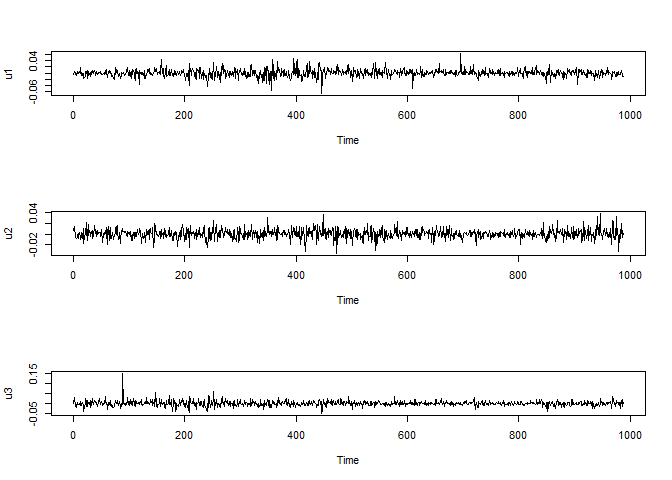
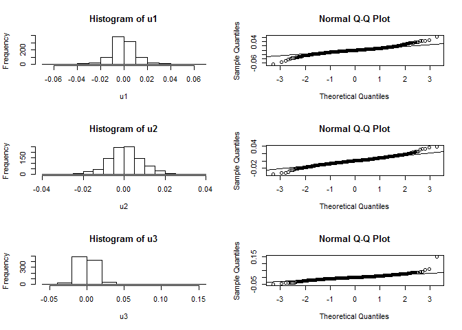
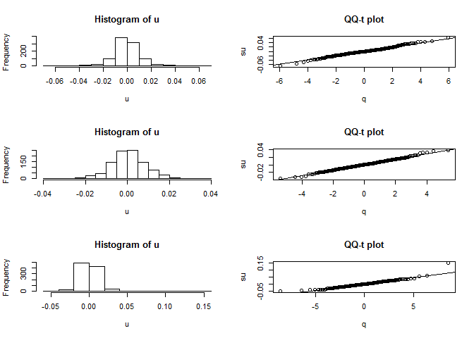

### Read in Data
The files `0005.HK.csv`, `0002.HK.csv` and `0001.HK.csv` contain information about the stock HSBC (0005), CLP (0002) and Cheung Kong (0001) from 1 Sep 2014 to 31 Aug 2018 respectively. Data are downloaded at Yahoo Finance (https://finance.yahoo.com/).

```r
# Read in data (CSV files) under Dataset
# Save them to objects named d5, d2, d1
d5 <- read.csv("./../Dataset/0005.HK.csv")
d2 <- read.csv("./../Dataset/0002.HK.csv")
d1 <- read.csv("./../Dataset/0001.HK.csv")

# as.character: coerce its argument to character type
d5$Date <- as.character(d5$Date)
d2$Date <- as.character(d2$Date)
d1$Date <- as.character(d1$Date)

str(d5)            # str: display the structure of an object
```

```
'data.frame':	989 obs. of  7 variables:
 $ Date     : chr  "2014-09-01" "2014-09-02" "2014-09-03" "2014-09-04" ...
 $ Open     : num  83.5 83.1 82.8 83.4 83.4 ...
 $ High     : num  84 83.4 83.8 83.7 84.1 ...
 $ Low      : num  83.4 82.8 82.6 82.8 83.2 ...
 $ Close    : num  83.6 83.2 83.7 83.3 83.6 ...
 $ Adj.Close: num  65.7 65.4 65.7 65.5 65.7 ...
 $ Volume   : int  9239373 11379534 16558649 12423460 31094094 12096081 12290475 7992181 4759417 6942459 ...
```

```r
str(d2)
```

```
'data.frame':	989 obs. of  7 variables:
 $ Date     : chr  "2014-09-01" "2014-09-02" "2014-09-03" "2014-09-04" ...
 $ Open     : num  66 66 66.3 67 66.8 ...
 $ High     : num  66.8 66.3 67.3 67 66.8 ...
 $ Low      : num  65.8 65.8 65.9 66.2 66.2 ...
 $ Close    : num  66.3 66.2 67.2 66.8 66.4 ...
 $ Adj.Close: num  55.8 56.2 57 56.6 56.3 ...
 $ Volume   : int  2416414 1348648 3594815 2012205 1600249 1669172 2346811 1976420 1411424 1515794 ...
```

```r
str(d1)
```

```
'data.frame':	989 obs. of  7 variables:
 $ Date     : chr  "2014-09-01" "2014-09-02" "2014-09-03" "2014-09-04" ...
 $ Open     : num  100 101 101 103 102 ...
 $ High     : num  102 102 104 103 102 ...
 $ Low      : num  100 101 101 101 101 ...
 $ Close    : num  101 101 104 102 101 ...
 $ Adj.Close: num  87.1 87 89.5 88.2 87.2 ...
 $ Volume   : int  3290054 2424496 9538173 6996772 7048638 3939298 5199616 3992300 2774844 3138619 ...
```

### Clean Data
Combine the three CSV files into one containing the adjusted daily closing prices only.

```r
HSBC <- d5$Adj.Close
CLP <- d2$Adj.Close
CK <- d1$Adj.Close

# Sanity check: the same date
mean(d5$Date == d2$Date)          # 1 means they are identical
```

```
[1] 1
```

```r
mean(d2$Date == d1$Date)          # 1 means they are identical
```

```
[1] 1
```

```r
Date <- d5$Date                           # Save the date

d <- data.frame(Date, HSBC, CLP, CK)      # data.frame: create a data frame
head(d)                                   # Return the first part of data
```

```
        Date     HSBC      CLP       CK
1 2014-09-01 65.69888 55.75199 87.12618
2 2014-09-02 65.38452 56.16741 87.00308
3 2014-09-03 65.73816 56.97283 89.46438
4 2014-09-04 65.46311 56.63371 88.23415
5 2014-09-05 65.69888 56.29458 87.18818
6 2014-09-08 65.18806 55.87067 86.94195
```

```r
tail(d)                                   # Return the last part of data
```

```
          Date  HSBC      CLP       CK
984 2018-08-24 69.40 89.65322 87.10404
985 2018-08-27 70.10 91.39166 88.54010
986 2018-08-28 70.20 91.59032 88.68866
987 2018-08-29 70.15 92.18636 90.32278
988 2018-08-30 69.50 91.54067 89.18385
989 2018-08-31 68.85 91.64000 89.57999
```

```r
# write.csv: create a CSV file
write.csv(d, "./../Dataset/stock_2018.csv", row.names = FALSE) 
```

### Time Series Plot

```r
is.ts(d$HSBC)              # is.ts: test whether an object is a time series
```

```
[1] FALSE
```

```r
class(d$HSBC)              # class: prints the names of classes an object inherits from
```

```
[1] "numeric"
```

```r
# as.ts: coerce an object to a time-series
t1 <- as.ts(d$HSBC)        # For stock HSBC (0005)
is.ts(t1)
```

```
[1] TRUE
```

```r
class(t1)
```

```
[1] "ts"
```

```r
t2 <- as.ts(d$CLP)         # For stock CLP (0002)
t3 <- as.ts(d$CK)          # For stock Cheung Kong (0001)

# Compute daily percentage return
u1 <- (lag(t1)-t1)/t1      # lag: compute a lagged version of a time series
u2 <- (lag(t2)-t2)/t2
u3 <- (lag(t3)-t3)/t3

# Sanity check: match positive and negative returns
head(d)                    # Return the first part of data (default: 6 rows)
```

```
        Date     HSBC      CLP       CK
1 2014-09-01 65.69888 55.75199 87.12618
2 2014-09-02 65.38452 56.16741 87.00308
3 2014-09-03 65.73816 56.97283 89.46438
4 2014-09-04 65.46311 56.63371 88.23415
5 2014-09-05 65.69888 56.29458 87.18818
6 2014-09-08 65.18806 55.87067 86.94195
```

```r
# First element corresponds to daily return on the 2nd day
head(u1, 5)                # Return the first 5 daily returns of HSBC
```

```
[1] -0.004784891  0.005408589 -0.004183978  0.003601586 -0.007775262
```

```r
head(u2, 5)                # Return the first 5 daily returns of CLP
```

```
[1]  0.007451304  0.014339632 -0.005952363 -0.005988077 -0.007530245
```

```r
head(u3, 5)                # Return the first 5 daily return of Cheung Kong
```

```
[1] -0.001412813  0.028289756 -0.013750993 -0.011854537 -0.002824133
```

```r
# par: set or query graphical parameters
# mfrow and mfcol: the form c(nr, nc) means figures are drawn in
# an nr-by-nc array on the device by columns (mfcol) or rows (mfrow)
par()$mfrow                # mfrow = c(nr, nc)
```

```
[1] 1 1
```

```r
par(mfrow = c(3,1))        # Set multi-frame for ploting
plot(u1)
plot(u2)
plot(u3)
```

<!-- -->

```r
# Compute average daily percentage return
cat("Average daily percentage return of", "\n",
    "HSBC: ", paste0(round(mean(u1)*100, 3), "% ;"), "\n",
    "CLP:  ", paste0(round(mean(u2)*100, 3), "% ;"), "\n",
    "CK:   ", paste0(round(mean(u3)*100, 3), "%"),
    sep = "")
```

```
Average daily percentage return of
HSBC: 0.012% ;
CLP:  0.054% ;
CK:   0.011%
```

As you can see, the daily percentage returns fluctuate around 0 (more precisely on upward trend).

### Histogram and Normal QQ plot

```r
par(mfrow = c(3,2))
hist(u1)                   # Produce histogram
qqnorm(u1)                 # Produce normal QQ plot
qqline(u1)                 # Add a line through theoretical 1st and 3rd quartiles

hist(u2)
qqnorm(u2)
qqline(u2)

hist(u3)
qqnorm(u3)
qqline(u3)
```

<!-- -->

There is some discrepancy, especially in the two tails. It suggests that normal distribution may not be plausible. More specifically, heavier-tailed distributions are needed.

### Check for Normal Distribution
In statistical hypothesis testing, the p-value is the probability for a given statistical model that, when the null hypothesis is true, the test statistic would be the same as or of greater magnitude than the actual observed results. You would reject the null hypothesis when the p-value is small.

```r
# ks.test: perform a Kolmogorov-Smirnov test
ks.test(u1, pnorm)                # KS normality test for u1, u2 and u3
```

```
Warning in ks.test(u1, pnorm): ties should not be present for the
Kolmogorov-Smirnov test
```

```

	One-sample Kolmogorov-Smirnov test

data:  u1
D = 0.48081, p-value < 2.2e-16
alternative hypothesis: two-sided
```

```r
ks.test(u2, pnorm)
```

```
Warning in ks.test(u2, pnorm): ties should not be present for the
Kolmogorov-Smirnov test
```

```

	One-sample Kolmogorov-Smirnov test

data:  u2
D = 0.48625, p-value < 2.2e-16
alternative hypothesis: two-sided
```

```r
ks.test(u3, pnorm)
```

```
Warning in ks.test(u3, pnorm): ties should not be present for the
Kolmogorov-Smirnov test
```

```

	One-sample Kolmogorov-Smirnov test

data:  u3
D = 0.48159, p-value < 2.2e-16
alternative hypothesis: two-sided
```

```r
# Write a function for JB-test
JB.test <- function(u) {
    n <- length(u)                # Sample size
    s <- sd(u)                    # Standard deviation
    sk <- sum(u^3)/(n*s^3)        # Skewness
    ku <- sum(u^4)/(n*s^4) - 3    # Excess kurtosis
    JB <- n*(sk^2/6 + ku^2/24)    # JB test statistic
    p <- 1 - pchisq(JB, 2)        # p-value
    cat("JB-stat:", JB, " p-value:", p,"\n")
}

JB.test(u1)
```

```
JB-stat: 538.7295  p-value: 0 
```

```r
JB.test(u2)
```

```
JB-stat: 139.5793  p-value: 0 
```

```r
JB.test(u3)
```

```
JB-stat: 16717.95  p-value: 0 
```

Since the p-values are very small (close to 0), you should reject the null hypothesis that the daily percentage returns come from normal distribution. It matches with the intuition gained from the plots.

### Check for t-distribution

```r
# Write a function for QQ-t plot
QQt.plot <- function(u) {
    su <- sort(u)                     # Sort u
    n <- length(u)                    # Sample size
    s <- sd(u)                        # Standard deviation
    ku <- sum(u^4)/(n*s^4) - 3	      # Excess kurtosis
    v <- round(6/ku + 4)              # Estimate df, round to the nearest integer
    i <- ((1:n) - 0.5)/n              # Create a vector of percentile
    q <- qt(i, v)                     # Percentile point from t(v)
  
    hist(u)                           # Histogram of u
    plot(q, su, main = "QQ-t plot")   # Plot(q, su)
    abline(lsfit(q, su))              # Add least squares fit line
    v                                 # Output estimated df
}

par(mfrow = c(3,2))
v1 <- QQt.plot(u1)                    # QQ-t plot for u1, u2, u3 and save df
v2 <- QQt.plot(u2)
v3 <- QQt.plot(u3)
```

<!-- -->

```r
ks.test(u1, pt, v1)                   # KS t-test for u1, u2 and u3
```

```
Warning in ks.test(u1, pt, v1): ties should not be present for the
Kolmogorov-Smirnov test
```

```

	One-sample Kolmogorov-Smirnov test

data:  u1
D = 0.4815, p-value < 2.2e-16
alternative hypothesis: two-sided
```

```r
ks.test(u2, pt, v2)
```

```
Warning in ks.test(u2, pt, v2): ties should not be present for the
Kolmogorov-Smirnov test
```

```

	One-sample Kolmogorov-Smirnov test

data:  u2
D = 0.4867, p-value < 2.2e-16
alternative hypothesis: two-sided
```

```r
ks.test(u3, pt, v3)
```

```
Warning in ks.test(u3, pt, v3): ties should not be present for the
Kolmogorov-Smirnov test
```

```

	One-sample Kolmogorov-Smirnov test

data:  u3
D = 0.48263, p-value < 2.2e-16
alternative hypothesis: two-sided
```

From the plots, t-distribution fits the tails better than normal distribution does. However, the p-values are very small (close to 0) so you should reject the null hypothesis that the daily percentage returns come from t-distribution.

Famous statistician George Box said "All models are wrong but some are useful".
