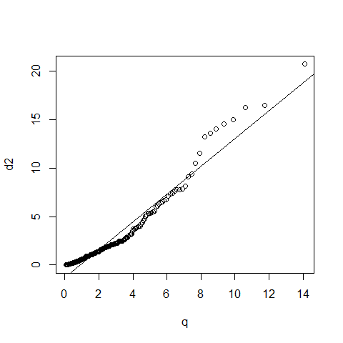

### Read in and Manipulate Data
The file `stock_2018.csv` contains information about the stock HSBC (0005), CLP (0002) and Cheung Kong (0001) from 1 Sep 2014 to 31 Aug 2018. Data are downloaded at Yahoo Finance (https://finance.yahoo.com/).

```r
# Read in data (a CSV file) under Dataset
d <- read.csv("./../Dataset/stock_2018.csv")

# as.ts: coerce an object to a time-series
t1 <- as.ts(d$HSBC)        # For stock HSBC (0005)
t2 <- as.ts(d$CLP)         # For stock CLP (0002)
t3 <- as.ts(d$CK)          # For stock Cheung Kong (0001)

# Compute daily percentage return
u1 <- (lag(t1)-t1)/t1      # lag: compute a lagged version of a time series
u2 <- (lag(t2)-t2)/t2
u3 <- (lag(t3)-t3)/t3

u <- cbind(u1, u2, u3)     # Combine into matrix u
```

### Check for Multivariate Normal Distribution
* For univariate normal distribution $N(\mu,\sigma^2)$, the term 
$$\bigg(\frac{x-\mu}{\sigma}\bigg)^2=(x-\mu)(\sigma^2)^{-1}(x-\mu)$$
measures the square of the distance from $x$ to $\mu$ in standard deviaton units.

* For multivariate normal distribution $N_p(\mu,\Sigma)$, the term
$$(x-\mu)'\Sigma^{-1}(x-\mu)$$
is the square of the generalized distance from $x$ to $\mu$, or the Mahalanobis distance.

* If $u=(u_1,u_2,u_3)'$ follows a multivariate normal distribution, then the quadratic form $$d^2=(u-\bar{u})'S^{-1}(u-\bar{u}),$$
where $\bar{u}$ is the sample mean vector and $S$ is the sample covariance matrix, follows approximately $\chi^2_3$.

* In general, if $u=(u_1,\dots,u_p)'\sim N_p(\mu_u, \Sigma_u)$, then $d^2$ should follow approximately a chi-squared distribution with $p$ degrees of freedom.

```r
n2 <- nrow(u)                # Number of rows in u
n1 <- n2-180+1               # Starting index: 180th obs before n2
u180 <- u[n1:n2,]            # Save the most recent 180 days to u180

(m <- apply(u180, 2, mean))  # Compute mean vector of u180
```

```
           u1            u2            u3 
-0.0002815488  0.0011469403 -0.0002769128 
```

```r
# Transform m into 180x3 matrix (each row is the column mean)
m <- matrix(m, nr = 180, nc = 3, byrow = T)	

(s <- var(u180))             # Compute covariance matrix of u180
```

```
             u1           u2           u3
u1 8.798931e-05 2.593044e-05 5.134027e-05
u2 2.593044e-05 9.257047e-05 4.930806e-05
u3 5.134027e-05 4.930806e-05 1.103498e-04
```

```r
sinv <- solve(s)             # Compute inverse of s

dim(u180)                    # 180x3 matrix
```

```
[1] 180   3
```

```r
dim(m)                       # 180x3 matrix
```

```
[1] 180   3
```

```r
# Compute the squared generalized distance
d2 <- diag((u180-m) %*% sinv %*% t(u180-m))
length(d2)                   # Length of d2 is 180
```

```
[1] 180
```

Remark: u180 and m are 180x3 matrices while sinv is a 3x3 matrix. Hence (u180-m) %\*% sinv %\*% t(u180-m) is a 180x180 matrix. Its diagonal is a vector of length 180 equal to the squared generalized distance from each observation to the sample mean.


```r
d2 <- sort(d2)               # Sort d2 in ascending order
i <- ((1:180)-0.5)/180       # Create a vector of percentiles
q <- qchisq(i, 3)            # Compute quantile of chisq(3)

par(mfrow = c(1, 1))
qqplot(q, d2)                # QQ-chisquare plot
abline(lsfit(q, d2))         # Add least squares fit line
```



```r
ks.test(d2, pchisq, 3)       # KS chisquare test for d2
```

```

	One-sample Kolmogorov-Smirnov test

data:  d2
D = 0.14609, p-value = 0.0009213
alternative hypothesis: two-sided
```

From the plot, the distribution of u180 is close to multivariate normal. However, the p-value is small, so formally speaking, you should reject the null hypothesis that d2 comes from a chi-squared distribution.

Famous statistician George Box said "All models are wrong but some are useful". Let us assume that $u=(u_1,u_2,u_3)'$ follows a trivariate normal distribution for the time being.

### Generate Multivariate Normal Random Vector
* Note that any linear combination of normal random variables/vectors are also normally distributed.

* For univariate normal distribution, if $$Z\sim N(0,1),$$ then $$X=\mu+\sigma Z\sim N(\mu,\sigma^2).$$
Reasoning: $$E(X)=\mu+\sigma E(Z)=\mu$$ and $$\text{Var}(X)=\sigma^2 \text{Var}(Z)=\sigma^2.$$

* For multivariate normal distribution, if $$Z=(Z_1,\dots,Z_p)'\sim N_p(0_p, I_p), \hspace{2mm}\text{i.e.}\hspace{2mm} Z_i\overset{\text{i.i.d.}}{\sim} N(0,1)$$ and $$C'C=\Sigma,$$ then $$X=\mu+C'Z\sim N_p(\mu,\Sigma).$$
Reasoning: $$E(X)=\mu+C'E(Z)=\mu$$ and $$\text{Cov}(X)=C'\text{Cov}(Z)C=C'C=\Sigma.$$

* The matrix $C$ is called the Cholesky decomposition of $\Sigma$. See https://en.wikipedia.org/wiki/Cholesky_decomposition for more details.

```r
# Setting random seed in simulation ensures that 
# the same set of pseudo random numbers is generated each time.
# It is an important element in reproducible research.
set.seed(7)                  # Set random seed
mu <- apply(u180, 2, mean)   # Compute mean vector
sigma <- var(u180)           # Compute covariance matrix
C <- chol(sigma)             # Cholesky decomposition of sigma

# Sanity check: C'C = sigma
t(C)%*%C
```

```
             u1           u2           u3
u1 8.798931e-05 2.593044e-05 5.134027e-05
u2 2.593044e-05 9.257047e-05 4.930806e-05
u3 5.134027e-05 4.930806e-05 1.103498e-04
```

```r
sigma
```

```
             u1           u2           u3
u1 8.798931e-05 2.593044e-05 5.134027e-05
u2 2.593044e-05 9.257047e-05 4.930806e-05
u3 5.134027e-05 4.930806e-05 1.103498e-04
```

```r
Tm <- cbind(t1,t2,t3)        # Combine t1, t2, t3 to form Tm
T0 <- Tm[nrow(Tm),]          # Set T0 to be the most recent prices

# Simulate prices for the future 90 days
for (i in 1:90) {             
    Z <- rnorm(3)            # Generate normal random vector
    v <- mu + t(C)%*%Z       # Transform to multivariate normal
    T1 <- T0*(1 + v)         # Predict new stock prices
    Tm <- rbind(Tm, t(T1))   # Append T1 to Tm
    T0 <- T1                 # Update T0
}
```

### Plot Simulation Results

```r
library(plotly)              # Create Interactive Web Graphics via 'plotly.js'
library(tidyr)               # Easily Tidy Data with 'spread()' and 'gather()' Functions
library(dplyr)               # A Grammar of Data Manipulation

colnames(Tm) <- c("HSBC", "CLP", "CK")     # To be appeared in plot

# %>%: pipe operator
newseries <- as.data.frame(Tm) %>% 
    gather(type, value) %>%
    mutate(time = rep(time(Tm), 3))

# Alternatively
temp1 <- as.data.frame(Tm)
temp2 <- gather(temp1, type, value)
temp3 <- mutate(temp2, time = rep(time(Tm), 3))

head(newseries)
```

```
  type    value time
1 HSBC 65.69888    1
2 HSBC 65.38452    2
3 HSBC 65.73816    3
4 HSBC 65.46311    4
5 HSBC 65.69888    5
6 HSBC 65.18806    6
```

```r
head(temp3)
```

```
  type    value time
1 HSBC 65.69888    1
2 HSBC 65.38452    2
3 HSBC 65.73816    3
4 HSBC 65.46311    4
5 HSBC 65.69888    5
6 HSBC 65.18806    6
```

```r
tail(newseries)
```

```
     type    value time
3232   CK 94.32474 1074
3233   CK 95.11284 1075
3234   CK 94.54062 1076
3235   CK 95.48517 1077
3236   CK 95.62374 1078
3237   CK 96.34513 1079
```

```r
tail(temp3)
```

```
     type    value time
3232   CK 94.32474 1074
3233   CK 95.11284 1075
3234   CK 94.54062 1076
3235   CK 95.48517 1077
3236   CK 95.62374 1078
3237   CK 96.34513 1079
```

```r
plot_ly(x = newseries$time, y = newseries$value, color = newseries$type, mode = 'lines')
```

<!--html_preserve--><div id="htmlwidget-ca669f746cc923278e88" style="width:672px;height:480px;" class="plotly html-widget"></div>
<script type="application/json" data-for="htmlwidget-ca669f746cc923278e88">{"x":{"visdat":{"3ef4c144773":["function () ","plotlyVisDat"]},"cur_data":"3ef4c144773","attrs":{"3ef4c144773":{"x":[1,2,3,4,5,6,7,8,9,10,11,12,13,14,15,16,17,18,19,20,21,22,23,24,25,26,27,28,29,30,31,32,33,34,35,36,37,38,39,40,41,42,43,44,45,46,47,48,49,50,51,52,53,54,55,56,57,58,59,60,61,62,63,64,65,66,67,68,69,70,71,72,73,74,75,76,77,78,79,80,81,82,83,84,85,86,87,88,89,90,91,92,93,94,95,96,97,98,99,100,101,102,103,104,105,106,107,108,109,110,111,112,113,114,115,116,117,118,119,120,121,122,123,124,125,126,127,128,129,130,131,132,133,134,135,136,137,138,139,140,141,142,143,144,145,146,147,148,149,150,151,152,153,154,155,156,157,158,159,160,161,162,163,164,165,166,167,168,169,170,171,172,173,174,175,176,177,178,179,180,181,182,183,184,185,186,187,188,189,190,191,192,193,194,195,196,197,198,199,200,201,202,203,204,205,206,207,208,209,210,211,212,213,214,215,216,217,218,219,220,221,222,223,224,225,226,227,228,229,230,231,232,233,234,235,236,237,238,239,240,241,242,243,244,245,246,247,248,249,250,251,252,253,254,255,256,257,258,259,260,261,262,263,264,265,266,267,268,269,270,271,272,273,274,275,276,277,278,279,280,281,282,283,284,285,286,287,288,289,290,291,292,293,294,295,296,297,298,299,300,301,302,303,304,305,306,307,308,309,310,311,312,313,314,315,316,317,318,319,320,321,322,323,324,325,326,327,328,329,330,331,332,333,334,335,336,337,338,339,340,341,342,343,344,345,346,347,348,349,350,351,352,353,354,355,356,357,358,359,360,361,362,363,364,365,366,367,368,369,370,371,372,373,374,375,376,377,378,379,380,381,382,383,384,385,386,387,388,389,390,391,392,393,394,395,396,397,398,399,400,401,402,403,404,405,406,407,408,409,410,411,412,413,414,415,416,417,418,419,420,421,422,423,424,425,426,427,428,429,430,431,432,433,434,435,436,437,438,439,440,441,442,443,444,445,446,447,448,449,450,451,452,453,454,455,456,457,458,459,460,461,462,463,464,465,466,467,468,469,470,471,472,473,474,475,476,477,478,479,480,481,482,483,484,485,486,487,488,489,490,491,492,493,494,495,496,497,498,499,500,501,502,503,504,505,506,507,508,509,510,511,512,513,514,515,516,517,518,519,520,521,522,523,524,525,526,527,528,529,530,531,532,533,534,535,536,537,538,539,540,541,542,543,544,545,546,547,548,549,550,551,552,553,554,555,556,557,558,559,560,561,562,563,564,565,566,567,568,569,570,571,572,573,574,575,576,577,578,579,580,581,582,583,584,585,586,587,588,589,590,591,592,593,594,595,596,597,598,599,600,601,602,603,604,605,606,607,608,609,610,611,612,613,614,615,616,617,618,619,620,621,622,623,624,625,626,627,628,629,630,631,632,633,634,635,636,637,638,639,640,641,642,643,644,645,646,647,648,649,650,651,652,653,654,655,656,657,658,659,660,661,662,663,664,665,666,667,668,669,670,671,672,673,674,675,676,677,678,679,680,681,682,683,684,685,686,687,688,689,690,691,692,693,694,695,696,697,698,699,700,701,702,703,704,705,706,707,708,709,710,711,712,713,714,715,716,717,718,719,720,721,722,723,724,725,726,727,728,729,730,731,732,733,734,735,736,737,738,739,740,741,742,743,744,745,746,747,748,749,750,751,752,753,754,755,756,757,758,759,760,761,762,763,764,765,766,767,768,769,770,771,772,773,774,775,776,777,778,779,780,781,782,783,784,785,786,787,788,789,790,791,792,793,794,795,796,797,798,799,800,801,802,803,804,805,806,807,808,809,810,811,812,813,814,815,816,817,818,819,820,821,822,823,824,825,826,827,828,829,830,831,832,833,834,835,836,837,838,839,840,841,842,843,844,845,846,847,848,849,850,851,852,853,854,855,856,857,858,859,860,861,862,863,864,865,866,867,868,869,870,871,872,873,874,875,876,877,878,879,880,881,882,883,884,885,886,887,888,889,890,891,892,893,894,895,896,897,898,899,900,901,902,903,904,905,906,907,908,909,910,911,912,913,914,915,916,917,918,919,920,921,922,923,924,925,926,927,928,929,930,931,932,933,934,935,936,937,938,939,940,941,942,943,944,945,946,947,948,949,950,951,952,953,954,955,956,957,958,959,960,961,962,963,964,965,966,967,968,969,970,971,972,973,974,975,976,977,978,979,980,981,982,983,984,985,986,987,988,989,990,991,992,993,994,995,996,997,998,999,1000,1001,1002,1003,1004,1005,1006,1007,1008,1009,1010,1011,1012,1013,1014,1015,1016,1017,1018,1019,1020,1021,1022,1023,1024,1025,1026,1027,1028,1029,1030,1031,1032,1033,1034,1035,1036,1037,1038,1039,1040,1041,1042,1043,1044,1045,1046,1047,1048,1049,1050,1051,1052,1053,1054,1055,1056,1057,1058,1059,1060,1061,1062,1063,1064,1065,1066,1067,1068,1069,1070,1071,1072,1073,1074,1075,1076,1077,1078,1079,1,2,3,4,5,6,7,8,9,10,11,12,13,14,15,16,17,18,19,20,21,22,23,24,25,26,27,28,29,30,31,32,33,34,35,36,37,38,39,40,41,42,43,44,45,46,47,48,49,50,51,52,53,54,55,56,57,58,59,60,61,62,63,64,65,66,67,68,69,70,71,72,73,74,75,76,77,78,79,80,81,82,83,84,85,86,87,88,89,90,91,92,93,94,95,96,97,98,99,100,101,102,103,104,105,106,107,108,109,110,111,112,113,114,115,116,117,118,119,120,121,122,123,124,125,126,127,128,129,130,131,132,133,134,135,136,137,138,139,140,141,142,143,144,145,146,147,148,149,150,151,152,153,154,155,156,157,158,159,160,161,162,163,164,165,166,167,168,169,170,171,172,173,174,175,176,177,178,179,180,181,182,183,184,185,186,187,188,189,190,191,192,193,194,195,196,197,198,199,200,201,202,203,204,205,206,207,208,209,210,211,212,213,214,215,216,217,218,219,220,221,222,223,224,225,226,227,228,229,230,231,232,233,234,235,236,237,238,239,240,241,242,243,244,245,246,247,248,249,250,251,252,253,254,255,256,257,258,259,260,261,262,263,264,265,266,267,268,269,270,271,272,273,274,275,276,277,278,279,280,281,282,283,284,285,286,287,288,289,290,291,292,293,294,295,296,297,298,299,300,301,302,303,304,305,306,307,308,309,310,311,312,313,314,315,316,317,318,319,320,321,322,323,324,325,326,327,328,329,330,331,332,333,334,335,336,337,338,339,340,341,342,343,344,345,346,347,348,349,350,351,352,353,354,355,356,357,358,359,360,361,362,363,364,365,366,367,368,369,370,371,372,373,374,375,376,377,378,379,380,381,382,383,384,385,386,387,388,389,390,391,392,393,394,395,396,397,398,399,400,401,402,403,404,405,406,407,408,409,410,411,412,413,414,415,416,417,418,419,420,421,422,423,424,425,426,427,428,429,430,431,432,433,434,435,436,437,438,439,440,441,442,443,444,445,446,447,448,449,450,451,452,453,454,455,456,457,458,459,460,461,462,463,464,465,466,467,468,469,470,471,472,473,474,475,476,477,478,479,480,481,482,483,484,485,486,487,488,489,490,491,492,493,494,495,496,497,498,499,500,501,502,503,504,505,506,507,508,509,510,511,512,513,514,515,516,517,518,519,520,521,522,523,524,525,526,527,528,529,530,531,532,533,534,535,536,537,538,539,540,541,542,543,544,545,546,547,548,549,550,551,552,553,554,555,556,557,558,559,560,561,562,563,564,565,566,567,568,569,570,571,572,573,574,575,576,577,578,579,580,581,582,583,584,585,586,587,588,589,590,591,592,593,594,595,596,597,598,599,600,601,602,603,604,605,606,607,608,609,610,611,612,613,614,615,616,617,618,619,620,621,622,623,624,625,626,627,628,629,630,631,632,633,634,635,636,637,638,639,640,641,642,643,644,645,646,647,648,649,650,651,652,653,654,655,656,657,658,659,660,661,662,663,664,665,666,667,668,669,670,671,672,673,674,675,676,677,678,679,680,681,682,683,684,685,686,687,688,689,690,691,692,693,694,695,696,697,698,699,700,701,702,703,704,705,706,707,708,709,710,711,712,713,714,715,716,717,718,719,720,721,722,723,724,725,726,727,728,729,730,731,732,733,734,735,736,737,738,739,740,741,742,743,744,745,746,747,748,749,750,751,752,753,754,755,756,757,758,759,760,761,762,763,764,765,766,767,768,769,770,771,772,773,774,775,776,777,778,779,780,781,782,783,784,785,786,787,788,789,790,791,792,793,794,795,796,797,798,799,800,801,802,803,804,805,806,807,808,809,810,811,812,813,814,815,816,817,818,819,820,821,822,823,824,825,826,827,828,829,830,831,832,833,834,835,836,837,838,839,840,841,842,843,844,845,846,847,848,849,850,851,852,853,854,855,856,857,858,859,860,861,862,863,864,865,866,867,868,869,870,871,872,873,874,875,876,877,878,879,880,881,882,883,884,885,886,887,888,889,890,891,892,893,894,895,896,897,898,899,900,901,902,903,904,905,906,907,908,909,910,911,912,913,914,915,916,917,918,919,920,921,922,923,924,925,926,927,928,929,930,931,932,933,934,935,936,937,938,939,940,941,942,943,944,945,946,947,948,949,950,951,952,953,954,955,956,957,958,959,960,961,962,963,964,965,966,967,968,969,970,971,972,973,974,975,976,977,978,979,980,981,982,983,984,985,986,987,988,989,990,991,992,993,994,995,996,997,998,999,1000,1001,1002,1003,1004,1005,1006,1007,1008,1009,1010,1011,1012,1013,1014,1015,1016,1017,1018,1019,1020,1021,1022,1023,1024,1025,1026,1027,1028,1029,1030,1031,1032,1033,1034,1035,1036,1037,1038,1039,1040,1041,1042,1043,1044,1045,1046,1047,1048,1049,1050,1051,1052,1053,1054,1055,1056,1057,1058,1059,1060,1061,1062,1063,1064,1065,1066,1067,1068,1069,1070,1071,1072,1073,1074,1075,1076,1077,1078,1079,1,2,3,4,5,6,7,8,9,10,11,12,13,14,15,16,17,18,19,20,21,22,23,24,25,26,27,28,29,30,31,32,33,34,35,36,37,38,39,40,41,42,43,44,45,46,47,48,49,50,51,52,53,54,55,56,57,58,59,60,61,62,63,64,65,66,67,68,69,70,71,72,73,74,75,76,77,78,79,80,81,82,83,84,85,86,87,88,89,90,91,92,93,94,95,96,97,98,99,100,101,102,103,104,105,106,107,108,109,110,111,112,113,114,115,116,117,118,119,120,121,122,123,124,125,126,127,128,129,130,131,132,133,134,135,136,137,138,139,140,141,142,143,144,145,146,147,148,149,150,151,152,153,154,155,156,157,158,159,160,161,162,163,164,165,166,167,168,169,170,171,172,173,174,175,176,177,178,179,180,181,182,183,184,185,186,187,188,189,190,191,192,193,194,195,196,197,198,199,200,201,202,203,204,205,206,207,208,209,210,211,212,213,214,215,216,217,218,219,220,221,222,223,224,225,226,227,228,229,230,231,232,233,234,235,236,237,238,239,240,241,242,243,244,245,246,247,248,249,250,251,252,253,254,255,256,257,258,259,260,261,262,263,264,265,266,267,268,269,270,271,272,273,274,275,276,277,278,279,280,281,282,283,284,285,286,287,288,289,290,291,292,293,294,295,296,297,298,299,300,301,302,303,304,305,306,307,308,309,310,311,312,313,314,315,316,317,318,319,320,321,322,323,324,325,326,327,328,329,330,331,332,333,334,335,336,337,338,339,340,341,342,343,344,345,346,347,348,349,350,351,352,353,354,355,356,357,358,359,360,361,362,363,364,365,366,367,368,369,370,371,372,373,374,375,376,377,378,379,380,381,382,383,384,385,386,387,388,389,390,391,392,393,394,395,396,397,398,399,400,401,402,403,404,405,406,407,408,409,410,411,412,413,414,415,416,417,418,419,420,421,422,423,424,425,426,427,428,429,430,431,432,433,434,435,436,437,438,439,440,441,442,443,444,445,446,447,448,449,450,451,452,453,454,455,456,457,458,459,460,461,462,463,464,465,466,467,468,469,470,471,472,473,474,475,476,477,478,479,480,481,482,483,484,485,486,487,488,489,490,491,492,493,494,495,496,497,498,499,500,501,502,503,504,505,506,507,508,509,510,511,512,513,514,515,516,517,518,519,520,521,522,523,524,525,526,527,528,529,530,531,532,533,534,535,536,537,538,539,540,541,542,543,544,545,546,547,548,549,550,551,552,553,554,555,556,557,558,559,560,561,562,563,564,565,566,567,568,569,570,571,572,573,574,575,576,577,578,579,580,581,582,583,584,585,586,587,588,589,590,591,592,593,594,595,596,597,598,599,600,601,602,603,604,605,606,607,608,609,610,611,612,613,614,615,616,617,618,619,620,621,622,623,624,625,626,627,628,629,630,631,632,633,634,635,636,637,638,639,640,641,642,643,644,645,646,647,648,649,650,651,652,653,654,655,656,657,658,659,660,661,662,663,664,665,666,667,668,669,670,671,672,673,674,675,676,677,678,679,680,681,682,683,684,685,686,687,688,689,690,691,692,693,694,695,696,697,698,699,700,701,702,703,704,705,706,707,708,709,710,711,712,713,714,715,716,717,718,719,720,721,722,723,724,725,726,727,728,729,730,731,732,733,734,735,736,737,738,739,740,741,742,743,744,745,746,747,748,749,750,751,752,753,754,755,756,757,758,759,760,761,762,763,764,765,766,767,768,769,770,771,772,773,774,775,776,777,778,779,780,781,782,783,784,785,786,787,788,789,790,791,792,793,794,795,796,797,798,799,800,801,802,803,804,805,806,807,808,809,810,811,812,813,814,815,816,817,818,819,820,821,822,823,824,825,826,827,828,829,830,831,832,833,834,835,836,837,838,839,840,841,842,843,844,845,846,847,848,849,850,851,852,853,854,855,856,857,858,859,860,861,862,863,864,865,866,867,868,869,870,871,872,873,874,875,876,877,878,879,880,881,882,883,884,885,886,887,888,889,890,891,892,893,894,895,896,897,898,899,900,901,902,903,904,905,906,907,908,909,910,911,912,913,914,915,916,917,918,919,920,921,922,923,924,925,926,927,928,929,930,931,932,933,934,935,936,937,938,939,940,941,942,943,944,945,946,947,948,949,950,951,952,953,954,955,956,957,958,959,960,961,962,963,964,965,966,967,968,969,970,971,972,973,974,975,976,977,978,979,980,981,982,983,984,985,986,987,988,989,990,991,992,993,994,995,996,997,998,999,1000,1001,1002,1003,1004,1005,1006,1007,1008,1009,1010,1011,1012,1013,1014,1015,1016,1017,1018,1019,1020,1021,1022,1023,1024,1025,1026,1027,1028,1029,1030,1031,1032,1033,1034,1035,1036,1037,1038,1039,1040,1041,1042,1043,1044,1045,1046,1047,1048,1049,1050,1051,1052,1053,1054,1055,1056,1057,1058,1059,1060,1061,1062,1063,1064,1065,1066,1067,1068,1069,1070,1071,1072,1073,1074,1075,1076,1077,1078,1079],"y":[65.698883,65.384521,65.738159,65.463112,65.698883,65.188057,64.637955,64.952301,64.913002,64.834404,64.71653,65.148758,65.070175,66.17038,65.659576,65.109459,64.677254,64.59864,64.559372,63.419846,62.51609,61.808807,62.162453,62.123158,62.20174,62.71257,61.612335,61.455166,61.769524,61.769524,61.02293,61.219398,60.944351,61.101524,61.612335,61.9104,61.870724,62.148537,62.58506,62.743805,62.267586,62.58506,62.426319,62.108826,61.83102,61.989784,61.870724,61.989784,61.950096,62.307274,62.069145,61.791336,61.553226,61.275429,61.156361,60.997616,60.71981,61.196053,61.156361,61.870724,61.553226,61.156361,60.402332,60.640438,60.75951,61.235744,61.156361,61.394478,60.799191,60.680126,60.164207,59.648289,58.814888,57.624306,57.58461,57.267132,58.259277,58.814888,58.933949,58.933949,59.489555,58.814888,58.735512,58.735512,57.862404,56.949635,56.35434,56.513088,56.433712,56.433712,56.592461,56.235275,56.036846,55.719364,55.520931,55.719364,56.036846,57.068691,58.021156,57.624306,58.179905,57.941788,57.386177,57.505249,56.552769,56.751209,57.465561,57.306805,57.822723,57.783051,57.029011,55.759045,56.195595,56.949635,56.909943,57.187748,57.108379,57.148064,55.124069,55.600307,55.481251,55.401878,55.203449,55.362183,55.401878,55.117786,55.03661,54.062511,54.468384,53.53487,53.210178,52.76371,52.479603,52.804302,53.494293,54.062511,53.940746,54.671318,54.468384,54.671318,54.671318,54.671318,54.346611,54.103104,54.021927,54.387211,55.401894,55.645416,56.173054,56.984806,57.350098,57.471851,57.147163,57.268925,57.187733,57.512444,57.187733,57.471851,59.907112,62.058228,62.017654,62.869991,62.464127,61.368248,60.759441,60.434738,60.678272,62.139412,61.490017,61.002968,60.678272,60.718864,61.408844,61.002968,60.597084,60.556507,60.90535,61.643589,61.192448,60.823318,60.24913,60.823318,60.577236,60.331161,60.618252,60.495209,59.962036,60.331161,60.085068,59.756973,60.003048,60.085068,59.551895,59.018719,58.977707,59.387848,59.469864,60.24913,60.454193,60.413185,59.921024,59.018719,57.624252,57.542233,57.050068,57.050068,55.696606,56.147755,53.933014,55.57357,55.860653,56.639927,56.229778,56.557903,57.337158,57.665268,58.075401,58.116421,57.542233,57.706284,56.721958,55.57357,56.475864,57.050068,57.091072,57.1731,58.280468,57.378162,58.444527,58.56757,58.280468,57.337158,57.501205,56.311806,56.830311,56.415497,56.125126,55.668823,55.08807,54.216953,53.843613,51.520618,51.188766,50.276161,50.981358,50.732468,50.856911,50.193195,49.280594,49.280594,48.285027,49.86134,51.603592,50.442089,50.151718,50.400608,49.86134,50.856911,50.649502,49.985783,49.695415,49.944302,48.948734,48.658367,48.741329,47.33094,47.828728,49.23912,50.317646,50.276161,51.479141,51.686554,51.976921,52.474716,51.603592,51.147293,51.603592,52.059887,51.893959,51.686554,50.993458,51.329494,51.539513,51.497509,51.119473,51.329494,51.245476,50.657417,50.825436,51.077465,52.043575,51.161472,51.95956,52.001564,51.917557,52.589622,51.287491,50.741428,51.20348,51.329494,52.127579,52.883656,52.589622,52.421612,52.043575,52.295601,52.085567,51.917557,52.63163,52.799648,52.547623,51.665531,51.833546,51.119473,50.61541,50.699421,50.447399,49.943348,49.4813,50.489399,51.917557,51.665531,51.329494,51.329494,51.707531,52.211594,51.875553,52.337605,52.211594,52.001564,50.741428,50.321384,49.775333,48.13715,48.221165,47.339066,47.465076,47.927128,47.297058,47.129036,45.658886,45.742901,44.65078,43.60067,44.398746,45.028812,43.516655,44.44075,44.818794,45.784904,45.910919,45.490868,43.894699,43.684669,43.97871,41.58445,40.408321,42.214512,42.298527,41.58445,42.802582,42.214512,41.290417,41.290417,40.912376,40.114285,41.62645,41.710464,42.046501,42.760571,43.089283,43.609985,43.089283,42.742134,43.43642,43.566597,43.653385,44.000534,43.566597,43.262852,43.783566,43.393032,43.653385,43.393032,42.959099,42.351593,42.17802,42.568562,42.004459,41.613914,40.572483,39.878189,39.748016,39.921585,40.095165,39.878189,41.700695,42.525169,42.785526,42.481781,44.043922,43.957138,45.909824,45.258926,44.651428,45.345718,45.692856,45.302319,44.955177,44.694817,43.523205,42.91571,41.96106,42.004459,42.308201,41.830872,41.483734,41.049809,41.613914,42.698742,42.09124,43.436897,42.951813,42.510826,42.775425,44.407059,44.848038,44.848038,44.803944,45.156731,44.407059,44.539349,44.803944,44.186565,44.848038,44.539349,43.525089,42.246243,41.672966,41.761158,40.92329,42.069847,43.525089,43.921974,44.362961,44.803944,41.849354,41.14378,40.879189,41.408367,41.761158,42.466732,41.761158,41.276081,41.452473,41.320171,41.981655,42.687233,42.907719,43.480995,43.745586,43.87788,43.657387,44.318859,44.495258,44.407059,44.318859,44.318859,44.627552,44.803944,44.583458,44.803944,44.803944,45.509514,46.744274,47.185257,48.06723,47.934933,48.287716,48.579155,48.847549,48.802818,48.489689,48.847549,49.384338,49.11594,49.339603,49.384338,49.384338,49.607998,50.01059,49.78693,50.27898,51.442017,52.873447,52.783981,53.6339,53.589165,52.82872,53.05238,53.499695,52.112999,51.889336,51.352554,52.202469,52.47086,52.73925,53.141838,52.381393,51.934071,51.307816,51.978806,52.023537,52.023537,51.128895,51.934071,52.560322,52.783981,53.097111,52.73925,52.73925,52.515587,51.665684,52.336666,51.934071,52.783981,52.82872,53.305157,53.305157,53.849091,53.713112,53.305157,53.214504,52.897221,52.897221,52.987869,52.307957,52.217297,52.081318,53.622459,53.577126,52.579918,54.393028,55.435555,54.982277,55.843498,55.70752,54.755642,55.390228,55.118267,55.934155,55.70752,55.70752,55.843498,55.752846,54.936951,55.344902,55.435555,55.435555,55.571537,57.475296,59.379047,59.243069,59.605686,58.563152,57.928574,58.51783,58.019226,57.9739,57.792587,56.659393,57.203327,56.704723,56.387432,56.160797,56.160797,56.432758,57.112675,57.520622,57.928574,57.792587,57.747257,57.429962,57.88324,57.9739,58.019226,57.293987,58.200527,58.653809,58.880444,58.472504,58.472504,58.51783,59.379047,60.466908,60.512234,60.149612,60.058964,59.65102,60.149612,60.013634,60.285599,60.013634,60.784199,60.648224,60.738873,61.373459,61.917397,61.917397,62.551968,59.424377,59.333721,59.548512,59.083652,58.572311,58.107449,58.479336,59.083652,58.804737,58.758251,58.758251,58.711769,58.432854,58.572311,59.827431,59.037167,59.223114,59.827431,59.641487,59.037167,59.223114,58.665279,58.572311,58.572311,58.339874,58.851223,59.083652,59.037167,58.851223,58.990677,58.851223,58.758251,58.804737,58.944195,59.223114,59.687973,58.897709,58.014484,57.735558,57.875019,57.921501,58.572311,59.316082,59.594994,59.873913,59.734455,59.920399,61.686867,61.826324,62.105244,62.430641,62.616589,63.174412,63.313873,64.011162,64.15062,63.871708,63.382496,63.006336,63.664604,63.617592,63.382496,63.617592,63.476528,63.711624,63.664604,63.852692,64.322884,64.181824,64.652016,64.746056,64.887115,64.510956,64.369904,64.510956,64.463943,63.758644,64.275864,64.793076,64.416916,63.852692,63.617592,63.758644,64.087784,64.134796,64.416916,68.460609,68.31955,69.165909,68.930817,69.212921,68.977829,68.789749,70.153313,70.576492,70.24736,70.623512,70.67054,70.858612,70.858612,70.482452,70.858612,70.623512,70.529472,72.128143,71.987083,72.316223,71.893036,73.773827,74.149986,74.620193,74.317482,74.554924,74.41246,74.41246,73.747635,72.655426,70.993385,71.705688,71.278305,71.468254,70.850914,70.091125,70.043625,70.755951,70.755951,70.61348,71.230812,71.515739,71.040863,72.417999,72.180565,72.085594,71.89563,71.705688,70.803436,70.423538,70.70845,71.658195,71.990616,71.848145,71.943123,71.563225,72.323021,72.797897,72.797897,72.797897,72.370514,72.323021,72.370514,72.370514,72.370514,72.702927,73.557686,73.937584,73.462715,73.605179,74.649887,74.175026,74.155693,74.059753,74.155693,74.011795,73.867889,72.908569,73.388229,73.388229,73.388229,73.580086,73.771957,73.963821,73.723991,73.100433,73.532127,72.764664,72.524834,72.237045,72.716705,72.285011,72.764664,72.860596,72.572807,72.093147,72.045174,72.285011,72.189079,72.045174,72.524834,73.819923,73.052467,73.196365,73.676033,73.819923,74.827217,74.827217,74.731285,74.539413,74.203651,73.004501,73.148399,73.676033,75.115005,75.162979,76.697891,76.314171,75.354843,75.642639,76.122299,76.074341,76.314171,76.745857,76.553993,76.745857,76.697891,77.992981,77.657211,77.225525,77.513321,77.225525,77.657211,78.760437,80.631119,80.295349,80.679085,81.350609,81.590446,81.974167,81.926208,81.54248,82.214005,82.357903,82.022141,82.214005,81.590446,80.679085,80.775017,80.631119,80.295349,79.479927,76.841789,76.745857,77.225525,76.553993,76.170265,76.553993,78.568581,80.151466,77.657211,78.280777,77.886467,77.984375,77.886467,76.956322,76.368874,76.270966,75.585602,74.36174,74.998146,74.36174,74.704422,74.998146,75.781425,75.487694,74.900246,74.802338,75.340828,75.536652,75.340828,75.24292,74.704422,73.088928,73.43161,73.529518,72.452522,72.452522,72.011932,70.885979,71.522392,72.648338,73.137878,73.676384,73.82325,74.704422,74.36174,73.872192,74.068024,74.704422,75.193977,75.389786,76.026199,75.879326,75.438744,75.781425,77.054237,76.809464,76.075142,73.382652,73.529518,74.31279,74.508606,75.487694,75.928291,76.760513,76.319923,76.417831,76.155571,76.402832,76.9468,76.650085,76.699547,76.205025,76.007217,75.067635,74.128052,75.117081,75.117081,75.759956,75.661057,75.661057,76.402832,75.71051,76.106117,75.90831,75.80941,75.562157,75.512695,73.781891,74.375305,73.584084,73.584084,72.941216,72.693954,71.704918,72.10054,72.792854,71.556564,71.408211,71.704918,71.803825,72.545601,73.089569,72.149986,72.29834,72.496155,72.496155,72.347794,71.803825,72.39724,72.39724,72.595055,73.831345,74.226959,73.930244,74.029152,73.880791,73.781891,73.43573,72.001633,71.507118,71.853279,72.051079,72.10054,72.545601,71.803825,71.309303,71.556564,70.765343,70.150002,70.099998,70.550003,70.300003,70.050003,69.650002,69.400002,70.099998,70.199997,70.150002,69.5,68.849998,70.3077885129159,70.0160839860862,70.4877259213977,71.9158790999794,73.4346754207619,73.7361553777131,73.712059555725,74.1790064577335,75.0438405593349,75.4392596710984,74.8017708135816,74.7256534589563,75.4038177988082,75.6053862229699,75.3816711912405,75.0765281803496,75.1261842710266,75.0996288475868,75.58832649563,75.7926963339334,75.8256537004662,76.3056095212888,76.8346606525478,77.3179877935275,76.8497585777604,75.8723627474257,75.806589089546,75.7882666973808,75.203384000771,74.9673320307945,76.0965373183709,76.2438514699033,77.0219596393692,76.8914150665252,76.8125464918718,75.635290558652,76.2100609397152,76.5166768449514,75.8569054052528,76.6207143684928,75.4817311475485,75.3347291476569,75.6714972132445,76.3736089558927,76.97263254934,76.4043175654051,76.5761400928095,75.926217955737,76.2483829265707,76.5744766097756,76.2974258815042,76.1274698380595,74.9695252865179,74.9407460002854,74.924422017156,74.6788935810528,74.882200320321,75.2002882815131,75.6134810794548,76.5313499791094,78.083785052265,77.9219879618795,78.671652889637,78.1388518197714,77.9123552398616,78.1513451617619,77.7034083257253,78.310183107165,79.181725254027,79.447069199466,79.4362576963299,78.9855599404906,78.8616106882848,78.5104112941045,79.190525760374,80.0908699346942,79.7665949974627,79.3595795727416,80.4705003289637,80.4663680533816,80.1375986532994,81.278817158266,80.7908624610551,81.3788770739209,80.3332505840967,79.8562875163783,79.8195455752894,78.6367481818589,79.2917499105322,79.3007431088579,55.751987,56.167412,56.972832,56.633709,56.294582,55.87067,55.44677,55.107647,55.065258,54.64135,54.726128,54.895695,54.683743,54.175056,53.920708,54.090271,53.963108,53.5392,54.132664,53.200073,52.860947,53.072899,53.157692,54.302227,54.175056,54.683743,54.005497,54.980469,54.853302,55.277206,55.319603,55.065258,55.277206,55.57394,55.913059,55.489151,55.404385,55.150043,56.08263,56.294582,56.33696,56.59132,56.379368,56.464149,56.803261,56.88805,56.930439,57.100002,57.311951,57.100002,57.651073,57.608688,57.269558,56.379368,56.464149,56.08263,56.252193,56.421753,56.506538,57.184776,56.676083,57.184776,56.125019,56.885765,56.201942,56.37289,57.099476,56.586594,56.415638,55.945515,55.902775,56.030994,55.475384,55.389908,55.347168,55.43264,55.988243,56.843029,56.757553,57.655079,57.911514,57.355907,57.484131,57.484131,56.501122,55.988243,56.287422,56.501122,57.099476,57.398643,57.655079,57.911514,58.082462,58.253433,58.552601,58.680813,58.680813,58.424374,58.766296,58.979984,58.979984,59.108223,59.407383,59.150948,58.979984,58.338909,58.338909,57.697811,57.868767,57.441383,57.612347,57.826038,57.526863,57.697811,57.441383,57.911514,58.253433,58.16795,58.467125,59.108223,59.236427,59.621075,58.552601,58.16795,57.826038,57.868767,57.441383,57.056728,57.270412,56.879951,56.012207,56.489468,56.879951,56.879951,57.010094,57.400585,56.836552,57.27042,57.921223,58.051376,58.094765,58.138149,58.051376,58.788963,57.357197,56.793167,57.921223,58.702187,59.179436,59.136059,59.396374,59.26622,59.222832,58.919117,58.962502,59.309589,58.875732,58.919117,59.439758,59.222832,59.222832,59.396374,58.962502,59.613304,59.700077,59.439758,59.830231,59.613304,59.222832,59.049282,58.962502,59.136059,59.873619,59.569916,59.352993,59.396374,59.439758,59.873619,59.222832,59.309589,58.658798,58.832352,58.658798,58.921253,59.008732,58.833771,58.965004,57.608978,57.434006,56.734119,56.734119,56.952835,56.384182,56.734119,56.471676,56.821613,57.82769,58.265106,58.615055,57.783951,57.521477,57.477749,56.952835,57.652718,57.040318,57.521477,57.171543,57.82769,56.384182,56.034248,56.952835,57.259029,57.127804,57.30278,57.346527,57.652718,57.696461,57.783951,57.346527,57.346527,57.521477,56.952835,57.434006,57.215298,57.171543,57.608978,57.521477,58.265106,57.915173,57.696461,57.521477,57.434006,57.040318,57.783951,57.871429,58.833771,59.271194,58.352592,58.00267,57.608978,56.821613,55.378113,55.159397,55.684307,56.427929,55.990501,56.121727,55.465588,54.891964,55.068462,55.156715,56.568729,57.627731,56.833473,56.568729,56.877602,57.318851,58.333736,57.495361,57.40712,57.142353,57.362984,57.009979,57.362984,57.804241,57.495361,58.377865,58.510246,59.127998,58.730869,58.598492,58.421986,58.333736,59.08387,59.481007,59.65749,60.187008,60.231117,60.363506,60.275272,60.760635,60.848877,60.451756,60.804764,60.716503,59.878136,59.569252,58.995621,59.304489,59.834,59.39275,58.81913,58.377865,57.539474,58.201363,58.951496,57.980736,57.804241,58.64262,57.936611,58.554363,58.81913,58.907372,58.598492,58.245495,58.289619,57.715996,57.186489,58.245495,58.02301,57.84502,57.800529,58.02301,57.489052,57.222076,57.622547,57.667042,57.489052,57.311066,57.088589,58.156502,57.622547,57.311066,57.711533,57.889526,58.112003,57.756035,58.067501,58.512463,58.60146,57.667042,57.934017,57.578041,57.133076,56.866116,55.84269,55.887184,56.376648,56.154167,56.376648,55.976181,56.332146,55.620216,55.575714,56.24316,56.198662,55.931683,55.887184,56.198662,57.934017,58.112003,58.734955,58.779446,58.734955,59.001926,58.734955,58.957428,59.446892,59.357899,59.268902,59.446892,59.580376,60.336819,60.158817,60.737282,59.980835,60.915268,60.336819,61.093239,61.449211,61.582706,61.760681,61.716202,61.716202,61.805183,61.538204,61.583397,61.990025,62.306305,62.215942,62.622593,62.758129,62.487034,62.441853,62.532227,62.441853,62.66777,63.255135,63.390686,63.481049,62.215942,63.209957,63.345493,63.706947,63.345493,64.113586,64.429871,65.062416,65.152779,64.972061,65.920883,65.649803,65.423882,65.514252,65.875702,65.694977,65.152779,66.056435,64.836517,65.694977,65.017242,65.197968,65.288338,65.830528,66.59861,65.96608,65.333504,63.255135,63.345493,64.384682,64.249138,64.06842,64.700966,64.429871,64.746147,65.604614,65.694977,66.056435,65.74015,66.23716,65.526787,66.801811,67.211639,67.71254,68.577721,69.716133,69.761673,68.441116,68.395592,69.579521,68.71434,68.21344,69.215233,69.397377,69.488464,69.169693,69.306313,69.078621,69.670609,72.175102,71.947418,72.539383,71.901871,72.676003,72.630463,71.856339,72.266174,72.539383,72.129562,72.858147,73.267975,73.222435,73.768883,73.951012,73.768883,74.634056,75.590317,76.409973,74.86174,74.451912,73.586731,74.679588,74.679588,71.947418,71.53759,72.584923,73.495636,72.994751,72.858147,73.313499,73.586731,73.267975,72.858147,72.539383,72.266174,72.584923,72.084038,72.721527,72.175102,73.176895,73.768883,72.448326,72.949219,72.448326,72.767075,73.381645,73.519234,72.923012,73.565086,73.977867,74.29892,72.739548,71.959862,71.959862,72.189178,73.014732,73.565086,73.244049,73.932007,73.610954,72.923012,73.610954,73.65683,73.519234,73.519234,73.65683,72.96888,72.556091,72.189178,72.00573,70.950867,71.363647,70.171196,71.042587,70.950867,71.088463,71.271919,71.730537,71.730537,73.106445,72.189178,72.097458,71.776405,71.45536,72.372643,73.519234,72.372643,71.868141,71.730537,72.556091,72.64782,71.638817,71.914009,69.712547,68.6577,68.6577,67.511124,67.878006,67.602837,67.37352,67.923889,68.382507,67.923889,68.153198,68.79528,69.941872,69.574966,69.070465,68.026062,68.580612,68.811676,68.303337,68.719254,68.811676,68.164696,67.887413,68.026062,67.563911,67.148003,66.547218,67.009361,66.916931,66.685852,66.177513,65.807808,65.669174,65.854019,67.05558,67.471497,68.072266,67.933624,68.164696,69.78215,69.78215,69.181381,69.597298,69.78215,69.874588,70.059433,69.2276,69.2276,69.2276,69.643509,69.920799,69.874588,70.105644,70.429146,70.059433,70.198074,71.122345,71.954185,72.092819,72.185242,71.769325,71.769325,72.185242,72.13903,71.630684,71.260986,71.538269,71.907967,71.907967,72.277664,71.954185,72.277664,72.970871,73.664063,73.710289,73.201935,73.802719,73.340584,73.617859,72.832245,72.86972,72.166794,72.213661,73.104034,74.134987,74.416161,75.119087,75.447113,75.306519,75.400253,75.54084,75.822006,76.196899,76.243752,76.806091,76.15004,76.852951,76.993538,77.134132,77.134132,77.274712,76.10318,77.087265,76.618652,75.212807,74.369301,74.791054,74.650467,74.556747,75.728287,76.431206,76.946678,76.899826,76.618652,76.665512,76.478065,77.602745,78.727425,78.446259,77.977638,77.696472,78.774284,78.914864,78.727425,78.821136,77.743332,77.883911,77.649612,78.727425,79.05545,78.493118,78.58683,79.852104,79.945831,79.889198,78.945435,79.747627,79.558884,79.275749,79.41732,78.567932,78.662315,78.096054,78.473557,78.756683,79.370132,79.511688,79.275749,79.134186,78.803879,79.275749,78.992615,79.03981,78.709496,77.954483,77.812927,76.633232,76.586044,76.586044,76.869164,77.057922,77.10511,77.199493,77.388237,77.482613,77.293861,77.246674,77.388237,77.624176,78.19043,78.662315,78.332001,78.520744,78.143234,78.19043,78.567932,78.756683,78.898247,79.653252,79.747627,79.181374,77.576981,77.388237,77.624176,78.237625,77.812927,78.048859,78.237625,78.61512,77.765747,77.199493,77.341049,77.341049,76.774788,77.010727,77.246674,77.388237,77.718544,78.001678,78.19043,77.943298,77.658142,77.372986,77.277931,77.705658,78.180923,77.990829,77.277931,76.850189,77.040298,76.707603,76.232338,76.374924,76.042244,75.852135,76.042244,75.899666,75.947189,75.947189,76.08976,75.614502,75.75708,75.376877,75.614502,75.281815,75.662025,75.852135,75.994705,76.042244,76.232338,76.042244,75.75708,76.469971,75.947189,75.614502,75.566978,75.75708,75.75708,75.662025,75.424393,75.471924,74.949127,75.376877,74.949127,75.044182,75.51944,75.709564,75.424393,75.091713,75.18676,75.994705,75.329346,75.424393,75.139244,75.281815,75.51944,76.184822,76.802666,77.468033,77.277931,77.182877,75.709564,75.994705,76.03302,75.362701,75.171181,75.123299,75.027534,74.548744,75.26693,75.745735,75.649979,75.649979,76.03302,76.224533,76.224533,75.937263,76.511818,76.511818,76.703331,76.559692,76.655457,75.889374,75.793625,76.368179,76.128777,75.841492,76.080887,75.649979,75.458466,75.458466,75.362701,75.26693,75.26693,75.027534,74.883896,75.075417,74.883896,75.745735,75.649979,75.027534,76.607582,76.463936,76.511818,76.511818,75.506332,74.309341,73.734795,73.734795,72.872955,72.346275,72.154747,73.255997,72.777191,73.399635,73.495392,73.543274,74.165703,75.554222,75.793625,75.745735,75.649979,75.745735,74.692383,75.554222,74.979668,76.864845,77.052177,77.397255,77.594444,77.693047,77.791641,78.43251,78.531105,78.43251,78.974777,79.862137,78.580399,77.988831,78.678993,78.383209,78.777596,79.07338,78.284615,78.43251,79.714241,79.369164,79.270569,79.418457,79.369164,78.728294,79.369164,80.305809,80.059326,79.911438,79.07338,80.256523,80.207222,79.615654,79.714241,80.355118,80.355118,79.862137,79.812843,79.615654,80.503006,80.700203,80.79879,81.193169,81.883347,80.601601,79.812843,79.960732,79.615654,81.439667,80.503006,81.48896,81.932632,81.291771,80.650902,80.552307,81.242477,80.355118,81.656448,81.507446,81.656448,82.600174,81.408104,81.308769,81.209427,81.010757,80.712738,80.961082,79.520676,80.265717,79.520676,79.669678,79.669678,82.252487,82.898186,83.990921,83.941246,83.792236,87.020744,87.467773,87.517441,87.418098,86.92141,86.126694,86.62339,86.871735,87.86512,87.567108,87.765785,87.914795,88.808846,88.808846,88.560501,87.96447,87.86512,87.418098,88.411491,89.05719,87.269089,86.275703,87.219429,89.404877,91.590324,91.192978,90.348595,90.447937,89.603554,92.583717,92.434715,93.477768,93.577103,93.328758,90.348595,90.298927,89.653221,89.653221,91.391655,91.590324,92.186363,91.540665,91.639999,91.3138205774834,90.4976391688227,90.6910549333948,91.6424679857447,92.5991942680106,92.0623779046303,93.005116425519,94.4124805120537,95.0132465307763,94.4168711077802,94.9232287502912,94.6436726212365,94.0493011870748,95.2952167746991,94.1775039493216,95.3531136493592,96.3071493370759,96.7414279188903,97.4747952079893,97.8214568753515,98.0977812642157,98.6897818547624,100.061886257942,100.769390971997,99.9086574844012,98.8385120395625,101.141568252968,101.285994846673,100.889264982568,99.2595674284717,99.2318593342249,100.184634025939,99.187328036893,99.7342372284018,98.7473768063696,99.3249154204764,99.7794275102649,100.613596966277,101.913208426317,103.263984933299,104.432597439384,105.202899124242,105.503194902429,105.3445429599,106.075165705032,106.410050757979,107.599483404009,107.626535325101,107.822413754687,108.42925704449,109.543480677323,110.291621607,111.132602012579,111.610584238327,112.504528659336,112.868768295801,111.106294251277,112.588753190246,113.175201247337,113.872748490093,117.135637279891,117.720762841529,118.664749587483,116.461258549807,115.328940057341,114.637296532486,115.265108211737,115.645670280613,114.913308765772,113.686430562713,112.123420352241,111.14192726772,111.338130572557,111.127788301613,112.032108179503,112.529512776399,110.566697288301,110.551259815056,109.642217291638,109.774138310965,109.934014340751,110.155610346185,110.017600000702,108.890776947995,108.345608425875,107.638756449517,107.910584619794,110.307017177557,111.191346691514,110.407639501409,87.126175,87.003082,89.464378,88.234154,87.188179,86.941948,85.280342,85.895706,85.58802,85.034218,84.726616,84.542038,83.557518,84.234352,83.188354,82.880669,83.188354,83.434494,82.880669,79.804169,78.696724,78.819748,80.604126,81.46553,80.419548,81.46553,80.296432,80.54258,80.665596,81.034828,79.558044,80.604126,79.927292,79.988838,81.896248,82.203842,82.080818,81.588562,82.634544,83.619072,84.111336,84.665062,84.788155,83.37294,82.634544,82.880669,83.249916,85.280342,85.034218,84.972733,85.526474,86.387535,85.83416,85.034218,84.603508,84.788155,84.972733,87.987946,88.357277,88.602623,88.172173,87.556641,84.84964,85.280342,84.726616,84.542038,85.711052,85.095764,83.680618,83.311378,81.71167,81.034828,79.496574,78.4506,77.466072,78.573608,79.681152,79.804169,79.927292,79.988838,81.034828,80.111855,80.173409,81.034828,80.234894,78.142906,77.466072,77.281487,76.78923,88.111046,88.234154,87.618622,87.74173,86.818855,86.326424,86.756866,86.510651,87.065063,89.710602,89.464378,88.725746,89.403252,89.464378,91.372139,92.048798,91.556366,90.694618,90.141045,92.356148,91.372139,91.679466,92.848564,91.679466,92.233032,93.217896,93.402153,93.525238,93.771461,93.094788,93.525238,94.140778,94.44812,96.232758,95.92543,94.940544,94.263885,93.648338,93.833443,94.201904,94.964134,94.964134,94.964134,97.711441,97.711441,98.633286,99.218994,98.697945,98.047562,98.567696,100.71653,101.693031,102.409012,104.492264,103.385498,103.646011,103.776276,102.409012,107.878105,109.11512,111.653816,110.091606,108.073044,107.487312,107.096542,107.096542,109.961349,108.919273,107.487312,109.375633,109.831085,109.11512,109.831085,109.700821,110.352119,108.333565,107.617584,104.948616,106.250305,105.92511,105.468742,105.273811,105.404076,109.700821,109.049522,109.765495,109.179794,111.52356,112.109268,107.487312,107.669495,110.220039,110.220039,111.768585,111.950783,107.487312,104.116966,104.116966,102.84169,102.021866,100.74659,101.019859,103.11496,102.112961,102.84169,103.479309,103.843681,106.394234,106.029861,107.669495,107.305145,106.394234,104.025864,102.386223,103.752594,103.661514,102.750587,99.198044,100.200035,95.827682,98.924774,101.110954,102.112961,102.021866,102.204033,102.112961,104.845673,104.754593,105.118958,104.299133,104.208054,104.390221,101.384232,101.839676,101.748589,102.386223,104.845673,103.570404,104.116966,103.023865,104.025864,105.027863,105.574409,104.025864,101.839676,101.748589,103.570404,103.023865,101.019859,99.015869,96.374237,93.459305,89.770134,93.186043,91.364227,94.643501,95.281136,94.096962,92.184044,93.459305,92.912766,92.001862,94.370224,100.108948,98.469307,95.554405,95.827682,94.916756,96.556404,94.461311,94.370224,94.279137,94.462563,93.086884,92.536613,92.444901,90.427254,91.894638,94.829399,95.287956,95.196251,95.471375,94.095703,93.912292,96.113358,96.847046,97.213882,98.772972,98.589554,98.589554,97.580734,98.589554,99.231529,97.672447,98.497849,98.314423,97.672447,97.672447,95.10453,95.56308,97.030479,96.113358,95.471375,94.737694,93.453728,93.637146,95.287956,93.820572,92.628334,93.545448,93.545448,95.196251,95.838226,95.379662,95.379662,95.012825,94.370842,92.811752,93.270309,94.737694,95.012825,94.737694,95.10453,94.921112,93.362022,93.362022,92.811752,92.903458,93.086884,91.802933,93.912292,92.811752,94.462563,94.462563,94.829399,95.746506,96.021645,95.287956,96.205063,96.021645,95.929939,94.462563,94.095703,94.003998,92.078064,91.115089,89.831139,88.959877,90.839966,89.785286,89.464302,88.684753,88.501328,85.841698,85.474854,86.712959,86.391975,85.337288,85.429001,86.667091,88.363754,89.464302,89.05159,87.44664,88.868172,87.263229,85.841698,84.328453,85.749985,87.033943,87.171509,87.905197,87.675934,88.04277,87.492508,87.630074,85.933411,87.217369,86.162689,86.942238,89.60186,89.464302,90.656525,90.014572,89.05159,89.235016,90.15213,90.931671,90.885818,90.7024,90.885818,90.656525,92.26149,91.711212,93.912292,92.995171,91.986351,91.986351,93.820572,92.353203,92.444901,90.61068,91.527786,91.023392,90.794106,90.748238,89.510147,90.977531,90.794106,91.069244,89.372581,89.326721,89.09745,89.418434,88.868172,88.409622,87.492508,86.712959,86.391975,85.291428,84.741165,85.291428,84.924591,85.016304,84.878731,86.070976,85.337288,84.557739,83.594788,83.869904,84.328453,83.392517,82.784164,83.486115,82.503387,83.064949,84.141273,83.860489,84.562447,84.515656,84.42205,83.439316,84.562447,85.49839,86.20034,86.761909,86.57473,85.966362,84.094482,83.345734,82.924553,82.222595,83.018143,84.656036,85.217613,84.936821,85.779175,81.42704,78.15123,76.74733,77.54287,79.133987,78.993584,77.683266,77.121704,78.010841,76.653732,77.308891,79.321167,80.444298,80.91227,81.473846,82.175797,82.222595,81.941811,83.486115,82.737358,83.11174,84.515656,85.49839,85.264404,84.983627,85.872757,85.872757,85.4048,85.779175,86.57473,88.119041,88.212624,87.931831,87.27668,89.616539,91.535225,91.535225,92.096786,91.862808,91.020454,91.769211,92.658348,92.471161,91.722412,92.42437,92.51796,92.798744,93.313515,93.173134,96.214935,96.58931,95.653366,95.559784,95.653366,96.440552,93.800926,93.565247,93.989464,94.130875,95.403549,93.895195,93.989464,94.649368,94.555099,93.518105,93.329552,93.659515,93.989464,92.952469,93.753784,93.753784,93.565247,93.04673,92.386841,89.935768,90.595665,89.935768,91.349854,90.925613,91.868332,92.056892,92.575378,92.575378,93.282425,92.858192,91.726936,90.737068,89.652946,90.454247,91.349854,90.359978,89.982895,90.030037,90.359978,90.595665,88.663086,89.32299,88.427406,88.003174,88.238853,88.144592,88.238853,89.464401,90.265709,90.972755,90.689934,90.124306,89.652946,89.18158,88.993034,89.087311,89.275848,88.427406,88.050316,88.474541,87.296143,87.10759,87.626076,86.777634,86.02346,86.117729,85.080727,84.845062,83.713791,83.148148,82.865334,83.666664,83.053879,83.053879,82.865334,82.865334,85.599236,84.986458,85.504959,84.986458,84.845062,85.740639,86.966179,86.353409,86.777634,85.41069,85.222137,86.447678,85.976326,86.447678,86.164871,87.013321,86.400551,87.013321,88.097443,86.919044,86.730499,86.494812,86.400551,86.353409,86.117729,85.976326,86.259148,86.447678,87.814629,87.767494,87.484688,87.956039,87.484688,87.767494,87.908905,87.201866,89.087311,90.784218,90.40712,90.784218,90.689934,89.888626,89.982895,90.501396,90.878487,90.030037,90.171448,90.40712,90.642799,91.349854,91.349854,91.538383,91.444122,91.39698,90.925613,92.198296,92.198296,91.302704,91.349854,90.831345,91.208435,90.124306,89.982895,89.982895,90.218575,89.982895,90.218575,90.077171,90.030037,89.370132,88.71022,88.33313,88.521675,87.814629,89.605812,91.302704,91.349854,91.444122,91.585518,92.151154,92.104019,91.538383,92.056892,92.811058,94.932182,96.063454,95.780632,96.629089,96.672333,96.864532,95.230896,95.71138,95.75943,96.384048,97.729385,97.729385,97.921577,97.825493,97.633286,97.248909,97.921577,96.864532,97.633286,97.056717,97.345001,96.095757,95.855522,95.423088,95.038712,94.894562,94.173851,94.846504,94.65432,94.65432,95.182854,95.182854,95.038712,94.510178,94.990654,94.65432,94.173851,93.645309,92.732407,92.876556,93.453125,93.405075,94.414085,95.086754,95.471138,96.864532,96.672333,96.384048,96.576241,96.191856,96.480141,96.864532,97.441101,97.537201,97.537201,97.825493,98.113777,98.882538,100.227882,103.302948,104.263901,100.996643,100.516167,100.420067,101.092743,99.266922,97.152817,98.017677,98.017677,97.825493,97.248909,96.864532,97.345001,98.690338,98.690338,97.537201,97.729385,96.864532,96.287949,97.537201,98.402061,97.729385,97.419502,97.22583,96.209023,96.209023,96.547958,97.806862,97.22583,97.516342,97.419502,97.516342,97.903702,97.710022,97.419502,97.03215,96.596382,96.160606,96.257446,96.547958,96.596382,96.693214,96.741638,97.806862,97.710022,97.61319,97.903702,97.516342,96.644798,96.741638,97.419502,97.61319,98.872086,97.61319,98.291054,97.903702,97.32267,96.93531,96.790047,96.596382,95.579567,95.91851,96.305862,96.063766,96.01535,95.095383,95.870087,95.579567,95.579567,94.853287,93.933327,93.933327,94.901711,94.950127,95.143806,94.611191,94.708031,95.531158,95.966927,95.627991,94.950127,94.659607,94.272255,95.19223,96.063766,95.773254,95.821671,95.095383,94.804871,93.642807,93.352295,93.110191,93.158607,93.207031,92.868095,93.497551,93.497551,93.545967,93.449127,93.545967,93.497551,94.708031,94.998543,95.531158,95.289063,95.966927,96.11219,96.209023,96.11219,95.821671,96.01535,98.000534,97.32267,97.32267,97.32267,97.710022,97.516342,99.35627,99.35627,101.293045,103.03614,103.326645,101.486725,101.777237,102.261429,102.164589,101.874077,100.808846,98.097374,98.581573,98.872086,95.046967,93.497551,94.175415,94.756447,95.821671,94.756447,95.434319,95.385895,96.160606,96.93531,96.11219,94.901711,94.950127,94.320671,92.190224,92.964935,92.287071,93.739647,95.627991,96.354286,95.385895,94.950127,95.482735,95.773254,93.981743,93.061775,93.110191,93.110191,91.802879,92.093391,92.577583,90.834496,90.931328,90.059776,89.091393,88.607208,88.946136,89.430328,89.769264,90.20504,89.914528,88.510368,87.541977,89.091393,90.737648,90.059776,89.817688,90.398712,90.059776,89.478752,89.672432,90.156616,89.624016,88.99456,88.365112,88.074593,88.704041,88.89772,88.752464,89.430328,90.253456,89.134331,88.886734,88.193466,87.896355,87.945869,87.450684,88.589615,88.639137,88.589615,87.549721,86.608849,87.69828,87.896355,88.886734,88.886734,89.480957,90.174232,89.183853,89.827591,90.669418,88.639137,87.450684,87.648758,85.519432,85.271835,83.934822,83.984344,83.142517,82.696846,81.855026,82.102623,82.399734,81.112236,80.963684,82.993965,83.291077,84.083382,84.479538,83.439636,82.944443,83.390114,83.489159,82.597809,81.855026,82.399734,82.944443,82.647324,83.04348,83.390114,83.489159,83.78627,84.529053,84.479538,84.033859,82.053101,83.192039,86.014626,87.846832,89.282883,89.084808,87.995384,86.658371,88.094421,88.044907,88.292503,88.68866,88.936256,88.68866,89.134331,87.054527,87.104042,88.5401,88.68866,90.322784,89.183853,89.579994,89.7712957414994,88.5264976806601,88.9363982394806,92.0679287515057,94.7277539119192,94.3923390506991,95.3567085765244,95.0798296122097,96.364760782333,96.0816811537291,95.9400076924816,95.2823733631591,95.274996800011,95.2995419032905,94.3565304065943,95.0510080768064,95.2013312914235,96.6273358168865,95.9189932618606,95.4139173745446,95.9071606106743,97.2324762978606,99.0314748890536,98.7968469576222,96.7967877851129,95.3078058999898,96.3717441622271,96.0482317485591,95.2225412153039,94.8632351747696,95.9385565477608,95.8880445279099,95.5576334172582,96.0946387009315,95.8499555595403,96.1350062816857,96.2587400448527,97.1846791957756,96.2560970231775,97.4007367241378,97.6594344446872,99.0239094403388,98.0969734029309,99.051710888551,100.546758846267,101.020084748132,100.31355969988,100.036640383312,99.5205339828663,98.9913725982962,98.4414014388091,97.9091038661624,98.4348722827846,98.6035608047598,99.6903783343419,100.165318315009,97.6884456863059,97.3156083317554,98.2872549504403,98.5457464170373,101.464483656446,101.057257582584,100.272565330628,100.136805974038,99.4656856143466,99.2610385741118,100.794512292109,101.72731254794,101.426561093628,102.107627287355,100.919498141181,101.465307970686,100.544262032918,99.1567143780823,99.3682141398373,99.368313552327,99.211825664062,98.699298408459,98.9416898696592,98.5766370810451,97.6047949728302,99.8337384555638,97.9536480442924,95.4443329406189,94.3247419298389,95.1128368604279,94.5406190537128,95.4851749049134,95.6237401381703,96.3451335499907],"mode":"lines","color":["HSBC","HSBC","HSBC","HSBC","HSBC","HSBC","HSBC","HSBC","HSBC","HSBC","HSBC","HSBC","HSBC","HSBC","HSBC","HSBC","HSBC","HSBC","HSBC","HSBC","HSBC","HSBC","HSBC","HSBC","HSBC","HSBC","HSBC","HSBC","HSBC","HSBC","HSBC","HSBC","HSBC","HSBC","HSBC","HSBC","HSBC","HSBC","HSBC","HSBC","HSBC","HSBC","HSBC","HSBC","HSBC","HSBC","HSBC","HSBC","HSBC","HSBC","HSBC","HSBC","HSBC","HSBC","HSBC","HSBC","HSBC","HSBC","HSBC","HSBC","HSBC","HSBC","HSBC","HSBC","HSBC","HSBC","HSBC","HSBC","HSBC","HSBC","HSBC","HSBC","HSBC","HSBC","HSBC","HSBC","HSBC","HSBC","HSBC","HSBC","HSBC","HSBC","HSBC","HSBC","HSBC","HSBC","HSBC","HSBC","HSBC","HSBC","HSBC","HSBC","HSBC","HSBC","HSBC","HSBC","HSBC","HSBC","HSBC","HSBC","HSBC","HSBC","HSBC","HSBC","HSBC","HSBC","HSBC","HSBC","HSBC","HSBC","HSBC","HSBC","HSBC","HSBC","HSBC","HSBC","HSBC","HSBC","HSBC","HSBC","HSBC","HSBC","HSBC","HSBC","HSBC","HSBC","HSBC","HSBC","HSBC","HSBC","HSBC","HSBC","HSBC","HSBC","HSBC","HSBC","HSBC","HSBC","HSBC","HSBC","HSBC","HSBC","HSBC","HSBC","HSBC","HSBC","HSBC","HSBC","HSBC","HSBC","HSBC","HSBC","HSBC","HSBC","HSBC","HSBC","HSBC","HSBC","HSBC","HSBC","HSBC","HSBC","HSBC","HSBC","HSBC","HSBC","HSBC","HSBC","HSBC","HSBC","HSBC","HSBC","HSBC","HSBC","HSBC","HSBC","HSBC","HSBC","HSBC","HSBC","HSBC","HSBC","HSBC","HSBC","HSBC","HSBC","HSBC","HSBC","HSBC","HSBC","HSBC","HSBC","HSBC","HSBC","HSBC","HSBC","HSBC","HSBC","HSBC","HSBC","HSBC","HSBC","HSBC","HSBC","HSBC","HSBC","HSBC","HSBC","HSBC","HSBC","HSBC","HSBC","HSBC","HSBC","HSBC","HSBC","HSBC","HSBC","HSBC","HSBC","HSBC","HSBC","HSBC","HSBC","HSBC","HSBC","HSBC","HSBC","HSBC","HSBC","HSBC","HSBC","HSBC","HSBC","HSBC","HSBC","HSBC","HSBC","HSBC","HSBC","HSBC","HSBC","HSBC","HSBC","HSBC","HSBC","HSBC","HSBC","HSBC","HSBC","HSBC","HSBC","HSBC","HSBC","HSBC","HSBC","HSBC","HSBC","HSBC","HSBC","HSBC","HSBC","HSBC","HSBC","HSBC","HSBC","HSBC","HSBC","HSBC","HSBC","HSBC","HSBC","HSBC","HSBC","HSBC","HSBC","HSBC","HSBC","HSBC","HSBC","HSBC","HSBC","HSBC","HSBC","HSBC","HSBC","HSBC","HSBC","HSBC","HSBC","HSBC","HSBC","HSBC","HSBC","HSBC","HSBC","HSBC","HSBC","HSBC","HSBC","HSBC","HSBC","HSBC","HSBC","HSBC","HSBC","HSBC","HSBC","HSBC","HSBC","HSBC","HSBC","HSBC","HSBC","HSBC","HSBC","HSBC","HSBC","HSBC","HSBC","HSBC","HSBC","HSBC","HSBC","HSBC","HSBC","HSBC","HSBC","HSBC","HSBC","HSBC","HSBC","HSBC","HSBC","HSBC","HSBC","HSBC","HSBC","HSBC","HSBC","HSBC","HSBC","HSBC","HSBC","HSBC","HSBC","HSBC","HSBC","HSBC","HSBC","HSBC","HSBC","HSBC","HSBC","HSBC","HSBC","HSBC","HSBC","HSBC","HSBC","HSBC","HSBC","HSBC","HSBC","HSBC","HSBC","HSBC","HSBC","HSBC","HSBC","HSBC","HSBC","HSBC","HSBC","HSBC","HSBC","HSBC","HSBC","HSBC","HSBC","HSBC","HSBC","HSBC","HSBC","HSBC","HSBC","HSBC","HSBC","HSBC","HSBC","HSBC","HSBC","HSBC","HSBC","HSBC","HSBC","HSBC","HSBC","HSBC","HSBC","HSBC","HSBC","HSBC","HSBC","HSBC","HSBC","HSBC","HSBC","HSBC","HSBC","HSBC","HSBC","HSBC","HSBC","HSBC","HSBC","HSBC","HSBC","HSBC","HSBC","HSBC","HSBC","HSBC","HSBC","HSBC","HSBC","HSBC","HSBC","HSBC","HSBC","HSBC","HSBC","HSBC","HSBC","HSBC","HSBC","HSBC","HSBC","HSBC","HSBC","HSBC","HSBC","HSBC","HSBC","HSBC","HSBC","HSBC","HSBC","HSBC","HSBC","HSBC","HSBC","HSBC","HSBC","HSBC","HSBC","HSBC","HSBC","HSBC","HSBC","HSBC","HSBC","HSBC","HSBC","HSBC","HSBC","HSBC","HSBC","HSBC","HSBC","HSBC","HSBC","HSBC","HSBC","HSBC","HSBC","HSBC","HSBC","HSBC","HSBC","HSBC","HSBC","HSBC","HSBC","HSBC","HSBC","HSBC","HSBC","HSBC","HSBC","HSBC","HSBC","HSBC","HSBC","HSBC","HSBC","HSBC","HSBC","HSBC","HSBC","HSBC","HSBC","HSBC","HSBC","HSBC","HSBC","HSBC","HSBC","HSBC","HSBC","HSBC","HSBC","HSBC","HSBC","HSBC","HSBC","HSBC","HSBC","HSBC","HSBC","HSBC","HSBC","HSBC","HSBC","HSBC","HSBC","HSBC","HSBC","HSBC","HSBC","HSBC","HSBC","HSBC","HSBC","HSBC","HSBC","HSBC","HSBC","HSBC","HSBC","HSBC","HSBC","HSBC","HSBC","HSBC","HSBC","HSBC","HSBC","HSBC","HSBC","HSBC","HSBC","HSBC","HSBC","HSBC","HSBC","HSBC","HSBC","HSBC","HSBC","HSBC","HSBC","HSBC","HSBC","HSBC","HSBC","HSBC","HSBC","HSBC","HSBC","HSBC","HSBC","HSBC","HSBC","HSBC","HSBC","HSBC","HSBC","HSBC","HSBC","HSBC","HSBC","HSBC","HSBC","HSBC","HSBC","HSBC","HSBC","HSBC","HSBC","HSBC","HSBC","HSBC","HSBC","HSBC","HSBC","HSBC","HSBC","HSBC","HSBC","HSBC","HSBC","HSBC","HSBC","HSBC","HSBC","HSBC","HSBC","HSBC","HSBC","HSBC","HSBC","HSBC","HSBC","HSBC","HSBC","HSBC","HSBC","HSBC","HSBC","HSBC","HSBC","HSBC","HSBC","HSBC","HSBC","HSBC","HSBC","HSBC","HSBC","HSBC","HSBC","HSBC","HSBC","HSBC","HSBC","HSBC","HSBC","HSBC","HSBC","HSBC","HSBC","HSBC","HSBC","HSBC","HSBC","HSBC","HSBC","HSBC","HSBC","HSBC","HSBC","HSBC","HSBC","HSBC","HSBC","HSBC","HSBC","HSBC","HSBC","HSBC","HSBC","HSBC","HSBC","HSBC","HSBC","HSBC","HSBC","HSBC","HSBC","HSBC","HSBC","HSBC","HSBC","HSBC","HSBC","HSBC","HSBC","HSBC","HSBC","HSBC","HSBC","HSBC","HSBC","HSBC","HSBC","HSBC","HSBC","HSBC","HSBC","HSBC","HSBC","HSBC","HSBC","HSBC","HSBC","HSBC","HSBC","HSBC","HSBC","HSBC","HSBC","HSBC","HSBC","HSBC","HSBC","HSBC","HSBC","HSBC","HSBC","HSBC","HSBC","HSBC","HSBC","HSBC","HSBC","HSBC","HSBC","HSBC","HSBC","HSBC","HSBC","HSBC","HSBC","HSBC","HSBC","HSBC","HSBC","HSBC","HSBC","HSBC","HSBC","HSBC","HSBC","HSBC","HSBC","HSBC","HSBC","HSBC","HSBC","HSBC","HSBC","HSBC","HSBC","HSBC","HSBC","HSBC","HSBC","HSBC","HSBC","HSBC","HSBC","HSBC","HSBC","HSBC","HSBC","HSBC","HSBC","HSBC","HSBC","HSBC","HSBC","HSBC","HSBC","HSBC","HSBC","HSBC","HSBC","HSBC","HSBC","HSBC","HSBC","HSBC","HSBC","HSBC","HSBC","HSBC","HSBC","HSBC","HSBC","HSBC","HSBC","HSBC","HSBC","HSBC","HSBC","HSBC","HSBC","HSBC","HSBC","HSBC","HSBC","HSBC","HSBC","HSBC","HSBC","HSBC","HSBC","HSBC","HSBC","HSBC","HSBC","HSBC","HSBC","HSBC","HSBC","HSBC","HSBC","HSBC","HSBC","HSBC","HSBC","HSBC","HSBC","HSBC","HSBC","HSBC","HSBC","HSBC","HSBC","HSBC","HSBC","HSBC","HSBC","HSBC","HSBC","HSBC","HSBC","HSBC","HSBC","HSBC","HSBC","HSBC","HSBC","HSBC","HSBC","HSBC","HSBC","HSBC","HSBC","HSBC","HSBC","HSBC","HSBC","HSBC","HSBC","HSBC","HSBC","HSBC","HSBC","HSBC","HSBC","HSBC","HSBC","HSBC","HSBC","HSBC","HSBC","HSBC","HSBC","HSBC","HSBC","HSBC","HSBC","HSBC","HSBC","HSBC","HSBC","HSBC","HSBC","HSBC","HSBC","HSBC","HSBC","HSBC","HSBC","HSBC","HSBC","HSBC","HSBC","HSBC","HSBC","HSBC","HSBC","HSBC","HSBC","HSBC","HSBC","HSBC","HSBC","HSBC","HSBC","HSBC","HSBC","HSBC","HSBC","HSBC","HSBC","HSBC","HSBC","HSBC","HSBC","HSBC","HSBC","HSBC","HSBC","HSBC","HSBC","HSBC","HSBC","HSBC","HSBC","HSBC","HSBC","HSBC","HSBC","HSBC","HSBC","HSBC","HSBC","HSBC","HSBC","HSBC","HSBC","HSBC","HSBC","HSBC","HSBC","HSBC","HSBC","HSBC","HSBC","HSBC","HSBC","HSBC","HSBC","HSBC","HSBC","HSBC","HSBC","HSBC","HSBC","HSBC","HSBC","HSBC","HSBC","HSBC","HSBC","HSBC","HSBC","HSBC","HSBC","HSBC","HSBC","HSBC","HSBC","HSBC","HSBC","HSBC","HSBC","HSBC","HSBC","HSBC","HSBC","HSBC","HSBC","HSBC","HSBC","HSBC","HSBC","HSBC","HSBC","HSBC","HSBC","HSBC","HSBC","HSBC","HSBC","HSBC","HSBC","HSBC","HSBC","HSBC","HSBC","HSBC","HSBC","HSBC","HSBC","HSBC","HSBC","HSBC","HSBC","HSBC","HSBC","HSBC","HSBC","HSBC","HSBC","HSBC","HSBC","HSBC","HSBC","HSBC","HSBC","HSBC","HSBC","HSBC","HSBC","HSBC","HSBC","HSBC","HSBC","HSBC","HSBC","HSBC","HSBC","HSBC","HSBC","HSBC","HSBC","HSBC","HSBC","HSBC","HSBC","HSBC","HSBC","HSBC","HSBC","HSBC","HSBC","HSBC","HSBC","HSBC","HSBC","HSBC","HSBC","HSBC","HSBC","HSBC","HSBC","HSBC","HSBC","HSBC","HSBC","HSBC","HSBC","HSBC","HSBC","HSBC","HSBC","HSBC","HSBC","HSBC","HSBC","HSBC","HSBC","HSBC","HSBC","HSBC","HSBC","HSBC","HSBC","HSBC","HSBC","HSBC","HSBC","HSBC","HSBC","HSBC","HSBC","HSBC","HSBC","HSBC","HSBC","HSBC","HSBC","HSBC","HSBC","HSBC","CLP","CLP","CLP","CLP","CLP","CLP","CLP","CLP","CLP","CLP","CLP","CLP","CLP","CLP","CLP","CLP","CLP","CLP","CLP","CLP","CLP","CLP","CLP","CLP","CLP","CLP","CLP","CLP","CLP","CLP","CLP","CLP","CLP","CLP","CLP","CLP","CLP","CLP","CLP","CLP","CLP","CLP","CLP","CLP","CLP","CLP","CLP","CLP","CLP","CLP","CLP","CLP","CLP","CLP","CLP","CLP","CLP","CLP","CLP","CLP","CLP","CLP","CLP","CLP","CLP","CLP","CLP","CLP","CLP","CLP","CLP","CLP","CLP","CLP","CLP","CLP","CLP","CLP","CLP","CLP","CLP","CLP","CLP","CLP","CLP","CLP","CLP","CLP","CLP","CLP","CLP","CLP","CLP","CLP","CLP","CLP","CLP","CLP","CLP","CLP","CLP","CLP","CLP","CLP","CLP","CLP","CLP","CLP","CLP","CLP","CLP","CLP","CLP","CLP","CLP","CLP","CLP","CLP","CLP","CLP","CLP","CLP","CLP","CLP","CLP","CLP","CLP","CLP","CLP","CLP","CLP","CLP","CLP","CLP","CLP","CLP","CLP","CLP","CLP","CLP","CLP","CLP","CLP","CLP","CLP","CLP","CLP","CLP","CLP","CLP","CLP","CLP","CLP","CLP","CLP","CLP","CLP","CLP","CLP","CLP","CLP","CLP","CLP","CLP","CLP","CLP","CLP","CLP","CLP","CLP","CLP","CLP","CLP","CLP","CLP","CLP","CLP","CLP","CLP","CLP","CLP","CLP","CLP","CLP","CLP","CLP","CLP","CLP","CLP","CLP","CLP","CLP","CLP","CLP","CLP","CLP","CLP","CLP","CLP","CLP","CLP","CLP","CLP","CLP","CLP","CLP","CLP","CLP","CLP","CLP","CLP","CLP","CLP","CLP","CLP","CLP","CLP","CLP","CLP","CLP","CLP","CLP","CLP","CLP","CLP","CLP","CLP","CLP","CLP","CLP","CLP","CLP","CLP","CLP","CLP","CLP","CLP","CLP","CLP","CLP","CLP","CLP","CLP","CLP","CLP","CLP","CLP","CLP","CLP","CLP","CLP","CLP","CLP","CLP","CLP","CLP","CLP","CLP","CLP","CLP","CLP","CLP","CLP","CLP","CLP","CLP","CLP","CLP","CLP","CLP","CLP","CLP","CLP","CLP","CLP","CLP","CLP","CLP","CLP","CLP","CLP","CLP","CLP","CLP","CLP","CLP","CLP","CLP","CLP","CLP","CLP","CLP","CLP","CLP","CLP","CLP","CLP","CLP","CLP","CLP","CLP","CLP","CLP","CLP","CLP","CLP","CLP","CLP","CLP","CLP","CLP","CLP","CLP","CLP","CLP","CLP","CLP","CLP","CLP","CLP","CLP","CLP","CLP","CLP","CLP","CLP","CLP","CLP","CLP","CLP","CLP","CLP","CLP","CLP","CLP","CLP","CLP","CLP","CLP","CLP","CLP","CLP","CLP","CLP","CLP","CLP","CLP","CLP","CLP","CLP","CLP","CLP","CLP","CLP","CLP","CLP","CLP","CLP","CLP","CLP","CLP","CLP","CLP","CLP","CLP","CLP","CLP","CLP","CLP","CLP","CLP","CLP","CLP","CLP","CLP","CLP","CLP","CLP","CLP","CLP","CLP","CLP","CLP","CLP","CLP","CLP","CLP","CLP","CLP","CLP","CLP","CLP","CLP","CLP","CLP","CLP","CLP","CLP","CLP","CLP","CLP","CLP","CLP","CLP","CLP","CLP","CLP","CLP","CLP","CLP","CLP","CLP","CLP","CLP","CLP","CLP","CLP","CLP","CLP","CLP","CLP","CLP","CLP","CLP","CLP","CLP","CLP","CLP","CLP","CLP","CLP","CLP","CLP","CLP","CLP","CLP","CLP","CLP","CLP","CLP","CLP","CLP","CLP","CLP","CLP","CLP","CLP","CLP","CLP","CLP","CLP","CLP","CLP","CLP","CLP","CLP","CLP","CLP","CLP","CLP","CLP","CLP","CLP","CLP","CLP","CLP","CLP","CLP","CLP","CLP","CLP","CLP","CLP","CLP","CLP","CLP","CLP","CLP","CLP","CLP","CLP","CLP","CLP","CLP","CLP","CLP","CLP","CLP","CLP","CLP","CLP","CLP","CLP","CLP","CLP","CLP","CLP","CLP","CLP","CLP","CLP","CLP","CLP","CLP","CLP","CLP","CLP","CLP","CLP","CLP","CLP","CLP","CLP","CLP","CLP","CLP","CLP","CLP","CLP","CLP","CLP","CLP","CLP","CLP","CLP","CLP","CLP","CLP","CLP","CLP","CLP","CLP","CLP","CLP","CLP","CLP","CLP","CLP","CLP","CLP","CLP","CLP","CLP","CLP","CLP","CLP","CLP","CLP","CLP","CLP","CLP","CLP","CLP","CLP","CLP","CLP","CLP","CLP","CLP","CLP","CLP","CLP","CLP","CLP","CLP","CLP","CLP","CLP","CLP","CLP","CLP","CLP","CLP","CLP","CLP","CLP","CLP","CLP","CLP","CLP","CLP","CLP","CLP","CLP","CLP","CLP","CLP","CLP","CLP","CLP","CLP","CLP","CLP","CLP","CLP","CLP","CLP","CLP","CLP","CLP","CLP","CLP","CLP","CLP","CLP","CLP","CLP","CLP","CLP","CLP","CLP","CLP","CLP","CLP","CLP","CLP","CLP","CLP","CLP","CLP","CLP","CLP","CLP","CLP","CLP","CLP","CLP","CLP","CLP","CLP","CLP","CLP","CLP","CLP","CLP","CLP","CLP","CLP","CLP","CLP","CLP","CLP","CLP","CLP","CLP","CLP","CLP","CLP","CLP","CLP","CLP","CLP","CLP","CLP","CLP","CLP","CLP","CLP","CLP","CLP","CLP","CLP","CLP","CLP","CLP","CLP","CLP","CLP","CLP","CLP","CLP","CLP","CLP","CLP","CLP","CLP","CLP","CLP","CLP","CLP","CLP","CLP","CLP","CLP","CLP","CLP","CLP","CLP","CLP","CLP","CLP","CLP","CLP","CLP","CLP","CLP","CLP","CLP","CLP","CLP","CLP","CLP","CLP","CLP","CLP","CLP","CLP","CLP","CLP","CLP","CLP","CLP","CLP","CLP","CLP","CLP","CLP","CLP","CLP","CLP","CLP","CLP","CLP","CLP","CLP","CLP","CLP","CLP","CLP","CLP","CLP","CLP","CLP","CLP","CLP","CLP","CLP","CLP","CLP","CLP","CLP","CLP","CLP","CLP","CLP","CLP","CLP","CLP","CLP","CLP","CLP","CLP","CLP","CLP","CLP","CLP","CLP","CLP","CLP","CLP","CLP","CLP","CLP","CLP","CLP","CLP","CLP","CLP","CLP","CLP","CLP","CLP","CLP","CLP","CLP","CLP","CLP","CLP","CLP","CLP","CLP","CLP","CLP","CLP","CLP","CLP","CLP","CLP","CLP","CLP","CLP","CLP","CLP","CLP","CLP","CLP","CLP","CLP","CLP","CLP","CLP","CLP","CLP","CLP","CLP","CLP","CLP","CLP","CLP","CLP","CLP","CLP","CLP","CLP","CLP","CLP","CLP","CLP","CLP","CLP","CLP","CLP","CLP","CLP","CLP","CLP","CLP","CLP","CLP","CLP","CLP","CLP","CLP","CLP","CLP","CLP","CLP","CLP","CLP","CLP","CLP","CLP","CLP","CLP","CLP","CLP","CLP","CLP","CLP","CLP","CLP","CLP","CLP","CLP","CLP","CLP","CLP","CLP","CLP","CLP","CLP","CLP","CLP","CLP","CLP","CLP","CLP","CLP","CLP","CLP","CLP","CLP","CLP","CLP","CLP","CLP","CLP","CLP","CLP","CLP","CLP","CLP","CLP","CLP","CLP","CLP","CLP","CLP","CLP","CLP","CLP","CLP","CLP","CLP","CLP","CLP","CLP","CLP","CLP","CLP","CLP","CLP","CLP","CLP","CLP","CLP","CLP","CLP","CLP","CLP","CLP","CLP","CLP","CLP","CLP","CLP","CLP","CLP","CLP","CLP","CLP","CLP","CLP","CLP","CLP","CLP","CLP","CLP","CLP","CLP","CLP","CLP","CLP","CLP","CLP","CLP","CLP","CLP","CLP","CLP","CLP","CLP","CLP","CLP","CLP","CLP","CLP","CLP","CLP","CLP","CLP","CLP","CLP","CLP","CLP","CLP","CLP","CLP","CLP","CLP","CLP","CLP","CLP","CLP","CLP","CLP","CLP","CLP","CLP","CLP","CLP","CLP","CLP","CLP","CLP","CLP","CLP","CLP","CLP","CLP","CLP","CLP","CLP","CLP","CLP","CLP","CLP","CLP","CLP","CLP","CLP","CLP","CLP","CLP","CLP","CLP","CLP","CLP","CLP","CLP","CLP","CLP","CLP","CLP","CLP","CLP","CLP","CLP","CLP","CLP","CLP","CLP","CLP","CLP","CLP","CLP","CLP","CLP","CLP","CLP","CLP","CLP","CLP","CLP","CLP","CLP","CLP","CLP","CLP","CLP","CLP","CLP","CLP","CLP","CLP","CLP","CLP","CLP","CLP","CLP","CLP","CLP","CLP","CLP","CLP","CLP","CLP","CLP","CLP","CLP","CLP","CLP","CLP","CLP","CLP","CLP","CLP","CLP","CLP","CLP","CLP","CLP","CLP","CLP","CLP","CLP","CLP","CLP","CLP","CLP","CLP","CLP","CLP","CLP","CLP","CLP","CLP","CLP","CLP","CK","CK","CK","CK","CK","CK","CK","CK","CK","CK","CK","CK","CK","CK","CK","CK","CK","CK","CK","CK","CK","CK","CK","CK","CK","CK","CK","CK","CK","CK","CK","CK","CK","CK","CK","CK","CK","CK","CK","CK","CK","CK","CK","CK","CK","CK","CK","CK","CK","CK","CK","CK","CK","CK","CK","CK","CK","CK","CK","CK","CK","CK","CK","CK","CK","CK","CK","CK","CK","CK","CK","CK","CK","CK","CK","CK","CK","CK","CK","CK","CK","CK","CK","CK","CK","CK","CK","CK","CK","CK","CK","CK","CK","CK","CK","CK","CK","CK","CK","CK","CK","CK","CK","CK","CK","CK","CK","CK","CK","CK","CK","CK","CK","CK","CK","CK","CK","CK","CK","CK","CK","CK","CK","CK","CK","CK","CK","CK","CK","CK","CK","CK","CK","CK","CK","CK","CK","CK","CK","CK","CK","CK","CK","CK","CK","CK","CK","CK","CK","CK","CK","CK","CK","CK","CK","CK","CK","CK","CK","CK","CK","CK","CK","CK","CK","CK","CK","CK","CK","CK","CK","CK","CK","CK","CK","CK","CK","CK","CK","CK","CK","CK","CK","CK","CK","CK","CK","CK","CK","CK","CK","CK","CK","CK","CK","CK","CK","CK","CK","CK","CK","CK","CK","CK","CK","CK","CK","CK","CK","CK","CK","CK","CK","CK","CK","CK","CK","CK","CK","CK","CK","CK","CK","CK","CK","CK","CK","CK","CK","CK","CK","CK","CK","CK","CK","CK","CK","CK","CK","CK","CK","CK","CK","CK","CK","CK","CK","CK","CK","CK","CK","CK","CK","CK","CK","CK","CK","CK","CK","CK","CK","CK","CK","CK","CK","CK","CK","CK","CK","CK","CK","CK","CK","CK","CK","CK","CK","CK","CK","CK","CK","CK","CK","CK","CK","CK","CK","CK","CK","CK","CK","CK","CK","CK","CK","CK","CK","CK","CK","CK","CK","CK","CK","CK","CK","CK","CK","CK","CK","CK","CK","CK","CK","CK","CK","CK","CK","CK","CK","CK","CK","CK","CK","CK","CK","CK","CK","CK","CK","CK","CK","CK","CK","CK","CK","CK","CK","CK","CK","CK","CK","CK","CK","CK","CK","CK","CK","CK","CK","CK","CK","CK","CK","CK","CK","CK","CK","CK","CK","CK","CK","CK","CK","CK","CK","CK","CK","CK","CK","CK","CK","CK","CK","CK","CK","CK","CK","CK","CK","CK","CK","CK","CK","CK","CK","CK","CK","CK","CK","CK","CK","CK","CK","CK","CK","CK","CK","CK","CK","CK","CK","CK","CK","CK","CK","CK","CK","CK","CK","CK","CK","CK","CK","CK","CK","CK","CK","CK","CK","CK","CK","CK","CK","CK","CK","CK","CK","CK","CK","CK","CK","CK","CK","CK","CK","CK","CK","CK","CK","CK","CK","CK","CK","CK","CK","CK","CK","CK","CK","CK","CK","CK","CK","CK","CK","CK","CK","CK","CK","CK","CK","CK","CK","CK","CK","CK","CK","CK","CK","CK","CK","CK","CK","CK","CK","CK","CK","CK","CK","CK","CK","CK","CK","CK","CK","CK","CK","CK","CK","CK","CK","CK","CK","CK","CK","CK","CK","CK","CK","CK","CK","CK","CK","CK","CK","CK","CK","CK","CK","CK","CK","CK","CK","CK","CK","CK","CK","CK","CK","CK","CK","CK","CK","CK","CK","CK","CK","CK","CK","CK","CK","CK","CK","CK","CK","CK","CK","CK","CK","CK","CK","CK","CK","CK","CK","CK","CK","CK","CK","CK","CK","CK","CK","CK","CK","CK","CK","CK","CK","CK","CK","CK","CK","CK","CK","CK","CK","CK","CK","CK","CK","CK","CK","CK","CK","CK","CK","CK","CK","CK","CK","CK","CK","CK","CK","CK","CK","CK","CK","CK","CK","CK","CK","CK","CK","CK","CK","CK","CK","CK","CK","CK","CK","CK","CK","CK","CK","CK","CK","CK","CK","CK","CK","CK","CK","CK","CK","CK","CK","CK","CK","CK","CK","CK","CK","CK","CK","CK","CK","CK","CK","CK","CK","CK","CK","CK","CK","CK","CK","CK","CK","CK","CK","CK","CK","CK","CK","CK","CK","CK","CK","CK","CK","CK","CK","CK","CK","CK","CK","CK","CK","CK","CK","CK","CK","CK","CK","CK","CK","CK","CK","CK","CK","CK","CK","CK","CK","CK","CK","CK","CK","CK","CK","CK","CK","CK","CK","CK","CK","CK","CK","CK","CK","CK","CK","CK","CK","CK","CK","CK","CK","CK","CK","CK","CK","CK","CK","CK","CK","CK","CK","CK","CK","CK","CK","CK","CK","CK","CK","CK","CK","CK","CK","CK","CK","CK","CK","CK","CK","CK","CK","CK","CK","CK","CK","CK","CK","CK","CK","CK","CK","CK","CK","CK","CK","CK","CK","CK","CK","CK","CK","CK","CK","CK","CK","CK","CK","CK","CK","CK","CK","CK","CK","CK","CK","CK","CK","CK","CK","CK","CK","CK","CK","CK","CK","CK","CK","CK","CK","CK","CK","CK","CK","CK","CK","CK","CK","CK","CK","CK","CK","CK","CK","CK","CK","CK","CK","CK","CK","CK","CK","CK","CK","CK","CK","CK","CK","CK","CK","CK","CK","CK","CK","CK","CK","CK","CK","CK","CK","CK","CK","CK","CK","CK","CK","CK","CK","CK","CK","CK","CK","CK","CK","CK","CK","CK","CK","CK","CK","CK","CK","CK","CK","CK","CK","CK","CK","CK","CK","CK","CK","CK","CK","CK","CK","CK","CK","CK","CK","CK","CK","CK","CK","CK","CK","CK","CK","CK","CK","CK","CK","CK","CK","CK","CK","CK","CK","CK","CK","CK","CK","CK","CK","CK","CK","CK","CK","CK","CK","CK","CK","CK","CK","CK","CK","CK","CK","CK","CK","CK","CK","CK","CK","CK","CK","CK","CK","CK","CK","CK","CK","CK","CK","CK","CK","CK","CK","CK","CK","CK","CK","CK","CK","CK","CK","CK","CK","CK","CK","CK","CK","CK","CK","CK","CK","CK","CK","CK","CK","CK","CK","CK","CK","CK","CK","CK","CK","CK","CK","CK","CK","CK","CK","CK","CK","CK","CK","CK","CK","CK","CK","CK","CK","CK","CK","CK","CK","CK","CK","CK","CK","CK","CK","CK","CK","CK","CK","CK","CK","CK","CK","CK","CK","CK","CK","CK","CK","CK","CK","CK","CK","CK","CK","CK","CK","CK","CK","CK","CK","CK","CK","CK","CK","CK","CK","CK","CK","CK","CK","CK","CK","CK","CK","CK","CK","CK","CK","CK","CK","CK","CK","CK","CK","CK","CK","CK","CK","CK","CK","CK","CK","CK","CK","CK","CK","CK","CK","CK","CK","CK","CK","CK","CK","CK","CK","CK","CK","CK","CK","CK","CK","CK","CK","CK","CK","CK","CK","CK","CK","CK","CK","CK","CK","CK","CK","CK","CK","CK","CK","CK","CK","CK","CK","CK","CK","CK","CK","CK","CK"],"alpha_stroke":1,"sizes":[10,100],"spans":[1,20]}},"layout":{"margin":{"b":40,"l":60,"t":25,"r":10},"xaxis":{"domain":[0,1],"automargin":true,"title":[]},"yaxis":{"domain":[0,1],"automargin":true,"title":[]},"hovermode":"closest","showlegend":true},"source":"A","config":{"modeBarButtonsToAdd":[{"name":"Collaborate","icon":{"width":1000,"ascent":500,"descent":-50,"path":"M487 375c7-10 9-23 5-36l-79-259c-3-12-11-23-22-31-11-8-22-12-35-12l-263 0c-15 0-29 5-43 15-13 10-23 23-28 37-5 13-5 25-1 37 0 0 0 3 1 7 1 5 1 8 1 11 0 2 0 4-1 6 0 3-1 5-1 6 1 2 2 4 3 6 1 2 2 4 4 6 2 3 4 5 5 7 5 7 9 16 13 26 4 10 7 19 9 26 0 2 0 5 0 9-1 4-1 6 0 8 0 2 2 5 4 8 3 3 5 5 5 7 4 6 8 15 12 26 4 11 7 19 7 26 1 1 0 4 0 9-1 4-1 7 0 8 1 2 3 5 6 8 4 4 6 6 6 7 4 5 8 13 13 24 4 11 7 20 7 28 1 1 0 4 0 7-1 3-1 6-1 7 0 2 1 4 3 6 1 1 3 4 5 6 2 3 3 5 5 6 1 2 3 5 4 9 2 3 3 7 5 10 1 3 2 6 4 10 2 4 4 7 6 9 2 3 4 5 7 7 3 2 7 3 11 3 3 0 8 0 13-1l0-1c7 2 12 2 14 2l218 0c14 0 25-5 32-16 8-10 10-23 6-37l-79-259c-7-22-13-37-20-43-7-7-19-10-37-10l-248 0c-5 0-9-2-11-5-2-3-2-7 0-12 4-13 18-20 41-20l264 0c5 0 10 2 16 5 5 3 8 6 10 11l85 282c2 5 2 10 2 17 7-3 13-7 17-13z m-304 0c-1-3-1-5 0-7 1-1 3-2 6-2l174 0c2 0 4 1 7 2 2 2 4 4 5 7l6 18c0 3 0 5-1 7-1 1-3 2-6 2l-173 0c-3 0-5-1-8-2-2-2-4-4-4-7z m-24-73c-1-3-1-5 0-7 2-2 3-2 6-2l174 0c2 0 5 0 7 2 3 2 4 4 5 7l6 18c1 2 0 5-1 6-1 2-3 3-5 3l-174 0c-3 0-5-1-7-3-3-1-4-4-5-6z"},"click":"function(gd) { \n        // is this being viewed in RStudio?\n        if (location.search == '?viewer_pane=1') {\n          alert('To learn about plotly for collaboration, visit:\\n https://cpsievert.github.io/plotly_book/plot-ly-for-collaboration.html');\n        } else {\n          window.open('https://cpsievert.github.io/plotly_book/plot-ly-for-collaboration.html', '_blank');\n        }\n      }"}],"cloud":false},"data":[{"x":[1,2,3,4,5,6,7,8,9,10,11,12,13,14,15,16,17,18,19,20,21,22,23,24,25,26,27,28,29,30,31,32,33,34,35,36,37,38,39,40,41,42,43,44,45,46,47,48,49,50,51,52,53,54,55,56,57,58,59,60,61,62,63,64,65,66,67,68,69,70,71,72,73,74,75,76,77,78,79,80,81,82,83,84,85,86,87,88,89,90,91,92,93,94,95,96,97,98,99,100,101,102,103,104,105,106,107,108,109,110,111,112,113,114,115,116,117,118,119,120,121,122,123,124,125,126,127,128,129,130,131,132,133,134,135,136,137,138,139,140,141,142,143,144,145,146,147,148,149,150,151,152,153,154,155,156,157,158,159,160,161,162,163,164,165,166,167,168,169,170,171,172,173,174,175,176,177,178,179,180,181,182,183,184,185,186,187,188,189,190,191,192,193,194,195,196,197,198,199,200,201,202,203,204,205,206,207,208,209,210,211,212,213,214,215,216,217,218,219,220,221,222,223,224,225,226,227,228,229,230,231,232,233,234,235,236,237,238,239,240,241,242,243,244,245,246,247,248,249,250,251,252,253,254,255,256,257,258,259,260,261,262,263,264,265,266,267,268,269,270,271,272,273,274,275,276,277,278,279,280,281,282,283,284,285,286,287,288,289,290,291,292,293,294,295,296,297,298,299,300,301,302,303,304,305,306,307,308,309,310,311,312,313,314,315,316,317,318,319,320,321,322,323,324,325,326,327,328,329,330,331,332,333,334,335,336,337,338,339,340,341,342,343,344,345,346,347,348,349,350,351,352,353,354,355,356,357,358,359,360,361,362,363,364,365,366,367,368,369,370,371,372,373,374,375,376,377,378,379,380,381,382,383,384,385,386,387,388,389,390,391,392,393,394,395,396,397,398,399,400,401,402,403,404,405,406,407,408,409,410,411,412,413,414,415,416,417,418,419,420,421,422,423,424,425,426,427,428,429,430,431,432,433,434,435,436,437,438,439,440,441,442,443,444,445,446,447,448,449,450,451,452,453,454,455,456,457,458,459,460,461,462,463,464,465,466,467,468,469,470,471,472,473,474,475,476,477,478,479,480,481,482,483,484,485,486,487,488,489,490,491,492,493,494,495,496,497,498,499,500,501,502,503,504,505,506,507,508,509,510,511,512,513,514,515,516,517,518,519,520,521,522,523,524,525,526,527,528,529,530,531,532,533,534,535,536,537,538,539,540,541,542,543,544,545,546,547,548,549,550,551,552,553,554,555,556,557,558,559,560,561,562,563,564,565,566,567,568,569,570,571,572,573,574,575,576,577,578,579,580,581,582,583,584,585,586,587,588,589,590,591,592,593,594,595,596,597,598,599,600,601,602,603,604,605,606,607,608,609,610,611,612,613,614,615,616,617,618,619,620,621,622,623,624,625,626,627,628,629,630,631,632,633,634,635,636,637,638,639,640,641,642,643,644,645,646,647,648,649,650,651,652,653,654,655,656,657,658,659,660,661,662,663,664,665,666,667,668,669,670,671,672,673,674,675,676,677,678,679,680,681,682,683,684,685,686,687,688,689,690,691,692,693,694,695,696,697,698,699,700,701,702,703,704,705,706,707,708,709,710,711,712,713,714,715,716,717,718,719,720,721,722,723,724,725,726,727,728,729,730,731,732,733,734,735,736,737,738,739,740,741,742,743,744,745,746,747,748,749,750,751,752,753,754,755,756,757,758,759,760,761,762,763,764,765,766,767,768,769,770,771,772,773,774,775,776,777,778,779,780,781,782,783,784,785,786,787,788,789,790,791,792,793,794,795,796,797,798,799,800,801,802,803,804,805,806,807,808,809,810,811,812,813,814,815,816,817,818,819,820,821,822,823,824,825,826,827,828,829,830,831,832,833,834,835,836,837,838,839,840,841,842,843,844,845,846,847,848,849,850,851,852,853,854,855,856,857,858,859,860,861,862,863,864,865,866,867,868,869,870,871,872,873,874,875,876,877,878,879,880,881,882,883,884,885,886,887,888,889,890,891,892,893,894,895,896,897,898,899,900,901,902,903,904,905,906,907,908,909,910,911,912,913,914,915,916,917,918,919,920,921,922,923,924,925,926,927,928,929,930,931,932,933,934,935,936,937,938,939,940,941,942,943,944,945,946,947,948,949,950,951,952,953,954,955,956,957,958,959,960,961,962,963,964,965,966,967,968,969,970,971,972,973,974,975,976,977,978,979,980,981,982,983,984,985,986,987,988,989,990,991,992,993,994,995,996,997,998,999,1000,1001,1002,1003,1004,1005,1006,1007,1008,1009,1010,1011,1012,1013,1014,1015,1016,1017,1018,1019,1020,1021,1022,1023,1024,1025,1026,1027,1028,1029,1030,1031,1032,1033,1034,1035,1036,1037,1038,1039,1040,1041,1042,1043,1044,1045,1046,1047,1048,1049,1050,1051,1052,1053,1054,1055,1056,1057,1058,1059,1060,1061,1062,1063,1064,1065,1066,1067,1068,1069,1070,1071,1072,1073,1074,1075,1076,1077,1078,1079],"y":[87.126175,87.003082,89.464378,88.234154,87.188179,86.941948,85.280342,85.895706,85.58802,85.034218,84.726616,84.542038,83.557518,84.234352,83.188354,82.880669,83.188354,83.434494,82.880669,79.804169,78.696724,78.819748,80.604126,81.46553,80.419548,81.46553,80.296432,80.54258,80.665596,81.034828,79.558044,80.604126,79.927292,79.988838,81.896248,82.203842,82.080818,81.588562,82.634544,83.619072,84.111336,84.665062,84.788155,83.37294,82.634544,82.880669,83.249916,85.280342,85.034218,84.972733,85.526474,86.387535,85.83416,85.034218,84.603508,84.788155,84.972733,87.987946,88.357277,88.602623,88.172173,87.556641,84.84964,85.280342,84.726616,84.542038,85.711052,85.095764,83.680618,83.311378,81.71167,81.034828,79.496574,78.4506,77.466072,78.573608,79.681152,79.804169,79.927292,79.988838,81.034828,80.111855,80.173409,81.034828,80.234894,78.142906,77.466072,77.281487,76.78923,88.111046,88.234154,87.618622,87.74173,86.818855,86.326424,86.756866,86.510651,87.065063,89.710602,89.464378,88.725746,89.403252,89.464378,91.372139,92.048798,91.556366,90.694618,90.141045,92.356148,91.372139,91.679466,92.848564,91.679466,92.233032,93.217896,93.402153,93.525238,93.771461,93.094788,93.525238,94.140778,94.44812,96.232758,95.92543,94.940544,94.263885,93.648338,93.833443,94.201904,94.964134,94.964134,94.964134,97.711441,97.711441,98.633286,99.218994,98.697945,98.047562,98.567696,100.71653,101.693031,102.409012,104.492264,103.385498,103.646011,103.776276,102.409012,107.878105,109.11512,111.653816,110.091606,108.073044,107.487312,107.096542,107.096542,109.961349,108.919273,107.487312,109.375633,109.831085,109.11512,109.831085,109.700821,110.352119,108.333565,107.617584,104.948616,106.250305,105.92511,105.468742,105.273811,105.404076,109.700821,109.049522,109.765495,109.179794,111.52356,112.109268,107.487312,107.669495,110.220039,110.220039,111.768585,111.950783,107.487312,104.116966,104.116966,102.84169,102.021866,100.74659,101.019859,103.11496,102.112961,102.84169,103.479309,103.843681,106.394234,106.029861,107.669495,107.305145,106.394234,104.025864,102.386223,103.752594,103.661514,102.750587,99.198044,100.200035,95.827682,98.924774,101.110954,102.112961,102.021866,102.204033,102.112961,104.845673,104.754593,105.118958,104.299133,104.208054,104.390221,101.384232,101.839676,101.748589,102.386223,104.845673,103.570404,104.116966,103.023865,104.025864,105.027863,105.574409,104.025864,101.839676,101.748589,103.570404,103.023865,101.019859,99.015869,96.374237,93.459305,89.770134,93.186043,91.364227,94.643501,95.281136,94.096962,92.184044,93.459305,92.912766,92.001862,94.370224,100.108948,98.469307,95.554405,95.827682,94.916756,96.556404,94.461311,94.370224,94.279137,94.462563,93.086884,92.536613,92.444901,90.427254,91.894638,94.829399,95.287956,95.196251,95.471375,94.095703,93.912292,96.113358,96.847046,97.213882,98.772972,98.589554,98.589554,97.580734,98.589554,99.231529,97.672447,98.497849,98.314423,97.672447,97.672447,95.10453,95.56308,97.030479,96.113358,95.471375,94.737694,93.453728,93.637146,95.287956,93.820572,92.628334,93.545448,93.545448,95.196251,95.838226,95.379662,95.379662,95.012825,94.370842,92.811752,93.270309,94.737694,95.012825,94.737694,95.10453,94.921112,93.362022,93.362022,92.811752,92.903458,93.086884,91.802933,93.912292,92.811752,94.462563,94.462563,94.829399,95.746506,96.021645,95.287956,96.205063,96.021645,95.929939,94.462563,94.095703,94.003998,92.078064,91.115089,89.831139,88.959877,90.839966,89.785286,89.464302,88.684753,88.501328,85.841698,85.474854,86.712959,86.391975,85.337288,85.429001,86.667091,88.363754,89.464302,89.05159,87.44664,88.868172,87.263229,85.841698,84.328453,85.749985,87.033943,87.171509,87.905197,87.675934,88.04277,87.492508,87.630074,85.933411,87.217369,86.162689,86.942238,89.60186,89.464302,90.656525,90.014572,89.05159,89.235016,90.15213,90.931671,90.885818,90.7024,90.885818,90.656525,92.26149,91.711212,93.912292,92.995171,91.986351,91.986351,93.820572,92.353203,92.444901,90.61068,91.527786,91.023392,90.794106,90.748238,89.510147,90.977531,90.794106,91.069244,89.372581,89.326721,89.09745,89.418434,88.868172,88.409622,87.492508,86.712959,86.391975,85.291428,84.741165,85.291428,84.924591,85.016304,84.878731,86.070976,85.337288,84.557739,83.594788,83.869904,84.328453,83.392517,82.784164,83.486115,82.503387,83.064949,84.141273,83.860489,84.562447,84.515656,84.42205,83.439316,84.562447,85.49839,86.20034,86.761909,86.57473,85.966362,84.094482,83.345734,82.924553,82.222595,83.018143,84.656036,85.217613,84.936821,85.779175,81.42704,78.15123,76.74733,77.54287,79.133987,78.993584,77.683266,77.121704,78.010841,76.653732,77.308891,79.321167,80.444298,80.91227,81.473846,82.175797,82.222595,81.941811,83.486115,82.737358,83.11174,84.515656,85.49839,85.264404,84.983627,85.872757,85.872757,85.4048,85.779175,86.57473,88.119041,88.212624,87.931831,87.27668,89.616539,91.535225,91.535225,92.096786,91.862808,91.020454,91.769211,92.658348,92.471161,91.722412,92.42437,92.51796,92.798744,93.313515,93.173134,96.214935,96.58931,95.653366,95.559784,95.653366,96.440552,93.800926,93.565247,93.989464,94.130875,95.403549,93.895195,93.989464,94.649368,94.555099,93.518105,93.329552,93.659515,93.989464,92.952469,93.753784,93.753784,93.565247,93.04673,92.386841,89.935768,90.595665,89.935768,91.349854,90.925613,91.868332,92.056892,92.575378,92.575378,93.282425,92.858192,91.726936,90.737068,89.652946,90.454247,91.349854,90.359978,89.982895,90.030037,90.359978,90.595665,88.663086,89.32299,88.427406,88.003174,88.238853,88.144592,88.238853,89.464401,90.265709,90.972755,90.689934,90.124306,89.652946,89.18158,88.993034,89.087311,89.275848,88.427406,88.050316,88.474541,87.296143,87.10759,87.626076,86.777634,86.02346,86.117729,85.080727,84.845062,83.713791,83.148148,82.865334,83.666664,83.053879,83.053879,82.865334,82.865334,85.599236,84.986458,85.504959,84.986458,84.845062,85.740639,86.966179,86.353409,86.777634,85.41069,85.222137,86.447678,85.976326,86.447678,86.164871,87.013321,86.400551,87.013321,88.097443,86.919044,86.730499,86.494812,86.400551,86.353409,86.117729,85.976326,86.259148,86.447678,87.814629,87.767494,87.484688,87.956039,87.484688,87.767494,87.908905,87.201866,89.087311,90.784218,90.40712,90.784218,90.689934,89.888626,89.982895,90.501396,90.878487,90.030037,90.171448,90.40712,90.642799,91.349854,91.349854,91.538383,91.444122,91.39698,90.925613,92.198296,92.198296,91.302704,91.349854,90.831345,91.208435,90.124306,89.982895,89.982895,90.218575,89.982895,90.218575,90.077171,90.030037,89.370132,88.71022,88.33313,88.521675,87.814629,89.605812,91.302704,91.349854,91.444122,91.585518,92.151154,92.104019,91.538383,92.056892,92.811058,94.932182,96.063454,95.780632,96.629089,96.672333,96.864532,95.230896,95.71138,95.75943,96.384048,97.729385,97.729385,97.921577,97.825493,97.633286,97.248909,97.921577,96.864532,97.633286,97.056717,97.345001,96.095757,95.855522,95.423088,95.038712,94.894562,94.173851,94.846504,94.65432,94.65432,95.182854,95.182854,95.038712,94.510178,94.990654,94.65432,94.173851,93.645309,92.732407,92.876556,93.453125,93.405075,94.414085,95.086754,95.471138,96.864532,96.672333,96.384048,96.576241,96.191856,96.480141,96.864532,97.441101,97.537201,97.537201,97.825493,98.113777,98.882538,100.227882,103.302948,104.263901,100.996643,100.516167,100.420067,101.092743,99.266922,97.152817,98.017677,98.017677,97.825493,97.248909,96.864532,97.345001,98.690338,98.690338,97.537201,97.729385,96.864532,96.287949,97.537201,98.402061,97.729385,97.419502,97.22583,96.209023,96.209023,96.547958,97.806862,97.22583,97.516342,97.419502,97.516342,97.903702,97.710022,97.419502,97.03215,96.596382,96.160606,96.257446,96.547958,96.596382,96.693214,96.741638,97.806862,97.710022,97.61319,97.903702,97.516342,96.644798,96.741638,97.419502,97.61319,98.872086,97.61319,98.291054,97.903702,97.32267,96.93531,96.790047,96.596382,95.579567,95.91851,96.305862,96.063766,96.01535,95.095383,95.870087,95.579567,95.579567,94.853287,93.933327,93.933327,94.901711,94.950127,95.143806,94.611191,94.708031,95.531158,95.966927,95.627991,94.950127,94.659607,94.272255,95.19223,96.063766,95.773254,95.821671,95.095383,94.804871,93.642807,93.352295,93.110191,93.158607,93.207031,92.868095,93.497551,93.497551,93.545967,93.449127,93.545967,93.497551,94.708031,94.998543,95.531158,95.289063,95.966927,96.11219,96.209023,96.11219,95.821671,96.01535,98.000534,97.32267,97.32267,97.32267,97.710022,97.516342,99.35627,99.35627,101.293045,103.03614,103.326645,101.486725,101.777237,102.261429,102.164589,101.874077,100.808846,98.097374,98.581573,98.872086,95.046967,93.497551,94.175415,94.756447,95.821671,94.756447,95.434319,95.385895,96.160606,96.93531,96.11219,94.901711,94.950127,94.320671,92.190224,92.964935,92.287071,93.739647,95.627991,96.354286,95.385895,94.950127,95.482735,95.773254,93.981743,93.061775,93.110191,93.110191,91.802879,92.093391,92.577583,90.834496,90.931328,90.059776,89.091393,88.607208,88.946136,89.430328,89.769264,90.20504,89.914528,88.510368,87.541977,89.091393,90.737648,90.059776,89.817688,90.398712,90.059776,89.478752,89.672432,90.156616,89.624016,88.99456,88.365112,88.074593,88.704041,88.89772,88.752464,89.430328,90.253456,89.134331,88.886734,88.193466,87.896355,87.945869,87.450684,88.589615,88.639137,88.589615,87.549721,86.608849,87.69828,87.896355,88.886734,88.886734,89.480957,90.174232,89.183853,89.827591,90.669418,88.639137,87.450684,87.648758,85.519432,85.271835,83.934822,83.984344,83.142517,82.696846,81.855026,82.102623,82.399734,81.112236,80.963684,82.993965,83.291077,84.083382,84.479538,83.439636,82.944443,83.390114,83.489159,82.597809,81.855026,82.399734,82.944443,82.647324,83.04348,83.390114,83.489159,83.78627,84.529053,84.479538,84.033859,82.053101,83.192039,86.014626,87.846832,89.282883,89.084808,87.995384,86.658371,88.094421,88.044907,88.292503,88.68866,88.936256,88.68866,89.134331,87.054527,87.104042,88.5401,88.68866,90.322784,89.183853,89.579994,89.7712957414994,88.5264976806601,88.9363982394806,92.0679287515057,94.7277539119192,94.3923390506991,95.3567085765244,95.0798296122097,96.364760782333,96.0816811537291,95.9400076924816,95.2823733631591,95.274996800011,95.2995419032905,94.3565304065943,95.0510080768064,95.2013312914235,96.6273358168865,95.9189932618606,95.4139173745446,95.9071606106743,97.2324762978606,99.0314748890536,98.7968469576222,96.7967877851129,95.3078058999898,96.3717441622271,96.0482317485591,95.2225412153039,94.8632351747696,95.9385565477608,95.8880445279099,95.5576334172582,96.0946387009315,95.8499555595403,96.1350062816857,96.2587400448527,97.1846791957756,96.2560970231775,97.4007367241378,97.6594344446872,99.0239094403388,98.0969734029309,99.051710888551,100.546758846267,101.020084748132,100.31355969988,100.036640383312,99.5205339828663,98.9913725982962,98.4414014388091,97.9091038661624,98.4348722827846,98.6035608047598,99.6903783343419,100.165318315009,97.6884456863059,97.3156083317554,98.2872549504403,98.5457464170373,101.464483656446,101.057257582584,100.272565330628,100.136805974038,99.4656856143466,99.2610385741118,100.794512292109,101.72731254794,101.426561093628,102.107627287355,100.919498141181,101.465307970686,100.544262032918,99.1567143780823,99.3682141398373,99.368313552327,99.211825664062,98.699298408459,98.9416898696592,98.5766370810451,97.6047949728302,99.8337384555638,97.9536480442924,95.4443329406189,94.3247419298389,95.1128368604279,94.5406190537128,95.4851749049134,95.6237401381703,96.3451335499907],"mode":"lines","type":"scatter","name":"CK","marker":{"color":"rgba(102,194,165,1)","line":{"color":"rgba(102,194,165,1)"}},"textfont":{"color":"rgba(102,194,165,1)"},"error_y":{"color":"rgba(102,194,165,1)"},"error_x":{"color":"rgba(102,194,165,1)"},"line":{"color":"rgba(102,194,165,1)"},"xaxis":"x","yaxis":"y","frame":null},{"x":[1,2,3,4,5,6,7,8,9,10,11,12,13,14,15,16,17,18,19,20,21,22,23,24,25,26,27,28,29,30,31,32,33,34,35,36,37,38,39,40,41,42,43,44,45,46,47,48,49,50,51,52,53,54,55,56,57,58,59,60,61,62,63,64,65,66,67,68,69,70,71,72,73,74,75,76,77,78,79,80,81,82,83,84,85,86,87,88,89,90,91,92,93,94,95,96,97,98,99,100,101,102,103,104,105,106,107,108,109,110,111,112,113,114,115,116,117,118,119,120,121,122,123,124,125,126,127,128,129,130,131,132,133,134,135,136,137,138,139,140,141,142,143,144,145,146,147,148,149,150,151,152,153,154,155,156,157,158,159,160,161,162,163,164,165,166,167,168,169,170,171,172,173,174,175,176,177,178,179,180,181,182,183,184,185,186,187,188,189,190,191,192,193,194,195,196,197,198,199,200,201,202,203,204,205,206,207,208,209,210,211,212,213,214,215,216,217,218,219,220,221,222,223,224,225,226,227,228,229,230,231,232,233,234,235,236,237,238,239,240,241,242,243,244,245,246,247,248,249,250,251,252,253,254,255,256,257,258,259,260,261,262,263,264,265,266,267,268,269,270,271,272,273,274,275,276,277,278,279,280,281,282,283,284,285,286,287,288,289,290,291,292,293,294,295,296,297,298,299,300,301,302,303,304,305,306,307,308,309,310,311,312,313,314,315,316,317,318,319,320,321,322,323,324,325,326,327,328,329,330,331,332,333,334,335,336,337,338,339,340,341,342,343,344,345,346,347,348,349,350,351,352,353,354,355,356,357,358,359,360,361,362,363,364,365,366,367,368,369,370,371,372,373,374,375,376,377,378,379,380,381,382,383,384,385,386,387,388,389,390,391,392,393,394,395,396,397,398,399,400,401,402,403,404,405,406,407,408,409,410,411,412,413,414,415,416,417,418,419,420,421,422,423,424,425,426,427,428,429,430,431,432,433,434,435,436,437,438,439,440,441,442,443,444,445,446,447,448,449,450,451,452,453,454,455,456,457,458,459,460,461,462,463,464,465,466,467,468,469,470,471,472,473,474,475,476,477,478,479,480,481,482,483,484,485,486,487,488,489,490,491,492,493,494,495,496,497,498,499,500,501,502,503,504,505,506,507,508,509,510,511,512,513,514,515,516,517,518,519,520,521,522,523,524,525,526,527,528,529,530,531,532,533,534,535,536,537,538,539,540,541,542,543,544,545,546,547,548,549,550,551,552,553,554,555,556,557,558,559,560,561,562,563,564,565,566,567,568,569,570,571,572,573,574,575,576,577,578,579,580,581,582,583,584,585,586,587,588,589,590,591,592,593,594,595,596,597,598,599,600,601,602,603,604,605,606,607,608,609,610,611,612,613,614,615,616,617,618,619,620,621,622,623,624,625,626,627,628,629,630,631,632,633,634,635,636,637,638,639,640,641,642,643,644,645,646,647,648,649,650,651,652,653,654,655,656,657,658,659,660,661,662,663,664,665,666,667,668,669,670,671,672,673,674,675,676,677,678,679,680,681,682,683,684,685,686,687,688,689,690,691,692,693,694,695,696,697,698,699,700,701,702,703,704,705,706,707,708,709,710,711,712,713,714,715,716,717,718,719,720,721,722,723,724,725,726,727,728,729,730,731,732,733,734,735,736,737,738,739,740,741,742,743,744,745,746,747,748,749,750,751,752,753,754,755,756,757,758,759,760,761,762,763,764,765,766,767,768,769,770,771,772,773,774,775,776,777,778,779,780,781,782,783,784,785,786,787,788,789,790,791,792,793,794,795,796,797,798,799,800,801,802,803,804,805,806,807,808,809,810,811,812,813,814,815,816,817,818,819,820,821,822,823,824,825,826,827,828,829,830,831,832,833,834,835,836,837,838,839,840,841,842,843,844,845,846,847,848,849,850,851,852,853,854,855,856,857,858,859,860,861,862,863,864,865,866,867,868,869,870,871,872,873,874,875,876,877,878,879,880,881,882,883,884,885,886,887,888,889,890,891,892,893,894,895,896,897,898,899,900,901,902,903,904,905,906,907,908,909,910,911,912,913,914,915,916,917,918,919,920,921,922,923,924,925,926,927,928,929,930,931,932,933,934,935,936,937,938,939,940,941,942,943,944,945,946,947,948,949,950,951,952,953,954,955,956,957,958,959,960,961,962,963,964,965,966,967,968,969,970,971,972,973,974,975,976,977,978,979,980,981,982,983,984,985,986,987,988,989,990,991,992,993,994,995,996,997,998,999,1000,1001,1002,1003,1004,1005,1006,1007,1008,1009,1010,1011,1012,1013,1014,1015,1016,1017,1018,1019,1020,1021,1022,1023,1024,1025,1026,1027,1028,1029,1030,1031,1032,1033,1034,1035,1036,1037,1038,1039,1040,1041,1042,1043,1044,1045,1046,1047,1048,1049,1050,1051,1052,1053,1054,1055,1056,1057,1058,1059,1060,1061,1062,1063,1064,1065,1066,1067,1068,1069,1070,1071,1072,1073,1074,1075,1076,1077,1078,1079],"y":[55.751987,56.167412,56.972832,56.633709,56.294582,55.87067,55.44677,55.107647,55.065258,54.64135,54.726128,54.895695,54.683743,54.175056,53.920708,54.090271,53.963108,53.5392,54.132664,53.200073,52.860947,53.072899,53.157692,54.302227,54.175056,54.683743,54.005497,54.980469,54.853302,55.277206,55.319603,55.065258,55.277206,55.57394,55.913059,55.489151,55.404385,55.150043,56.08263,56.294582,56.33696,56.59132,56.379368,56.464149,56.803261,56.88805,56.930439,57.100002,57.311951,57.100002,57.651073,57.608688,57.269558,56.379368,56.464149,56.08263,56.252193,56.421753,56.506538,57.184776,56.676083,57.184776,56.125019,56.885765,56.201942,56.37289,57.099476,56.586594,56.415638,55.945515,55.902775,56.030994,55.475384,55.389908,55.347168,55.43264,55.988243,56.843029,56.757553,57.655079,57.911514,57.355907,57.484131,57.484131,56.501122,55.988243,56.287422,56.501122,57.099476,57.398643,57.655079,57.911514,58.082462,58.253433,58.552601,58.680813,58.680813,58.424374,58.766296,58.979984,58.979984,59.108223,59.407383,59.150948,58.979984,58.338909,58.338909,57.697811,57.868767,57.441383,57.612347,57.826038,57.526863,57.697811,57.441383,57.911514,58.253433,58.16795,58.467125,59.108223,59.236427,59.621075,58.552601,58.16795,57.826038,57.868767,57.441383,57.056728,57.270412,56.879951,56.012207,56.489468,56.879951,56.879951,57.010094,57.400585,56.836552,57.27042,57.921223,58.051376,58.094765,58.138149,58.051376,58.788963,57.357197,56.793167,57.921223,58.702187,59.179436,59.136059,59.396374,59.26622,59.222832,58.919117,58.962502,59.309589,58.875732,58.919117,59.439758,59.222832,59.222832,59.396374,58.962502,59.613304,59.700077,59.439758,59.830231,59.613304,59.222832,59.049282,58.962502,59.136059,59.873619,59.569916,59.352993,59.396374,59.439758,59.873619,59.222832,59.309589,58.658798,58.832352,58.658798,58.921253,59.008732,58.833771,58.965004,57.608978,57.434006,56.734119,56.734119,56.952835,56.384182,56.734119,56.471676,56.821613,57.82769,58.265106,58.615055,57.783951,57.521477,57.477749,56.952835,57.652718,57.040318,57.521477,57.171543,57.82769,56.384182,56.034248,56.952835,57.259029,57.127804,57.30278,57.346527,57.652718,57.696461,57.783951,57.346527,57.346527,57.521477,56.952835,57.434006,57.215298,57.171543,57.608978,57.521477,58.265106,57.915173,57.696461,57.521477,57.434006,57.040318,57.783951,57.871429,58.833771,59.271194,58.352592,58.00267,57.608978,56.821613,55.378113,55.159397,55.684307,56.427929,55.990501,56.121727,55.465588,54.891964,55.068462,55.156715,56.568729,57.627731,56.833473,56.568729,56.877602,57.318851,58.333736,57.495361,57.40712,57.142353,57.362984,57.009979,57.362984,57.804241,57.495361,58.377865,58.510246,59.127998,58.730869,58.598492,58.421986,58.333736,59.08387,59.481007,59.65749,60.187008,60.231117,60.363506,60.275272,60.760635,60.848877,60.451756,60.804764,60.716503,59.878136,59.569252,58.995621,59.304489,59.834,59.39275,58.81913,58.377865,57.539474,58.201363,58.951496,57.980736,57.804241,58.64262,57.936611,58.554363,58.81913,58.907372,58.598492,58.245495,58.289619,57.715996,57.186489,58.245495,58.02301,57.84502,57.800529,58.02301,57.489052,57.222076,57.622547,57.667042,57.489052,57.311066,57.088589,58.156502,57.622547,57.311066,57.711533,57.889526,58.112003,57.756035,58.067501,58.512463,58.60146,57.667042,57.934017,57.578041,57.133076,56.866116,55.84269,55.887184,56.376648,56.154167,56.376648,55.976181,56.332146,55.620216,55.575714,56.24316,56.198662,55.931683,55.887184,56.198662,57.934017,58.112003,58.734955,58.779446,58.734955,59.001926,58.734955,58.957428,59.446892,59.357899,59.268902,59.446892,59.580376,60.336819,60.158817,60.737282,59.980835,60.915268,60.336819,61.093239,61.449211,61.582706,61.760681,61.716202,61.716202,61.805183,61.538204,61.583397,61.990025,62.306305,62.215942,62.622593,62.758129,62.487034,62.441853,62.532227,62.441853,62.66777,63.255135,63.390686,63.481049,62.215942,63.209957,63.345493,63.706947,63.345493,64.113586,64.429871,65.062416,65.152779,64.972061,65.920883,65.649803,65.423882,65.514252,65.875702,65.694977,65.152779,66.056435,64.836517,65.694977,65.017242,65.197968,65.288338,65.830528,66.59861,65.96608,65.333504,63.255135,63.345493,64.384682,64.249138,64.06842,64.700966,64.429871,64.746147,65.604614,65.694977,66.056435,65.74015,66.23716,65.526787,66.801811,67.211639,67.71254,68.577721,69.716133,69.761673,68.441116,68.395592,69.579521,68.71434,68.21344,69.215233,69.397377,69.488464,69.169693,69.306313,69.078621,69.670609,72.175102,71.947418,72.539383,71.901871,72.676003,72.630463,71.856339,72.266174,72.539383,72.129562,72.858147,73.267975,73.222435,73.768883,73.951012,73.768883,74.634056,75.590317,76.409973,74.86174,74.451912,73.586731,74.679588,74.679588,71.947418,71.53759,72.584923,73.495636,72.994751,72.858147,73.313499,73.586731,73.267975,72.858147,72.539383,72.266174,72.584923,72.084038,72.721527,72.175102,73.176895,73.768883,72.448326,72.949219,72.448326,72.767075,73.381645,73.519234,72.923012,73.565086,73.977867,74.29892,72.739548,71.959862,71.959862,72.189178,73.014732,73.565086,73.244049,73.932007,73.610954,72.923012,73.610954,73.65683,73.519234,73.519234,73.65683,72.96888,72.556091,72.189178,72.00573,70.950867,71.363647,70.171196,71.042587,70.950867,71.088463,71.271919,71.730537,71.730537,73.106445,72.189178,72.097458,71.776405,71.45536,72.372643,73.519234,72.372643,71.868141,71.730537,72.556091,72.64782,71.638817,71.914009,69.712547,68.6577,68.6577,67.511124,67.878006,67.602837,67.37352,67.923889,68.382507,67.923889,68.153198,68.79528,69.941872,69.574966,69.070465,68.026062,68.580612,68.811676,68.303337,68.719254,68.811676,68.164696,67.887413,68.026062,67.563911,67.148003,66.547218,67.009361,66.916931,66.685852,66.177513,65.807808,65.669174,65.854019,67.05558,67.471497,68.072266,67.933624,68.164696,69.78215,69.78215,69.181381,69.597298,69.78215,69.874588,70.059433,69.2276,69.2276,69.2276,69.643509,69.920799,69.874588,70.105644,70.429146,70.059433,70.198074,71.122345,71.954185,72.092819,72.185242,71.769325,71.769325,72.185242,72.13903,71.630684,71.260986,71.538269,71.907967,71.907967,72.277664,71.954185,72.277664,72.970871,73.664063,73.710289,73.201935,73.802719,73.340584,73.617859,72.832245,72.86972,72.166794,72.213661,73.104034,74.134987,74.416161,75.119087,75.447113,75.306519,75.400253,75.54084,75.822006,76.196899,76.243752,76.806091,76.15004,76.852951,76.993538,77.134132,77.134132,77.274712,76.10318,77.087265,76.618652,75.212807,74.369301,74.791054,74.650467,74.556747,75.728287,76.431206,76.946678,76.899826,76.618652,76.665512,76.478065,77.602745,78.727425,78.446259,77.977638,77.696472,78.774284,78.914864,78.727425,78.821136,77.743332,77.883911,77.649612,78.727425,79.05545,78.493118,78.58683,79.852104,79.945831,79.889198,78.945435,79.747627,79.558884,79.275749,79.41732,78.567932,78.662315,78.096054,78.473557,78.756683,79.370132,79.511688,79.275749,79.134186,78.803879,79.275749,78.992615,79.03981,78.709496,77.954483,77.812927,76.633232,76.586044,76.586044,76.869164,77.057922,77.10511,77.199493,77.388237,77.482613,77.293861,77.246674,77.388237,77.624176,78.19043,78.662315,78.332001,78.520744,78.143234,78.19043,78.567932,78.756683,78.898247,79.653252,79.747627,79.181374,77.576981,77.388237,77.624176,78.237625,77.812927,78.048859,78.237625,78.61512,77.765747,77.199493,77.341049,77.341049,76.774788,77.010727,77.246674,77.388237,77.718544,78.001678,78.19043,77.943298,77.658142,77.372986,77.277931,77.705658,78.180923,77.990829,77.277931,76.850189,77.040298,76.707603,76.232338,76.374924,76.042244,75.852135,76.042244,75.899666,75.947189,75.947189,76.08976,75.614502,75.75708,75.376877,75.614502,75.281815,75.662025,75.852135,75.994705,76.042244,76.232338,76.042244,75.75708,76.469971,75.947189,75.614502,75.566978,75.75708,75.75708,75.662025,75.424393,75.471924,74.949127,75.376877,74.949127,75.044182,75.51944,75.709564,75.424393,75.091713,75.18676,75.994705,75.329346,75.424393,75.139244,75.281815,75.51944,76.184822,76.802666,77.468033,77.277931,77.182877,75.709564,75.994705,76.03302,75.362701,75.171181,75.123299,75.027534,74.548744,75.26693,75.745735,75.649979,75.649979,76.03302,76.224533,76.224533,75.937263,76.511818,76.511818,76.703331,76.559692,76.655457,75.889374,75.793625,76.368179,76.128777,75.841492,76.080887,75.649979,75.458466,75.458466,75.362701,75.26693,75.26693,75.027534,74.883896,75.075417,74.883896,75.745735,75.649979,75.027534,76.607582,76.463936,76.511818,76.511818,75.506332,74.309341,73.734795,73.734795,72.872955,72.346275,72.154747,73.255997,72.777191,73.399635,73.495392,73.543274,74.165703,75.554222,75.793625,75.745735,75.649979,75.745735,74.692383,75.554222,74.979668,76.864845,77.052177,77.397255,77.594444,77.693047,77.791641,78.43251,78.531105,78.43251,78.974777,79.862137,78.580399,77.988831,78.678993,78.383209,78.777596,79.07338,78.284615,78.43251,79.714241,79.369164,79.270569,79.418457,79.369164,78.728294,79.369164,80.305809,80.059326,79.911438,79.07338,80.256523,80.207222,79.615654,79.714241,80.355118,80.355118,79.862137,79.812843,79.615654,80.503006,80.700203,80.79879,81.193169,81.883347,80.601601,79.812843,79.960732,79.615654,81.439667,80.503006,81.48896,81.932632,81.291771,80.650902,80.552307,81.242477,80.355118,81.656448,81.507446,81.656448,82.600174,81.408104,81.308769,81.209427,81.010757,80.712738,80.961082,79.520676,80.265717,79.520676,79.669678,79.669678,82.252487,82.898186,83.990921,83.941246,83.792236,87.020744,87.467773,87.517441,87.418098,86.92141,86.126694,86.62339,86.871735,87.86512,87.567108,87.765785,87.914795,88.808846,88.808846,88.560501,87.96447,87.86512,87.418098,88.411491,89.05719,87.269089,86.275703,87.219429,89.404877,91.590324,91.192978,90.348595,90.447937,89.603554,92.583717,92.434715,93.477768,93.577103,93.328758,90.348595,90.298927,89.653221,89.653221,91.391655,91.590324,92.186363,91.540665,91.639999,91.3138205774834,90.4976391688227,90.6910549333948,91.6424679857447,92.5991942680106,92.0623779046303,93.005116425519,94.4124805120537,95.0132465307763,94.4168711077802,94.9232287502912,94.6436726212365,94.0493011870748,95.2952167746991,94.1775039493216,95.3531136493592,96.3071493370759,96.7414279188903,97.4747952079893,97.8214568753515,98.0977812642157,98.6897818547624,100.061886257942,100.769390971997,99.9086574844012,98.8385120395625,101.141568252968,101.285994846673,100.889264982568,99.2595674284717,99.2318593342249,100.184634025939,99.187328036893,99.7342372284018,98.7473768063696,99.3249154204764,99.7794275102649,100.613596966277,101.913208426317,103.263984933299,104.432597439384,105.202899124242,105.503194902429,105.3445429599,106.075165705032,106.410050757979,107.599483404009,107.626535325101,107.822413754687,108.42925704449,109.543480677323,110.291621607,111.132602012579,111.610584238327,112.504528659336,112.868768295801,111.106294251277,112.588753190246,113.175201247337,113.872748490093,117.135637279891,117.720762841529,118.664749587483,116.461258549807,115.328940057341,114.637296532486,115.265108211737,115.645670280613,114.913308765772,113.686430562713,112.123420352241,111.14192726772,111.338130572557,111.127788301613,112.032108179503,112.529512776399,110.566697288301,110.551259815056,109.642217291638,109.774138310965,109.934014340751,110.155610346185,110.017600000702,108.890776947995,108.345608425875,107.638756449517,107.910584619794,110.307017177557,111.191346691514,110.407639501409],"mode":"lines","type":"scatter","name":"CLP","marker":{"color":"rgba(252,141,98,1)","line":{"color":"rgba(252,141,98,1)"}},"textfont":{"color":"rgba(252,141,98,1)"},"error_y":{"color":"rgba(252,141,98,1)"},"error_x":{"color":"rgba(252,141,98,1)"},"line":{"color":"rgba(252,141,98,1)"},"xaxis":"x","yaxis":"y","frame":null},{"x":[1,2,3,4,5,6,7,8,9,10,11,12,13,14,15,16,17,18,19,20,21,22,23,24,25,26,27,28,29,30,31,32,33,34,35,36,37,38,39,40,41,42,43,44,45,46,47,48,49,50,51,52,53,54,55,56,57,58,59,60,61,62,63,64,65,66,67,68,69,70,71,72,73,74,75,76,77,78,79,80,81,82,83,84,85,86,87,88,89,90,91,92,93,94,95,96,97,98,99,100,101,102,103,104,105,106,107,108,109,110,111,112,113,114,115,116,117,118,119,120,121,122,123,124,125,126,127,128,129,130,131,132,133,134,135,136,137,138,139,140,141,142,143,144,145,146,147,148,149,150,151,152,153,154,155,156,157,158,159,160,161,162,163,164,165,166,167,168,169,170,171,172,173,174,175,176,177,178,179,180,181,182,183,184,185,186,187,188,189,190,191,192,193,194,195,196,197,198,199,200,201,202,203,204,205,206,207,208,209,210,211,212,213,214,215,216,217,218,219,220,221,222,223,224,225,226,227,228,229,230,231,232,233,234,235,236,237,238,239,240,241,242,243,244,245,246,247,248,249,250,251,252,253,254,255,256,257,258,259,260,261,262,263,264,265,266,267,268,269,270,271,272,273,274,275,276,277,278,279,280,281,282,283,284,285,286,287,288,289,290,291,292,293,294,295,296,297,298,299,300,301,302,303,304,305,306,307,308,309,310,311,312,313,314,315,316,317,318,319,320,321,322,323,324,325,326,327,328,329,330,331,332,333,334,335,336,337,338,339,340,341,342,343,344,345,346,347,348,349,350,351,352,353,354,355,356,357,358,359,360,361,362,363,364,365,366,367,368,369,370,371,372,373,374,375,376,377,378,379,380,381,382,383,384,385,386,387,388,389,390,391,392,393,394,395,396,397,398,399,400,401,402,403,404,405,406,407,408,409,410,411,412,413,414,415,416,417,418,419,420,421,422,423,424,425,426,427,428,429,430,431,432,433,434,435,436,437,438,439,440,441,442,443,444,445,446,447,448,449,450,451,452,453,454,455,456,457,458,459,460,461,462,463,464,465,466,467,468,469,470,471,472,473,474,475,476,477,478,479,480,481,482,483,484,485,486,487,488,489,490,491,492,493,494,495,496,497,498,499,500,501,502,503,504,505,506,507,508,509,510,511,512,513,514,515,516,517,518,519,520,521,522,523,524,525,526,527,528,529,530,531,532,533,534,535,536,537,538,539,540,541,542,543,544,545,546,547,548,549,550,551,552,553,554,555,556,557,558,559,560,561,562,563,564,565,566,567,568,569,570,571,572,573,574,575,576,577,578,579,580,581,582,583,584,585,586,587,588,589,590,591,592,593,594,595,596,597,598,599,600,601,602,603,604,605,606,607,608,609,610,611,612,613,614,615,616,617,618,619,620,621,622,623,624,625,626,627,628,629,630,631,632,633,634,635,636,637,638,639,640,641,642,643,644,645,646,647,648,649,650,651,652,653,654,655,656,657,658,659,660,661,662,663,664,665,666,667,668,669,670,671,672,673,674,675,676,677,678,679,680,681,682,683,684,685,686,687,688,689,690,691,692,693,694,695,696,697,698,699,700,701,702,703,704,705,706,707,708,709,710,711,712,713,714,715,716,717,718,719,720,721,722,723,724,725,726,727,728,729,730,731,732,733,734,735,736,737,738,739,740,741,742,743,744,745,746,747,748,749,750,751,752,753,754,755,756,757,758,759,760,761,762,763,764,765,766,767,768,769,770,771,772,773,774,775,776,777,778,779,780,781,782,783,784,785,786,787,788,789,790,791,792,793,794,795,796,797,798,799,800,801,802,803,804,805,806,807,808,809,810,811,812,813,814,815,816,817,818,819,820,821,822,823,824,825,826,827,828,829,830,831,832,833,834,835,836,837,838,839,840,841,842,843,844,845,846,847,848,849,850,851,852,853,854,855,856,857,858,859,860,861,862,863,864,865,866,867,868,869,870,871,872,873,874,875,876,877,878,879,880,881,882,883,884,885,886,887,888,889,890,891,892,893,894,895,896,897,898,899,900,901,902,903,904,905,906,907,908,909,910,911,912,913,914,915,916,917,918,919,920,921,922,923,924,925,926,927,928,929,930,931,932,933,934,935,936,937,938,939,940,941,942,943,944,945,946,947,948,949,950,951,952,953,954,955,956,957,958,959,960,961,962,963,964,965,966,967,968,969,970,971,972,973,974,975,976,977,978,979,980,981,982,983,984,985,986,987,988,989,990,991,992,993,994,995,996,997,998,999,1000,1001,1002,1003,1004,1005,1006,1007,1008,1009,1010,1011,1012,1013,1014,1015,1016,1017,1018,1019,1020,1021,1022,1023,1024,1025,1026,1027,1028,1029,1030,1031,1032,1033,1034,1035,1036,1037,1038,1039,1040,1041,1042,1043,1044,1045,1046,1047,1048,1049,1050,1051,1052,1053,1054,1055,1056,1057,1058,1059,1060,1061,1062,1063,1064,1065,1066,1067,1068,1069,1070,1071,1072,1073,1074,1075,1076,1077,1078,1079],"y":[65.698883,65.384521,65.738159,65.463112,65.698883,65.188057,64.637955,64.952301,64.913002,64.834404,64.71653,65.148758,65.070175,66.17038,65.659576,65.109459,64.677254,64.59864,64.559372,63.419846,62.51609,61.808807,62.162453,62.123158,62.20174,62.71257,61.612335,61.455166,61.769524,61.769524,61.02293,61.219398,60.944351,61.101524,61.612335,61.9104,61.870724,62.148537,62.58506,62.743805,62.267586,62.58506,62.426319,62.108826,61.83102,61.989784,61.870724,61.989784,61.950096,62.307274,62.069145,61.791336,61.553226,61.275429,61.156361,60.997616,60.71981,61.196053,61.156361,61.870724,61.553226,61.156361,60.402332,60.640438,60.75951,61.235744,61.156361,61.394478,60.799191,60.680126,60.164207,59.648289,58.814888,57.624306,57.58461,57.267132,58.259277,58.814888,58.933949,58.933949,59.489555,58.814888,58.735512,58.735512,57.862404,56.949635,56.35434,56.513088,56.433712,56.433712,56.592461,56.235275,56.036846,55.719364,55.520931,55.719364,56.036846,57.068691,58.021156,57.624306,58.179905,57.941788,57.386177,57.505249,56.552769,56.751209,57.465561,57.306805,57.822723,57.783051,57.029011,55.759045,56.195595,56.949635,56.909943,57.187748,57.108379,57.148064,55.124069,55.600307,55.481251,55.401878,55.203449,55.362183,55.401878,55.117786,55.03661,54.062511,54.468384,53.53487,53.210178,52.76371,52.479603,52.804302,53.494293,54.062511,53.940746,54.671318,54.468384,54.671318,54.671318,54.671318,54.346611,54.103104,54.021927,54.387211,55.401894,55.645416,56.173054,56.984806,57.350098,57.471851,57.147163,57.268925,57.187733,57.512444,57.187733,57.471851,59.907112,62.058228,62.017654,62.869991,62.464127,61.368248,60.759441,60.434738,60.678272,62.139412,61.490017,61.002968,60.678272,60.718864,61.408844,61.002968,60.597084,60.556507,60.90535,61.643589,61.192448,60.823318,60.24913,60.823318,60.577236,60.331161,60.618252,60.495209,59.962036,60.331161,60.085068,59.756973,60.003048,60.085068,59.551895,59.018719,58.977707,59.387848,59.469864,60.24913,60.454193,60.413185,59.921024,59.018719,57.624252,57.542233,57.050068,57.050068,55.696606,56.147755,53.933014,55.57357,55.860653,56.639927,56.229778,56.557903,57.337158,57.665268,58.075401,58.116421,57.542233,57.706284,56.721958,55.57357,56.475864,57.050068,57.091072,57.1731,58.280468,57.378162,58.444527,58.56757,58.280468,57.337158,57.501205,56.311806,56.830311,56.415497,56.125126,55.668823,55.08807,54.216953,53.843613,51.520618,51.188766,50.276161,50.981358,50.732468,50.856911,50.193195,49.280594,49.280594,48.285027,49.86134,51.603592,50.442089,50.151718,50.400608,49.86134,50.856911,50.649502,49.985783,49.695415,49.944302,48.948734,48.658367,48.741329,47.33094,47.828728,49.23912,50.317646,50.276161,51.479141,51.686554,51.976921,52.474716,51.603592,51.147293,51.603592,52.059887,51.893959,51.686554,50.993458,51.329494,51.539513,51.497509,51.119473,51.329494,51.245476,50.657417,50.825436,51.077465,52.043575,51.161472,51.95956,52.001564,51.917557,52.589622,51.287491,50.741428,51.20348,51.329494,52.127579,52.883656,52.589622,52.421612,52.043575,52.295601,52.085567,51.917557,52.63163,52.799648,52.547623,51.665531,51.833546,51.119473,50.61541,50.699421,50.447399,49.943348,49.4813,50.489399,51.917557,51.665531,51.329494,51.329494,51.707531,52.211594,51.875553,52.337605,52.211594,52.001564,50.741428,50.321384,49.775333,48.13715,48.221165,47.339066,47.465076,47.927128,47.297058,47.129036,45.658886,45.742901,44.65078,43.60067,44.398746,45.028812,43.516655,44.44075,44.818794,45.784904,45.910919,45.490868,43.894699,43.684669,43.97871,41.58445,40.408321,42.214512,42.298527,41.58445,42.802582,42.214512,41.290417,41.290417,40.912376,40.114285,41.62645,41.710464,42.046501,42.760571,43.089283,43.609985,43.089283,42.742134,43.43642,43.566597,43.653385,44.000534,43.566597,43.262852,43.783566,43.393032,43.653385,43.393032,42.959099,42.351593,42.17802,42.568562,42.004459,41.613914,40.572483,39.878189,39.748016,39.921585,40.095165,39.878189,41.700695,42.525169,42.785526,42.481781,44.043922,43.957138,45.909824,45.258926,44.651428,45.345718,45.692856,45.302319,44.955177,44.694817,43.523205,42.91571,41.96106,42.004459,42.308201,41.830872,41.483734,41.049809,41.613914,42.698742,42.09124,43.436897,42.951813,42.510826,42.775425,44.407059,44.848038,44.848038,44.803944,45.156731,44.407059,44.539349,44.803944,44.186565,44.848038,44.539349,43.525089,42.246243,41.672966,41.761158,40.92329,42.069847,43.525089,43.921974,44.362961,44.803944,41.849354,41.14378,40.879189,41.408367,41.761158,42.466732,41.761158,41.276081,41.452473,41.320171,41.981655,42.687233,42.907719,43.480995,43.745586,43.87788,43.657387,44.318859,44.495258,44.407059,44.318859,44.318859,44.627552,44.803944,44.583458,44.803944,44.803944,45.509514,46.744274,47.185257,48.06723,47.934933,48.287716,48.579155,48.847549,48.802818,48.489689,48.847549,49.384338,49.11594,49.339603,49.384338,49.384338,49.607998,50.01059,49.78693,50.27898,51.442017,52.873447,52.783981,53.6339,53.589165,52.82872,53.05238,53.499695,52.112999,51.889336,51.352554,52.202469,52.47086,52.73925,53.141838,52.381393,51.934071,51.307816,51.978806,52.023537,52.023537,51.128895,51.934071,52.560322,52.783981,53.097111,52.73925,52.73925,52.515587,51.665684,52.336666,51.934071,52.783981,52.82872,53.305157,53.305157,53.849091,53.713112,53.305157,53.214504,52.897221,52.897221,52.987869,52.307957,52.217297,52.081318,53.622459,53.577126,52.579918,54.393028,55.435555,54.982277,55.843498,55.70752,54.755642,55.390228,55.118267,55.934155,55.70752,55.70752,55.843498,55.752846,54.936951,55.344902,55.435555,55.435555,55.571537,57.475296,59.379047,59.243069,59.605686,58.563152,57.928574,58.51783,58.019226,57.9739,57.792587,56.659393,57.203327,56.704723,56.387432,56.160797,56.160797,56.432758,57.112675,57.520622,57.928574,57.792587,57.747257,57.429962,57.88324,57.9739,58.019226,57.293987,58.200527,58.653809,58.880444,58.472504,58.472504,58.51783,59.379047,60.466908,60.512234,60.149612,60.058964,59.65102,60.149612,60.013634,60.285599,60.013634,60.784199,60.648224,60.738873,61.373459,61.917397,61.917397,62.551968,59.424377,59.333721,59.548512,59.083652,58.572311,58.107449,58.479336,59.083652,58.804737,58.758251,58.758251,58.711769,58.432854,58.572311,59.827431,59.037167,59.223114,59.827431,59.641487,59.037167,59.223114,58.665279,58.572311,58.572311,58.339874,58.851223,59.083652,59.037167,58.851223,58.990677,58.851223,58.758251,58.804737,58.944195,59.223114,59.687973,58.897709,58.014484,57.735558,57.875019,57.921501,58.572311,59.316082,59.594994,59.873913,59.734455,59.920399,61.686867,61.826324,62.105244,62.430641,62.616589,63.174412,63.313873,64.011162,64.15062,63.871708,63.382496,63.006336,63.664604,63.617592,63.382496,63.617592,63.476528,63.711624,63.664604,63.852692,64.322884,64.181824,64.652016,64.746056,64.887115,64.510956,64.369904,64.510956,64.463943,63.758644,64.275864,64.793076,64.416916,63.852692,63.617592,63.758644,64.087784,64.134796,64.416916,68.460609,68.31955,69.165909,68.930817,69.212921,68.977829,68.789749,70.153313,70.576492,70.24736,70.623512,70.67054,70.858612,70.858612,70.482452,70.858612,70.623512,70.529472,72.128143,71.987083,72.316223,71.893036,73.773827,74.149986,74.620193,74.317482,74.554924,74.41246,74.41246,73.747635,72.655426,70.993385,71.705688,71.278305,71.468254,70.850914,70.091125,70.043625,70.755951,70.755951,70.61348,71.230812,71.515739,71.040863,72.417999,72.180565,72.085594,71.89563,71.705688,70.803436,70.423538,70.70845,71.658195,71.990616,71.848145,71.943123,71.563225,72.323021,72.797897,72.797897,72.797897,72.370514,72.323021,72.370514,72.370514,72.370514,72.702927,73.557686,73.937584,73.462715,73.605179,74.649887,74.175026,74.155693,74.059753,74.155693,74.011795,73.867889,72.908569,73.388229,73.388229,73.388229,73.580086,73.771957,73.963821,73.723991,73.100433,73.532127,72.764664,72.524834,72.237045,72.716705,72.285011,72.764664,72.860596,72.572807,72.093147,72.045174,72.285011,72.189079,72.045174,72.524834,73.819923,73.052467,73.196365,73.676033,73.819923,74.827217,74.827217,74.731285,74.539413,74.203651,73.004501,73.148399,73.676033,75.115005,75.162979,76.697891,76.314171,75.354843,75.642639,76.122299,76.074341,76.314171,76.745857,76.553993,76.745857,76.697891,77.992981,77.657211,77.225525,77.513321,77.225525,77.657211,78.760437,80.631119,80.295349,80.679085,81.350609,81.590446,81.974167,81.926208,81.54248,82.214005,82.357903,82.022141,82.214005,81.590446,80.679085,80.775017,80.631119,80.295349,79.479927,76.841789,76.745857,77.225525,76.553993,76.170265,76.553993,78.568581,80.151466,77.657211,78.280777,77.886467,77.984375,77.886467,76.956322,76.368874,76.270966,75.585602,74.36174,74.998146,74.36174,74.704422,74.998146,75.781425,75.487694,74.900246,74.802338,75.340828,75.536652,75.340828,75.24292,74.704422,73.088928,73.43161,73.529518,72.452522,72.452522,72.011932,70.885979,71.522392,72.648338,73.137878,73.676384,73.82325,74.704422,74.36174,73.872192,74.068024,74.704422,75.193977,75.389786,76.026199,75.879326,75.438744,75.781425,77.054237,76.809464,76.075142,73.382652,73.529518,74.31279,74.508606,75.487694,75.928291,76.760513,76.319923,76.417831,76.155571,76.402832,76.9468,76.650085,76.699547,76.205025,76.007217,75.067635,74.128052,75.117081,75.117081,75.759956,75.661057,75.661057,76.402832,75.71051,76.106117,75.90831,75.80941,75.562157,75.512695,73.781891,74.375305,73.584084,73.584084,72.941216,72.693954,71.704918,72.10054,72.792854,71.556564,71.408211,71.704918,71.803825,72.545601,73.089569,72.149986,72.29834,72.496155,72.496155,72.347794,71.803825,72.39724,72.39724,72.595055,73.831345,74.226959,73.930244,74.029152,73.880791,73.781891,73.43573,72.001633,71.507118,71.853279,72.051079,72.10054,72.545601,71.803825,71.309303,71.556564,70.765343,70.150002,70.099998,70.550003,70.300003,70.050003,69.650002,69.400002,70.099998,70.199997,70.150002,69.5,68.849998,70.3077885129159,70.0160839860862,70.4877259213977,71.9158790999794,73.4346754207619,73.7361553777131,73.712059555725,74.1790064577335,75.0438405593349,75.4392596710984,74.8017708135816,74.7256534589563,75.4038177988082,75.6053862229699,75.3816711912405,75.0765281803496,75.1261842710266,75.0996288475868,75.58832649563,75.7926963339334,75.8256537004662,76.3056095212888,76.8346606525478,77.3179877935275,76.8497585777604,75.8723627474257,75.806589089546,75.7882666973808,75.203384000771,74.9673320307945,76.0965373183709,76.2438514699033,77.0219596393692,76.8914150665252,76.8125464918718,75.635290558652,76.2100609397152,76.5166768449514,75.8569054052528,76.6207143684928,75.4817311475485,75.3347291476569,75.6714972132445,76.3736089558927,76.97263254934,76.4043175654051,76.5761400928095,75.926217955737,76.2483829265707,76.5744766097756,76.2974258815042,76.1274698380595,74.9695252865179,74.9407460002854,74.924422017156,74.6788935810528,74.882200320321,75.2002882815131,75.6134810794548,76.5313499791094,78.083785052265,77.9219879618795,78.671652889637,78.1388518197714,77.9123552398616,78.1513451617619,77.7034083257253,78.310183107165,79.181725254027,79.447069199466,79.4362576963299,78.9855599404906,78.8616106882848,78.5104112941045,79.190525760374,80.0908699346942,79.7665949974627,79.3595795727416,80.4705003289637,80.4663680533816,80.1375986532994,81.278817158266,80.7908624610551,81.3788770739209,80.3332505840967,79.8562875163783,79.8195455752894,78.6367481818589,79.2917499105322,79.3007431088579],"mode":"lines","type":"scatter","name":"HSBC","marker":{"color":"rgba(141,160,203,1)","line":{"color":"rgba(141,160,203,1)"}},"textfont":{"color":"rgba(141,160,203,1)"},"error_y":{"color":"rgba(141,160,203,1)"},"error_x":{"color":"rgba(141,160,203,1)"},"line":{"color":"rgba(141,160,203,1)"},"xaxis":"x","yaxis":"y","frame":null}],"highlight":{"on":"plotly_click","persistent":false,"dynamic":false,"selectize":false,"opacityDim":0.2,"selected":{"opacity":1},"debounce":0},"base_url":"https://plot.ly"},"evals":["config.modeBarButtonsToAdd.0.click"],"jsHooks":[]}</script><!--/html_preserve-->
