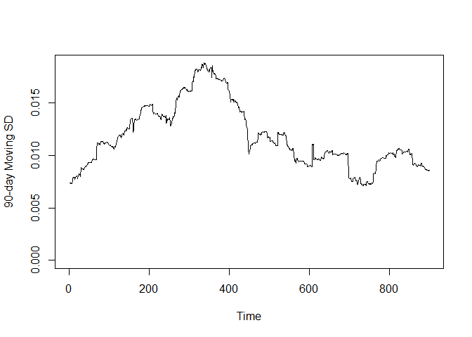
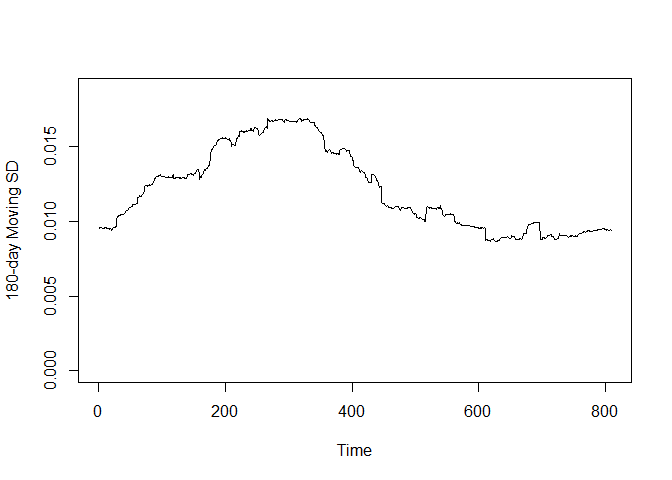
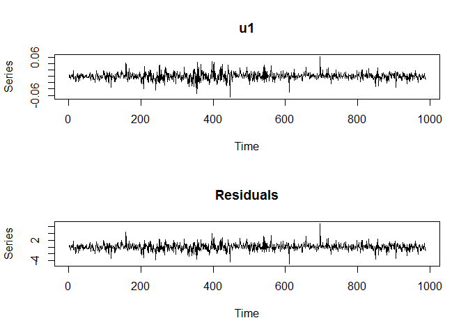
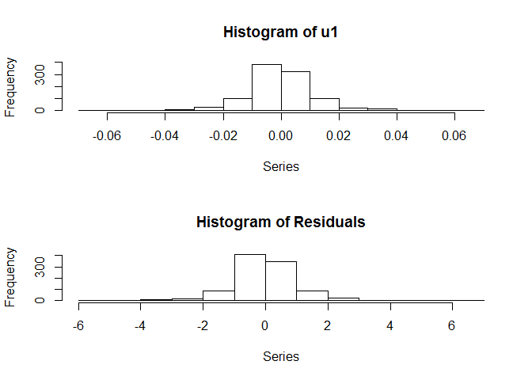
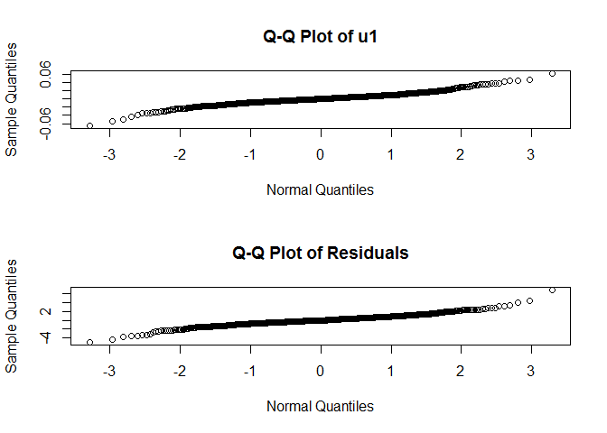
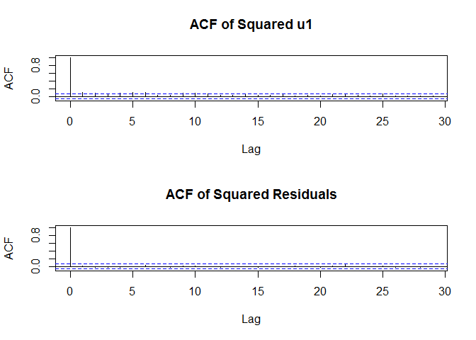

### Read in and Manipulate Data

```r
# Read in data (a CSV file) under Dataset
d <- read.csv("./../Dataset/stock_2018.csv")

# as.ts: coerce an object to a time-series
t1 <- as.ts(d$HSBC)               # For stock HSBC (0005)
t2 <- as.ts(d$CLP)                # For stock CLP (0002)
t3 <- as.ts(d$CK)                 # For stock Cheung Kong (0001)

# Compute daily percentage return
u1 <- (lag(t1)-t1)/t1             # lag: compute a lagged version of a time series
u2 <- (lag(t2)-t2)/t2
u3 <- (lag(t3)-t3)/t3
```

### Moving Standard Deviation

```r
msd <- function(t, w) {           # Function to compute moving s.d.
   n <- length(t)-w+1
   out <- c()                     # Initialize an output vector
   
   for (i in 1:n) {
      j <- i+w-1
      s <- sd (window(t, i, j))   # Compute the sd of t(i) to t(j)
      out <- append(out, s)       # Append to out
   }

   out <- as.ts(out)              # Coerce to a time-series object
}

s1_90 <- msd(u1, 90)              # Compute 90-day moving sd of u1
s1_180 <- msd(u1, 180)            # Compute 180-day moving sd of u1

par(mfrow = c(1, 1))
plot(s1_90, ylim = c(0, max(s1_90, s1_180)), ylab = "90-day Moving SD")
```

<!-- -->

```r
plot(s1_180, ylim = c(0, max(s1_90, s1_180)), ylab = "180-day Moving SD")
```

<!-- -->

Note that the volatility varies with time.

The minimum and maximum of `s1_90` is 0.0071 and 0.0188. Hence the minimum and maximum annual volatility is 11.27% and 29.85%.
Similarly, the minimum and maximum of `s1_180` is 0.0086 and 0.0169. Hence the minimum and maximum annual volatility is 13.7% and 26.85%.

### Generalized Autoregressive Conditional Heteroskedasticity (GARCH) Model
#### Maximum Likelihood Estimation

```r
library(tseries)
res <- garch(u1, order = c(1, 1))     # Fit GARCH(1,1) model
```


```r
names(res)                            # names: get or set the names of an object
```

```
 [1] "order"         "coef"          "n.likeli"      "n.used"       
 [5] "residuals"     "fitted.values" "series"        "frequency"    
 [9] "call"          "vcov"         
```

```r
round(res$coef, 6)                    # Display the coefficient using 6 digits
```

```
      a0       a1       b1 
0.000011 0.082403 0.837725 
```

```r
# n.likeli: the negative log-likelihood function evaluated
# at the coefficient estimates (apart from some constant)
-2*res$n.likeli                       
```

```
[1] 7853.381
```

```r
summary(res)
```

```

Call:
garch(x = u1, order = c(1, 1))

Model:
GARCH(1,1)

Residuals:
    Min      1Q  Median      3Q     Max 
-5.0160 -0.5337  0.0000  0.5162  6.9064 

Coefficient(s):
    Estimate  Std. Error  t value Pr(>|t|)    
a0 1.118e-05   2.780e-06    4.020 5.81e-05 ***
a1 8.240e-02   1.853e-02    4.446 8.73e-06 ***
b1 8.377e-01   3.571e-02   23.459  < 2e-16 ***
---
Signif. codes:  0 '***' 0.001 '**' 0.01 '*' 0.05 '.' 0.1 ' ' 1

Diagnostic Tests:
	Jarque Bera Test

data:  Residuals
X-squared = 788.5, df = 2, p-value < 2.2e-16


	Box-Ljung test

data:  Squared.Residuals
X-squared = 0.12839, df = 1, p-value = 0.7201
```

All the p-values are small and hence the coefficients are significantly different from zero.

#### Model Diagnostic

```r
plot(res)
```

<!-- --><!-- --><!-- --><!-- -->

From the plots, `u1` and the residuals are approximately normally distributed


```r
# Box.test: compute the Box-Pierce or Ljung-Box test statistic 
# for examining null hypothesis of independence in a time series
Box.test(u1^2, lag = 15, type = "Ljung")
```

```

	Box-Ljung test

data:  u1^2
X-squared = 76.023, df = 15, p-value = 3.698e-10
```

```r
Box.test(res$resid^2, lag = 15, type = "Ljung")
```

```

	Box-Ljung test

data:  res$resid^2
X-squared = 3.4925, df = 15, p-value = 0.999
```

The p-value of Box-Ljung test statistic for $u_i^2$ is small, meaning that there exists autocorrelation in $u_i^2$. On the other hand, the p-value for $u_i^2/\sigma_i^2$ is large, meaning that there is no autocorrelation in $u_i^2/\sigma_i^2$. It indicates that the autocorrelation of $u_i^2$ is removed by GARCH(1,1) model. Hence $\sigma_i^2$ is a good estimate of the variance rate.

#### Plot the Fitted Values

```r
library(plotly)                                # Create Interactive Web Graphics via 'plotly.js'
library(tidyr)                                 # Easily Tidy Data with 'spread()' and 'gather()' Functions
library(dplyr)                                 # A Grammar of Data Manipulation

t90 <- as.ts(c(rep(NA, 45), s1_90))            # Add 45 NA's in front of s1_90
t180 <- as.ts(c(rep(NA, 90), s1_180))          # Add 90 NA's in front of s1_180
s <- cbind(res$fitted.values[, 1], t90, t180)

# To be appeared in plot
colnames(s) <- c("GARCH", "90-day Moving SD", "180-day Moving SD")

# %>%: pipe operator
newseries <- as.data.frame(s) %>% 
    gather(type, value) %>%
    mutate(time = rep(time(s), 3))

plot_ly(x = newseries$time, y = newseries$value, color = newseries$type, mode = 'lines')
```

<!--html_preserve--><div id="htmlwidget-c2c39624a75dfb9ba81e" style="width:672px;height:480px;" class="plotly html-widget"></div>
<script type="application/json" data-for="htmlwidget-c2c39624a75dfb9ba81e">{"x":{"visdat":{"4a9411ea48d1":["function () ","plotlyVisDat"]},"cur_data":"4a9411ea48d1","attrs":{"4a9411ea48d1":{"x":[1,2,3,4,5,6,7,8,9,10,11,12,13,14,15,16,17,18,19,20,21,22,23,24,25,26,27,28,29,30,31,32,33,34,35,36,37,38,39,40,41,42,43,44,45,46,47,48,49,50,51,52,53,54,55,56,57,58,59,60,61,62,63,64,65,66,67,68,69,70,71,72,73,74,75,76,77,78,79,80,81,82,83,84,85,86,87,88,89,90,91,92,93,94,95,96,97,98,99,100,101,102,103,104,105,106,107,108,109,110,111,112,113,114,115,116,117,118,119,120,121,122,123,124,125,126,127,128,129,130,131,132,133,134,135,136,137,138,139,140,141,142,143,144,145,146,147,148,149,150,151,152,153,154,155,156,157,158,159,160,161,162,163,164,165,166,167,168,169,170,171,172,173,174,175,176,177,178,179,180,181,182,183,184,185,186,187,188,189,190,191,192,193,194,195,196,197,198,199,200,201,202,203,204,205,206,207,208,209,210,211,212,213,214,215,216,217,218,219,220,221,222,223,224,225,226,227,228,229,230,231,232,233,234,235,236,237,238,239,240,241,242,243,244,245,246,247,248,249,250,251,252,253,254,255,256,257,258,259,260,261,262,263,264,265,266,267,268,269,270,271,272,273,274,275,276,277,278,279,280,281,282,283,284,285,286,287,288,289,290,291,292,293,294,295,296,297,298,299,300,301,302,303,304,305,306,307,308,309,310,311,312,313,314,315,316,317,318,319,320,321,322,323,324,325,326,327,328,329,330,331,332,333,334,335,336,337,338,339,340,341,342,343,344,345,346,347,348,349,350,351,352,353,354,355,356,357,358,359,360,361,362,363,364,365,366,367,368,369,370,371,372,373,374,375,376,377,378,379,380,381,382,383,384,385,386,387,388,389,390,391,392,393,394,395,396,397,398,399,400,401,402,403,404,405,406,407,408,409,410,411,412,413,414,415,416,417,418,419,420,421,422,423,424,425,426,427,428,429,430,431,432,433,434,435,436,437,438,439,440,441,442,443,444,445,446,447,448,449,450,451,452,453,454,455,456,457,458,459,460,461,462,463,464,465,466,467,468,469,470,471,472,473,474,475,476,477,478,479,480,481,482,483,484,485,486,487,488,489,490,491,492,493,494,495,496,497,498,499,500,501,502,503,504,505,506,507,508,509,510,511,512,513,514,515,516,517,518,519,520,521,522,523,524,525,526,527,528,529,530,531,532,533,534,535,536,537,538,539,540,541,542,543,544,545,546,547,548,549,550,551,552,553,554,555,556,557,558,559,560,561,562,563,564,565,566,567,568,569,570,571,572,573,574,575,576,577,578,579,580,581,582,583,584,585,586,587,588,589,590,591,592,593,594,595,596,597,598,599,600,601,602,603,604,605,606,607,608,609,610,611,612,613,614,615,616,617,618,619,620,621,622,623,624,625,626,627,628,629,630,631,632,633,634,635,636,637,638,639,640,641,642,643,644,645,646,647,648,649,650,651,652,653,654,655,656,657,658,659,660,661,662,663,664,665,666,667,668,669,670,671,672,673,674,675,676,677,678,679,680,681,682,683,684,685,686,687,688,689,690,691,692,693,694,695,696,697,698,699,700,701,702,703,704,705,706,707,708,709,710,711,712,713,714,715,716,717,718,719,720,721,722,723,724,725,726,727,728,729,730,731,732,733,734,735,736,737,738,739,740,741,742,743,744,745,746,747,748,749,750,751,752,753,754,755,756,757,758,759,760,761,762,763,764,765,766,767,768,769,770,771,772,773,774,775,776,777,778,779,780,781,782,783,784,785,786,787,788,789,790,791,792,793,794,795,796,797,798,799,800,801,802,803,804,805,806,807,808,809,810,811,812,813,814,815,816,817,818,819,820,821,822,823,824,825,826,827,828,829,830,831,832,833,834,835,836,837,838,839,840,841,842,843,844,845,846,847,848,849,850,851,852,853,854,855,856,857,858,859,860,861,862,863,864,865,866,867,868,869,870,871,872,873,874,875,876,877,878,879,880,881,882,883,884,885,886,887,888,889,890,891,892,893,894,895,896,897,898,899,900,901,902,903,904,905,906,907,908,909,910,911,912,913,914,915,916,917,918,919,920,921,922,923,924,925,926,927,928,929,930,931,932,933,934,935,936,937,938,939,940,941,942,943,944,945,946,947,948,949,950,951,952,953,954,955,956,957,958,959,960,961,962,963,964,965,966,967,968,969,970,971,972,973,974,975,976,977,978,979,980,981,982,983,984,985,986,987,988,1,2,3,4,5,6,7,8,9,10,11,12,13,14,15,16,17,18,19,20,21,22,23,24,25,26,27,28,29,30,31,32,33,34,35,36,37,38,39,40,41,42,43,44,45,46,47,48,49,50,51,52,53,54,55,56,57,58,59,60,61,62,63,64,65,66,67,68,69,70,71,72,73,74,75,76,77,78,79,80,81,82,83,84,85,86,87,88,89,90,91,92,93,94,95,96,97,98,99,100,101,102,103,104,105,106,107,108,109,110,111,112,113,114,115,116,117,118,119,120,121,122,123,124,125,126,127,128,129,130,131,132,133,134,135,136,137,138,139,140,141,142,143,144,145,146,147,148,149,150,151,152,153,154,155,156,157,158,159,160,161,162,163,164,165,166,167,168,169,170,171,172,173,174,175,176,177,178,179,180,181,182,183,184,185,186,187,188,189,190,191,192,193,194,195,196,197,198,199,200,201,202,203,204,205,206,207,208,209,210,211,212,213,214,215,216,217,218,219,220,221,222,223,224,225,226,227,228,229,230,231,232,233,234,235,236,237,238,239,240,241,242,243,244,245,246,247,248,249,250,251,252,253,254,255,256,257,258,259,260,261,262,263,264,265,266,267,268,269,270,271,272,273,274,275,276,277,278,279,280,281,282,283,284,285,286,287,288,289,290,291,292,293,294,295,296,297,298,299,300,301,302,303,304,305,306,307,308,309,310,311,312,313,314,315,316,317,318,319,320,321,322,323,324,325,326,327,328,329,330,331,332,333,334,335,336,337,338,339,340,341,342,343,344,345,346,347,348,349,350,351,352,353,354,355,356,357,358,359,360,361,362,363,364,365,366,367,368,369,370,371,372,373,374,375,376,377,378,379,380,381,382,383,384,385,386,387,388,389,390,391,392,393,394,395,396,397,398,399,400,401,402,403,404,405,406,407,408,409,410,411,412,413,414,415,416,417,418,419,420,421,422,423,424,425,426,427,428,429,430,431,432,433,434,435,436,437,438,439,440,441,442,443,444,445,446,447,448,449,450,451,452,453,454,455,456,457,458,459,460,461,462,463,464,465,466,467,468,469,470,471,472,473,474,475,476,477,478,479,480,481,482,483,484,485,486,487,488,489,490,491,492,493,494,495,496,497,498,499,500,501,502,503,504,505,506,507,508,509,510,511,512,513,514,515,516,517,518,519,520,521,522,523,524,525,526,527,528,529,530,531,532,533,534,535,536,537,538,539,540,541,542,543,544,545,546,547,548,549,550,551,552,553,554,555,556,557,558,559,560,561,562,563,564,565,566,567,568,569,570,571,572,573,574,575,576,577,578,579,580,581,582,583,584,585,586,587,588,589,590,591,592,593,594,595,596,597,598,599,600,601,602,603,604,605,606,607,608,609,610,611,612,613,614,615,616,617,618,619,620,621,622,623,624,625,626,627,628,629,630,631,632,633,634,635,636,637,638,639,640,641,642,643,644,645,646,647,648,649,650,651,652,653,654,655,656,657,658,659,660,661,662,663,664,665,666,667,668,669,670,671,672,673,674,675,676,677,678,679,680,681,682,683,684,685,686,687,688,689,690,691,692,693,694,695,696,697,698,699,700,701,702,703,704,705,706,707,708,709,710,711,712,713,714,715,716,717,718,719,720,721,722,723,724,725,726,727,728,729,730,731,732,733,734,735,736,737,738,739,740,741,742,743,744,745,746,747,748,749,750,751,752,753,754,755,756,757,758,759,760,761,762,763,764,765,766,767,768,769,770,771,772,773,774,775,776,777,778,779,780,781,782,783,784,785,786,787,788,789,790,791,792,793,794,795,796,797,798,799,800,801,802,803,804,805,806,807,808,809,810,811,812,813,814,815,816,817,818,819,820,821,822,823,824,825,826,827,828,829,830,831,832,833,834,835,836,837,838,839,840,841,842,843,844,845,846,847,848,849,850,851,852,853,854,855,856,857,858,859,860,861,862,863,864,865,866,867,868,869,870,871,872,873,874,875,876,877,878,879,880,881,882,883,884,885,886,887,888,889,890,891,892,893,894,895,896,897,898,899,900,901,902,903,904,905,906,907,908,909,910,911,912,913,914,915,916,917,918,919,920,921,922,923,924,925,926,927,928,929,930,931,932,933,934,935,936,937,938,939,940,941,942,943,944,945,946,947,948,949,950,951,952,953,954,955,956,957,958,959,960,961,962,963,964,965,966,967,968,969,970,971,972,973,974,975,976,977,978,979,980,981,982,983,984,985,986,987,988,1,2,3,4,5,6,7,8,9,10,11,12,13,14,15,16,17,18,19,20,21,22,23,24,25,26,27,28,29,30,31,32,33,34,35,36,37,38,39,40,41,42,43,44,45,46,47,48,49,50,51,52,53,54,55,56,57,58,59,60,61,62,63,64,65,66,67,68,69,70,71,72,73,74,75,76,77,78,79,80,81,82,83,84,85,86,87,88,89,90,91,92,93,94,95,96,97,98,99,100,101,102,103,104,105,106,107,108,109,110,111,112,113,114,115,116,117,118,119,120,121,122,123,124,125,126,127,128,129,130,131,132,133,134,135,136,137,138,139,140,141,142,143,144,145,146,147,148,149,150,151,152,153,154,155,156,157,158,159,160,161,162,163,164,165,166,167,168,169,170,171,172,173,174,175,176,177,178,179,180,181,182,183,184,185,186,187,188,189,190,191,192,193,194,195,196,197,198,199,200,201,202,203,204,205,206,207,208,209,210,211,212,213,214,215,216,217,218,219,220,221,222,223,224,225,226,227,228,229,230,231,232,233,234,235,236,237,238,239,240,241,242,243,244,245,246,247,248,249,250,251,252,253,254,255,256,257,258,259,260,261,262,263,264,265,266,267,268,269,270,271,272,273,274,275,276,277,278,279,280,281,282,283,284,285,286,287,288,289,290,291,292,293,294,295,296,297,298,299,300,301,302,303,304,305,306,307,308,309,310,311,312,313,314,315,316,317,318,319,320,321,322,323,324,325,326,327,328,329,330,331,332,333,334,335,336,337,338,339,340,341,342,343,344,345,346,347,348,349,350,351,352,353,354,355,356,357,358,359,360,361,362,363,364,365,366,367,368,369,370,371,372,373,374,375,376,377,378,379,380,381,382,383,384,385,386,387,388,389,390,391,392,393,394,395,396,397,398,399,400,401,402,403,404,405,406,407,408,409,410,411,412,413,414,415,416,417,418,419,420,421,422,423,424,425,426,427,428,429,430,431,432,433,434,435,436,437,438,439,440,441,442,443,444,445,446,447,448,449,450,451,452,453,454,455,456,457,458,459,460,461,462,463,464,465,466,467,468,469,470,471,472,473,474,475,476,477,478,479,480,481,482,483,484,485,486,487,488,489,490,491,492,493,494,495,496,497,498,499,500,501,502,503,504,505,506,507,508,509,510,511,512,513,514,515,516,517,518,519,520,521,522,523,524,525,526,527,528,529,530,531,532,533,534,535,536,537,538,539,540,541,542,543,544,545,546,547,548,549,550,551,552,553,554,555,556,557,558,559,560,561,562,563,564,565,566,567,568,569,570,571,572,573,574,575,576,577,578,579,580,581,582,583,584,585,586,587,588,589,590,591,592,593,594,595,596,597,598,599,600,601,602,603,604,605,606,607,608,609,610,611,612,613,614,615,616,617,618,619,620,621,622,623,624,625,626,627,628,629,630,631,632,633,634,635,636,637,638,639,640,641,642,643,644,645,646,647,648,649,650,651,652,653,654,655,656,657,658,659,660,661,662,663,664,665,666,667,668,669,670,671,672,673,674,675,676,677,678,679,680,681,682,683,684,685,686,687,688,689,690,691,692,693,694,695,696,697,698,699,700,701,702,703,704,705,706,707,708,709,710,711,712,713,714,715,716,717,718,719,720,721,722,723,724,725,726,727,728,729,730,731,732,733,734,735,736,737,738,739,740,741,742,743,744,745,746,747,748,749,750,751,752,753,754,755,756,757,758,759,760,761,762,763,764,765,766,767,768,769,770,771,772,773,774,775,776,777,778,779,780,781,782,783,784,785,786,787,788,789,790,791,792,793,794,795,796,797,798,799,800,801,802,803,804,805,806,807,808,809,810,811,812,813,814,815,816,817,818,819,820,821,822,823,824,825,826,827,828,829,830,831,832,833,834,835,836,837,838,839,840,841,842,843,844,845,846,847,848,849,850,851,852,853,854,855,856,857,858,859,860,861,862,863,864,865,866,867,868,869,870,871,872,873,874,875,876,877,878,879,880,881,882,883,884,885,886,887,888,889,890,891,892,893,894,895,896,897,898,899,900,901,902,903,904,905,906,907,908,909,910,911,912,913,914,915,916,917,918,919,920,921,922,923,924,925,926,927,928,929,930,931,932,933,934,935,936,937,938,939,940,941,942,943,944,945,946,947,948,949,950,951,952,953,954,955,956,957,958,959,960,961,962,963,964,965,966,967,968,969,970,971,972,973,974,975,976,977,978,979,980,981,982,983,984,985,986,987,988],"y":[null,0.0114153133620536,0.0110793701100516,0.0107449430841959,0.0104386738293187,0.0103655015076523,0.0103467270639908,0.0101395176314906,0.00986585060889483,0.00963531357782705,0.00944587950766136,0.0094657222581263,0.00929292493834955,0.0103479732787264,0.0102855745709311,0.0102756201214809,0.0101618691814303,0.00988972784000442,0.00965111747711092,0.0107182309710771,0.011142289341772,0.0112129392680172,0.0109180255177002,0.0105390219666174,0.0102155410366399,0.0102058244680084,0.0111264681865704,0.0107435391534793,0.0104894180124181,0.0101661989881901,0.0104784066327953,0.0101986445024161,0.00999877844517781,0.00977131460830408,0.00984492118241364,0.009710891707292,0.00949794641725938,0.00940276052939351,0.00945032765067563,0.00930186905156255,0.00940262819480397,0.00934790630325803,0.00921476181568898,0.00918927179760793,0.00914149246355403,0.00904034574202702,0.00894136038678406,0.00885765253618672,0.00877145939964771,0.00885274151004403,0.00883376969341288,0.00884316304900778,0.00882686135744638,0.00883894614351406,0.00877146208902517,0.00872851920322987,0.00875851119700604,0.00897278455697839,0.00886899747339847,0.0093976931278294,0.00934524070782216,0.00936832429217005,0.00986045447123053,0.00969070585237314,0.00949561867967659,0.00957997145725889,0.00939147991602396,0.00929058522868557,0.009551638183534,0.00937674452933242,0.00952842530328632,0.00965896909298587,0.0102674696007335,0.0115437836500816,0.0110838593532683,0.0107981177174929,0.0115581177404653,0.0114273782338448,0.0109959295670828,0.0106051029436435,0.0106169628818108,0.010779852025457,0.0104248062629606,0.0101103699346266,0.0107246952379089,0.0113154096859552,0.0112890816370252,0.0108901272812242,0.0105209762368861,0.0101934810561568,0.00994364564754002,0.00986367306418687,0.00968031214174592,0.00960861345857972,0.0094639808107991,0.00934149536247655,0.00932505339250015,0.0105813140168388,0.0113104858889515,0.0110544656883568,0.0110095403697362,0.0106817337510605,0.0106929662795977,0.010359456569985,0.0111215404130599,0.0107615134650618,0.0110114407099872,0.0106481493867184,0.0106226671574339,0.0102833385657581,0.0106676075836985,0.0121397461530126,0.0118189657907016,0.0119597235123184,0.0114473796033641,0.0110869132129196,0.0106915887449746,0.0103430499835724,0.0142884249324298,0.0137243635207881,0.0130134026444789,0.0123779941014356,0.01185695487127,0.0113856651409645,0.0109461393263136,0.0106639470722402,0.0103258470456817,0.0112388998642855,0.0110289785197451,0.0117167637652713,0.011367264921636,0.0111904567473037,0.0108845223736067,0.0106574199253093,0.0109725910296735,0.0110152646802248,0.0106415579202903,0.011007305265099,0.0106683296179649,0.010376248741957,0.0100684377160342,0.00980313985215112,0.00972583759231833,0.00959556317932166,0.00940730494962527,0.00943835626371892,0.0106998755852225,0.0104249459248513,0.010470481897339,0.0109648210984673,0.0107369482716587,0.0103982952586667,0.0102170048280378,0.00994989128806673,0.00970974625419036,0.00963406186278782,0.00956863545563869,0.00948227303263733,0.0153119161286429,0.0177153554948319,0.0165565741455392,0.0160118811505463,0.0151455885286269,0.0151230525840269,0.0145217678067364,0.0137910391044763,0.0131089977657381,0.0142449905182624,0.0137901828011483,0.0132535962531678,0.0126754070248316,0.0120751497615511,0.0119986348023503,0.011635427250999,0.0113243225558285,0.0108924527053566,0.0106444982250479,0.0108721643693382,0.0107058162725498,0.0104972589665987,0.0105277307478606,0.0105598513038829,0.010292834328175,0.0100642372708216,0.00989427406844273,0.00967101213841118,0.00979441160542937,0.00972957479783476,0.00958397003222517,0.00951749121892905,0.00940527351862844,0.00924320919983829,0.00944667560943361,0.00961988200663829,0.00942035745254268,0.00946075541471313,0.00929069284482626,0.00988115667033409,0.00969155562885818,0.00948160178417332,0.00958954930700963,0.0103392558909301,0.0121133800334671,0.0115874133495037,0.0113879998505745,0.0109462388335248,0.0125671850052726,0.0122020694796422,0.0162517352188937,0.0175693919894589,0.0164914944382338,0.0159703057701538,0.0151380906560406,0.0143512739628533,0.0141194348641935,0.0134493296116521,0.0129181379740667,0.0122889263937723,0.0120720124878833,0.0115729359456521,0.0121389190725395,0.0129767850843849,0.0131898081523581,0.0128622176429858,0.0122397494571457,0.0116982652241902,0.0125193424500277,0.0127369620400531,0.0132493256584087,0.0125937224898275,0.0120840137929278,0.0124536613925552,0.011907093842995,0.0128532969014809,0.0125125174560364,0.0121130332845407,0.0116737814072275,0.0114362590320778,0.0113890756277134,0.0118509973318898,0.0115213318664614,0.0166060360207709,0.0156719072210282,0.0155923875526689,0.0152006743044438,0.0143773301322405,0.0135955300476288,0.0134185380340334,0.0137570883900964,0.013027824461908,0.0136744736754771,0.0159889950178904,0.0180541018327603,0.0180549842940868,0.0169408613590715,0.0159257342145704,0.0152670742138378,0.0154690128608974,0.0145948130546667,0.0142748483106153,0.0135890934968433,0.0129592658358866,0.0135871587052363,0.012989663527939,0.0123599559031126,0.0144275113848669,0.0139523563018809,0.0156815802463182,0.0160224967561238,0.0150431246142431,0.0157457839429184,0.0148395784911429,0.0140803820820818,0.0135949171830526,0.013737453853243,0.0132557499072166,0.0128428058673916,0.0124817351583765,0.011938503899407,0.0114845084838867,0.011682759849848,0.0113620131864433,0.0109865555781551,0.0105995432136309,0.0104755774814816,0.0102224960959814,0.00994691144577407,0.0102428031007686,0.00999874664228372,0.00984663366630101,0.0110400136967629,0.0117027674727699,0.012081433247796,0.0115545463649465,0.011101177610759,0.011323636189171,0.0130044011683235,0.0127354303602961,0.0124049560117733,0.0118570301006759,0.0122014114691154,0.0123786119905671,0.0119201726407122,0.0114478076916018,0.0111915006566419,0.0108644235571438,0.0105541059882598,0.0102639835892998,0.0107247690497253,0.0104102811445809,0.0101903637702039,0.01101775876294,0.0106649994176571,0.0110499839848809,0.0110217293488302,0.0106381902657828,0.0103933111896317,0.0104831687661585,0.0105021254083503,0.0117379053276749,0.0138755534347295,0.0132063740286338,0.0126795350582324,0.012077253240351,0.0117404771198395,0.0115965644650767,0.0112804905029069,0.0111497032424701,0.0107609798077711,0.0104651508181659,0.0123010002598959,0.0119827125326842,0.0118813535421468,0.0147883060080244,0.0139511622137522,0.0142057484835294,0.0134468589911579,0.0130561458931553,0.0129700107036029,0.0123750359185733,0.0148207127063981,0.0139809419669585,0.0148962351385845,0.0155770961325636,0.0155582066503639,0.0151839150455392,0.0172408631440191,0.0172438183645348,0.0163168142864241,0.0165076458681483,0.0154946689475337,0.0148054514714966,0.0172121875783108,0.0161631991668092,0.0152894307189987,0.0212424692604194,0.0213333511573394,0.0236024398813076,0.0218673425039159,0.0208625751114044,0.0211306476419268,0.0200195157895592,0.0196573083543623,0.0182998254530448,0.0172808103555684,0.0171085560399613,0.0193256201864714,0.018010756432911,0.0169786435372335,0.0166264749963143,0.0157362148635645,0.015187374067984,0.014702133079525,0.0140571545549947,0.0140875275940318,0.0133481160934881,0.0126793060818053,0.0122909078369318,0.0120724978294306,0.0117165855741066,0.0117523401961046,0.0115515793876584,0.0112218564658356,0.0109363783362881,0.0109368409809743,0.0113075951945292,0.0109396317973416,0.0108857066725587,0.0111766825213781,0.0110882439971088,0.0128757689517729,0.0131981699307732,0.0125690597385434,0.0120455235024689,0.0115881729145585,0.0112288096693979,0.0169975358217062,0.0168944488674585,0.0159176875551338,0.0150860287963561,0.0176991267840757,0.0165506309284739,0.0200813895170004,0.0191197564449018,0.0182282214320282,0.0175912133711584,0.0165904297734483,0.0157408880874825,0.0149527538250234,0.0141860873721866,0.0153749851935581,0.0150087516634728,0.0155132916563015,0.0145902498579293,0.0139218674976937,0.0135659105716527,0.0130775827098003,0.0127853416832428,0.0127936836263948,0.0142932179600698,0.0141068405492658,0.0161898448315667,0.0155252168471968,0.0148924002595176,0.0141479530194993,0.0172845725620815,0.0164188983765401,0.0153952128749799,0.0144848025678242,0.0138582167133196,0.0139561823386478,0.013231692767191,0.0126788650930508,0.0127079606097522,0.0128425563148125,0.012379395485184,0.013501540194389,0.0153305812992404,0.0149412233678091,0.014091181773452,0.0145151210893264,0.0158858869411319,0.0179216933086692,0.0169439246691955,0.0161243060817503,0.0153988191561147,0.0238363622131389,0.0225958852991267,0.0210310963126874,0.0198876477908273,0.0186680383861374,0.0180733111001381,0.0175375091227143,0.0167317237440407,0.0157227535077742,0.014802286689154,0.0146917930177431,0.014672313822805,0.0139183209421882,0.013717576330776,0.0131097737793639,0.0124863405386774,0.0119944972068014,0.0122726226587113,0.0117753889733754,0.0112987181551443,0.010883400020754,0.0105074102426246,0.0103762168867726,0.0101321386200927,0.00995867130635339,0.00981200117094789,0.00958283723201461,0.0104184091934208,0.0127580674456438,0.0124445726656001,0.0130270805187994,0.0124084122948747,0.0120260221275392,0.0116334145905355,0.011272462970591,0.0108487778319721,0.0106380312205315,0.0105104759577253,0.0106617561907754,0.010432605718814,0.0102012080386824,0.00992087612717141,0.00967628809622674,0.0095553837888996,0.00964854472415762,0.00952964630580536,0.00976240756545307,0.0116236580429181,0.0137174038417215,0.0130017983030751,0.0131968865038627,0.0125352370736444,0.0126255725813682,0.0120910343732649,0.0118112776366893,0.0135428009663655,0.0128973404744781,0.0126231975542284,0.0129320512467518,0.0123877399683074,0.0119116942857968,0.0116122235045153,0.0118749327652303,0.0116326636103785,0.0116842132284078,0.0118168780656275,0.0113233504202423,0.0108899096974432,0.0116143758364745,0.0120257314648905,0.0120129508224361,0.0115569684974171,0.0112235436540779,0.0109748837962562,0.010586824383235,0.0103224742791335,0.0110464361470306,0.0112826922096447,0.01107683278361,0.0116633330683049,0.0111891114223868,0.0110797407491748,0.0106779285067517,0.0107365995821306,0.0104053989481786,0.0103263918144738,0.0100372849358391,0.00992503093610859,0.00967985675167866,0.00948235183212703,0.010003496501424,0.00975997526505145,0.00956747407061077,0.0126497344323571,0.012053489233453,0.0127057268789344,0.0156333159507952,0.0156904546762255,0.0149307608889899,0.0147698364996562,0.0139432836871348,0.0140749434933735,0.0137187154944347,0.013070099020798,0.0131278579612851,0.0125261883906911,0.0119424478109362,0.0114519658333023,0.0110118659601399,0.0114196913684844,0.0111789797986573,0.0107744939000218,0.0104129605375924,0.01012465431466,0.0139197994144323,0.0162451175962509,0.0152541622715079,0.014463591444804,0.0145476947385375,0.0140764377381904,0.0136270632275235,0.0131424442447414,0.0124869475115835,0.011941767277755,0.0127406696356317,0.0124401089186651,0.012127748424256,0.0117035466081727,0.011280752086533,0.0108528102466881,0.0105726551264147,0.0108065712302157,0.0106402024863804,0.0104959765532912,0.0101941651565747,0.00991395005896097,0.00979812359373853,0.00983545077741454,0.00961347380996243,0.00941543748700162,0.00991557687781102,0.0106851555207625,0.0105745944399805,0.0102997523448358,0.0101982302862554,0.00991489563738922,0.00967371122681023,0.0103644356308533,0.0113501740773143,0.0109153987090083,0.0106746970725579,0.0103355550369453,0.010221016407299,0.0102201747053493,0.0099549809145274,0.00979237905157383,0.00965326649019192,0.0101403880558761,0.00988594934029845,0.00965583317880871,0.00991356071180579,0.0099990824925979,0.00974349095112073,0.00996813307638898,0.0173327778921574,0.0162186300369658,0.0152517822985753,0.0145282175859624,0.0139344331868763,0.0133801613845966,0.0128269461358255,0.0125622267344273,0.012050552971799,0.0115273982664635,0.0110677978094774,0.0106699644261203,0.0104120891428755,0.0101225965420431,0.0116127435698308,0.0117698018476003,0.0113156760118814,0.0112705223330598,0.0108805433339525,0.0109001745438803,0.0105607410961332,0.0105792380336003,0.0102539672404577,0.00996293703718689,0.00977900072754091,0.00988027440107729,0.00970785156220022,0.00949624634957951,0.00935632825954745,0.00921826262962706,0.00910086944062783,0.00898718009007078,0.00888215147146315,0.00881658990990079,0.00883978722268232,0.00903973611595708,0.00969946618477624,0.0104173893332357,0.0101977880869641,0.00993873225301168,0.00969436822244191,0.0100155822195084,0.0104163147235786,0.0101928045865337,0.0100008744595996,0.00976794192390276,0.00958679058933507,0.012640662871197,0.0120605417239134,0.0116063890151725,0.0112378417319837,0.010849195236631,0.0107852979357688,0.0104415734793006,0.0106069523349905,0.01028688047319,0.0100689695619974,0.010047123511707,0.00993200572603894,0.0101395387315177,0.00986661713517017,0.00968795438690183,0.00953614629521152,0.00936828437391319,0.00926453202789516,0.00911737944999264,0.00902967110116948,0.00916245620367114,0.00904998920799645,0.00917674383908052,0.00904985384016013,0.00895428232331497,0.0090064359274019,0.00891769255877297,0.00884276222384953,0.00875943444409119,0.00923684424283941,0.00938484468228723,0.0095024738443507,0.00946572302758492,0.00962083558940552,0.00947817556141995,0.00931886691306283,0.00928027889305286,0.00913075584411316,0.00908926348242595,0.0201271196360166,0.0187320984037267,0.017826255539084,0.0166834909390178,0.0156757806087758,0.0147642621890945,0.0139427870241972,0.0143670173607496,0.013678185060127,0.0130270053382054,0.0124782024811343,0.0119018253856361,0.0114205395074664,0.0109746019995692,0.010695695170195,0.0104575113537542,0.0101832622915672,0.00990937423536224,0.0116523224322021,0.0111909393363746,0.0108542805073321,0.0106158971710622,0.0127273049805641,0.0122073375875215,0.011803775214796,0.0113689953208854,0.010968090011433,0.0105951334161536,0.0102576244292616,0.0102907999441631,0.01086131993254,0.0123743592439384,0.0121552602637391,0.0117422307127807,0.0112813649327973,0.0111329934786924,0.0111573030643361,0.0107471332766096,0.0107916132442731,0.0104278009774203,0.0101294615044926,0.0101701599236095,0.00995714192376945,0.00989281380255268,0.0111413878968331,0.0107727217682872,0.010418273068631,0.010133003575451,0.00988783929534824,0.0103018833897517,0.0101221311705164,0.00991758420517063,0.0104135772115981,0.0101880757420659,0.00992242257517614,0.00968505329294798,0.00959453196469367,0.0098784655339701,0.00982241100250483,0.0095917669279543,0.0093941927306994,0.00937809083578639,0.0092136152642192,0.00907353784988061,0.00895252053267981,0.00884986756666863,0.00886158849669731,0.00939964169202867,0.0093483795038702,0.00936953576342767,0.00922121236011112,0.00995043946257096,0.0098720360301918,0.00963464222303372,0.00943818596959668,0.00927042481403434,0.0091369312432225,0.00902364913466451,0.00965865106957815,0.00963826064361715,0.00943397299117927,0.00925936736435102,0.00914137631314341,0.0090411893843367,0.00895623289410736,0.00890181105406378,0.00913546112563154,0.00916329694642598,0.00951290579677182,0.00937464172391405,0.00927893152386136,0.00932408880303969,0.00932273375019702,0.00936035680532615,0.00920435029177422,0.009134342257259,0.00920188916603855,0.00906361641841628,0.00899500310315191,0.00889404413956908,0.00881892057771362,0.00894336476054088,0.0102205461757217,0.0103727200241379,0.0100812614690527,0.00999283451395208,0.00975424435562269,0.0103066510690265,0.0100083739062698,0.00975842142159018,0.00956533078607102,0.00946036985245578,0.0103765909916535,0.0100846189360127,0.0100330552619296,0.0112667440435396,0.0108421635565847,0.0120007980525912,0.0115710627461414,0.0116774477368956,0.0112523316138186,0.0109800019955711,0.0105928132434562,0.0102954679455745,0.0101297234348747,0.00988198124812479,0.00966969040523942,0.00946257912021389,0.0104730053359811,0.0102269574320072,0.0100669280304278,0.0098600468535016,0.00968289764244326,0.00960714438596352,0.0102532364668859,0.0120720426522569,0.0116057163124934,0.0112203354982767,0.0110613501059026,0.0106954793970881,0.0104322203613644,0.0101181682137569,0.00993731934845145,0.00997460131728613,0.00973542132018356,0.00958886630735911,0.00941568576001085,0.00949670669131674,0.00984946857177973,0.0096210393287466,0.00943310737730613,0.00933547921632288,0.00962732760271829,0.0134018882287949,0.0127189314293187,0.0122440697579511,0.0119582143072405,0.0115344111073709,0.0111679431089631,0.0131426230758476,0.0137594914501462,0.0157980912635344,0.0150190114272872,0.0142209525878331,0.0134434530016176,0.0127556819279015,0.0126188285986701,0.0122219142296046,0.0116811496231034,0.0114951826549459,0.0119782585510143,0.0117221872317101,0.0114988486929381,0.0111218432175329,0.0107738154933242,0.0108353947244731,0.0105247440709218,0.010438574438619,0.0101292162146424,0.0100697734587311,0.00983263841321574,0.00962934072016209,0.0094337178349618,0.0094843303355302,0.0111834525873122,0.0108519061950964,0.0104870737650726,0.0109995030256568,0.0106082068906434,0.0104162526216021,0.0110551189461058,0.010963742270202,0.0115020851233382,0.0112138085893242,0.0109995112235248,0.0106236360816123,0.0108381649697598,0.0105506626988529,0.0103924236115149,0.0101110805865038,0.0101442468470805,0.0100460934343494,0.00981243209487986,0.00988483740914131,0.00966127043843503,0.00959947825828261,0.00949079405915268,0.0104824937665101,0.0102010530397512,0.0102900442145858,0.0142513792924893,0.0134778343119477,0.0131416768907372,0.0125071509713826,0.0125080714199363,0.0120436425798175,0.0119410841399382,0.0115474702815393,0.0110914274325221,0.010733395130185,0.0104191125965858,0.0103100551113262,0.0100723204864853,0.00980823001330476,0.00975675840640059,0.00956453770607178,0.0100202878261408,0.0104019586924701,0.0107930465298249,0.0104290435758451,0.0104081315537036,0.0101029201276183,0.00983281427145259,0.0100046806914034,0.0100893797368231,0.0099350428781526,0.00971714241015073,0.00950887775296598,0.00937022410645855,0.009206898093505,0.0112018382168231,0.0110284912034279,0.0110632142902225,0.0106635639551876,0.0106173017646545,0.010322776503701,0.0107563850422924,0.0105172040353859,0.0105564258938109,0.0113270394576992,0.0109093686154226,0.0105972841173752,0.0102671234955875,0.0104057895655915,0.0103208917112832,0.010678545760622,0.0103466799202162,0.0100735796993933,0.00980756412520332,0.00959702820221228,0.0096433340146729,0.00973190399056435,0.00951416758903648,0.00936077150520274,0.0104154630695862,0.0102187287390326,0.0099986247827894,0.00975066347938305,0.00954759244370295,0.0093643071509035,0.00929799175696209,0.0107251045699565,0.0105559105066651,0.0103177016222591,0.0100490265021731,0.00978842416489823,0.00972540354200348,0.00995131550062632,0.00990181213638873,0.00971106193843138,0.0100127330919319,0.0100695151031074,0.00980620192233629,0.00975352601432574,0.00958681745155718,0.00944528706484306,0.00941284847831612,0.00929860274311964,0.00959139647199616,0.00940279697453637,0.00923502681865009,0.00947097354460928,null,null,null,null,null,null,null,null,null,null,null,null,null,null,null,null,null,null,null,null,null,null,null,null,null,null,null,null,null,null,null,null,null,null,null,null,null,null,null,null,null,null,null,null,null,0.00737557562657682,0.00738466407385488,0.00734873012078012,0.00735590950292518,0.0073359457620761,0.00733034902216619,0.00733612742987431,0.00760358014230226,0.00783900473507247,0.00786138684283073,0.00794491258170115,0.0079066761064146,0.00795513479707,0.00772258367978713,0.00785733237026375,0.00784246663752404,0.00796173139128487,0.00796325770067988,0.00803672187840555,0.00784295915469007,0.0078211603025828,0.00806508384228736,0.00808817468099704,0.00823140422390841,0.00822811767221087,0.00819384325563411,0.00800184425987908,0.00800123054292953,0.00876972781403157,0.00883036843444728,0.00875360469005959,0.00874202034039027,0.00873853975154215,0.00873998299426396,0.00868440464915585,0.00867082123647096,0.00867060466580551,0.00881939278742895,0.00882479566869852,0.00896615945570827,0.00895638233742208,0.00895411335571799,0.00896157822497324,0.00899507979285207,0.00912474782611815,0.00920489598663806,0.0092051419488914,0.0093340204078613,0.0093370051561258,0.00932191422120819,0.0093195013671226,0.00931466085622132,0.00932363505647221,0.00932351142411768,0.00932330589950074,0.00936117862699926,0.00958560901187688,0.00955682855547621,0.00962058907840574,0.00966560851036061,0.00968494295894029,0.00967030680673679,0.00960502258623443,0.00959735775420964,0.00959386811335655,0.0095751367187945,0.0095893955892376,0.0095958456313996,0.0105671167968151,0.0112259413800191,0.0111871209072371,0.0112332319608157,0.0111509653059773,0.0110974328189253,0.0111535013709274,0.0111524639152241,0.0110164622516737,0.0112544209990172,0.0113142595341034,0.0113492192333798,0.0113245492770675,0.011256594783436,0.0113138058451386,0.0113388895952669,0.0112466541166617,0.0111118143796067,0.0110595624939277,0.0111207762216779,0.0111527310706634,0.0111766729546095,0.0112275509358937,0.0112396461298378,0.0112420858558854,0.0112327855334309,0.0112295089751093,0.0112308281193591,0.0112663907710407,0.0111244503425976,0.0110033423694011,0.0109940347839756,0.010957577844458,0.0109475226427954,0.0109403986824644,0.0109838997591706,0.0108357459818267,0.0108524808861314,0.0107769907340731,0.0108535417046367,0.0108209178450753,0.0108209078911224,0.0107638525242682,0.0106175126702244,0.0108939196435109,0.0108056599598508,0.0108444249091166,0.0108323674087587,0.0111173635180129,0.0111515405853859,0.0113018091921773,0.011718249425402,0.0117281198200547,0.0118166539955686,0.0118364918672202,0.0118479089960149,0.0119326794752294,0.0119304856656686,0.0119482582460191,0.011786783727746,0.011819256242215,0.0116675137924117,0.011798062274336,0.0119665697971022,0.0120607669152617,0.0120876845209275,0.0120182750467776,0.0119727968068453,0.0121289405988555,0.0121756508683655,0.0123127878283918,0.0123097315288529,0.0123243261224354,0.0124533346928961,0.0124359055108401,0.0126276254467781,0.0126587519391615,0.0126691424707328,0.0125332833337237,0.0125559374586027,0.0125638980137797,0.0125740198678115,0.0125703223901095,0.0133411771613453,0.0133444537412219,0.0134549659493761,0.0135523089830212,0.0135379303077003,0.0135356489459977,0.0135764065409617,0.0128638850932833,0.0122126549641775,0.0123527653822082,0.0127885200056206,0.0133753536304927,0.0134500690918023,0.0134299648032256,0.0134454110626203,0.0134617401952629,0.0133786203963909,0.0133509511579955,0.0133876282750196,0.0133890329633899,0.0134070162812225,0.0134602104454412,0.0134580347299976,0.0134573269731605,0.0137450000348143,0.0137867472023602,0.0141126266505942,0.0143325193765088,0.0143268542305348,0.0145622801378827,0.0145263625040161,0.0145445504996024,0.014589544887103,0.0146610722611735,0.0146804679374995,0.0147036868458021,0.0147222399965984,0.0147208049185991,0.0147172102303349,0.014757900169718,0.0147803403679219,0.014772228170269,0.0147509619563358,0.0147639927341469,0.0147487670934197,0.0147455479026794,0.0146987379183224,0.0146983942575269,0.0147153094561658,0.0148590364363075,0.014879810615877,0.0147979651753406,0.0147991864919507,0.014777538108342,0.0148495990384818,0.0148679653345301,0.014873105915292,0.0143342872118265,0.0139551879130138,0.0140475484592327,0.0140541475040293,0.0140464222499764,0.0140318506495267,0.0139619950460549,0.0139575570266128,0.0139342551526171,0.0139346518442566,0.0139909861260572,0.0139920589874413,0.0138921328924421,0.0138422904351612,0.0137308501993792,0.013746753568757,0.0137760073573681,0.0137765147937337,0.0136052359316169,0.0135540986859766,0.01340860606966,0.0136046007570316,0.0139580913815932,0.0138721253658274,0.0138774943726708,0.0137209991904945,0.0137070597974885,0.0137361806185988,0.0137414705822814,0.0137564365138573,0.0137178907526715,0.0136260249140548,0.0138402067109231,0.0131033466196562,0.0131352424473186,0.0134546916286094,0.01336880367723,0.0134920257119494,0.0134925886363082,0.0134715510506148,0.0134072741119821,0.0134114083442719,0.0136417747900093,0.01317863261402,0.0128366229387526,0.0128556027819507,0.0130160328818963,0.013101743167484,0.0135046495569502,0.0135278665137415,0.0135649320655393,0.0137162483926943,0.0137113782988641,0.0137253553112856,0.0140500472474348,0.0140461451856174,0.0140673952675586,0.0148696387751911,0.0150833114829115,0.0155163416207352,0.0153182889422493,0.0153999712143418,0.0155114086877705,0.0155477538127223,0.0156637538561386,0.0156137015629751,0.0155579838926125,0.0156475315908741,0.0161703068708183,0.0161336458367431,0.0161704274432407,0.0162950532890524,0.0162804138428838,0.0163222412584758,0.0163460406468892,0.0163586809658482,0.0164597088098175,0.0164557383227589,0.0164603051840516,0.0164573366182071,0.0164732523096371,0.0164680776330355,0.0163870517928337,0.0163253057117536,0.0162421848504196,0.0162456404008174,0.0162681445132496,0.0162396248555977,0.0160632288746896,0.0160804566848672,0.0160824470235272,0.0160929869481028,0.0161583838279645,0.0161248723731559,0.0161225966199975,0.0161411396603431,0.0161523762210198,0.0161342702171783,0.0169265696139245,0.017085665957993,0.0170250781336216,0.0170233193922999,0.0175109633175651,0.0174380575585642,0.0180955339622076,0.0180987217993331,0.0181217762170644,0.018205608618966,0.0182238937607477,0.0182164621839922,0.0182090657733667,0.0180739490736399,0.0179879777974469,0.0180309031325085,0.018152007543476,0.0181536625880452,0.0181528877801258,0.0181344745588754,0.0181403120680386,0.0181205169647692,0.0182015571569194,0.0184453095070968,0.0183397786505335,0.0186704440459013,0.0186722610266231,0.0183942563071034,0.0184084041403456,0.018775928120586,0.0188054482215305,0.0187741483732902,0.0187262714666482,0.018743581128813,0.0185353043324626,0.0185370598471756,0.0183735779106432,0.0182606273763875,0.0182270676442106,0.0181816005628564,0.0179917002044905,0.0181162432884666,0.0181437174301265,0.0179915113059125,0.0181004205123725,0.0183374988499522,0.0183403727022601,0.0183575542560854,0.0183740366675686,0.0174503881099283,0.0185752778614389,0.0180578779221648,0.0180686121069655,0.0180330350490647,0.0177866162215757,0.0178161095382843,0.0177510940779528,0.0177953358209996,0.017772696358303,0.01765116460727,0.0172815906235475,0.0173687547419115,0.0173571163558568,0.0173223374693602,0.0173155181538337,0.0172726169832465,0.0172332737567002,0.0172805109505557,0.0172035544586177,0.0172031610407446,0.0172040280258802,0.0171847701452398,0.0171653064361279,0.0171511164179097,0.0171164533317609,0.0170945022011519,0.0170845096552674,0.0171463386665596,0.017332322449788,0.0172776436022732,0.0173636978274084,0.0173503410907579,0.0172897763423324,0.0172557207349494,0.0170195917468759,0.0168982036685374,0.0169133087345988,0.0169203216019037,0.0169434377798333,0.0169435598753864,0.0163068183633749,0.0161967262002603,0.0161911944886642,0.0161663640331366,0.0157476919674057,0.0157561566639938,0.015106386160365,0.0151934231835656,0.0153582834053022,0.015294741371638,0.0153568278528812,0.0153193519563401,0.0153808700893712,0.0153607378075889,0.0150766263238388,0.0152739625937367,0.0150659408375527,0.0151257985877795,0.0151913542886694,0.0151230028100361,0.0150800748114128,0.0150220216987457,0.0150871997612642,0.0149243711915104,0.0148991306314049,0.0146068170987568,0.0145389004673178,0.0144798483558011,0.0146192453867524,0.0141827461698066,0.0141981495421873,0.014198953086449,0.0142018174583195,0.0142173154607235,0.0140825867245722,0.0140975700312969,0.0142192455561039,0.0141719897920843,0.0141399399364655,0.0141930587954822,0.0139462791106552,0.0135493672248387,0.0134415976793215,0.0134637947551674,0.0132526835622565,0.0130305688298706,0.0125871536245009,0.0125959446854744,0.0125696906831459,0.012541444790612,0.0103731638116193,0.0101760608780548,0.0101454163795895,0.0104796779337368,0.0104700449444123,0.0106021064443508,0.0109336699479296,0.0109527927664047,0.0110193107157263,0.0110754626889352,0.0110102182253165,0.0111189662015555,0.0111546820165953,0.0111284373333867,0.0111959681712519,0.0112191714481029,0.0111926772251362,0.0111146579189455,0.0111227145276787,0.0112600011315769,0.0112622363714323,0.0112594184276806,0.011252680784725,0.0112515784033831,0.0117113822449045,0.0121357999953872,0.012144995877159,0.0120752652419938,0.0119921710222432,0.0120521620534498,0.0119554615338545,0.0119980113289869,0.0119893172153058,0.0119944606868819,0.0122022932709949,0.0122270646109421,0.0122469029966776,0.012257015399059,0.0122308712609847,0.0122096289279524,0.0122104614251791,0.012260071403442,0.0122721174648231,0.012281563182045,0.0122706115893662,0.0122559771797007,0.0122481295390593,0.0120501935609193,0.0117160100218582,0.0117123079247769,0.0116892076117002,0.0117944176227512,0.0117038455612571,0.0117028443192158,0.011708581872183,0.0113509284759697,0.0113352184706658,0.0113512853174035,0.0113788423070345,0.0113733249595482,0.0113955370937415,0.0113812129615087,0.011291678338555,0.0112631892676416,0.0111757658222951,0.0111150447923776,0.0111340607468841,0.0111947810311317,0.0110193486720458,0.0109209247395715,0.0109052324265211,0.010927763920604,0.0109206515741365,0.0109187732935401,0.0122145541770663,0.012203811216166,0.0120603321959278,0.0120398800241612,0.012048485810624,0.0119816695730643,0.0119944389553141,0.0120048681514537,0.0120205413090041,0.0119834369611082,0.0119779485689092,0.0119440744291387,0.0119565578226242,0.0119334303214869,0.0121214392685149,0.012219342810305,0.0121278115439318,0.012157809971066,0.0121598771148632,0.0118486855495581,0.0118486513638157,0.011714945260401,0.0111708229630638,0.010999767440404,0.0109706369891952,0.0108888384767474,0.0108893646460696,0.0107242903329458,0.0106715357525481,0.0106558827661172,0.0105557927667989,0.0105467111949615,0.0105464949127579,0.0105463655495136,0.0105522083909487,0.0104501179448123,0.0105335198762735,0.010662839497311,0.0106777190081922,0.0106776430822255,0.0100536048546547,0.00949596791237731,0.00958823413024343,0.00957931932996126,0.00940685910018001,0.00933628357575656,0.00928263229972428,0.00973009414061824,0.00973007437760569,0.0097290794213427,0.00949175574410097,0.00945088608233932,0.00942882787638062,0.00940105102926543,0.00943837018092638,0.00943727562671853,0.00945066979728839,0.00942996598554733,0.00943815313386918,0.0094688381809311,0.00946378426849076,0.00947530697520222,0.0094531950331806,0.00943260330837591,0.00943655728112941,0.00943848106355444,0.00932864734821442,0.00922216404053066,0.00920148293652365,0.00922062285891115,0.0091810530847048,0.00918079218177079,0.00921029470604556,0.00910174350422753,0.0089124663614284,0.00891384654049307,0.00897093724326831,0.00900174266107969,0.008997111824138,0.00899011184851259,0.00904093866372455,0.00904358673886058,0.00902833305405867,0.00894838482122626,0.00894317472875909,0.0089514515116405,0.0110462927352474,0.011021966919587,0.0110845768325108,0.0110539677634579,0.00961967891456436,0.0096288343145208,0.00963799703678269,0.00977250490078426,0.00971578959704172,0.00968379912131438,0.00967927727731843,0.00964093788150569,0.00961416673854957,0.00961183980996047,0.00964128572975231,0.00964250221494602,0.00963218138072975,0.00963913742022251,0.00966785823069428,0.00953922582531114,0.0095419114060399,0.00954192166977922,0.00985645266646678,0.00976900381154398,0.00977687790940222,0.00971886731223123,0.00970837174440199,0.00971649537334277,0.00969483416383348,0.00975086166237088,0.00991978840853777,0.0102654498900336,0.010283705175482,0.0103200264364489,0.0103088850249226,0.0103647521123885,0.0104522130692621,0.0104559555020261,0.0104877466035268,0.0104714543639461,0.0103547502946532,0.0102165744549175,0.0101895469608477,0.0102343190677929,0.0103894132344747,0.0103654941078151,0.0103138210066551,0.0103229785473496,0.0103315741269995,0.0104364909237897,0.0104640459670368,0.0100444716808747,0.0101218689059181,0.0101222774536456,0.0101224533455795,0.0101214468579603,0.0101167331961763,0.0101626712485919,0.0101267892747445,0.010127704403285,0.0101100645437522,0.0100935951748672,0.0100650635311707,0.0100209857938576,0.0100194562841702,0.010005562461867,0.0100081662805168,0.0100576070175503,0.0100620744776537,0.0100953650661304,0.010094448592102,0.0101634716114328,0.0101908975815927,0.0101748650386535,0.0101793546004546,0.0101791623495382,0.0101560409346056,0.0101550646557799,0.0102701885561935,0.0102819554823629,0.0101976261671567,0.0101753767583305,0.0101523382364053,0.0101233409255376,0.0100639107457209,0.0100613848452265,0.0101178505558878,0.0101211181278597,0.0101997832301206,0.010207070530362,0.00784742648501791,0.00786751147480908,0.0077990708612679,0.00781412540843393,0.00780578713224654,0.0078091874687259,0.00783841234716825,0.00756520974760487,0.00754763766961059,0.00753119111702166,0.00751593218462071,0.00754614102101759,0.00776600760894065,0.0078501625268737,0.00782847369332994,0.00783804815544834,0.00782916245596455,0.00794758962311322,0.00759460176762363,0.00759254909189844,0.00758623021326389,0.00757514516517131,0.0072639489209999,0.00724630409682927,0.00725562324687363,0.007532395938366,0.00752558871813414,0.007820325883738,0.00784071423480195,0.00789805177378737,0.0077409375096149,0.00735351524225189,0.00728872593267018,0.00725862963656849,0.0072741708332221,0.00721303591080684,0.00710781316335445,0.00710767282361163,0.0072387106783554,0.00726031002404892,0.00728674665461791,0.00724609723492134,0.00725540823097208,0.00722745916598753,0.00709904093947363,0.00747937221815768,0.00749639547568759,0.00749421596402496,0.0075183545208073,0.00736985981668678,0.00733923703282588,0.00733894929438673,0.00726057718171019,0.007288098264052,0.00727867595452025,0.00730273477706822,0.00726751238479776,0.0072661446836264,0.00736340362887576,0.00736234835846679,0.00736795648781558,0.00735182994517386,0.00744609591734335,0.0082761281502903,0.00827836090809786,0.0082987288226328,0.00834776118922198,0.00828301927166316,0.0082822138509041,0.00868732963941032,0.00892332310856153,0.00943352152797588,0.00943817115746995,0.00945672008404494,0.00945483372948016,0.00945660397761422,0.00954502955757442,0.00958003109021025,0.00947491448266753,0.0095055519163653,0.0096645802535186,0.00970468303811364,0.00974523133938107,0.0097531457137615,0.00975785556026554,0.00981008891831894,0.00977567543928751,0.0097955826301203,0.00973069816971085,0.00974933434602906,0.00974031294541266,0.00972398598443077,0.00970207515971699,0.00971287165907901,0.00998418284611265,0.00998648869198782,0.00996087733781903,0.0100838763185351,0.0100780511595239,0.0100979269197484,0.0102300661059556,0.0102502631458433,0.0102109814202658,0.0101770234369707,0.0102042104095202,0.0101832300523632,0.0102580310344767,0.0101688569399083,0.0101923762277159,0.0101956441528057,0.0102324458018599,0.0102432039631047,0.0100963905709769,0.010130627406785,0.0101081688773689,0.00991982436076899,0.00993075047340579,0.00985462258509588,0.00984587349158552,0.00980731281669303,0.0104898618098429,0.0104690271182173,0.0105327573260582,0.0105310446650939,0.0106071683195336,0.0106226089861818,0.010682547814983,0.0106998180652948,0.0105485198585749,0.0105450759966683,0.0105352826416045,0.0105550518357321,0.0105556248038464,0.0105389120600842,0.010448755289697,0.0101312444279384,0.0102002180933906,0.0102586663170349,0.0103227415283099,0.0103152847881295,0.0103466250061943,0.0103467180478831,0.0103388941414134,0.0103555687132676,0.0103887690732331,0.0104028795013041,0.0103992781769099,0.0103745018582207,0.0103187043552938,0.0103167924370073,0.0105791007588739,0.0106153617706044,0.0106202676508874,0.0100434087190356,0.0100812006547328,0.0100597113432192,0.0101171381506655,0.0101273058129906,0.010166997937021,0.00990449368041567,0.00964526631374105,0.00911969060241115,0.00907380734899092,0.00913978209773566,0.00917875614292228,0.00926796174499839,0.00919617046579137,0.00917263965093353,0.00917246389745956,0.00912958231306967,0.0090064437167099,0.00900323123772907,0.00896142897814653,0.00895216104313898,0.00912615133774451,0.00907553066634488,0.00907609365472048,0.00904122926269724,0.00904258235979154,0.00900990694427899,0.00901730327786141,0.0092402148802333,0.00926450386460106,0.009254289511598,0.00897840997808365,0.00896423222587033,0.0089877942194699,0.00891925230325602,0.00894822578934765,0.00893355072556997,0.00885639520059027,0.00885147538859306,0.00868738943845024,0.0086845255352115,0.00865154359188794,0.00865346552049652,0.00856695944363844,0.00856257143633558,0.0086146803407226,0.00861054174511942,0.0085551143299063,0.00856769874055875,0.00860633819693494,null,null,null,null,null,null,null,null,null,null,null,null,null,null,null,null,null,null,null,null,null,null,null,null,null,null,null,null,null,null,null,null,null,null,null,null,null,null,null,null,null,null,null,null,null,null,null,null,null,null,null,null,null,null,null,null,null,null,null,null,null,null,null,null,null,null,null,null,null,null,null,null,null,null,null,null,null,null,null,null,null,null,null,null,null,null,null,null,null,null,null,null,null,null,null,null,null,null,null,null,null,null,null,null,null,null,null,null,null,null,null,null,null,null,null,null,null,null,null,null,null,null,null,null,null,null,null,null,null,null,null,null,null,null,0.00954764065236698,0.00957080338753516,0.00956493047280024,0.00956466619133546,0.00956776414553215,0.00955259922104291,0.00955440846097657,0.00955885055879787,0.0095628449534746,0.00957014100232693,0.00957547924957672,0.00956179577428049,0.00958244566307788,0.00951441862019008,0.00949940794771768,0.00949757418517645,0.00948726347868929,0.00954045252793091,0.00954451247041701,0.00945576403927687,0.00941604864014853,0.00944485114106663,0.0095939944724052,0.00959429399906456,0.00961278180345938,0.00959097698925484,0.00966319339659747,0.00968324244619797,0.0101006409943128,0.0103635037512614,0.0103358012346193,0.0103878301713575,0.0103959291447647,0.0104039613010316,0.0104371595311954,0.0104398219681079,0.0104545591680199,0.0104486813872732,0.010458282060058,0.0104588036992446,0.0105187457753018,0.0106130881041659,0.0106859769360248,0.0107098565779375,0.0107058569717619,0.010704445600443,0.0108046096275423,0.0108625635579196,0.0109540292083487,0.010946168200311,0.0109484143791342,0.0110080509375699,0.0110075074043431,0.0111074806491122,0.0111299432163124,0.0111407706581381,0.0111421010458074,0.0111398878907942,0.0111646340296142,0.0111848573860652,0.0111895294501796,0.0116211426978907,0.0115970088549046,0.0116600816580443,0.0117116057905188,0.0116969168341043,0.0116996823372815,0.0117285765259452,0.011780462582729,0.0117805670790529,0.0118537620121617,0.0121050543307142,0.0123568772067492,0.0123780782586642,0.0123838989985428,0.0123857272314684,0.012334763541221,0.0124078217767239,0.0124085890242851,0.012442472185649,0.0124240619965869,0.0124072182886488,0.0124886097360862,0.0124939556476069,0.0124519596109468,0.0125779435160514,0.0125865319150615,0.012785157043379,0.0128953786079167,0.0128953270099052,0.0130215873556626,0.0130183560046641,0.0130238634792862,0.0130385463433795,0.0130931629745678,0.013105228616278,0.0131157922083315,0.0130584814056412,0.0129968381395632,0.0129908605659203,0.0130037394744273,0.0130123048168551,0.0129993883324243,0.0129979590456058,0.0129524974814227,0.0129536053150534,0.0129168125299886,0.0129414393381525,0.0129247937035726,0.0129315112249155,0.0129790051264824,0.0129349699591029,0.0129754713137397,0.0129346892890744,0.0129349796759237,0.0129673878968646,0.0130939164875285,0.0131153496875775,0.0128721627275432,0.0128563463241679,0.0129101656387927,0.0129566689209651,0.0129604134605052,0.0129603004028576,0.0129705679080174,0.0129709692104711,0.0129737395029419,0.0129095111407761,0.0129385524045942,0.0128776423476517,0.0128745998660581,0.0129203423602672,0.0129163970298099,0.0129487635214012,0.0129313050729824,0.012906540007928,0.0129104580355187,0.0128887404888628,0.012903250400693,0.0129927050802161,0.0131669532634797,0.0131715098280069,0.0131729452683832,0.0131691031357553,0.0131808085977051,0.0131914420756909,0.0131241051517509,0.013137384541652,0.0131180308949328,0.0130740082711685,0.0131835725759749,0.0131943887649972,0.0132110827967345,0.0134258740265649,0.0134272296276144,0.0134808132247621,0.0134790073028749,0.0134953597128221,0.013129909711766,0.0128324945505282,0.0130224596493819,0.0129741639351965,0.0130745527609805,0.0131222937044373,0.0131932955302827,0.0132430308638903,0.01344967663238,0.0134207901891515,0.0134266773512058,0.0135293230744511,0.0135299704560506,0.0135411386334566,0.0137356302363251,0.0137327115211875,0.0137422962201322,0.0142934947038275,0.0144151626504253,0.014795129428296,0.0147926752259091,0.0148314957329203,0.0150029430031743,0.0150051485806846,0.0150780796753895,0.0150780364609162,0.0150789066544067,0.0151348244640911,0.0154151162107892,0.0154061077447472,0.0154231948307141,0.0154845436089999,0.0154943669921658,0.0155268462370579,0.01553648550408,0.0155342827619493,0.0155914261879393,0.0155821174547439,0.0155828367601663,0.0155604060009929,0.0155678751638131,0.0155726403150855,0.0155988365329574,0.0155759870281673,0.0154981143651705,0.0155018122769633,0.0155058925260932,0.0155342793874902,0.0154462828089067,0.015450517327943,0.0152118718977712,0.0150366626918438,0.0151300716517796,0.0151281670063086,0.0151231279558088,0.0151193749820306,0.0150813172850199,0.015072825907811,0.0154713764557289,0.0155531176982302,0.0155513367567409,0.0155533812269607,0.0157701143465071,0.0157060313438211,0.0160180462353825,0.0160258136197912,0.0160512054483362,0.0160987309211025,0.0160388570486815,0.0160127211287124,0.0159510784409796,0.0159524358336667,0.0160575052358761,0.0160469723509018,0.0161179776971072,0.0160556323282129,0.0160489432226048,0.0160597119076821,0.0160653919154355,0.0160716611156814,0.0160981119423598,0.0161914415542377,0.016215085371371,0.0160966745459313,0.0161097463750189,0.0160750363796498,0.01604531659448,0.0163032826273856,0.0163206420354018,0.0162938369727293,0.0162398710836767,0.0162515502235149,0.0162291855063592,0.0160419422594856,0.0158282128085982,0.015774182947312,0.0158120219081997,0.0158138237495018,0.0158825099329468,0.0159507694026293,0.0159769901947737,0.0159525978120616,0.0160125108155603,0.0161515860241205,0.0163017724303415,0.0163124547189289,0.0163303894332088,0.0162073636381615,0.0169122669134856,0.0168041036011513,0.0167222147995706,0.016754550395598,0.0166659304861194,0.0167152397399899,0.0167485324395083,0.0167477195043806,0.0167126676912938,0.0167033043430384,0.0167352538070205,0.0167719271903812,0.0167772896111798,0.0168093330946823,0.0167905515854429,0.016783992378744,0.0167831146681048,0.0168250763594953,0.0168212449774027,0.0168177860972706,0.016817919192571,0.0167984519686021,0.0168054063518036,0.0168037204971787,0.0167429882812721,0.0167039072626006,0.0166598112685924,0.0167044443249209,0.0168316357648945,0.0168180650020133,0.0167791407897577,0.0167620419984397,0.0167571440552683,0.0167624152664817,0.0167265310258774,0.0166901371200758,0.0166917644178647,0.0167001694191541,0.0167128987985872,0.0167132953355528,0.0167145964132927,0.0167132023231577,0.0166807409912926,0.0166825637573299,0.0166905164450967,0.016647067662307,0.0166617858007304,0.0167186879471668,0.0168279396873072,0.0168283741296173,0.0168643069484305,0.0168463375318533,0.0168663726063566,0.0168029427757347,0.0166837088326046,0.0167936259502819,0.0167895097696117,0.016807895903933,0.0168438505736772,0.0168327485538277,0.0168294459810616,0.0168260467484876,0.0168598059477646,0.0168694248257924,0.0167954270121504,0.0168106091107058,0.0167897780053063,0.0166033091070992,0.0166557569311621,0.0166348432202103,0.0166559149025616,0.0166443229501422,0.01661654298357,0.0166228830530977,0.016449560117991,0.0164539369148822,0.0163991276387188,0.016320442250401,0.0162827538195358,0.0162933938050829,0.0160857389997444,0.0160264227389723,0.0160171144598999,0.0159583288152566,0.0159599920252737,0.015954890615018,0.015725337143213,0.0157280825571446,0.0157228280101362,0.0151607000281086,0.0150345633934109,0.0146843070497261,0.014687074437113,0.0147745243889123,0.0146280937531762,0.0146606598908673,0.0147636732504068,0.0148207823066739,0.0148169380672428,0.0147668326830581,0.0145250559129944,0.0145925489947577,0.0146036281540879,0.0145662370717216,0.0145927061175832,0.0145772251396521,0.0145430038553992,0.0145253712386133,0.014485677563141,0.014534970735055,0.0145418605188674,0.0145336384644569,0.0145095552035935,0.0144960142997636,0.0146797367677088,0.0148446502532395,0.0148445736119221,0.0148365553274331,0.0148804867374469,0.0148626907770818,0.0148688365863931,0.0148789319678982,0.0148372820128873,0.0148183803377068,0.0147687277276708,0.0147100471520667,0.0147267865950441,0.0147368743358976,0.0147427112559336,0.0147330650156021,0.014366361472813,0.0143238138684499,0.0143257590787568,0.0143158470229096,0.0140773207478318,0.0140759134853394,0.0137149333321517,0.0136740381991204,0.0136284574913927,0.013588067895237,0.0136197561006285,0.0136419285464479,0.0136326510506376,0.0136225099638014,0.013477403090322,0.0134266824180713,0.0133053683933022,0.0133392220658267,0.0133889701297006,0.0133518943232618,0.0133429236026816,0.0133122873718121,0.0133008454778901,0.0131875004268784,0.0131353353666667,0.012944094085814,0.0129160131908201,0.0129088055507341,0.0129090048318508,0.0126219593726994,0.0126238752248848,0.0126340018335117,0.0126329725686911,0.0126405062767508,0.0131483985179709,0.0131502490174335,0.0131471868327914,0.0131154779365141,0.0131001538002732,0.0131041864573485,0.0129813391833623,0.0127856893450346,0.0127426323986664,0.0127443211603336,0.0126377429245185,0.0124891241849689,0.0122564546351626,0.0122439953363398,0.012316667704701,0.0123513618381981,0.0112661342394816,0.0111934692318471,0.0111819819397418,0.0111899638752648,0.0111797309668737,0.0111559518397198,0.0110728488269709,0.0110271483348107,0.011034791829093,0.0110395887232318,0.0109907493231319,0.010936074517864,0.010939606460398,0.0109054305719123,0.0109048730825141,0.0109071686100153,0.0108957947684352,0.0108492904073244,0.010850339271416,0.0108567052961306,0.0109103393323198,0.0109799666372086,0.0109826357179631,0.010981309110683,0.0109709428418288,0.0109919311755046,0.0110226348530409,0.0109741848507756,0.0108082392222946,0.0107951543234697,0.0107176676275526,0.0109172897426064,0.0109085117755921,0.0109055105293371,0.0109049317308243,0.0109041286662924,0.0109022354200945,0.0108935424707771,0.0108936600931823,0.0108813521318781,0.0108878206894459,0.0109091018860352,0.0109224583516022,0.010940783200109,0.0109305307053751,0.0109283535282209,0.0109112599608335,0.0107917153477676,0.0106077609664753,0.0106066001716049,0.0105478047106882,0.0105574279756782,0.0104982517071293,0.0105058749151262,0.010491735856012,0.0102944233134956,0.0102995778511655,0.0102661080873407,0.0102025986436785,0.0101994030442213,0.0102350842734906,0.010236851301526,0.0101842165110639,0.0101715893443116,0.0101504234382413,0.0101182970748907,0.0101185675308828,0.0101225149147317,0.0100281474070261,0.00997238559441995,0.0109482432885039,0.0109495761040908,0.0109747417391921,0.0109634984903531,0.0109645140867624,0.0109621944679918,0.0108860249442796,0.0109375913993321,0.010919656848659,0.0108749721631395,0.0108783083699953,0.0108646037593421,0.0108641892826601,0.0108458636470415,0.0108537366753058,0.0108355247817363,0.0108389806895431,0.0108263438709146,0.0109382045290464,0.010941753620861,0.0108888359568086,0.0109007488819867,0.0110451753474949,0.0108525149623249,0.0108557240622423,0.0107558213211111,0.01047683511663,0.0103992333651693,0.0103737191048484,0.0103512114774525,0.0104190287130278,0.0104855343863844,0.0104778068439949,0.0104816823829595,0.010434456201684,0.0104534643968477,0.0104919227007508,0.010492654820487,0.0105110147598607,0.0104428362476146,0.0104364126538038,0.010450710554649,0.0104518677540151,0.0104690507908023,0.0102651335644176,0.00999031430170817,0.00998871237320577,0.00998564064559203,0.00989217229552184,0.00990486943043897,0.00989362508508571,0.00986982490610247,0.0099110756999175,0.00990891990131373,0.00978779576521254,0.00976832698567696,0.00975194573802344,0.00976238916492009,0.00976125742625409,0.00976125742625409,0.00975863773382905,0.00974143196704464,0.00973292212854412,0.00972341472445064,0.00972009034647289,0.00971932778323031,0.00970900018602601,0.00972778469912473,0.00973186820532694,0.0097492199382215,0.00969379603809672,0.00968104340039365,0.00968657187584035,0.00968547379610337,0.00966772791531206,0.00966719207230492,0.00967023962771751,0.00962121123752603,0.00959400747954174,0.0096027018808492,0.0095882897703765,0.00958661345859738,0.00956864525439318,0.00955423974533532,0.00955133037129329,0.00955378873246792,0.00957139848378235,0.00953794834202142,0.00957350836260669,0.00957894429734463,0.00956001880749555,0.00955117386705956,0.00956467371045015,0.00954873463821505,0.00875397646943508,0.00876001077237267,0.0087771087570793,0.00875273011635013,0.00872333940316813,0.0086985132648683,0.00869321141910154,0.00867592689723746,0.00875306192388968,0.00879507076099433,0.00879473424123647,0.00880220160151484,0.00879063189279747,0.00883806593014429,0.00871017012596015,0.00864444304324651,0.00864828535792766,0.00863330496325032,0.00872430924416411,0.00868332515532717,0.00869362423981908,0.00876264084066706,0.00875995992543256,0.00887292186998895,0.00887684285297119,0.00892205191757484,0.00892185039950768,0.00892785057761739,0.00892256887191737,0.0089232025887938,0.0089239735325615,0.00892601974728614,0.00892616353861581,0.00892735982392413,0.00899760337768275,0.00899582629966619,0.00894356799425707,0.00885858380909891,0.00885449962792349,0.00885918161134953,0.00890802034654414,0.00903049615399047,0.0090044142331935,0.00900455821369939,0.00901532809844686,0.00901058690075542,0.00901268659653365,0.00877188157235391,0.0087842903924387,0.0087956183406559,0.00879139092069526,0.00880083544620575,0.00878370792870824,0.00880960123839827,0.00883018236356481,0.00882995581343489,0.00882282341841795,0.00880675318093944,0.00883184720002742,0.00917256038838203,0.00917320616194665,0.00917420841436472,0.00920134934054364,0.0092092843313727,0.00921196433586545,0.00940118321367588,0.00950572774363004,0.00979707033803999,0.00980753141252701,0.00980733767019393,0.00980730686715827,0.00980850073088598,0.00984314308918153,0.00986143758464077,0.00986248769493574,0.00988963954534297,0.00993250954857973,0.00993437368491231,0.00994440588212192,0.00993596718364312,0.0099122423080628,0.00993132473343089,0.00993760753912522,0.0099540482018402,0.00995541848519519,0.00996309427905858,0.00882001334256776,0.00882099393281866,0.00877754193015406,0.00879134018851246,0.00894011129873626,0.00894153087532737,0.00893875186160334,0.00888964346520074,0.00887896812616205,0.00888392001909441,0.00895307124979814,0.0089776137631206,0.0090510551465086,0.00906423519586642,0.00907028720681342,0.00906330888478444,0.00910082483605382,0.00910742471264789,0.00896660706937996,0.00896707228212846,0.00898301788420391,0.0089837548787293,0.00877389836948722,0.00878793975714281,0.00877714935568754,0.00878278036034627,0.00878598841302357,0.00887194046394822,0.00887556529331208,0.00887929227032806,0.00920054275880937,0.00903894914903316,0.00904281514603268,0.00903258383336307,0.00908160624637267,0.00906568956157397,0.00906077929441684,0.00907244705487606,0.00904376454459764,0.00904837427527909,0.00904886967917669,0.00904139623006743,0.00904322065311089,0.00902770827168996,0.00893008087728775,0.00892868709791245,0.00897786327985127,0.00902578055009728,0.00907604998171072,0.00902458824211276,0.00903482649770578,0.00903172091931934,0.00897892202969707,0.00900095575944045,0.00902672901562217,0.0090338072215158,0.00902667315988818,0.00899473151926143,0.00898631874384581,0.00898655184326092,0.0091509116808793,0.00915881624357366,0.00919414272728645,0.00919406613409529,0.00921781013689115,0.00922144904252118,0.00927117958929033,0.0092384555087209,0.00925839713943487,0.00933221596493803,0.00933210363666084,0.00927588486981611,0.00926500810740105,0.00929779604318628,0.00931445682793157,0.00936279874373082,0.0093631691664041,0.00936447949270408,0.00931422354896345,0.00930242884016959,0.00931913165475032,0.009339853058228,0.0093377474266404,0.00933795007835794,0.00942234950235324,0.00942744607780978,0.00941071975017905,0.00940115001477718,0.00936939729718154,0.00936653623744865,0.00936846381909161,0.00946945709421311,0.00947296766863424,0.00946687095770727,0.00946861198015509,0.0094641596534375,0.00946218099114792,0.00949316177742892,0.00950383926359748,0.00950690309957485,0.00954144161961817,0.00954972697740891,0.00945404894779546,0.00943622018789966,0.00943825152715357,0.00942803523504394,0.00943539460134046,0.00938059687317701,0.00941291548050155,0.00941353112389024,0.00941205364215242,0.00943062875876937,0.00938026186161858,null,null,null,null,null,null,null,null,null,null,null,null,null,null,null,null,null,null,null,null,null,null,null,null,null,null,null,null,null,null,null,null,null,null,null,null,null,null,null,null,null,null,null,null,null,null,null,null,null,null,null,null,null,null,null,null,null,null,null,null,null,null,null,null,null,null,null,null,null,null,null,null,null,null,null,null,null,null,null,null,null,null,null,null,null,null,null,null,null],"mode":"lines","color":["GARCH","GARCH","GARCH","GARCH","GARCH","GARCH","GARCH","GARCH","GARCH","GARCH","GARCH","GARCH","GARCH","GARCH","GARCH","GARCH","GARCH","GARCH","GARCH","GARCH","GARCH","GARCH","GARCH","GARCH","GARCH","GARCH","GARCH","GARCH","GARCH","GARCH","GARCH","GARCH","GARCH","GARCH","GARCH","GARCH","GARCH","GARCH","GARCH","GARCH","GARCH","GARCH","GARCH","GARCH","GARCH","GARCH","GARCH","GARCH","GARCH","GARCH","GARCH","GARCH","GARCH","GARCH","GARCH","GARCH","GARCH","GARCH","GARCH","GARCH","GARCH","GARCH","GARCH","GARCH","GARCH","GARCH","GARCH","GARCH","GARCH","GARCH","GARCH","GARCH","GARCH","GARCH","GARCH","GARCH","GARCH","GARCH","GARCH","GARCH","GARCH","GARCH","GARCH","GARCH","GARCH","GARCH","GARCH","GARCH","GARCH","GARCH","GARCH","GARCH","GARCH","GARCH","GARCH","GARCH","GARCH","GARCH","GARCH","GARCH","GARCH","GARCH","GARCH","GARCH","GARCH","GARCH","GARCH","GARCH","GARCH","GARCH","GARCH","GARCH","GARCH","GARCH","GARCH","GARCH","GARCH","GARCH","GARCH","GARCH","GARCH","GARCH","GARCH","GARCH","GARCH","GARCH","GARCH","GARCH","GARCH","GARCH","GARCH","GARCH","GARCH","GARCH","GARCH","GARCH","GARCH","GARCH","GARCH","GARCH","GARCH","GARCH","GARCH","GARCH","GARCH","GARCH","GARCH","GARCH","GARCH","GARCH","GARCH","GARCH","GARCH","GARCH","GARCH","GARCH","GARCH","GARCH","GARCH","GARCH","GARCH","GARCH","GARCH","GARCH","GARCH","GARCH","GARCH","GARCH","GARCH","GARCH","GARCH","GARCH","GARCH","GARCH","GARCH","GARCH","GARCH","GARCH","GARCH","GARCH","GARCH","GARCH","GARCH","GARCH","GARCH","GARCH","GARCH","GARCH","GARCH","GARCH","GARCH","GARCH","GARCH","GARCH","GARCH","GARCH","GARCH","GARCH","GARCH","GARCH","GARCH","GARCH","GARCH","GARCH","GARCH","GARCH","GARCH","GARCH","GARCH","GARCH","GARCH","GARCH","GARCH","GARCH","GARCH","GARCH","GARCH","GARCH","GARCH","GARCH","GARCH","GARCH","GARCH","GARCH","GARCH","GARCH","GARCH","GARCH","GARCH","GARCH","GARCH","GARCH","GARCH","GARCH","GARCH","GARCH","GARCH","GARCH","GARCH","GARCH","GARCH","GARCH","GARCH","GARCH","GARCH","GARCH","GARCH","GARCH","GARCH","GARCH","GARCH","GARCH","GARCH","GARCH","GARCH","GARCH","GARCH","GARCH","GARCH","GARCH","GARCH","GARCH","GARCH","GARCH","GARCH","GARCH","GARCH","GARCH","GARCH","GARCH","GARCH","GARCH","GARCH","GARCH","GARCH","GARCH","GARCH","GARCH","GARCH","GARCH","GARCH","GARCH","GARCH","GARCH","GARCH","GARCH","GARCH","GARCH","GARCH","GARCH","GARCH","GARCH","GARCH","GARCH","GARCH","GARCH","GARCH","GARCH","GARCH","GARCH","GARCH","GARCH","GARCH","GARCH","GARCH","GARCH","GARCH","GARCH","GARCH","GARCH","GARCH","GARCH","GARCH","GARCH","GARCH","GARCH","GARCH","GARCH","GARCH","GARCH","GARCH","GARCH","GARCH","GARCH","GARCH","GARCH","GARCH","GARCH","GARCH","GARCH","GARCH","GARCH","GARCH","GARCH","GARCH","GARCH","GARCH","GARCH","GARCH","GARCH","GARCH","GARCH","GARCH","GARCH","GARCH","GARCH","GARCH","GARCH","GARCH","GARCH","GARCH","GARCH","GARCH","GARCH","GARCH","GARCH","GARCH","GARCH","GARCH","GARCH","GARCH","GARCH","GARCH","GARCH","GARCH","GARCH","GARCH","GARCH","GARCH","GARCH","GARCH","GARCH","GARCH","GARCH","GARCH","GARCH","GARCH","GARCH","GARCH","GARCH","GARCH","GARCH","GARCH","GARCH","GARCH","GARCH","GARCH","GARCH","GARCH","GARCH","GARCH","GARCH","GARCH","GARCH","GARCH","GARCH","GARCH","GARCH","GARCH","GARCH","GARCH","GARCH","GARCH","GARCH","GARCH","GARCH","GARCH","GARCH","GARCH","GARCH","GARCH","GARCH","GARCH","GARCH","GARCH","GARCH","GARCH","GARCH","GARCH","GARCH","GARCH","GARCH","GARCH","GARCH","GARCH","GARCH","GARCH","GARCH","GARCH","GARCH","GARCH","GARCH","GARCH","GARCH","GARCH","GARCH","GARCH","GARCH","GARCH","GARCH","GARCH","GARCH","GARCH","GARCH","GARCH","GARCH","GARCH","GARCH","GARCH","GARCH","GARCH","GARCH","GARCH","GARCH","GARCH","GARCH","GARCH","GARCH","GARCH","GARCH","GARCH","GARCH","GARCH","GARCH","GARCH","GARCH","GARCH","GARCH","GARCH","GARCH","GARCH","GARCH","GARCH","GARCH","GARCH","GARCH","GARCH","GARCH","GARCH","GARCH","GARCH","GARCH","GARCH","GARCH","GARCH","GARCH","GARCH","GARCH","GARCH","GARCH","GARCH","GARCH","GARCH","GARCH","GARCH","GARCH","GARCH","GARCH","GARCH","GARCH","GARCH","GARCH","GARCH","GARCH","GARCH","GARCH","GARCH","GARCH","GARCH","GARCH","GARCH","GARCH","GARCH","GARCH","GARCH","GARCH","GARCH","GARCH","GARCH","GARCH","GARCH","GARCH","GARCH","GARCH","GARCH","GARCH","GARCH","GARCH","GARCH","GARCH","GARCH","GARCH","GARCH","GARCH","GARCH","GARCH","GARCH","GARCH","GARCH","GARCH","GARCH","GARCH","GARCH","GARCH","GARCH","GARCH","GARCH","GARCH","GARCH","GARCH","GARCH","GARCH","GARCH","GARCH","GARCH","GARCH","GARCH","GARCH","GARCH","GARCH","GARCH","GARCH","GARCH","GARCH","GARCH","GARCH","GARCH","GARCH","GARCH","GARCH","GARCH","GARCH","GARCH","GARCH","GARCH","GARCH","GARCH","GARCH","GARCH","GARCH","GARCH","GARCH","GARCH","GARCH","GARCH","GARCH","GARCH","GARCH","GARCH","GARCH","GARCH","GARCH","GARCH","GARCH","GARCH","GARCH","GARCH","GARCH","GARCH","GARCH","GARCH","GARCH","GARCH","GARCH","GARCH","GARCH","GARCH","GARCH","GARCH","GARCH","GARCH","GARCH","GARCH","GARCH","GARCH","GARCH","GARCH","GARCH","GARCH","GARCH","GARCH","GARCH","GARCH","GARCH","GARCH","GARCH","GARCH","GARCH","GARCH","GARCH","GARCH","GARCH","GARCH","GARCH","GARCH","GARCH","GARCH","GARCH","GARCH","GARCH","GARCH","GARCH","GARCH","GARCH","GARCH","GARCH","GARCH","GARCH","GARCH","GARCH","GARCH","GARCH","GARCH","GARCH","GARCH","GARCH","GARCH","GARCH","GARCH","GARCH","GARCH","GARCH","GARCH","GARCH","GARCH","GARCH","GARCH","GARCH","GARCH","GARCH","GARCH","GARCH","GARCH","GARCH","GARCH","GARCH","GARCH","GARCH","GARCH","GARCH","GARCH","GARCH","GARCH","GARCH","GARCH","GARCH","GARCH","GARCH","GARCH","GARCH","GARCH","GARCH","GARCH","GARCH","GARCH","GARCH","GARCH","GARCH","GARCH","GARCH","GARCH","GARCH","GARCH","GARCH","GARCH","GARCH","GARCH","GARCH","GARCH","GARCH","GARCH","GARCH","GARCH","GARCH","GARCH","GARCH","GARCH","GARCH","GARCH","GARCH","GARCH","GARCH","GARCH","GARCH","GARCH","GARCH","GARCH","GARCH","GARCH","GARCH","GARCH","GARCH","GARCH","GARCH","GARCH","GARCH","GARCH","GARCH","GARCH","GARCH","GARCH","GARCH","GARCH","GARCH","GARCH","GARCH","GARCH","GARCH","GARCH","GARCH","GARCH","GARCH","GARCH","GARCH","GARCH","GARCH","GARCH","GARCH","GARCH","GARCH","GARCH","GARCH","GARCH","GARCH","GARCH","GARCH","GARCH","GARCH","GARCH","GARCH","GARCH","GARCH","GARCH","GARCH","GARCH","GARCH","GARCH","GARCH","GARCH","GARCH","GARCH","GARCH","GARCH","GARCH","GARCH","GARCH","GARCH","GARCH","GARCH","GARCH","GARCH","GARCH","GARCH","GARCH","GARCH","GARCH","GARCH","GARCH","GARCH","GARCH","GARCH","GARCH","GARCH","GARCH","GARCH","GARCH","GARCH","GARCH","GARCH","GARCH","GARCH","GARCH","GARCH","GARCH","GARCH","GARCH","GARCH","GARCH","GARCH","GARCH","GARCH","GARCH","GARCH","GARCH","GARCH","GARCH","GARCH","GARCH","GARCH","GARCH","GARCH","GARCH","GARCH","GARCH","GARCH","GARCH","GARCH","GARCH","GARCH","GARCH","GARCH","GARCH","GARCH","GARCH","GARCH","GARCH","GARCH","GARCH","GARCH","GARCH","GARCH","GARCH","GARCH","GARCH","GARCH","GARCH","GARCH","GARCH","GARCH","GARCH","GARCH","GARCH","GARCH","GARCH","GARCH","GARCH","GARCH","GARCH","GARCH","GARCH","GARCH","GARCH","GARCH","GARCH","GARCH","GARCH","GARCH","GARCH","GARCH","GARCH","GARCH","GARCH","GARCH","GARCH","GARCH","GARCH","GARCH","GARCH","GARCH","GARCH","GARCH","GARCH","GARCH","GARCH","GARCH","GARCH","GARCH","GARCH","GARCH","GARCH","GARCH","GARCH","GARCH","GARCH","GARCH","GARCH","GARCH","GARCH","GARCH","GARCH","GARCH","GARCH","GARCH","GARCH","GARCH","GARCH","GARCH","GARCH","GARCH","GARCH","GARCH","GARCH","GARCH","GARCH","GARCH","GARCH","GARCH","GARCH","GARCH","GARCH","GARCH","GARCH","GARCH","GARCH","GARCH","GARCH","GARCH","GARCH","GARCH","GARCH","GARCH","GARCH","GARCH","GARCH","GARCH","GARCH","GARCH","GARCH","GARCH","GARCH","GARCH","GARCH","GARCH","GARCH","GARCH","GARCH","GARCH","GARCH","GARCH","GARCH","GARCH","GARCH","GARCH","GARCH","GARCH","GARCH","GARCH","GARCH","GARCH","GARCH","GARCH","GARCH","GARCH","GARCH","GARCH","GARCH","GARCH","GARCH","GARCH","GARCH","GARCH","GARCH","GARCH","GARCH","GARCH","GARCH","GARCH","GARCH","90-day Moving SD","90-day Moving SD","90-day Moving SD","90-day Moving SD","90-day Moving SD","90-day Moving SD","90-day Moving SD","90-day Moving SD","90-day Moving SD","90-day Moving SD","90-day Moving SD","90-day Moving SD","90-day Moving SD","90-day Moving SD","90-day Moving SD","90-day Moving SD","90-day Moving SD","90-day Moving SD","90-day Moving SD","90-day Moving SD","90-day Moving SD","90-day Moving SD","90-day Moving SD","90-day Moving SD","90-day Moving SD","90-day Moving SD","90-day Moving SD","90-day Moving SD","90-day Moving SD","90-day Moving SD","90-day Moving SD","90-day Moving SD","90-day Moving SD","90-day Moving SD","90-day Moving SD","90-day Moving SD","90-day Moving SD","90-day Moving SD","90-day Moving SD","90-day Moving SD","90-day Moving SD","90-day Moving SD","90-day Moving SD","90-day Moving SD","90-day Moving SD","90-day Moving SD","90-day Moving SD","90-day Moving SD","90-day Moving SD","90-day Moving SD","90-day Moving SD","90-day Moving SD","90-day Moving SD","90-day Moving SD","90-day Moving SD","90-day Moving SD","90-day Moving SD","90-day Moving SD","90-day Moving SD","90-day Moving SD","90-day Moving SD","90-day Moving SD","90-day Moving SD","90-day Moving SD","90-day Moving SD","90-day Moving SD","90-day Moving SD","90-day Moving SD","90-day Moving SD","90-day Moving SD","90-day Moving SD","90-day Moving SD","90-day Moving SD","90-day Moving SD","90-day Moving SD","90-day Moving SD","90-day Moving SD","90-day Moving SD","90-day Moving SD","90-day Moving SD","90-day Moving SD","90-day Moving SD","90-day Moving SD","90-day Moving SD","90-day Moving SD","90-day Moving SD","90-day Moving SD","90-day Moving SD","90-day Moving SD","90-day Moving SD","90-day Moving SD","90-day Moving SD","90-day Moving SD","90-day Moving SD","90-day Moving SD","90-day Moving SD","90-day Moving SD","90-day Moving SD","90-day Moving SD","90-day Moving SD","90-day Moving SD","90-day Moving SD","90-day Moving SD","90-day Moving SD","90-day Moving SD","90-day Moving SD","90-day Moving SD","90-day Moving SD","90-day Moving SD","90-day Moving SD","90-day Moving SD","90-day Moving SD","90-day Moving SD","90-day Moving SD","90-day Moving SD","90-day Moving SD","90-day Moving SD","90-day Moving SD","90-day Moving SD","90-day Moving SD","90-day Moving SD","90-day Moving SD","90-day Moving SD","90-day Moving SD","90-day Moving SD","90-day Moving SD","90-day Moving SD","90-day Moving SD","90-day Moving SD","90-day Moving SD","90-day Moving SD","90-day Moving SD","90-day Moving SD","90-day Moving SD","90-day Moving SD","90-day Moving SD","90-day Moving SD","90-day Moving SD","90-day Moving SD","90-day Moving SD","90-day Moving SD","90-day Moving SD","90-day Moving SD","90-day Moving SD","90-day Moving SD","90-day Moving SD","90-day Moving SD","90-day Moving SD","90-day Moving SD","90-day Moving SD","90-day Moving SD","90-day Moving SD","90-day Moving SD","90-day Moving SD","90-day Moving SD","90-day Moving SD","90-day Moving SD","90-day Moving SD","90-day Moving SD","90-day Moving SD","90-day Moving SD","90-day Moving SD","90-day Moving SD","90-day Moving SD","90-day Moving SD","90-day Moving SD","90-day Moving SD","90-day Moving SD","90-day Moving SD","90-day Moving SD","90-day Moving SD","90-day Moving SD","90-day Moving SD","90-day Moving SD","90-day Moving SD","90-day Moving SD","90-day Moving SD","90-day Moving SD","90-day Moving SD","90-day Moving SD","90-day Moving SD","90-day Moving SD","90-day Moving SD","90-day Moving SD","90-day Moving SD","90-day Moving SD","90-day Moving SD","90-day Moving SD","90-day Moving SD","90-day Moving SD","90-day Moving SD","90-day Moving SD","90-day Moving SD","90-day Moving SD","90-day Moving SD","90-day Moving SD","90-day Moving SD","90-day Moving SD","90-day Moving SD","90-day Moving SD","90-day Moving SD","90-day Moving SD","90-day Moving SD","90-day Moving SD","90-day Moving SD","90-day Moving SD","90-day Moving SD","90-day Moving SD","90-day Moving SD","90-day Moving SD","90-day Moving SD","90-day Moving SD","90-day Moving SD","90-day Moving SD","90-day Moving SD","90-day Moving SD","90-day Moving SD","90-day Moving SD","90-day Moving SD","90-day Moving SD","90-day Moving SD","90-day Moving SD","90-day Moving SD","90-day Moving SD","90-day Moving SD","90-day Moving SD","90-day Moving SD","90-day Moving SD","90-day Moving SD","90-day Moving SD","90-day Moving SD","90-day Moving SD","90-day Moving SD","90-day Moving SD","90-day Moving SD","90-day Moving SD","90-day Moving SD","90-day Moving SD","90-day Moving SD","90-day Moving SD","90-day Moving SD","90-day Moving SD","90-day Moving SD","90-day Moving SD","90-day Moving SD","90-day Moving SD","90-day Moving SD","90-day Moving SD","90-day Moving SD","90-day Moving SD","90-day Moving SD","90-day Moving SD","90-day Moving SD","90-day Moving SD","90-day Moving SD","90-day Moving SD","90-day Moving SD","90-day Moving SD","90-day Moving SD","90-day Moving SD","90-day Moving SD","90-day Moving SD","90-day Moving SD","90-day Moving SD","90-day Moving SD","90-day Moving SD","90-day Moving SD","90-day Moving SD","90-day Moving SD","90-day Moving SD","90-day Moving SD","90-day Moving SD","90-day Moving SD","90-day Moving SD","90-day Moving SD","90-day Moving SD","90-day Moving SD","90-day Moving SD","90-day Moving SD","90-day Moving SD","90-day Moving SD","90-day Moving SD","90-day Moving SD","90-day Moving SD","90-day Moving SD","90-day Moving SD","90-day Moving SD","90-day Moving SD","90-day Moving SD","90-day Moving SD","90-day Moving SD","90-day Moving SD","90-day Moving SD","90-day Moving SD","90-day Moving SD","90-day Moving SD","90-day Moving SD","90-day Moving SD","90-day Moving SD","90-day Moving SD","90-day Moving SD","90-day Moving SD","90-day Moving SD","90-day Moving SD","90-day Moving SD","90-day Moving SD","90-day Moving SD","90-day Moving SD","90-day Moving SD","90-day Moving SD","90-day Moving SD","90-day Moving SD","90-day Moving SD","90-day Moving SD","90-day Moving SD","90-day Moving SD","90-day Moving SD","90-day Moving SD","90-day Moving SD","90-day Moving SD","90-day Moving SD","90-day Moving SD","90-day Moving SD","90-day Moving SD","90-day Moving SD","90-day Moving SD","90-day Moving SD","90-day Moving SD","90-day Moving SD","90-day Moving SD","90-day Moving SD","90-day Moving SD","90-day Moving SD","90-day Moving SD","90-day Moving SD","90-day Moving SD","90-day Moving SD","90-day Moving SD","90-day Moving SD","90-day Moving SD","90-day Moving SD","90-day Moving SD","90-day Moving SD","90-day Moving SD","90-day Moving SD","90-day Moving SD","90-day Moving SD","90-day Moving SD","90-day Moving SD","90-day Moving SD","90-day Moving SD","90-day Moving SD","90-day Moving SD","90-day Moving SD","90-day Moving SD","90-day Moving SD","90-day Moving SD","90-day Moving SD","90-day Moving SD","90-day Moving SD","90-day Moving SD","90-day Moving SD","90-day Moving SD","90-day Moving SD","90-day Moving SD","90-day Moving SD","90-day Moving SD","90-day Moving SD","90-day Moving SD","90-day Moving SD","90-day Moving SD","90-day Moving SD","90-day Moving SD","90-day Moving SD","90-day Moving SD","90-day Moving SD","90-day Moving SD","90-day Moving SD","90-day Moving SD","90-day Moving SD","90-day Moving SD","90-day Moving SD","90-day Moving SD","90-day Moving SD","90-day Moving SD","90-day Moving SD","90-day Moving SD","90-day Moving SD","90-day Moving SD","90-day Moving SD","90-day Moving SD","90-day Moving SD","90-day Moving SD","90-day Moving SD","90-day Moving SD","90-day Moving SD","90-day Moving SD","90-day Moving SD","90-day Moving SD","90-day Moving SD","90-day Moving SD","90-day Moving SD","90-day Moving SD","90-day Moving SD","90-day Moving SD","90-day Moving SD","90-day Moving SD","90-day Moving SD","90-day Moving SD","90-day Moving SD","90-day Moving SD","90-day Moving SD","90-day Moving SD","90-day Moving SD","90-day Moving SD","90-day Moving SD","90-day Moving SD","90-day Moving SD","90-day Moving SD","90-day Moving SD","90-day Moving SD","90-day Moving SD","90-day Moving SD","90-day Moving SD","90-day Moving SD","90-day Moving SD","90-day Moving SD","90-day Moving SD","90-day Moving SD","90-day Moving SD","90-day Moving SD","90-day Moving SD","90-day Moving SD","90-day Moving SD","90-day Moving SD","90-day Moving SD","90-day Moving SD","90-day Moving SD","90-day Moving SD","90-day Moving SD","90-day Moving SD","90-day Moving SD","90-day Moving SD","90-day Moving SD","90-day Moving SD","90-day Moving SD","90-day Moving SD","90-day Moving SD","90-day Moving SD","90-day Moving SD","90-day Moving SD","90-day Moving SD","90-day Moving SD","90-day Moving SD","90-day Moving SD","90-day Moving SD","90-day Moving SD","90-day Moving SD","90-day Moving SD","90-day Moving SD","90-day Moving SD","90-day Moving SD","90-day Moving SD","90-day Moving SD","90-day Moving SD","90-day Moving SD","90-day Moving SD","90-day Moving SD","90-day Moving SD","90-day Moving SD","90-day Moving SD","90-day Moving SD","90-day Moving SD","90-day Moving SD","90-day Moving SD","90-day Moving SD","90-day Moving SD","90-day Moving SD","90-day Moving SD","90-day Moving SD","90-day Moving SD","90-day Moving SD","90-day Moving SD","90-day Moving SD","90-day Moving SD","90-day Moving SD","90-day Moving SD","90-day Moving SD","90-day Moving SD","90-day Moving SD","90-day Moving SD","90-day Moving SD","90-day Moving SD","90-day Moving SD","90-day Moving SD","90-day Moving SD","90-day Moving SD","90-day Moving SD","90-day Moving SD","90-day Moving SD","90-day Moving SD","90-day Moving SD","90-day Moving SD","90-day Moving SD","90-day Moving SD","90-day Moving SD","90-day Moving SD","90-day Moving SD","90-day Moving SD","90-day Moving SD","90-day Moving SD","90-day Moving SD","90-day Moving SD","90-day Moving SD","90-day Moving SD","90-day Moving SD","90-day Moving SD","90-day Moving SD","90-day Moving SD","90-day Moving SD","90-day Moving SD","90-day Moving SD","90-day Moving SD","90-day Moving SD","90-day Moving SD","90-day Moving SD","90-day Moving SD","90-day Moving SD","90-day Moving SD","90-day Moving SD","90-day Moving SD","90-day Moving SD","90-day Moving SD","90-day Moving SD","90-day Moving SD","90-day Moving SD","90-day Moving SD","90-day Moving SD","90-day Moving SD","90-day Moving SD","90-day Moving SD","90-day Moving SD","90-day Moving SD","90-day Moving SD","90-day Moving SD","90-day Moving SD","90-day Moving SD","90-day Moving SD","90-day Moving SD","90-day Moving SD","90-day Moving SD","90-day Moving SD","90-day Moving SD","90-day Moving SD","90-day Moving SD","90-day Moving SD","90-day Moving SD","90-day Moving SD","90-day Moving SD","90-day Moving SD","90-day Moving SD","90-day Moving SD","90-day Moving SD","90-day Moving SD","90-day Moving SD","90-day Moving SD","90-day Moving SD","90-day Moving SD","90-day Moving SD","90-day Moving SD","90-day Moving SD","90-day Moving SD","90-day Moving SD","90-day Moving SD","90-day Moving SD","90-day Moving SD","90-day Moving SD","90-day Moving SD","90-day Moving SD","90-day Moving SD","90-day Moving SD","90-day Moving SD","90-day Moving SD","90-day Moving SD","90-day Moving SD","90-day Moving SD","90-day Moving SD","90-day Moving SD","90-day Moving SD","90-day Moving SD","90-day Moving SD","90-day Moving SD","90-day Moving SD","90-day Moving SD","90-day Moving SD","90-day Moving SD","90-day Moving SD","90-day Moving SD","90-day Moving SD","90-day Moving SD","90-day Moving SD","90-day Moving SD","90-day Moving SD","90-day Moving SD","90-day Moving SD","90-day Moving SD","90-day Moving SD","90-day Moving SD","90-day Moving SD","90-day Moving SD","90-day Moving SD","90-day Moving SD","90-day Moving SD","90-day Moving SD","90-day Moving SD","90-day Moving SD","90-day Moving SD","90-day Moving SD","90-day Moving SD","90-day Moving SD","90-day Moving SD","90-day Moving SD","90-day Moving SD","90-day Moving SD","90-day Moving SD","90-day Moving SD","90-day Moving SD","90-day Moving SD","90-day Moving SD","90-day Moving SD","90-day Moving SD","90-day Moving SD","90-day Moving SD","90-day Moving SD","90-day Moving SD","90-day Moving SD","90-day Moving SD","90-day Moving SD","90-day Moving SD","90-day Moving SD","90-day Moving SD","90-day Moving SD","90-day Moving SD","90-day Moving SD","90-day Moving SD","90-day Moving SD","90-day Moving SD","90-day Moving SD","90-day Moving SD","90-day Moving SD","90-day Moving SD","90-day Moving SD","90-day Moving SD","90-day Moving SD","90-day Moving SD","90-day Moving SD","90-day Moving SD","90-day Moving SD","90-day Moving SD","90-day Moving SD","90-day Moving SD","90-day Moving SD","90-day Moving SD","90-day Moving SD","90-day Moving SD","90-day Moving SD","90-day Moving SD","90-day Moving SD","90-day Moving SD","90-day Moving SD","90-day Moving SD","90-day Moving SD","90-day Moving SD","90-day Moving SD","90-day Moving SD","90-day Moving SD","90-day Moving SD","90-day Moving SD","90-day Moving SD","90-day Moving SD","90-day Moving SD","90-day Moving SD","90-day Moving SD","90-day Moving SD","90-day Moving SD","90-day Moving SD","90-day Moving SD","90-day Moving SD","90-day Moving SD","90-day Moving SD","90-day Moving SD","90-day Moving SD","90-day Moving SD","90-day Moving SD","90-day Moving SD","90-day Moving SD","90-day Moving SD","90-day Moving SD","90-day Moving SD","90-day Moving SD","90-day Moving SD","90-day Moving SD","90-day Moving SD","90-day Moving SD","90-day Moving SD","90-day Moving SD","90-day Moving SD","90-day Moving SD","90-day Moving SD","90-day Moving SD","90-day Moving SD","90-day Moving SD","90-day Moving SD","90-day Moving SD","90-day Moving SD","90-day Moving SD","90-day Moving SD","90-day Moving SD","90-day Moving SD","90-day Moving SD","90-day Moving SD","90-day Moving SD","90-day Moving SD","90-day Moving SD","90-day Moving SD","90-day Moving SD","90-day Moving SD","90-day Moving SD","90-day Moving SD","90-day Moving SD","90-day Moving SD","90-day Moving SD","90-day Moving SD","90-day Moving SD","90-day Moving SD","90-day Moving SD","90-day Moving SD","90-day Moving SD","90-day Moving SD","90-day Moving SD","90-day Moving SD","90-day Moving SD","90-day Moving SD","90-day Moving SD","90-day Moving SD","90-day Moving SD","90-day Moving SD","90-day Moving SD","90-day Moving SD","90-day Moving SD","90-day Moving SD","90-day Moving SD","90-day Moving SD","90-day Moving SD","90-day Moving SD","90-day Moving SD","90-day Moving SD","90-day Moving SD","90-day Moving SD","90-day Moving SD","90-day Moving SD","90-day Moving SD","90-day Moving SD","90-day Moving SD","90-day Moving SD","90-day Moving SD","90-day Moving SD","90-day Moving SD","90-day Moving SD","90-day Moving SD","90-day Moving SD","90-day Moving SD","90-day Moving SD","90-day Moving SD","90-day Moving SD","90-day Moving SD","90-day Moving SD","90-day Moving SD","90-day Moving SD","90-day Moving SD","90-day Moving SD","90-day Moving SD","90-day Moving SD","90-day Moving SD","90-day Moving SD","90-day Moving SD","90-day Moving SD","90-day Moving SD","90-day Moving SD","90-day Moving SD","90-day Moving SD","90-day Moving SD","90-day Moving SD","90-day Moving SD","90-day Moving SD","90-day Moving SD","90-day Moving SD","90-day Moving SD","90-day Moving SD","90-day Moving SD","90-day Moving SD","90-day Moving SD","90-day Moving SD","90-day Moving SD","90-day Moving SD","90-day Moving SD","90-day Moving SD","90-day Moving SD","90-day Moving SD","90-day Moving SD","90-day Moving SD","90-day Moving SD","90-day Moving SD","90-day Moving SD","90-day Moving SD","90-day Moving SD","90-day Moving SD","90-day Moving SD","90-day Moving SD","90-day Moving SD","90-day Moving SD","90-day Moving SD","90-day Moving SD","90-day Moving SD","90-day Moving SD","90-day Moving SD","90-day Moving SD","90-day Moving SD","90-day Moving SD","90-day Moving SD","90-day Moving SD","90-day Moving SD","90-day Moving SD","90-day Moving SD","90-day Moving SD","90-day Moving SD","90-day Moving SD","90-day Moving SD","90-day Moving SD","90-day Moving SD","90-day Moving SD","90-day Moving SD","90-day Moving SD","90-day Moving SD","90-day Moving SD","90-day Moving SD","90-day Moving SD","90-day Moving SD","90-day Moving SD","90-day Moving SD","90-day Moving SD","90-day Moving SD","90-day Moving SD","90-day Moving SD","90-day Moving SD","90-day Moving SD","90-day Moving SD","90-day Moving SD","90-day Moving SD","90-day Moving SD","90-day Moving SD","90-day Moving SD","90-day Moving SD","90-day Moving SD","90-day Moving SD","90-day Moving SD","90-day Moving SD","90-day Moving SD","90-day Moving SD","90-day Moving SD","90-day Moving SD","90-day Moving SD","90-day Moving SD","90-day Moving SD","90-day Moving SD","90-day Moving SD","90-day Moving SD","90-day Moving SD","90-day Moving SD","90-day Moving SD","90-day Moving SD","90-day Moving SD","90-day Moving SD","90-day Moving SD","90-day Moving SD","90-day Moving SD","90-day Moving SD","90-day Moving SD","90-day Moving SD","90-day Moving SD","90-day Moving SD","90-day Moving SD","90-day Moving SD","90-day Moving SD","90-day Moving SD","90-day Moving SD","90-day Moving SD","90-day Moving SD","90-day Moving SD","90-day Moving SD","90-day Moving SD","90-day Moving SD","90-day Moving SD","90-day Moving SD","90-day Moving SD","90-day Moving SD","90-day Moving SD","90-day Moving SD","90-day Moving SD","90-day Moving SD","90-day Moving SD","90-day Moving SD","90-day Moving SD","90-day Moving SD","90-day Moving SD","90-day Moving SD","90-day Moving SD","90-day Moving SD","90-day Moving SD","90-day Moving SD","90-day Moving SD","90-day Moving SD","90-day Moving SD","90-day Moving SD","90-day Moving SD","90-day Moving SD","90-day Moving SD","90-day Moving SD","90-day Moving SD","90-day Moving SD","90-day Moving SD","90-day Moving SD","90-day Moving SD","90-day Moving SD","90-day Moving SD","90-day Moving SD","90-day Moving SD","90-day Moving SD","90-day Moving SD","90-day Moving SD","90-day Moving SD","90-day Moving SD","90-day Moving SD","90-day Moving SD","90-day Moving SD","90-day Moving SD","90-day Moving SD","90-day Moving SD","90-day Moving SD","90-day Moving SD","90-day Moving SD","90-day Moving SD","90-day Moving SD","90-day Moving SD","90-day Moving SD","90-day Moving SD","90-day Moving SD","90-day Moving SD","90-day Moving SD","90-day Moving SD","90-day Moving SD","90-day Moving SD","90-day Moving SD","90-day Moving SD","90-day Moving SD","90-day Moving SD","90-day Moving SD","90-day Moving SD","90-day Moving SD","90-day Moving SD","90-day Moving SD","90-day Moving SD","90-day Moving SD","90-day Moving SD","90-day Moving SD","90-day Moving SD","90-day Moving SD","90-day Moving SD","90-day Moving SD","90-day Moving SD","90-day Moving SD","90-day Moving SD","90-day Moving SD","90-day Moving SD","90-day Moving SD","90-day Moving SD","90-day Moving SD","90-day Moving SD","180-day Moving SD","180-day Moving SD","180-day Moving SD","180-day Moving SD","180-day Moving SD","180-day Moving SD","180-day Moving SD","180-day Moving SD","180-day Moving SD","180-day Moving SD","180-day Moving SD","180-day Moving SD","180-day Moving SD","180-day Moving SD","180-day Moving SD","180-day Moving SD","180-day Moving SD","180-day Moving SD","180-day Moving SD","180-day Moving SD","180-day Moving SD","180-day Moving SD","180-day Moving SD","180-day Moving SD","180-day Moving SD","180-day Moving SD","180-day Moving SD","180-day Moving SD","180-day Moving SD","180-day Moving SD","180-day Moving SD","180-day Moving SD","180-day Moving SD","180-day Moving SD","180-day Moving SD","180-day Moving SD","180-day Moving SD","180-day Moving SD","180-day Moving SD","180-day Moving SD","180-day Moving SD","180-day Moving SD","180-day Moving SD","180-day Moving SD","180-day Moving SD","180-day Moving SD","180-day Moving SD","180-day Moving SD","180-day Moving SD","180-day Moving SD","180-day Moving SD","180-day Moving SD","180-day Moving SD","180-day Moving SD","180-day Moving SD","180-day Moving SD","180-day Moving SD","180-day Moving SD","180-day Moving SD","180-day Moving SD","180-day Moving SD","180-day Moving SD","180-day Moving SD","180-day Moving SD","180-day Moving SD","180-day Moving SD","180-day Moving SD","180-day Moving SD","180-day Moving SD","180-day Moving SD","180-day Moving SD","180-day Moving SD","180-day Moving SD","180-day Moving SD","180-day Moving SD","180-day Moving SD","180-day Moving SD","180-day Moving SD","180-day Moving SD","180-day Moving SD","180-day Moving SD","180-day Moving SD","180-day Moving SD","180-day Moving SD","180-day Moving SD","180-day Moving SD","180-day Moving SD","180-day Moving SD","180-day Moving SD","180-day Moving SD","180-day Moving SD","180-day Moving SD","180-day Moving SD","180-day Moving SD","180-day Moving SD","180-day Moving SD","180-day Moving SD","180-day Moving SD","180-day Moving SD","180-day Moving SD","180-day Moving SD","180-day Moving SD","180-day Moving SD","180-day Moving SD","180-day Moving SD","180-day Moving SD","180-day Moving SD","180-day Moving SD","180-day Moving SD","180-day Moving SD","180-day Moving SD","180-day Moving SD","180-day Moving SD","180-day Moving SD","180-day Moving SD","180-day Moving SD","180-day Moving SD","180-day Moving SD","180-day Moving SD","180-day Moving SD","180-day Moving SD","180-day Moving SD","180-day Moving SD","180-day Moving SD","180-day Moving SD","180-day Moving SD","180-day Moving SD","180-day Moving SD","180-day Moving SD","180-day Moving SD","180-day Moving SD","180-day Moving SD","180-day Moving SD","180-day Moving SD","180-day Moving SD","180-day Moving SD","180-day Moving SD","180-day Moving SD","180-day Moving SD","180-day Moving SD","180-day Moving SD","180-day Moving SD","180-day Moving SD","180-day Moving SD","180-day Moving SD","180-day Moving SD","180-day Moving SD","180-day Moving SD","180-day Moving SD","180-day Moving SD","180-day Moving SD","180-day Moving SD","180-day Moving SD","180-day Moving SD","180-day Moving SD","180-day Moving SD","180-day Moving SD","180-day Moving SD","180-day Moving SD","180-day Moving SD","180-day Moving SD","180-day Moving SD","180-day Moving SD","180-day Moving SD","180-day Moving SD","180-day Moving SD","180-day Moving SD","180-day Moving SD","180-day Moving SD","180-day Moving SD","180-day Moving SD","180-day Moving SD","180-day Moving SD","180-day Moving SD","180-day Moving SD","180-day Moving SD","180-day Moving SD","180-day Moving SD","180-day Moving SD","180-day Moving SD","180-day Moving SD","180-day Moving SD","180-day Moving SD","180-day Moving SD","180-day Moving SD","180-day Moving SD","180-day Moving SD","180-day Moving SD","180-day Moving SD","180-day Moving SD","180-day Moving SD","180-day Moving SD","180-day Moving SD","180-day Moving SD","180-day Moving SD","180-day Moving SD","180-day Moving SD","180-day Moving SD","180-day Moving SD","180-day Moving SD","180-day Moving SD","180-day Moving SD","180-day Moving SD","180-day Moving SD","180-day Moving SD","180-day Moving SD","180-day Moving SD","180-day Moving SD","180-day Moving SD","180-day Moving SD","180-day Moving SD","180-day Moving SD","180-day Moving SD","180-day Moving SD","180-day Moving SD","180-day Moving SD","180-day Moving SD","180-day Moving SD","180-day Moving SD","180-day Moving SD","180-day Moving SD","180-day Moving SD","180-day Moving SD","180-day Moving SD","180-day Moving SD","180-day Moving SD","180-day Moving SD","180-day Moving SD","180-day Moving SD","180-day Moving SD","180-day Moving SD","180-day Moving SD","180-day Moving SD","180-day Moving SD","180-day Moving SD","180-day Moving SD","180-day Moving SD","180-day Moving SD","180-day Moving SD","180-day Moving SD","180-day Moving SD","180-day Moving SD","180-day Moving SD","180-day Moving SD","180-day Moving SD","180-day Moving SD","180-day Moving SD","180-day Moving SD","180-day Moving SD","180-day Moving SD","180-day Moving SD","180-day Moving SD","180-day Moving SD","180-day Moving SD","180-day Moving SD","180-day Moving SD","180-day Moving SD","180-day Moving SD","180-day Moving SD","180-day Moving SD","180-day Moving SD","180-day Moving SD","180-day Moving SD","180-day Moving SD","180-day Moving SD","180-day Moving SD","180-day Moving SD","180-day Moving SD","180-day Moving SD","180-day Moving SD","180-day Moving SD","180-day Moving SD","180-day Moving SD","180-day Moving SD","180-day Moving SD","180-day Moving SD","180-day Moving SD","180-day Moving SD","180-day Moving SD","180-day Moving SD","180-day Moving SD","180-day Moving SD","180-day Moving SD","180-day Moving SD","180-day Moving SD","180-day Moving SD","180-day Moving SD","180-day Moving SD","180-day Moving SD","180-day Moving SD","180-day Moving SD","180-day Moving SD","180-day Moving SD","180-day Moving SD","180-day Moving SD","180-day Moving SD","180-day Moving SD","180-day Moving SD","180-day Moving SD","180-day Moving SD","180-day Moving SD","180-day Moving SD","180-day Moving SD","180-day Moving SD","180-day Moving SD","180-day Moving SD","180-day Moving SD","180-day Moving SD","180-day Moving SD","180-day Moving SD","180-day Moving SD","180-day Moving SD","180-day Moving SD","180-day Moving SD","180-day Moving SD","180-day Moving SD","180-day Moving SD","180-day Moving SD","180-day Moving SD","180-day Moving SD","180-day Moving SD","180-day Moving SD","180-day Moving SD","180-day Moving SD","180-day Moving SD","180-day Moving SD","180-day Moving SD","180-day Moving SD","180-day Moving SD","180-day Moving SD","180-day Moving SD","180-day Moving SD","180-day Moving SD","180-day Moving SD","180-day Moving SD","180-day Moving SD","180-day Moving SD","180-day Moving SD","180-day Moving SD","180-day Moving SD","180-day Moving SD","180-day Moving SD","180-day Moving SD","180-day Moving SD","180-day Moving SD","180-day Moving SD","180-day Moving SD","180-day Moving SD","180-day Moving SD","180-day Moving SD","180-day Moving SD","180-day Moving SD","180-day Moving SD","180-day Moving SD","180-day Moving SD","180-day Moving SD","180-day Moving SD","180-day Moving SD","180-day Moving SD","180-day Moving SD","180-day Moving SD","180-day Moving SD","180-day Moving SD","180-day Moving SD","180-day Moving SD","180-day Moving SD","180-day Moving SD","180-day Moving SD","180-day Moving SD","180-day Moving SD","180-day Moving SD","180-day Moving SD","180-day Moving SD","180-day Moving SD","180-day Moving SD","180-day Moving SD","180-day Moving SD","180-day Moving SD","180-day Moving SD","180-day Moving SD","180-day Moving SD","180-day Moving SD","180-day Moving SD","180-day Moving SD","180-day Moving SD","180-day Moving SD","180-day Moving SD","180-day Moving SD","180-day Moving SD","180-day Moving SD","180-day Moving SD","180-day Moving SD","180-day Moving SD","180-day Moving SD","180-day Moving SD","180-day Moving SD","180-day Moving SD","180-day Moving SD","180-day Moving SD","180-day Moving SD","180-day Moving SD","180-day Moving SD","180-day Moving SD","180-day Moving SD","180-day Moving SD","180-day Moving SD","180-day Moving SD","180-day Moving SD","180-day Moving SD","180-day Moving SD","180-day Moving SD","180-day Moving SD","180-day Moving SD","180-day Moving SD","180-day Moving SD","180-day Moving SD","180-day Moving SD","180-day Moving SD","180-day Moving SD","180-day Moving SD","180-day Moving SD","180-day Moving SD","180-day Moving SD","180-day Moving SD","180-day Moving SD","180-day Moving SD","180-day Moving SD","180-day Moving SD","180-day Moving SD","180-day Moving SD","180-day Moving SD","180-day Moving SD","180-day Moving SD","180-day Moving SD","180-day Moving SD","180-day Moving SD","180-day Moving SD","180-day Moving SD","180-day Moving SD","180-day Moving SD","180-day Moving SD","180-day Moving SD","180-day Moving SD","180-day Moving SD","180-day Moving SD","180-day Moving SD","180-day Moving SD","180-day Moving SD","180-day Moving SD","180-day Moving SD","180-day Moving SD","180-day Moving SD","180-day Moving SD","180-day Moving SD","180-day Moving SD","180-day Moving SD","180-day Moving SD","180-day Moving SD","180-day Moving SD","180-day Moving SD","180-day Moving SD","180-day Moving SD","180-day Moving SD","180-day Moving SD","180-day Moving SD","180-day Moving SD","180-day Moving SD","180-day Moving SD","180-day Moving SD","180-day Moving SD","180-day Moving SD","180-day Moving SD","180-day Moving SD","180-day Moving SD","180-day Moving SD","180-day Moving SD","180-day Moving SD","180-day Moving SD","180-day Moving SD","180-day Moving SD","180-day Moving SD","180-day Moving SD","180-day Moving SD","180-day Moving SD","180-day Moving SD","180-day Moving SD","180-day Moving SD","180-day Moving SD","180-day Moving SD","180-day Moving SD","180-day Moving SD","180-day Moving SD","180-day Moving SD","180-day Moving SD","180-day Moving SD","180-day Moving SD","180-day Moving SD","180-day Moving SD","180-day Moving SD","180-day Moving SD","180-day Moving SD","180-day Moving SD","180-day Moving SD","180-day Moving SD","180-day Moving SD","180-day Moving SD","180-day Moving SD","180-day Moving SD","180-day Moving SD","180-day Moving SD","180-day Moving SD","180-day Moving SD","180-day Moving SD","180-day Moving SD","180-day Moving SD","180-day Moving SD","180-day Moving SD","180-day Moving SD","180-day Moving SD","180-day Moving SD","180-day Moving SD","180-day Moving SD","180-day Moving SD","180-day Moving SD","180-day Moving SD","180-day Moving SD","180-day Moving SD","180-day Moving SD","180-day Moving SD","180-day Moving SD","180-day Moving SD","180-day Moving SD","180-day Moving SD","180-day Moving SD","180-day Moving SD","180-day Moving SD","180-day Moving SD","180-day Moving SD","180-day Moving SD","180-day Moving SD","180-day Moving SD","180-day Moving SD","180-day Moving SD","180-day Moving SD","180-day Moving SD","180-day Moving SD","180-day Moving SD","180-day Moving SD","180-day Moving SD","180-day Moving SD","180-day Moving SD","180-day Moving SD","180-day Moving SD","180-day Moving SD","180-day Moving SD","180-day Moving SD","180-day Moving SD","180-day Moving SD","180-day Moving SD","180-day Moving SD","180-day Moving SD","180-day Moving SD","180-day Moving SD","180-day Moving SD","180-day Moving SD","180-day Moving SD","180-day Moving SD","180-day Moving SD","180-day Moving SD","180-day Moving SD","180-day Moving SD","180-day Moving SD","180-day Moving SD","180-day Moving SD","180-day Moving SD","180-day Moving SD","180-day Moving SD","180-day Moving SD","180-day Moving SD","180-day Moving SD","180-day Moving SD","180-day Moving SD","180-day Moving SD","180-day Moving SD","180-day Moving SD","180-day Moving SD","180-day Moving SD","180-day Moving SD","180-day Moving SD","180-day Moving SD","180-day Moving SD","180-day Moving SD","180-day Moving SD","180-day Moving SD","180-day Moving SD","180-day Moving SD","180-day Moving SD","180-day Moving SD","180-day Moving SD","180-day Moving SD","180-day Moving SD","180-day Moving SD","180-day Moving SD","180-day Moving SD","180-day Moving SD","180-day Moving SD","180-day Moving SD","180-day Moving SD","180-day Moving SD","180-day Moving SD","180-day Moving SD","180-day Moving SD","180-day Moving SD","180-day Moving SD","180-day Moving SD","180-day Moving SD","180-day Moving SD","180-day Moving SD","180-day Moving SD","180-day Moving SD","180-day Moving SD","180-day Moving SD","180-day Moving SD","180-day Moving SD","180-day Moving SD","180-day Moving SD","180-day Moving SD","180-day Moving SD","180-day Moving SD","180-day Moving SD","180-day Moving SD","180-day Moving SD","180-day Moving SD","180-day Moving SD","180-day Moving SD","180-day Moving SD","180-day Moving SD","180-day Moving SD","180-day Moving SD","180-day Moving SD","180-day Moving SD","180-day Moving SD","180-day Moving SD","180-day Moving SD","180-day Moving SD","180-day Moving SD","180-day Moving SD","180-day Moving SD","180-day Moving SD","180-day Moving SD","180-day Moving SD","180-day Moving SD","180-day Moving SD","180-day Moving SD","180-day Moving SD","180-day Moving SD","180-day Moving SD","180-day Moving SD","180-day Moving SD","180-day Moving SD","180-day Moving SD","180-day Moving SD","180-day Moving SD","180-day Moving SD","180-day Moving SD","180-day Moving SD","180-day Moving SD","180-day Moving SD","180-day Moving SD","180-day Moving SD","180-day Moving SD","180-day Moving SD","180-day Moving SD","180-day Moving SD","180-day Moving SD","180-day Moving SD","180-day Moving SD","180-day Moving SD","180-day Moving SD","180-day Moving SD","180-day Moving SD","180-day Moving SD","180-day Moving SD","180-day Moving SD","180-day Moving SD","180-day Moving SD","180-day Moving SD","180-day Moving SD","180-day Moving SD","180-day Moving SD","180-day Moving SD","180-day Moving SD","180-day Moving SD","180-day Moving SD","180-day Moving SD","180-day Moving SD","180-day Moving SD","180-day Moving SD","180-day Moving SD","180-day Moving SD","180-day Moving SD","180-day Moving SD","180-day Moving SD","180-day Moving SD","180-day Moving SD","180-day Moving SD","180-day Moving SD","180-day Moving SD","180-day Moving SD","180-day Moving SD","180-day Moving SD","180-day Moving SD","180-day Moving SD","180-day Moving SD","180-day Moving SD","180-day Moving SD","180-day Moving SD","180-day Moving SD","180-day Moving SD","180-day Moving SD","180-day Moving SD","180-day Moving SD","180-day Moving SD","180-day Moving SD","180-day Moving SD","180-day Moving SD","180-day Moving SD","180-day Moving SD","180-day Moving SD","180-day Moving SD","180-day Moving SD","180-day Moving SD","180-day Moving SD","180-day Moving SD","180-day Moving SD","180-day Moving SD","180-day Moving SD","180-day Moving SD","180-day Moving SD","180-day Moving SD","180-day Moving SD","180-day Moving SD","180-day Moving SD","180-day Moving SD","180-day Moving SD","180-day Moving SD","180-day Moving SD","180-day Moving SD","180-day Moving SD","180-day Moving SD","180-day Moving SD","180-day Moving SD","180-day Moving SD","180-day Moving SD","180-day Moving SD","180-day Moving SD","180-day Moving SD","180-day Moving SD","180-day Moving SD","180-day Moving SD","180-day Moving SD","180-day Moving SD","180-day Moving SD","180-day Moving SD","180-day Moving SD","180-day Moving SD","180-day Moving SD","180-day Moving SD","180-day Moving SD","180-day Moving SD","180-day Moving SD","180-day Moving SD","180-day Moving SD","180-day Moving SD","180-day Moving SD","180-day Moving SD","180-day Moving SD","180-day Moving SD","180-day Moving SD","180-day Moving SD","180-day Moving SD","180-day Moving SD","180-day Moving SD","180-day Moving SD","180-day Moving SD","180-day Moving SD","180-day Moving SD","180-day Moving SD","180-day Moving SD","180-day Moving SD","180-day Moving SD","180-day Moving SD","180-day Moving SD","180-day Moving SD","180-day Moving SD","180-day Moving SD","180-day Moving SD","180-day Moving SD","180-day Moving SD","180-day Moving SD","180-day Moving SD","180-day Moving SD","180-day Moving SD","180-day Moving SD","180-day Moving SD","180-day Moving SD","180-day Moving SD","180-day Moving SD","180-day Moving SD","180-day Moving SD","180-day Moving SD","180-day Moving SD","180-day Moving SD","180-day Moving SD","180-day Moving SD","180-day Moving SD","180-day Moving SD","180-day Moving SD","180-day Moving SD","180-day Moving SD","180-day Moving SD","180-day Moving SD","180-day Moving SD","180-day Moving SD","180-day Moving SD","180-day Moving SD","180-day Moving SD","180-day Moving SD","180-day Moving SD","180-day Moving SD","180-day Moving SD","180-day Moving SD","180-day Moving SD","180-day Moving SD","180-day Moving SD","180-day Moving SD","180-day Moving SD","180-day Moving SD","180-day Moving SD","180-day Moving SD","180-day Moving SD","180-day Moving SD","180-day Moving SD","180-day Moving SD","180-day Moving SD","180-day Moving SD","180-day Moving SD","180-day Moving SD","180-day Moving SD","180-day Moving SD","180-day Moving SD","180-day Moving SD","180-day Moving SD","180-day Moving SD","180-day Moving SD","180-day Moving SD","180-day Moving SD","180-day Moving SD","180-day Moving SD","180-day Moving SD","180-day Moving SD","180-day Moving SD","180-day Moving SD","180-day Moving SD","180-day Moving SD","180-day Moving SD","180-day Moving SD","180-day Moving SD","180-day Moving SD","180-day Moving SD","180-day Moving SD","180-day Moving SD","180-day Moving SD","180-day Moving SD","180-day Moving SD","180-day Moving SD","180-day Moving SD","180-day Moving SD","180-day Moving SD","180-day Moving SD","180-day Moving SD","180-day Moving SD","180-day Moving SD","180-day Moving SD","180-day Moving SD","180-day Moving SD","180-day Moving SD","180-day Moving SD","180-day Moving SD","180-day Moving SD","180-day Moving SD","180-day Moving SD","180-day Moving SD","180-day Moving SD","180-day Moving SD","180-day Moving SD","180-day Moving SD","180-day Moving SD","180-day Moving SD","180-day Moving SD","180-day Moving SD","180-day Moving SD","180-day Moving SD","180-day Moving SD","180-day Moving SD","180-day Moving SD","180-day Moving SD","180-day Moving SD","180-day Moving SD","180-day Moving SD","180-day Moving SD","180-day Moving SD","180-day Moving SD","180-day Moving SD","180-day Moving SD","180-day Moving SD","180-day Moving SD","180-day Moving SD","180-day Moving SD","180-day Moving SD","180-day Moving SD","180-day Moving SD","180-day Moving SD","180-day Moving SD","180-day Moving SD","180-day Moving SD","180-day Moving SD","180-day Moving SD","180-day Moving SD","180-day Moving SD","180-day Moving SD","180-day Moving SD","180-day Moving SD","180-day Moving SD","180-day Moving SD","180-day Moving SD","180-day Moving SD","180-day Moving SD","180-day Moving SD","180-day Moving SD","180-day Moving SD","180-day Moving SD","180-day Moving SD","180-day Moving SD","180-day Moving SD","180-day Moving SD","180-day Moving SD","180-day Moving SD","180-day Moving SD","180-day Moving SD","180-day Moving SD","180-day Moving SD","180-day Moving SD","180-day Moving SD","180-day Moving SD","180-day Moving SD","180-day Moving SD","180-day Moving SD","180-day Moving SD","180-day Moving SD","180-day Moving SD","180-day Moving SD","180-day Moving SD","180-day Moving SD","180-day Moving SD","180-day Moving SD","180-day Moving SD","180-day Moving SD","180-day Moving SD","180-day Moving SD","180-day Moving SD","180-day Moving SD","180-day Moving SD","180-day Moving SD","180-day Moving SD","180-day Moving SD","180-day Moving SD","180-day Moving SD","180-day Moving SD","180-day Moving SD","180-day Moving SD","180-day Moving SD","180-day Moving SD","180-day Moving SD","180-day Moving SD","180-day Moving SD","180-day Moving SD","180-day Moving SD"],"alpha_stroke":1,"sizes":[10,100],"spans":[1,20]}},"layout":{"margin":{"b":40,"l":60,"t":25,"r":10},"xaxis":{"domain":[0,1],"automargin":true,"title":[]},"yaxis":{"domain":[0,1],"automargin":true,"title":[]},"hovermode":"closest","showlegend":true},"source":"A","config":{"modeBarButtonsToAdd":[{"name":"Collaborate","icon":{"width":1000,"ascent":500,"descent":-50,"path":"M487 375c7-10 9-23 5-36l-79-259c-3-12-11-23-22-31-11-8-22-12-35-12l-263 0c-15 0-29 5-43 15-13 10-23 23-28 37-5 13-5 25-1 37 0 0 0 3 1 7 1 5 1 8 1 11 0 2 0 4-1 6 0 3-1 5-1 6 1 2 2 4 3 6 1 2 2 4 4 6 2 3 4 5 5 7 5 7 9 16 13 26 4 10 7 19 9 26 0 2 0 5 0 9-1 4-1 6 0 8 0 2 2 5 4 8 3 3 5 5 5 7 4 6 8 15 12 26 4 11 7 19 7 26 1 1 0 4 0 9-1 4-1 7 0 8 1 2 3 5 6 8 4 4 6 6 6 7 4 5 8 13 13 24 4 11 7 20 7 28 1 1 0 4 0 7-1 3-1 6-1 7 0 2 1 4 3 6 1 1 3 4 5 6 2 3 3 5 5 6 1 2 3 5 4 9 2 3 3 7 5 10 1 3 2 6 4 10 2 4 4 7 6 9 2 3 4 5 7 7 3 2 7 3 11 3 3 0 8 0 13-1l0-1c7 2 12 2 14 2l218 0c14 0 25-5 32-16 8-10 10-23 6-37l-79-259c-7-22-13-37-20-43-7-7-19-10-37-10l-248 0c-5 0-9-2-11-5-2-3-2-7 0-12 4-13 18-20 41-20l264 0c5 0 10 2 16 5 5 3 8 6 10 11l85 282c2 5 2 10 2 17 7-3 13-7 17-13z m-304 0c-1-3-1-5 0-7 1-1 3-2 6-2l174 0c2 0 4 1 7 2 2 2 4 4 5 7l6 18c0 3 0 5-1 7-1 1-3 2-6 2l-173 0c-3 0-5-1-8-2-2-2-4-4-4-7z m-24-73c-1-3-1-5 0-7 2-2 3-2 6-2l174 0c2 0 5 0 7 2 3 2 4 4 5 7l6 18c1 2 0 5-1 6-1 2-3 3-5 3l-174 0c-3 0-5-1-7-3-3-1-4-4-5-6z"},"click":"function(gd) { \n        // is this being viewed in RStudio?\n        if (location.search == '?viewer_pane=1') {\n          alert('To learn about plotly for collaboration, visit:\\n https://cpsievert.github.io/plotly_book/plot-ly-for-collaboration.html');\n        } else {\n          window.open('https://cpsievert.github.io/plotly_book/plot-ly-for-collaboration.html', '_blank');\n        }\n      }"}],"cloud":false},"data":[{"x":[91,92,93,94,95,96,97,98,99,100,101,102,103,104,105,106,107,108,109,110,111,112,113,114,115,116,117,118,119,120,121,122,123,124,125,126,127,128,129,130,131,132,133,134,135,136,137,138,139,140,141,142,143,144,145,146,147,148,149,150,151,152,153,154,155,156,157,158,159,160,161,162,163,164,165,166,167,168,169,170,171,172,173,174,175,176,177,178,179,180,181,182,183,184,185,186,187,188,189,190,191,192,193,194,195,196,197,198,199,200,201,202,203,204,205,206,207,208,209,210,211,212,213,214,215,216,217,218,219,220,221,222,223,224,225,226,227,228,229,230,231,232,233,234,235,236,237,238,239,240,241,242,243,244,245,246,247,248,249,250,251,252,253,254,255,256,257,258,259,260,261,262,263,264,265,266,267,268,269,270,271,272,273,274,275,276,277,278,279,280,281,282,283,284,285,286,287,288,289,290,291,292,293,294,295,296,297,298,299,300,301,302,303,304,305,306,307,308,309,310,311,312,313,314,315,316,317,318,319,320,321,322,323,324,325,326,327,328,329,330,331,332,333,334,335,336,337,338,339,340,341,342,343,344,345,346,347,348,349,350,351,352,353,354,355,356,357,358,359,360,361,362,363,364,365,366,367,368,369,370,371,372,373,374,375,376,377,378,379,380,381,382,383,384,385,386,387,388,389,390,391,392,393,394,395,396,397,398,399,400,401,402,403,404,405,406,407,408,409,410,411,412,413,414,415,416,417,418,419,420,421,422,423,424,425,426,427,428,429,430,431,432,433,434,435,436,437,438,439,440,441,442,443,444,445,446,447,448,449,450,451,452,453,454,455,456,457,458,459,460,461,462,463,464,465,466,467,468,469,470,471,472,473,474,475,476,477,478,479,480,481,482,483,484,485,486,487,488,489,490,491,492,493,494,495,496,497,498,499,500,501,502,503,504,505,506,507,508,509,510,511,512,513,514,515,516,517,518,519,520,521,522,523,524,525,526,527,528,529,530,531,532,533,534,535,536,537,538,539,540,541,542,543,544,545,546,547,548,549,550,551,552,553,554,555,556,557,558,559,560,561,562,563,564,565,566,567,568,569,570,571,572,573,574,575,576,577,578,579,580,581,582,583,584,585,586,587,588,589,590,591,592,593,594,595,596,597,598,599,600,601,602,603,604,605,606,607,608,609,610,611,612,613,614,615,616,617,618,619,620,621,622,623,624,625,626,627,628,629,630,631,632,633,634,635,636,637,638,639,640,641,642,643,644,645,646,647,648,649,650,651,652,653,654,655,656,657,658,659,660,661,662,663,664,665,666,667,668,669,670,671,672,673,674,675,676,677,678,679,680,681,682,683,684,685,686,687,688,689,690,691,692,693,694,695,696,697,698,699,700,701,702,703,704,705,706,707,708,709,710,711,712,713,714,715,716,717,718,719,720,721,722,723,724,725,726,727,728,729,730,731,732,733,734,735,736,737,738,739,740,741,742,743,744,745,746,747,748,749,750,751,752,753,754,755,756,757,758,759,760,761,762,763,764,765,766,767,768,769,770,771,772,773,774,775,776,777,778,779,780,781,782,783,784,785,786,787,788,789,790,791,792,793,794,795,796,797,798,799,800,801,802,803,804,805,806,807,808,809,810,811,812,813,814,815,816,817,818,819,820,821,822,823,824,825,826,827,828,829,830,831,832,833,834,835,836,837,838,839,840,841,842,843,844,845,846,847,848,849,850,851,852,853,854,855,856,857,858,859,860,861,862,863,864,865,866,867,868,869,870,871,872,873,874,875,876,877,878,879,880,881,882,883,884,885,886,887,888,889,890,891,892,893,894,895,896,897,898,899],"y":[0.00954764065236698,0.00957080338753516,0.00956493047280024,0.00956466619133546,0.00956776414553215,0.00955259922104291,0.00955440846097657,0.00955885055879787,0.0095628449534746,0.00957014100232693,0.00957547924957672,0.00956179577428049,0.00958244566307788,0.00951441862019008,0.00949940794771768,0.00949757418517645,0.00948726347868929,0.00954045252793091,0.00954451247041701,0.00945576403927687,0.00941604864014853,0.00944485114106663,0.0095939944724052,0.00959429399906456,0.00961278180345938,0.00959097698925484,0.00966319339659747,0.00968324244619797,0.0101006409943128,0.0103635037512614,0.0103358012346193,0.0103878301713575,0.0103959291447647,0.0104039613010316,0.0104371595311954,0.0104398219681079,0.0104545591680199,0.0104486813872732,0.010458282060058,0.0104588036992446,0.0105187457753018,0.0106130881041659,0.0106859769360248,0.0107098565779375,0.0107058569717619,0.010704445600443,0.0108046096275423,0.0108625635579196,0.0109540292083487,0.010946168200311,0.0109484143791342,0.0110080509375699,0.0110075074043431,0.0111074806491122,0.0111299432163124,0.0111407706581381,0.0111421010458074,0.0111398878907942,0.0111646340296142,0.0111848573860652,0.0111895294501796,0.0116211426978907,0.0115970088549046,0.0116600816580443,0.0117116057905188,0.0116969168341043,0.0116996823372815,0.0117285765259452,0.011780462582729,0.0117805670790529,0.0118537620121617,0.0121050543307142,0.0123568772067492,0.0123780782586642,0.0123838989985428,0.0123857272314684,0.012334763541221,0.0124078217767239,0.0124085890242851,0.012442472185649,0.0124240619965869,0.0124072182886488,0.0124886097360862,0.0124939556476069,0.0124519596109468,0.0125779435160514,0.0125865319150615,0.012785157043379,0.0128953786079167,0.0128953270099052,0.0130215873556626,0.0130183560046641,0.0130238634792862,0.0130385463433795,0.0130931629745678,0.013105228616278,0.0131157922083315,0.0130584814056412,0.0129968381395632,0.0129908605659203,0.0130037394744273,0.0130123048168551,0.0129993883324243,0.0129979590456058,0.0129524974814227,0.0129536053150534,0.0129168125299886,0.0129414393381525,0.0129247937035726,0.0129315112249155,0.0129790051264824,0.0129349699591029,0.0129754713137397,0.0129346892890744,0.0129349796759237,0.0129673878968646,0.0130939164875285,0.0131153496875775,0.0128721627275432,0.0128563463241679,0.0129101656387927,0.0129566689209651,0.0129604134605052,0.0129603004028576,0.0129705679080174,0.0129709692104711,0.0129737395029419,0.0129095111407761,0.0129385524045942,0.0128776423476517,0.0128745998660581,0.0129203423602672,0.0129163970298099,0.0129487635214012,0.0129313050729824,0.012906540007928,0.0129104580355187,0.0128887404888628,0.012903250400693,0.0129927050802161,0.0131669532634797,0.0131715098280069,0.0131729452683832,0.0131691031357553,0.0131808085977051,0.0131914420756909,0.0131241051517509,0.013137384541652,0.0131180308949328,0.0130740082711685,0.0131835725759749,0.0131943887649972,0.0132110827967345,0.0134258740265649,0.0134272296276144,0.0134808132247621,0.0134790073028749,0.0134953597128221,0.013129909711766,0.0128324945505282,0.0130224596493819,0.0129741639351965,0.0130745527609805,0.0131222937044373,0.0131932955302827,0.0132430308638903,0.01344967663238,0.0134207901891515,0.0134266773512058,0.0135293230744511,0.0135299704560506,0.0135411386334566,0.0137356302363251,0.0137327115211875,0.0137422962201322,0.0142934947038275,0.0144151626504253,0.014795129428296,0.0147926752259091,0.0148314957329203,0.0150029430031743,0.0150051485806846,0.0150780796753895,0.0150780364609162,0.0150789066544067,0.0151348244640911,0.0154151162107892,0.0154061077447472,0.0154231948307141,0.0154845436089999,0.0154943669921658,0.0155268462370579,0.01553648550408,0.0155342827619493,0.0155914261879393,0.0155821174547439,0.0155828367601663,0.0155604060009929,0.0155678751638131,0.0155726403150855,0.0155988365329574,0.0155759870281673,0.0154981143651705,0.0155018122769633,0.0155058925260932,0.0155342793874902,0.0154462828089067,0.015450517327943,0.0152118718977712,0.0150366626918438,0.0151300716517796,0.0151281670063086,0.0151231279558088,0.0151193749820306,0.0150813172850199,0.015072825907811,0.0154713764557289,0.0155531176982302,0.0155513367567409,0.0155533812269607,0.0157701143465071,0.0157060313438211,0.0160180462353825,0.0160258136197912,0.0160512054483362,0.0160987309211025,0.0160388570486815,0.0160127211287124,0.0159510784409796,0.0159524358336667,0.0160575052358761,0.0160469723509018,0.0161179776971072,0.0160556323282129,0.0160489432226048,0.0160597119076821,0.0160653919154355,0.0160716611156814,0.0160981119423598,0.0161914415542377,0.016215085371371,0.0160966745459313,0.0161097463750189,0.0160750363796498,0.01604531659448,0.0163032826273856,0.0163206420354018,0.0162938369727293,0.0162398710836767,0.0162515502235149,0.0162291855063592,0.0160419422594856,0.0158282128085982,0.015774182947312,0.0158120219081997,0.0158138237495018,0.0158825099329468,0.0159507694026293,0.0159769901947737,0.0159525978120616,0.0160125108155603,0.0161515860241205,0.0163017724303415,0.0163124547189289,0.0163303894332088,0.0162073636381615,0.0169122669134856,0.0168041036011513,0.0167222147995706,0.016754550395598,0.0166659304861194,0.0167152397399899,0.0167485324395083,0.0167477195043806,0.0167126676912938,0.0167033043430384,0.0167352538070205,0.0167719271903812,0.0167772896111798,0.0168093330946823,0.0167905515854429,0.016783992378744,0.0167831146681048,0.0168250763594953,0.0168212449774027,0.0168177860972706,0.016817919192571,0.0167984519686021,0.0168054063518036,0.0168037204971787,0.0167429882812721,0.0167039072626006,0.0166598112685924,0.0167044443249209,0.0168316357648945,0.0168180650020133,0.0167791407897577,0.0167620419984397,0.0167571440552683,0.0167624152664817,0.0167265310258774,0.0166901371200758,0.0166917644178647,0.0167001694191541,0.0167128987985872,0.0167132953355528,0.0167145964132927,0.0167132023231577,0.0166807409912926,0.0166825637573299,0.0166905164450967,0.016647067662307,0.0166617858007304,0.0167186879471668,0.0168279396873072,0.0168283741296173,0.0168643069484305,0.0168463375318533,0.0168663726063566,0.0168029427757347,0.0166837088326046,0.0167936259502819,0.0167895097696117,0.016807895903933,0.0168438505736772,0.0168327485538277,0.0168294459810616,0.0168260467484876,0.0168598059477646,0.0168694248257924,0.0167954270121504,0.0168106091107058,0.0167897780053063,0.0166033091070992,0.0166557569311621,0.0166348432202103,0.0166559149025616,0.0166443229501422,0.01661654298357,0.0166228830530977,0.016449560117991,0.0164539369148822,0.0163991276387188,0.016320442250401,0.0162827538195358,0.0162933938050829,0.0160857389997444,0.0160264227389723,0.0160171144598999,0.0159583288152566,0.0159599920252737,0.015954890615018,0.015725337143213,0.0157280825571446,0.0157228280101362,0.0151607000281086,0.0150345633934109,0.0146843070497261,0.014687074437113,0.0147745243889123,0.0146280937531762,0.0146606598908673,0.0147636732504068,0.0148207823066739,0.0148169380672428,0.0147668326830581,0.0145250559129944,0.0145925489947577,0.0146036281540879,0.0145662370717216,0.0145927061175832,0.0145772251396521,0.0145430038553992,0.0145253712386133,0.014485677563141,0.014534970735055,0.0145418605188674,0.0145336384644569,0.0145095552035935,0.0144960142997636,0.0146797367677088,0.0148446502532395,0.0148445736119221,0.0148365553274331,0.0148804867374469,0.0148626907770818,0.0148688365863931,0.0148789319678982,0.0148372820128873,0.0148183803377068,0.0147687277276708,0.0147100471520667,0.0147267865950441,0.0147368743358976,0.0147427112559336,0.0147330650156021,0.014366361472813,0.0143238138684499,0.0143257590787568,0.0143158470229096,0.0140773207478318,0.0140759134853394,0.0137149333321517,0.0136740381991204,0.0136284574913927,0.013588067895237,0.0136197561006285,0.0136419285464479,0.0136326510506376,0.0136225099638014,0.013477403090322,0.0134266824180713,0.0133053683933022,0.0133392220658267,0.0133889701297006,0.0133518943232618,0.0133429236026816,0.0133122873718121,0.0133008454778901,0.0131875004268784,0.0131353353666667,0.012944094085814,0.0129160131908201,0.0129088055507341,0.0129090048318508,0.0126219593726994,0.0126238752248848,0.0126340018335117,0.0126329725686911,0.0126405062767508,0.0131483985179709,0.0131502490174335,0.0131471868327914,0.0131154779365141,0.0131001538002732,0.0131041864573485,0.0129813391833623,0.0127856893450346,0.0127426323986664,0.0127443211603336,0.0126377429245185,0.0124891241849689,0.0122564546351626,0.0122439953363398,0.012316667704701,0.0123513618381981,0.0112661342394816,0.0111934692318471,0.0111819819397418,0.0111899638752648,0.0111797309668737,0.0111559518397198,0.0110728488269709,0.0110271483348107,0.011034791829093,0.0110395887232318,0.0109907493231319,0.010936074517864,0.010939606460398,0.0109054305719123,0.0109048730825141,0.0109071686100153,0.0108957947684352,0.0108492904073244,0.010850339271416,0.0108567052961306,0.0109103393323198,0.0109799666372086,0.0109826357179631,0.010981309110683,0.0109709428418288,0.0109919311755046,0.0110226348530409,0.0109741848507756,0.0108082392222946,0.0107951543234697,0.0107176676275526,0.0109172897426064,0.0109085117755921,0.0109055105293371,0.0109049317308243,0.0109041286662924,0.0109022354200945,0.0108935424707771,0.0108936600931823,0.0108813521318781,0.0108878206894459,0.0109091018860352,0.0109224583516022,0.010940783200109,0.0109305307053751,0.0109283535282209,0.0109112599608335,0.0107917153477676,0.0106077609664753,0.0106066001716049,0.0105478047106882,0.0105574279756782,0.0104982517071293,0.0105058749151262,0.010491735856012,0.0102944233134956,0.0102995778511655,0.0102661080873407,0.0102025986436785,0.0101994030442213,0.0102350842734906,0.010236851301526,0.0101842165110639,0.0101715893443116,0.0101504234382413,0.0101182970748907,0.0101185675308828,0.0101225149147317,0.0100281474070261,0.00997238559441995,0.0109482432885039,0.0109495761040908,0.0109747417391921,0.0109634984903531,0.0109645140867624,0.0109621944679918,0.0108860249442796,0.0109375913993321,0.010919656848659,0.0108749721631395,0.0108783083699953,0.0108646037593421,0.0108641892826601,0.0108458636470415,0.0108537366753058,0.0108355247817363,0.0108389806895431,0.0108263438709146,0.0109382045290464,0.010941753620861,0.0108888359568086,0.0109007488819867,0.0110451753474949,0.0108525149623249,0.0108557240622423,0.0107558213211111,0.01047683511663,0.0103992333651693,0.0103737191048484,0.0103512114774525,0.0104190287130278,0.0104855343863844,0.0104778068439949,0.0104816823829595,0.010434456201684,0.0104534643968477,0.0104919227007508,0.010492654820487,0.0105110147598607,0.0104428362476146,0.0104364126538038,0.010450710554649,0.0104518677540151,0.0104690507908023,0.0102651335644176,0.00999031430170817,0.00998871237320577,0.00998564064559203,0.00989217229552184,0.00990486943043897,0.00989362508508571,0.00986982490610247,0.0099110756999175,0.00990891990131373,0.00978779576521254,0.00976832698567696,0.00975194573802344,0.00976238916492009,0.00976125742625409,0.00976125742625409,0.00975863773382905,0.00974143196704464,0.00973292212854412,0.00972341472445064,0.00972009034647289,0.00971932778323031,0.00970900018602601,0.00972778469912473,0.00973186820532694,0.0097492199382215,0.00969379603809672,0.00968104340039365,0.00968657187584035,0.00968547379610337,0.00966772791531206,0.00966719207230492,0.00967023962771751,0.00962121123752603,0.00959400747954174,0.0096027018808492,0.0095882897703765,0.00958661345859738,0.00956864525439318,0.00955423974533532,0.00955133037129329,0.00955378873246792,0.00957139848378235,0.00953794834202142,0.00957350836260669,0.00957894429734463,0.00956001880749555,0.00955117386705956,0.00956467371045015,0.00954873463821505,0.00875397646943508,0.00876001077237267,0.0087771087570793,0.00875273011635013,0.00872333940316813,0.0086985132648683,0.00869321141910154,0.00867592689723746,0.00875306192388968,0.00879507076099433,0.00879473424123647,0.00880220160151484,0.00879063189279747,0.00883806593014429,0.00871017012596015,0.00864444304324651,0.00864828535792766,0.00863330496325032,0.00872430924416411,0.00868332515532717,0.00869362423981908,0.00876264084066706,0.00875995992543256,0.00887292186998895,0.00887684285297119,0.00892205191757484,0.00892185039950768,0.00892785057761739,0.00892256887191737,0.0089232025887938,0.0089239735325615,0.00892601974728614,0.00892616353861581,0.00892735982392413,0.00899760337768275,0.00899582629966619,0.00894356799425707,0.00885858380909891,0.00885449962792349,0.00885918161134953,0.00890802034654414,0.00903049615399047,0.0090044142331935,0.00900455821369939,0.00901532809844686,0.00901058690075542,0.00901268659653365,0.00877188157235391,0.0087842903924387,0.0087956183406559,0.00879139092069526,0.00880083544620575,0.00878370792870824,0.00880960123839827,0.00883018236356481,0.00882995581343489,0.00882282341841795,0.00880675318093944,0.00883184720002742,0.00917256038838203,0.00917320616194665,0.00917420841436472,0.00920134934054364,0.0092092843313727,0.00921196433586545,0.00940118321367588,0.00950572774363004,0.00979707033803999,0.00980753141252701,0.00980733767019393,0.00980730686715827,0.00980850073088598,0.00984314308918153,0.00986143758464077,0.00986248769493574,0.00988963954534297,0.00993250954857973,0.00993437368491231,0.00994440588212192,0.00993596718364312,0.0099122423080628,0.00993132473343089,0.00993760753912522,0.0099540482018402,0.00995541848519519,0.00996309427905858,0.00882001334256776,0.00882099393281866,0.00877754193015406,0.00879134018851246,0.00894011129873626,0.00894153087532737,0.00893875186160334,0.00888964346520074,0.00887896812616205,0.00888392001909441,0.00895307124979814,0.0089776137631206,0.0090510551465086,0.00906423519586642,0.00907028720681342,0.00906330888478444,0.00910082483605382,0.00910742471264789,0.00896660706937996,0.00896707228212846,0.00898301788420391,0.0089837548787293,0.00877389836948722,0.00878793975714281,0.00877714935568754,0.00878278036034627,0.00878598841302357,0.00887194046394822,0.00887556529331208,0.00887929227032806,0.00920054275880937,0.00903894914903316,0.00904281514603268,0.00903258383336307,0.00908160624637267,0.00906568956157397,0.00906077929441684,0.00907244705487606,0.00904376454459764,0.00904837427527909,0.00904886967917669,0.00904139623006743,0.00904322065311089,0.00902770827168996,0.00893008087728775,0.00892868709791245,0.00897786327985127,0.00902578055009728,0.00907604998171072,0.00902458824211276,0.00903482649770578,0.00903172091931934,0.00897892202969707,0.00900095575944045,0.00902672901562217,0.0090338072215158,0.00902667315988818,0.00899473151926143,0.00898631874384581,0.00898655184326092,0.0091509116808793,0.00915881624357366,0.00919414272728645,0.00919406613409529,0.00921781013689115,0.00922144904252118,0.00927117958929033,0.0092384555087209,0.00925839713943487,0.00933221596493803,0.00933210363666084,0.00927588486981611,0.00926500810740105,0.00929779604318628,0.00931445682793157,0.00936279874373082,0.0093631691664041,0.00936447949270408,0.00931422354896345,0.00930242884016959,0.00931913165475032,0.009339853058228,0.0093377474266404,0.00933795007835794,0.00942234950235324,0.00942744607780978,0.00941071975017905,0.00940115001477718,0.00936939729718154,0.00936653623744865,0.00936846381909161,0.00946945709421311,0.00947296766863424,0.00946687095770727,0.00946861198015509,0.0094641596534375,0.00946218099114792,0.00949316177742892,0.00950383926359748,0.00950690309957485,0.00954144161961817,0.00954972697740891,0.00945404894779546,0.00943622018789966,0.00943825152715357,0.00942803523504394,0.00943539460134046,0.00938059687317701,0.00941291548050155,0.00941353112389024,0.00941205364215242,0.00943062875876937,0.00938026186161858],"mode":"lines","type":"scatter","name":"180-day Moving SD","marker":{"color":"rgba(102,194,165,1)","line":{"color":"rgba(102,194,165,1)"}},"textfont":{"color":"rgba(102,194,165,1)"},"error_y":{"color":"rgba(102,194,165,1)"},"error_x":{"color":"rgba(102,194,165,1)"},"line":{"color":"rgba(102,194,165,1)"},"xaxis":"x","yaxis":"y","frame":null},{"x":[46,47,48,49,50,51,52,53,54,55,56,57,58,59,60,61,62,63,64,65,66,67,68,69,70,71,72,73,74,75,76,77,78,79,80,81,82,83,84,85,86,87,88,89,90,91,92,93,94,95,96,97,98,99,100,101,102,103,104,105,106,107,108,109,110,111,112,113,114,115,116,117,118,119,120,121,122,123,124,125,126,127,128,129,130,131,132,133,134,135,136,137,138,139,140,141,142,143,144,145,146,147,148,149,150,151,152,153,154,155,156,157,158,159,160,161,162,163,164,165,166,167,168,169,170,171,172,173,174,175,176,177,178,179,180,181,182,183,184,185,186,187,188,189,190,191,192,193,194,195,196,197,198,199,200,201,202,203,204,205,206,207,208,209,210,211,212,213,214,215,216,217,218,219,220,221,222,223,224,225,226,227,228,229,230,231,232,233,234,235,236,237,238,239,240,241,242,243,244,245,246,247,248,249,250,251,252,253,254,255,256,257,258,259,260,261,262,263,264,265,266,267,268,269,270,271,272,273,274,275,276,277,278,279,280,281,282,283,284,285,286,287,288,289,290,291,292,293,294,295,296,297,298,299,300,301,302,303,304,305,306,307,308,309,310,311,312,313,314,315,316,317,318,319,320,321,322,323,324,325,326,327,328,329,330,331,332,333,334,335,336,337,338,339,340,341,342,343,344,345,346,347,348,349,350,351,352,353,354,355,356,357,358,359,360,361,362,363,364,365,366,367,368,369,370,371,372,373,374,375,376,377,378,379,380,381,382,383,384,385,386,387,388,389,390,391,392,393,394,395,396,397,398,399,400,401,402,403,404,405,406,407,408,409,410,411,412,413,414,415,416,417,418,419,420,421,422,423,424,425,426,427,428,429,430,431,432,433,434,435,436,437,438,439,440,441,442,443,444,445,446,447,448,449,450,451,452,453,454,455,456,457,458,459,460,461,462,463,464,465,466,467,468,469,470,471,472,473,474,475,476,477,478,479,480,481,482,483,484,485,486,487,488,489,490,491,492,493,494,495,496,497,498,499,500,501,502,503,504,505,506,507,508,509,510,511,512,513,514,515,516,517,518,519,520,521,522,523,524,525,526,527,528,529,530,531,532,533,534,535,536,537,538,539,540,541,542,543,544,545,546,547,548,549,550,551,552,553,554,555,556,557,558,559,560,561,562,563,564,565,566,567,568,569,570,571,572,573,574,575,576,577,578,579,580,581,582,583,584,585,586,587,588,589,590,591,592,593,594,595,596,597,598,599,600,601,602,603,604,605,606,607,608,609,610,611,612,613,614,615,616,617,618,619,620,621,622,623,624,625,626,627,628,629,630,631,632,633,634,635,636,637,638,639,640,641,642,643,644,645,646,647,648,649,650,651,652,653,654,655,656,657,658,659,660,661,662,663,664,665,666,667,668,669,670,671,672,673,674,675,676,677,678,679,680,681,682,683,684,685,686,687,688,689,690,691,692,693,694,695,696,697,698,699,700,701,702,703,704,705,706,707,708,709,710,711,712,713,714,715,716,717,718,719,720,721,722,723,724,725,726,727,728,729,730,731,732,733,734,735,736,737,738,739,740,741,742,743,744,745,746,747,748,749,750,751,752,753,754,755,756,757,758,759,760,761,762,763,764,765,766,767,768,769,770,771,772,773,774,775,776,777,778,779,780,781,782,783,784,785,786,787,788,789,790,791,792,793,794,795,796,797,798,799,800,801,802,803,804,805,806,807,808,809,810,811,812,813,814,815,816,817,818,819,820,821,822,823,824,825,826,827,828,829,830,831,832,833,834,835,836,837,838,839,840,841,842,843,844,845,846,847,848,849,850,851,852,853,854,855,856,857,858,859,860,861,862,863,864,865,866,867,868,869,870,871,872,873,874,875,876,877,878,879,880,881,882,883,884,885,886,887,888,889,890,891,892,893,894,895,896,897,898,899,900,901,902,903,904,905,906,907,908,909,910,911,912,913,914,915,916,917,918,919,920,921,922,923,924,925,926,927,928,929,930,931,932,933,934,935,936,937,938,939,940,941,942,943,944],"y":[0.00737557562657682,0.00738466407385488,0.00734873012078012,0.00735590950292518,0.0073359457620761,0.00733034902216619,0.00733612742987431,0.00760358014230226,0.00783900473507247,0.00786138684283073,0.00794491258170115,0.0079066761064146,0.00795513479707,0.00772258367978713,0.00785733237026375,0.00784246663752404,0.00796173139128487,0.00796325770067988,0.00803672187840555,0.00784295915469007,0.0078211603025828,0.00806508384228736,0.00808817468099704,0.00823140422390841,0.00822811767221087,0.00819384325563411,0.00800184425987908,0.00800123054292953,0.00876972781403157,0.00883036843444728,0.00875360469005959,0.00874202034039027,0.00873853975154215,0.00873998299426396,0.00868440464915585,0.00867082123647096,0.00867060466580551,0.00881939278742895,0.00882479566869852,0.00896615945570827,0.00895638233742208,0.00895411335571799,0.00896157822497324,0.00899507979285207,0.00912474782611815,0.00920489598663806,0.0092051419488914,0.0093340204078613,0.0093370051561258,0.00932191422120819,0.0093195013671226,0.00931466085622132,0.00932363505647221,0.00932351142411768,0.00932330589950074,0.00936117862699926,0.00958560901187688,0.00955682855547621,0.00962058907840574,0.00966560851036061,0.00968494295894029,0.00967030680673679,0.00960502258623443,0.00959735775420964,0.00959386811335655,0.0095751367187945,0.0095893955892376,0.0095958456313996,0.0105671167968151,0.0112259413800191,0.0111871209072371,0.0112332319608157,0.0111509653059773,0.0110974328189253,0.0111535013709274,0.0111524639152241,0.0110164622516737,0.0112544209990172,0.0113142595341034,0.0113492192333798,0.0113245492770675,0.011256594783436,0.0113138058451386,0.0113388895952669,0.0112466541166617,0.0111118143796067,0.0110595624939277,0.0111207762216779,0.0111527310706634,0.0111766729546095,0.0112275509358937,0.0112396461298378,0.0112420858558854,0.0112327855334309,0.0112295089751093,0.0112308281193591,0.0112663907710407,0.0111244503425976,0.0110033423694011,0.0109940347839756,0.010957577844458,0.0109475226427954,0.0109403986824644,0.0109838997591706,0.0108357459818267,0.0108524808861314,0.0107769907340731,0.0108535417046367,0.0108209178450753,0.0108209078911224,0.0107638525242682,0.0106175126702244,0.0108939196435109,0.0108056599598508,0.0108444249091166,0.0108323674087587,0.0111173635180129,0.0111515405853859,0.0113018091921773,0.011718249425402,0.0117281198200547,0.0118166539955686,0.0118364918672202,0.0118479089960149,0.0119326794752294,0.0119304856656686,0.0119482582460191,0.011786783727746,0.011819256242215,0.0116675137924117,0.011798062274336,0.0119665697971022,0.0120607669152617,0.0120876845209275,0.0120182750467776,0.0119727968068453,0.0121289405988555,0.0121756508683655,0.0123127878283918,0.0123097315288529,0.0123243261224354,0.0124533346928961,0.0124359055108401,0.0126276254467781,0.0126587519391615,0.0126691424707328,0.0125332833337237,0.0125559374586027,0.0125638980137797,0.0125740198678115,0.0125703223901095,0.0133411771613453,0.0133444537412219,0.0134549659493761,0.0135523089830212,0.0135379303077003,0.0135356489459977,0.0135764065409617,0.0128638850932833,0.0122126549641775,0.0123527653822082,0.0127885200056206,0.0133753536304927,0.0134500690918023,0.0134299648032256,0.0134454110626203,0.0134617401952629,0.0133786203963909,0.0133509511579955,0.0133876282750196,0.0133890329633899,0.0134070162812225,0.0134602104454412,0.0134580347299976,0.0134573269731605,0.0137450000348143,0.0137867472023602,0.0141126266505942,0.0143325193765088,0.0143268542305348,0.0145622801378827,0.0145263625040161,0.0145445504996024,0.014589544887103,0.0146610722611735,0.0146804679374995,0.0147036868458021,0.0147222399965984,0.0147208049185991,0.0147172102303349,0.014757900169718,0.0147803403679219,0.014772228170269,0.0147509619563358,0.0147639927341469,0.0147487670934197,0.0147455479026794,0.0146987379183224,0.0146983942575269,0.0147153094561658,0.0148590364363075,0.014879810615877,0.0147979651753406,0.0147991864919507,0.014777538108342,0.0148495990384818,0.0148679653345301,0.014873105915292,0.0143342872118265,0.0139551879130138,0.0140475484592327,0.0140541475040293,0.0140464222499764,0.0140318506495267,0.0139619950460549,0.0139575570266128,0.0139342551526171,0.0139346518442566,0.0139909861260572,0.0139920589874413,0.0138921328924421,0.0138422904351612,0.0137308501993792,0.013746753568757,0.0137760073573681,0.0137765147937337,0.0136052359316169,0.0135540986859766,0.01340860606966,0.0136046007570316,0.0139580913815932,0.0138721253658274,0.0138774943726708,0.0137209991904945,0.0137070597974885,0.0137361806185988,0.0137414705822814,0.0137564365138573,0.0137178907526715,0.0136260249140548,0.0138402067109231,0.0131033466196562,0.0131352424473186,0.0134546916286094,0.01336880367723,0.0134920257119494,0.0134925886363082,0.0134715510506148,0.0134072741119821,0.0134114083442719,0.0136417747900093,0.01317863261402,0.0128366229387526,0.0128556027819507,0.0130160328818963,0.013101743167484,0.0135046495569502,0.0135278665137415,0.0135649320655393,0.0137162483926943,0.0137113782988641,0.0137253553112856,0.0140500472474348,0.0140461451856174,0.0140673952675586,0.0148696387751911,0.0150833114829115,0.0155163416207352,0.0153182889422493,0.0153999712143418,0.0155114086877705,0.0155477538127223,0.0156637538561386,0.0156137015629751,0.0155579838926125,0.0156475315908741,0.0161703068708183,0.0161336458367431,0.0161704274432407,0.0162950532890524,0.0162804138428838,0.0163222412584758,0.0163460406468892,0.0163586809658482,0.0164597088098175,0.0164557383227589,0.0164603051840516,0.0164573366182071,0.0164732523096371,0.0164680776330355,0.0163870517928337,0.0163253057117536,0.0162421848504196,0.0162456404008174,0.0162681445132496,0.0162396248555977,0.0160632288746896,0.0160804566848672,0.0160824470235272,0.0160929869481028,0.0161583838279645,0.0161248723731559,0.0161225966199975,0.0161411396603431,0.0161523762210198,0.0161342702171783,0.0169265696139245,0.017085665957993,0.0170250781336216,0.0170233193922999,0.0175109633175651,0.0174380575585642,0.0180955339622076,0.0180987217993331,0.0181217762170644,0.018205608618966,0.0182238937607477,0.0182164621839922,0.0182090657733667,0.0180739490736399,0.0179879777974469,0.0180309031325085,0.018152007543476,0.0181536625880452,0.0181528877801258,0.0181344745588754,0.0181403120680386,0.0181205169647692,0.0182015571569194,0.0184453095070968,0.0183397786505335,0.0186704440459013,0.0186722610266231,0.0183942563071034,0.0184084041403456,0.018775928120586,0.0188054482215305,0.0187741483732902,0.0187262714666482,0.018743581128813,0.0185353043324626,0.0185370598471756,0.0183735779106432,0.0182606273763875,0.0182270676442106,0.0181816005628564,0.0179917002044905,0.0181162432884666,0.0181437174301265,0.0179915113059125,0.0181004205123725,0.0183374988499522,0.0183403727022601,0.0183575542560854,0.0183740366675686,0.0174503881099283,0.0185752778614389,0.0180578779221648,0.0180686121069655,0.0180330350490647,0.0177866162215757,0.0178161095382843,0.0177510940779528,0.0177953358209996,0.017772696358303,0.01765116460727,0.0172815906235475,0.0173687547419115,0.0173571163558568,0.0173223374693602,0.0173155181538337,0.0172726169832465,0.0172332737567002,0.0172805109505557,0.0172035544586177,0.0172031610407446,0.0172040280258802,0.0171847701452398,0.0171653064361279,0.0171511164179097,0.0171164533317609,0.0170945022011519,0.0170845096552674,0.0171463386665596,0.017332322449788,0.0172776436022732,0.0173636978274084,0.0173503410907579,0.0172897763423324,0.0172557207349494,0.0170195917468759,0.0168982036685374,0.0169133087345988,0.0169203216019037,0.0169434377798333,0.0169435598753864,0.0163068183633749,0.0161967262002603,0.0161911944886642,0.0161663640331366,0.0157476919674057,0.0157561566639938,0.015106386160365,0.0151934231835656,0.0153582834053022,0.015294741371638,0.0153568278528812,0.0153193519563401,0.0153808700893712,0.0153607378075889,0.0150766263238388,0.0152739625937367,0.0150659408375527,0.0151257985877795,0.0151913542886694,0.0151230028100361,0.0150800748114128,0.0150220216987457,0.0150871997612642,0.0149243711915104,0.0148991306314049,0.0146068170987568,0.0145389004673178,0.0144798483558011,0.0146192453867524,0.0141827461698066,0.0141981495421873,0.014198953086449,0.0142018174583195,0.0142173154607235,0.0140825867245722,0.0140975700312969,0.0142192455561039,0.0141719897920843,0.0141399399364655,0.0141930587954822,0.0139462791106552,0.0135493672248387,0.0134415976793215,0.0134637947551674,0.0132526835622565,0.0130305688298706,0.0125871536245009,0.0125959446854744,0.0125696906831459,0.012541444790612,0.0103731638116193,0.0101760608780548,0.0101454163795895,0.0104796779337368,0.0104700449444123,0.0106021064443508,0.0109336699479296,0.0109527927664047,0.0110193107157263,0.0110754626889352,0.0110102182253165,0.0111189662015555,0.0111546820165953,0.0111284373333867,0.0111959681712519,0.0112191714481029,0.0111926772251362,0.0111146579189455,0.0111227145276787,0.0112600011315769,0.0112622363714323,0.0112594184276806,0.011252680784725,0.0112515784033831,0.0117113822449045,0.0121357999953872,0.012144995877159,0.0120752652419938,0.0119921710222432,0.0120521620534498,0.0119554615338545,0.0119980113289869,0.0119893172153058,0.0119944606868819,0.0122022932709949,0.0122270646109421,0.0122469029966776,0.012257015399059,0.0122308712609847,0.0122096289279524,0.0122104614251791,0.012260071403442,0.0122721174648231,0.012281563182045,0.0122706115893662,0.0122559771797007,0.0122481295390593,0.0120501935609193,0.0117160100218582,0.0117123079247769,0.0116892076117002,0.0117944176227512,0.0117038455612571,0.0117028443192158,0.011708581872183,0.0113509284759697,0.0113352184706658,0.0113512853174035,0.0113788423070345,0.0113733249595482,0.0113955370937415,0.0113812129615087,0.011291678338555,0.0112631892676416,0.0111757658222951,0.0111150447923776,0.0111340607468841,0.0111947810311317,0.0110193486720458,0.0109209247395715,0.0109052324265211,0.010927763920604,0.0109206515741365,0.0109187732935401,0.0122145541770663,0.012203811216166,0.0120603321959278,0.0120398800241612,0.012048485810624,0.0119816695730643,0.0119944389553141,0.0120048681514537,0.0120205413090041,0.0119834369611082,0.0119779485689092,0.0119440744291387,0.0119565578226242,0.0119334303214869,0.0121214392685149,0.012219342810305,0.0121278115439318,0.012157809971066,0.0121598771148632,0.0118486855495581,0.0118486513638157,0.011714945260401,0.0111708229630638,0.010999767440404,0.0109706369891952,0.0108888384767474,0.0108893646460696,0.0107242903329458,0.0106715357525481,0.0106558827661172,0.0105557927667989,0.0105467111949615,0.0105464949127579,0.0105463655495136,0.0105522083909487,0.0104501179448123,0.0105335198762735,0.010662839497311,0.0106777190081922,0.0106776430822255,0.0100536048546547,0.00949596791237731,0.00958823413024343,0.00957931932996126,0.00940685910018001,0.00933628357575656,0.00928263229972428,0.00973009414061824,0.00973007437760569,0.0097290794213427,0.00949175574410097,0.00945088608233932,0.00942882787638062,0.00940105102926543,0.00943837018092638,0.00943727562671853,0.00945066979728839,0.00942996598554733,0.00943815313386918,0.0094688381809311,0.00946378426849076,0.00947530697520222,0.0094531950331806,0.00943260330837591,0.00943655728112941,0.00943848106355444,0.00932864734821442,0.00922216404053066,0.00920148293652365,0.00922062285891115,0.0091810530847048,0.00918079218177079,0.00921029470604556,0.00910174350422753,0.0089124663614284,0.00891384654049307,0.00897093724326831,0.00900174266107969,0.008997111824138,0.00899011184851259,0.00904093866372455,0.00904358673886058,0.00902833305405867,0.00894838482122626,0.00894317472875909,0.0089514515116405,0.0110462927352474,0.011021966919587,0.0110845768325108,0.0110539677634579,0.00961967891456436,0.0096288343145208,0.00963799703678269,0.00977250490078426,0.00971578959704172,0.00968379912131438,0.00967927727731843,0.00964093788150569,0.00961416673854957,0.00961183980996047,0.00964128572975231,0.00964250221494602,0.00963218138072975,0.00963913742022251,0.00966785823069428,0.00953922582531114,0.0095419114060399,0.00954192166977922,0.00985645266646678,0.00976900381154398,0.00977687790940222,0.00971886731223123,0.00970837174440199,0.00971649537334277,0.00969483416383348,0.00975086166237088,0.00991978840853777,0.0102654498900336,0.010283705175482,0.0103200264364489,0.0103088850249226,0.0103647521123885,0.0104522130692621,0.0104559555020261,0.0104877466035268,0.0104714543639461,0.0103547502946532,0.0102165744549175,0.0101895469608477,0.0102343190677929,0.0103894132344747,0.0103654941078151,0.0103138210066551,0.0103229785473496,0.0103315741269995,0.0104364909237897,0.0104640459670368,0.0100444716808747,0.0101218689059181,0.0101222774536456,0.0101224533455795,0.0101214468579603,0.0101167331961763,0.0101626712485919,0.0101267892747445,0.010127704403285,0.0101100645437522,0.0100935951748672,0.0100650635311707,0.0100209857938576,0.0100194562841702,0.010005562461867,0.0100081662805168,0.0100576070175503,0.0100620744776537,0.0100953650661304,0.010094448592102,0.0101634716114328,0.0101908975815927,0.0101748650386535,0.0101793546004546,0.0101791623495382,0.0101560409346056,0.0101550646557799,0.0102701885561935,0.0102819554823629,0.0101976261671567,0.0101753767583305,0.0101523382364053,0.0101233409255376,0.0100639107457209,0.0100613848452265,0.0101178505558878,0.0101211181278597,0.0101997832301206,0.010207070530362,0.00784742648501791,0.00786751147480908,0.0077990708612679,0.00781412540843393,0.00780578713224654,0.0078091874687259,0.00783841234716825,0.00756520974760487,0.00754763766961059,0.00753119111702166,0.00751593218462071,0.00754614102101759,0.00776600760894065,0.0078501625268737,0.00782847369332994,0.00783804815544834,0.00782916245596455,0.00794758962311322,0.00759460176762363,0.00759254909189844,0.00758623021326389,0.00757514516517131,0.0072639489209999,0.00724630409682927,0.00725562324687363,0.007532395938366,0.00752558871813414,0.007820325883738,0.00784071423480195,0.00789805177378737,0.0077409375096149,0.00735351524225189,0.00728872593267018,0.00725862963656849,0.0072741708332221,0.00721303591080684,0.00710781316335445,0.00710767282361163,0.0072387106783554,0.00726031002404892,0.00728674665461791,0.00724609723492134,0.00725540823097208,0.00722745916598753,0.00709904093947363,0.00747937221815768,0.00749639547568759,0.00749421596402496,0.0075183545208073,0.00736985981668678,0.00733923703282588,0.00733894929438673,0.00726057718171019,0.007288098264052,0.00727867595452025,0.00730273477706822,0.00726751238479776,0.0072661446836264,0.00736340362887576,0.00736234835846679,0.00736795648781558,0.00735182994517386,0.00744609591734335,0.0082761281502903,0.00827836090809786,0.0082987288226328,0.00834776118922198,0.00828301927166316,0.0082822138509041,0.00868732963941032,0.00892332310856153,0.00943352152797588,0.00943817115746995,0.00945672008404494,0.00945483372948016,0.00945660397761422,0.00954502955757442,0.00958003109021025,0.00947491448266753,0.0095055519163653,0.0096645802535186,0.00970468303811364,0.00974523133938107,0.0097531457137615,0.00975785556026554,0.00981008891831894,0.00977567543928751,0.0097955826301203,0.00973069816971085,0.00974933434602906,0.00974031294541266,0.00972398598443077,0.00970207515971699,0.00971287165907901,0.00998418284611265,0.00998648869198782,0.00996087733781903,0.0100838763185351,0.0100780511595239,0.0100979269197484,0.0102300661059556,0.0102502631458433,0.0102109814202658,0.0101770234369707,0.0102042104095202,0.0101832300523632,0.0102580310344767,0.0101688569399083,0.0101923762277159,0.0101956441528057,0.0102324458018599,0.0102432039631047,0.0100963905709769,0.010130627406785,0.0101081688773689,0.00991982436076899,0.00993075047340579,0.00985462258509588,0.00984587349158552,0.00980731281669303,0.0104898618098429,0.0104690271182173,0.0105327573260582,0.0105310446650939,0.0106071683195336,0.0106226089861818,0.010682547814983,0.0106998180652948,0.0105485198585749,0.0105450759966683,0.0105352826416045,0.0105550518357321,0.0105556248038464,0.0105389120600842,0.010448755289697,0.0101312444279384,0.0102002180933906,0.0102586663170349,0.0103227415283099,0.0103152847881295,0.0103466250061943,0.0103467180478831,0.0103388941414134,0.0103555687132676,0.0103887690732331,0.0104028795013041,0.0103992781769099,0.0103745018582207,0.0103187043552938,0.0103167924370073,0.0105791007588739,0.0106153617706044,0.0106202676508874,0.0100434087190356,0.0100812006547328,0.0100597113432192,0.0101171381506655,0.0101273058129906,0.010166997937021,0.00990449368041567,0.00964526631374105,0.00911969060241115,0.00907380734899092,0.00913978209773566,0.00917875614292228,0.00926796174499839,0.00919617046579137,0.00917263965093353,0.00917246389745956,0.00912958231306967,0.0090064437167099,0.00900323123772907,0.00896142897814653,0.00895216104313898,0.00912615133774451,0.00907553066634488,0.00907609365472048,0.00904122926269724,0.00904258235979154,0.00900990694427899,0.00901730327786141,0.0092402148802333,0.00926450386460106,0.009254289511598,0.00897840997808365,0.00896423222587033,0.0089877942194699,0.00891925230325602,0.00894822578934765,0.00893355072556997,0.00885639520059027,0.00885147538859306,0.00868738943845024,0.0086845255352115,0.00865154359188794,0.00865346552049652,0.00856695944363844,0.00856257143633558,0.0086146803407226,0.00861054174511942,0.0085551143299063,0.00856769874055875,0.00860633819693494],"mode":"lines","type":"scatter","name":"90-day Moving SD","marker":{"color":"rgba(252,141,98,1)","line":{"color":"rgba(252,141,98,1)"}},"textfont":{"color":"rgba(252,141,98,1)"},"error_y":{"color":"rgba(252,141,98,1)"},"error_x":{"color":"rgba(252,141,98,1)"},"line":{"color":"rgba(252,141,98,1)"},"xaxis":"x","yaxis":"y","frame":null},{"x":[2,3,4,5,6,7,8,9,10,11,12,13,14,15,16,17,18,19,20,21,22,23,24,25,26,27,28,29,30,31,32,33,34,35,36,37,38,39,40,41,42,43,44,45,46,47,48,49,50,51,52,53,54,55,56,57,58,59,60,61,62,63,64,65,66,67,68,69,70,71,72,73,74,75,76,77,78,79,80,81,82,83,84,85,86,87,88,89,90,91,92,93,94,95,96,97,98,99,100,101,102,103,104,105,106,107,108,109,110,111,112,113,114,115,116,117,118,119,120,121,122,123,124,125,126,127,128,129,130,131,132,133,134,135,136,137,138,139,140,141,142,143,144,145,146,147,148,149,150,151,152,153,154,155,156,157,158,159,160,161,162,163,164,165,166,167,168,169,170,171,172,173,174,175,176,177,178,179,180,181,182,183,184,185,186,187,188,189,190,191,192,193,194,195,196,197,198,199,200,201,202,203,204,205,206,207,208,209,210,211,212,213,214,215,216,217,218,219,220,221,222,223,224,225,226,227,228,229,230,231,232,233,234,235,236,237,238,239,240,241,242,243,244,245,246,247,248,249,250,251,252,253,254,255,256,257,258,259,260,261,262,263,264,265,266,267,268,269,270,271,272,273,274,275,276,277,278,279,280,281,282,283,284,285,286,287,288,289,290,291,292,293,294,295,296,297,298,299,300,301,302,303,304,305,306,307,308,309,310,311,312,313,314,315,316,317,318,319,320,321,322,323,324,325,326,327,328,329,330,331,332,333,334,335,336,337,338,339,340,341,342,343,344,345,346,347,348,349,350,351,352,353,354,355,356,357,358,359,360,361,362,363,364,365,366,367,368,369,370,371,372,373,374,375,376,377,378,379,380,381,382,383,384,385,386,387,388,389,390,391,392,393,394,395,396,397,398,399,400,401,402,403,404,405,406,407,408,409,410,411,412,413,414,415,416,417,418,419,420,421,422,423,424,425,426,427,428,429,430,431,432,433,434,435,436,437,438,439,440,441,442,443,444,445,446,447,448,449,450,451,452,453,454,455,456,457,458,459,460,461,462,463,464,465,466,467,468,469,470,471,472,473,474,475,476,477,478,479,480,481,482,483,484,485,486,487,488,489,490,491,492,493,494,495,496,497,498,499,500,501,502,503,504,505,506,507,508,509,510,511,512,513,514,515,516,517,518,519,520,521,522,523,524,525,526,527,528,529,530,531,532,533,534,535,536,537,538,539,540,541,542,543,544,545,546,547,548,549,550,551,552,553,554,555,556,557,558,559,560,561,562,563,564,565,566,567,568,569,570,571,572,573,574,575,576,577,578,579,580,581,582,583,584,585,586,587,588,589,590,591,592,593,594,595,596,597,598,599,600,601,602,603,604,605,606,607,608,609,610,611,612,613,614,615,616,617,618,619,620,621,622,623,624,625,626,627,628,629,630,631,632,633,634,635,636,637,638,639,640,641,642,643,644,645,646,647,648,649,650,651,652,653,654,655,656,657,658,659,660,661,662,663,664,665,666,667,668,669,670,671,672,673,674,675,676,677,678,679,680,681,682,683,684,685,686,687,688,689,690,691,692,693,694,695,696,697,698,699,700,701,702,703,704,705,706,707,708,709,710,711,712,713,714,715,716,717,718,719,720,721,722,723,724,725,726,727,728,729,730,731,732,733,734,735,736,737,738,739,740,741,742,743,744,745,746,747,748,749,750,751,752,753,754,755,756,757,758,759,760,761,762,763,764,765,766,767,768,769,770,771,772,773,774,775,776,777,778,779,780,781,782,783,784,785,786,787,788,789,790,791,792,793,794,795,796,797,798,799,800,801,802,803,804,805,806,807,808,809,810,811,812,813,814,815,816,817,818,819,820,821,822,823,824,825,826,827,828,829,830,831,832,833,834,835,836,837,838,839,840,841,842,843,844,845,846,847,848,849,850,851,852,853,854,855,856,857,858,859,860,861,862,863,864,865,866,867,868,869,870,871,872,873,874,875,876,877,878,879,880,881,882,883,884,885,886,887,888,889,890,891,892,893,894,895,896,897,898,899,900,901,902,903,904,905,906,907,908,909,910,911,912,913,914,915,916,917,918,919,920,921,922,923,924,925,926,927,928,929,930,931,932,933,934,935,936,937,938,939,940,941,942,943,944,945,946,947,948,949,950,951,952,953,954,955,956,957,958,959,960,961,962,963,964,965,966,967,968,969,970,971,972,973,974,975,976,977,978,979,980,981,982,983,984,985,986,987,988],"y":[0.0114153133620536,0.0110793701100516,0.0107449430841959,0.0104386738293187,0.0103655015076523,0.0103467270639908,0.0101395176314906,0.00986585060889483,0.00963531357782705,0.00944587950766136,0.0094657222581263,0.00929292493834955,0.0103479732787264,0.0102855745709311,0.0102756201214809,0.0101618691814303,0.00988972784000442,0.00965111747711092,0.0107182309710771,0.011142289341772,0.0112129392680172,0.0109180255177002,0.0105390219666174,0.0102155410366399,0.0102058244680084,0.0111264681865704,0.0107435391534793,0.0104894180124181,0.0101661989881901,0.0104784066327953,0.0101986445024161,0.00999877844517781,0.00977131460830408,0.00984492118241364,0.009710891707292,0.00949794641725938,0.00940276052939351,0.00945032765067563,0.00930186905156255,0.00940262819480397,0.00934790630325803,0.00921476181568898,0.00918927179760793,0.00914149246355403,0.00904034574202702,0.00894136038678406,0.00885765253618672,0.00877145939964771,0.00885274151004403,0.00883376969341288,0.00884316304900778,0.00882686135744638,0.00883894614351406,0.00877146208902517,0.00872851920322987,0.00875851119700604,0.00897278455697839,0.00886899747339847,0.0093976931278294,0.00934524070782216,0.00936832429217005,0.00986045447123053,0.00969070585237314,0.00949561867967659,0.00957997145725889,0.00939147991602396,0.00929058522868557,0.009551638183534,0.00937674452933242,0.00952842530328632,0.00965896909298587,0.0102674696007335,0.0115437836500816,0.0110838593532683,0.0107981177174929,0.0115581177404653,0.0114273782338448,0.0109959295670828,0.0106051029436435,0.0106169628818108,0.010779852025457,0.0104248062629606,0.0101103699346266,0.0107246952379089,0.0113154096859552,0.0112890816370252,0.0108901272812242,0.0105209762368861,0.0101934810561568,0.00994364564754002,0.00986367306418687,0.00968031214174592,0.00960861345857972,0.0094639808107991,0.00934149536247655,0.00932505339250015,0.0105813140168388,0.0113104858889515,0.0110544656883568,0.0110095403697362,0.0106817337510605,0.0106929662795977,0.010359456569985,0.0111215404130599,0.0107615134650618,0.0110114407099872,0.0106481493867184,0.0106226671574339,0.0102833385657581,0.0106676075836985,0.0121397461530126,0.0118189657907016,0.0119597235123184,0.0114473796033641,0.0110869132129196,0.0106915887449746,0.0103430499835724,0.0142884249324298,0.0137243635207881,0.0130134026444789,0.0123779941014356,0.01185695487127,0.0113856651409645,0.0109461393263136,0.0106639470722402,0.0103258470456817,0.0112388998642855,0.0110289785197451,0.0117167637652713,0.011367264921636,0.0111904567473037,0.0108845223736067,0.0106574199253093,0.0109725910296735,0.0110152646802248,0.0106415579202903,0.011007305265099,0.0106683296179649,0.010376248741957,0.0100684377160342,0.00980313985215112,0.00972583759231833,0.00959556317932166,0.00940730494962527,0.00943835626371892,0.0106998755852225,0.0104249459248513,0.010470481897339,0.0109648210984673,0.0107369482716587,0.0103982952586667,0.0102170048280378,0.00994989128806673,0.00970974625419036,0.00963406186278782,0.00956863545563869,0.00948227303263733,0.0153119161286429,0.0177153554948319,0.0165565741455392,0.0160118811505463,0.0151455885286269,0.0151230525840269,0.0145217678067364,0.0137910391044763,0.0131089977657381,0.0142449905182624,0.0137901828011483,0.0132535962531678,0.0126754070248316,0.0120751497615511,0.0119986348023503,0.011635427250999,0.0113243225558285,0.0108924527053566,0.0106444982250479,0.0108721643693382,0.0107058162725498,0.0104972589665987,0.0105277307478606,0.0105598513038829,0.010292834328175,0.0100642372708216,0.00989427406844273,0.00967101213841118,0.00979441160542937,0.00972957479783476,0.00958397003222517,0.00951749121892905,0.00940527351862844,0.00924320919983829,0.00944667560943361,0.00961988200663829,0.00942035745254268,0.00946075541471313,0.00929069284482626,0.00988115667033409,0.00969155562885818,0.00948160178417332,0.00958954930700963,0.0103392558909301,0.0121133800334671,0.0115874133495037,0.0113879998505745,0.0109462388335248,0.0125671850052726,0.0122020694796422,0.0162517352188937,0.0175693919894589,0.0164914944382338,0.0159703057701538,0.0151380906560406,0.0143512739628533,0.0141194348641935,0.0134493296116521,0.0129181379740667,0.0122889263937723,0.0120720124878833,0.0115729359456521,0.0121389190725395,0.0129767850843849,0.0131898081523581,0.0128622176429858,0.0122397494571457,0.0116982652241902,0.0125193424500277,0.0127369620400531,0.0132493256584087,0.0125937224898275,0.0120840137929278,0.0124536613925552,0.011907093842995,0.0128532969014809,0.0125125174560364,0.0121130332845407,0.0116737814072275,0.0114362590320778,0.0113890756277134,0.0118509973318898,0.0115213318664614,0.0166060360207709,0.0156719072210282,0.0155923875526689,0.0152006743044438,0.0143773301322405,0.0135955300476288,0.0134185380340334,0.0137570883900964,0.013027824461908,0.0136744736754771,0.0159889950178904,0.0180541018327603,0.0180549842940868,0.0169408613590715,0.0159257342145704,0.0152670742138378,0.0154690128608974,0.0145948130546667,0.0142748483106153,0.0135890934968433,0.0129592658358866,0.0135871587052363,0.012989663527939,0.0123599559031126,0.0144275113848669,0.0139523563018809,0.0156815802463182,0.0160224967561238,0.0150431246142431,0.0157457839429184,0.0148395784911429,0.0140803820820818,0.0135949171830526,0.013737453853243,0.0132557499072166,0.0128428058673916,0.0124817351583765,0.011938503899407,0.0114845084838867,0.011682759849848,0.0113620131864433,0.0109865555781551,0.0105995432136309,0.0104755774814816,0.0102224960959814,0.00994691144577407,0.0102428031007686,0.00999874664228372,0.00984663366630101,0.0110400136967629,0.0117027674727699,0.012081433247796,0.0115545463649465,0.011101177610759,0.011323636189171,0.0130044011683235,0.0127354303602961,0.0124049560117733,0.0118570301006759,0.0122014114691154,0.0123786119905671,0.0119201726407122,0.0114478076916018,0.0111915006566419,0.0108644235571438,0.0105541059882598,0.0102639835892998,0.0107247690497253,0.0104102811445809,0.0101903637702039,0.01101775876294,0.0106649994176571,0.0110499839848809,0.0110217293488302,0.0106381902657828,0.0103933111896317,0.0104831687661585,0.0105021254083503,0.0117379053276749,0.0138755534347295,0.0132063740286338,0.0126795350582324,0.012077253240351,0.0117404771198395,0.0115965644650767,0.0112804905029069,0.0111497032424701,0.0107609798077711,0.0104651508181659,0.0123010002598959,0.0119827125326842,0.0118813535421468,0.0147883060080244,0.0139511622137522,0.0142057484835294,0.0134468589911579,0.0130561458931553,0.0129700107036029,0.0123750359185733,0.0148207127063981,0.0139809419669585,0.0148962351385845,0.0155770961325636,0.0155582066503639,0.0151839150455392,0.0172408631440191,0.0172438183645348,0.0163168142864241,0.0165076458681483,0.0154946689475337,0.0148054514714966,0.0172121875783108,0.0161631991668092,0.0152894307189987,0.0212424692604194,0.0213333511573394,0.0236024398813076,0.0218673425039159,0.0208625751114044,0.0211306476419268,0.0200195157895592,0.0196573083543623,0.0182998254530448,0.0172808103555684,0.0171085560399613,0.0193256201864714,0.018010756432911,0.0169786435372335,0.0166264749963143,0.0157362148635645,0.015187374067984,0.014702133079525,0.0140571545549947,0.0140875275940318,0.0133481160934881,0.0126793060818053,0.0122909078369318,0.0120724978294306,0.0117165855741066,0.0117523401961046,0.0115515793876584,0.0112218564658356,0.0109363783362881,0.0109368409809743,0.0113075951945292,0.0109396317973416,0.0108857066725587,0.0111766825213781,0.0110882439971088,0.0128757689517729,0.0131981699307732,0.0125690597385434,0.0120455235024689,0.0115881729145585,0.0112288096693979,0.0169975358217062,0.0168944488674585,0.0159176875551338,0.0150860287963561,0.0176991267840757,0.0165506309284739,0.0200813895170004,0.0191197564449018,0.0182282214320282,0.0175912133711584,0.0165904297734483,0.0157408880874825,0.0149527538250234,0.0141860873721866,0.0153749851935581,0.0150087516634728,0.0155132916563015,0.0145902498579293,0.0139218674976937,0.0135659105716527,0.0130775827098003,0.0127853416832428,0.0127936836263948,0.0142932179600698,0.0141068405492658,0.0161898448315667,0.0155252168471968,0.0148924002595176,0.0141479530194993,0.0172845725620815,0.0164188983765401,0.0153952128749799,0.0144848025678242,0.0138582167133196,0.0139561823386478,0.013231692767191,0.0126788650930508,0.0127079606097522,0.0128425563148125,0.012379395485184,0.013501540194389,0.0153305812992404,0.0149412233678091,0.014091181773452,0.0145151210893264,0.0158858869411319,0.0179216933086692,0.0169439246691955,0.0161243060817503,0.0153988191561147,0.0238363622131389,0.0225958852991267,0.0210310963126874,0.0198876477908273,0.0186680383861374,0.0180733111001381,0.0175375091227143,0.0167317237440407,0.0157227535077742,0.014802286689154,0.0146917930177431,0.014672313822805,0.0139183209421882,0.013717576330776,0.0131097737793639,0.0124863405386774,0.0119944972068014,0.0122726226587113,0.0117753889733754,0.0112987181551443,0.010883400020754,0.0105074102426246,0.0103762168867726,0.0101321386200927,0.00995867130635339,0.00981200117094789,0.00958283723201461,0.0104184091934208,0.0127580674456438,0.0124445726656001,0.0130270805187994,0.0124084122948747,0.0120260221275392,0.0116334145905355,0.011272462970591,0.0108487778319721,0.0106380312205315,0.0105104759577253,0.0106617561907754,0.010432605718814,0.0102012080386824,0.00992087612717141,0.00967628809622674,0.0095553837888996,0.00964854472415762,0.00952964630580536,0.00976240756545307,0.0116236580429181,0.0137174038417215,0.0130017983030751,0.0131968865038627,0.0125352370736444,0.0126255725813682,0.0120910343732649,0.0118112776366893,0.0135428009663655,0.0128973404744781,0.0126231975542284,0.0129320512467518,0.0123877399683074,0.0119116942857968,0.0116122235045153,0.0118749327652303,0.0116326636103785,0.0116842132284078,0.0118168780656275,0.0113233504202423,0.0108899096974432,0.0116143758364745,0.0120257314648905,0.0120129508224361,0.0115569684974171,0.0112235436540779,0.0109748837962562,0.010586824383235,0.0103224742791335,0.0110464361470306,0.0112826922096447,0.01107683278361,0.0116633330683049,0.0111891114223868,0.0110797407491748,0.0106779285067517,0.0107365995821306,0.0104053989481786,0.0103263918144738,0.0100372849358391,0.00992503093610859,0.00967985675167866,0.00948235183212703,0.010003496501424,0.00975997526505145,0.00956747407061077,0.0126497344323571,0.012053489233453,0.0127057268789344,0.0156333159507952,0.0156904546762255,0.0149307608889899,0.0147698364996562,0.0139432836871348,0.0140749434933735,0.0137187154944347,0.013070099020798,0.0131278579612851,0.0125261883906911,0.0119424478109362,0.0114519658333023,0.0110118659601399,0.0114196913684844,0.0111789797986573,0.0107744939000218,0.0104129605375924,0.01012465431466,0.0139197994144323,0.0162451175962509,0.0152541622715079,0.014463591444804,0.0145476947385375,0.0140764377381904,0.0136270632275235,0.0131424442447414,0.0124869475115835,0.011941767277755,0.0127406696356317,0.0124401089186651,0.012127748424256,0.0117035466081727,0.011280752086533,0.0108528102466881,0.0105726551264147,0.0108065712302157,0.0106402024863804,0.0104959765532912,0.0101941651565747,0.00991395005896097,0.00979812359373853,0.00983545077741454,0.00961347380996243,0.00941543748700162,0.00991557687781102,0.0106851555207625,0.0105745944399805,0.0102997523448358,0.0101982302862554,0.00991489563738922,0.00967371122681023,0.0103644356308533,0.0113501740773143,0.0109153987090083,0.0106746970725579,0.0103355550369453,0.010221016407299,0.0102201747053493,0.0099549809145274,0.00979237905157383,0.00965326649019192,0.0101403880558761,0.00988594934029845,0.00965583317880871,0.00991356071180579,0.0099990824925979,0.00974349095112073,0.00996813307638898,0.0173327778921574,0.0162186300369658,0.0152517822985753,0.0145282175859624,0.0139344331868763,0.0133801613845966,0.0128269461358255,0.0125622267344273,0.012050552971799,0.0115273982664635,0.0110677978094774,0.0106699644261203,0.0104120891428755,0.0101225965420431,0.0116127435698308,0.0117698018476003,0.0113156760118814,0.0112705223330598,0.0108805433339525,0.0109001745438803,0.0105607410961332,0.0105792380336003,0.0102539672404577,0.00996293703718689,0.00977900072754091,0.00988027440107729,0.00970785156220022,0.00949624634957951,0.00935632825954745,0.00921826262962706,0.00910086944062783,0.00898718009007078,0.00888215147146315,0.00881658990990079,0.00883978722268232,0.00903973611595708,0.00969946618477624,0.0104173893332357,0.0101977880869641,0.00993873225301168,0.00969436822244191,0.0100155822195084,0.0104163147235786,0.0101928045865337,0.0100008744595996,0.00976794192390276,0.00958679058933507,0.012640662871197,0.0120605417239134,0.0116063890151725,0.0112378417319837,0.010849195236631,0.0107852979357688,0.0104415734793006,0.0106069523349905,0.01028688047319,0.0100689695619974,0.010047123511707,0.00993200572603894,0.0101395387315177,0.00986661713517017,0.00968795438690183,0.00953614629521152,0.00936828437391319,0.00926453202789516,0.00911737944999264,0.00902967110116948,0.00916245620367114,0.00904998920799645,0.00917674383908052,0.00904985384016013,0.00895428232331497,0.0090064359274019,0.00891769255877297,0.00884276222384953,0.00875943444409119,0.00923684424283941,0.00938484468228723,0.0095024738443507,0.00946572302758492,0.00962083558940552,0.00947817556141995,0.00931886691306283,0.00928027889305286,0.00913075584411316,0.00908926348242595,0.0201271196360166,0.0187320984037267,0.017826255539084,0.0166834909390178,0.0156757806087758,0.0147642621890945,0.0139427870241972,0.0143670173607496,0.013678185060127,0.0130270053382054,0.0124782024811343,0.0119018253856361,0.0114205395074664,0.0109746019995692,0.010695695170195,0.0104575113537542,0.0101832622915672,0.00990937423536224,0.0116523224322021,0.0111909393363746,0.0108542805073321,0.0106158971710622,0.0127273049805641,0.0122073375875215,0.011803775214796,0.0113689953208854,0.010968090011433,0.0105951334161536,0.0102576244292616,0.0102907999441631,0.01086131993254,0.0123743592439384,0.0121552602637391,0.0117422307127807,0.0112813649327973,0.0111329934786924,0.0111573030643361,0.0107471332766096,0.0107916132442731,0.0104278009774203,0.0101294615044926,0.0101701599236095,0.00995714192376945,0.00989281380255268,0.0111413878968331,0.0107727217682872,0.010418273068631,0.010133003575451,0.00988783929534824,0.0103018833897517,0.0101221311705164,0.00991758420517063,0.0104135772115981,0.0101880757420659,0.00992242257517614,0.00968505329294798,0.00959453196469367,0.0098784655339701,0.00982241100250483,0.0095917669279543,0.0093941927306994,0.00937809083578639,0.0092136152642192,0.00907353784988061,0.00895252053267981,0.00884986756666863,0.00886158849669731,0.00939964169202867,0.0093483795038702,0.00936953576342767,0.00922121236011112,0.00995043946257096,0.0098720360301918,0.00963464222303372,0.00943818596959668,0.00927042481403434,0.0091369312432225,0.00902364913466451,0.00965865106957815,0.00963826064361715,0.00943397299117927,0.00925936736435102,0.00914137631314341,0.0090411893843367,0.00895623289410736,0.00890181105406378,0.00913546112563154,0.00916329694642598,0.00951290579677182,0.00937464172391405,0.00927893152386136,0.00932408880303969,0.00932273375019702,0.00936035680532615,0.00920435029177422,0.009134342257259,0.00920188916603855,0.00906361641841628,0.00899500310315191,0.00889404413956908,0.00881892057771362,0.00894336476054088,0.0102205461757217,0.0103727200241379,0.0100812614690527,0.00999283451395208,0.00975424435562269,0.0103066510690265,0.0100083739062698,0.00975842142159018,0.00956533078607102,0.00946036985245578,0.0103765909916535,0.0100846189360127,0.0100330552619296,0.0112667440435396,0.0108421635565847,0.0120007980525912,0.0115710627461414,0.0116774477368956,0.0112523316138186,0.0109800019955711,0.0105928132434562,0.0102954679455745,0.0101297234348747,0.00988198124812479,0.00966969040523942,0.00946257912021389,0.0104730053359811,0.0102269574320072,0.0100669280304278,0.0098600468535016,0.00968289764244326,0.00960714438596352,0.0102532364668859,0.0120720426522569,0.0116057163124934,0.0112203354982767,0.0110613501059026,0.0106954793970881,0.0104322203613644,0.0101181682137569,0.00993731934845145,0.00997460131728613,0.00973542132018356,0.00958886630735911,0.00941568576001085,0.00949670669131674,0.00984946857177973,0.0096210393287466,0.00943310737730613,0.00933547921632288,0.00962732760271829,0.0134018882287949,0.0127189314293187,0.0122440697579511,0.0119582143072405,0.0115344111073709,0.0111679431089631,0.0131426230758476,0.0137594914501462,0.0157980912635344,0.0150190114272872,0.0142209525878331,0.0134434530016176,0.0127556819279015,0.0126188285986701,0.0122219142296046,0.0116811496231034,0.0114951826549459,0.0119782585510143,0.0117221872317101,0.0114988486929381,0.0111218432175329,0.0107738154933242,0.0108353947244731,0.0105247440709218,0.010438574438619,0.0101292162146424,0.0100697734587311,0.00983263841321574,0.00962934072016209,0.0094337178349618,0.0094843303355302,0.0111834525873122,0.0108519061950964,0.0104870737650726,0.0109995030256568,0.0106082068906434,0.0104162526216021,0.0110551189461058,0.010963742270202,0.0115020851233382,0.0112138085893242,0.0109995112235248,0.0106236360816123,0.0108381649697598,0.0105506626988529,0.0103924236115149,0.0101110805865038,0.0101442468470805,0.0100460934343494,0.00981243209487986,0.00988483740914131,0.00966127043843503,0.00959947825828261,0.00949079405915268,0.0104824937665101,0.0102010530397512,0.0102900442145858,0.0142513792924893,0.0134778343119477,0.0131416768907372,0.0125071509713826,0.0125080714199363,0.0120436425798175,0.0119410841399382,0.0115474702815393,0.0110914274325221,0.010733395130185,0.0104191125965858,0.0103100551113262,0.0100723204864853,0.00980823001330476,0.00975675840640059,0.00956453770607178,0.0100202878261408,0.0104019586924701,0.0107930465298249,0.0104290435758451,0.0104081315537036,0.0101029201276183,0.00983281427145259,0.0100046806914034,0.0100893797368231,0.0099350428781526,0.00971714241015073,0.00950887775296598,0.00937022410645855,0.009206898093505,0.0112018382168231,0.0110284912034279,0.0110632142902225,0.0106635639551876,0.0106173017646545,0.010322776503701,0.0107563850422924,0.0105172040353859,0.0105564258938109,0.0113270394576992,0.0109093686154226,0.0105972841173752,0.0102671234955875,0.0104057895655915,0.0103208917112832,0.010678545760622,0.0103466799202162,0.0100735796993933,0.00980756412520332,0.00959702820221228,0.0096433340146729,0.00973190399056435,0.00951416758903648,0.00936077150520274,0.0104154630695862,0.0102187287390326,0.0099986247827894,0.00975066347938305,0.00954759244370295,0.0093643071509035,0.00929799175696209,0.0107251045699565,0.0105559105066651,0.0103177016222591,0.0100490265021731,0.00978842416489823,0.00972540354200348,0.00995131550062632,0.00990181213638873,0.00971106193843138,0.0100127330919319,0.0100695151031074,0.00980620192233629,0.00975352601432574,0.00958681745155718,0.00944528706484306,0.00941284847831612,0.00929860274311964,0.00959139647199616,0.00940279697453637,0.00923502681865009,0.00947097354460928],"mode":"lines","type":"scatter","name":"GARCH","marker":{"color":"rgba(141,160,203,1)","line":{"color":"rgba(141,160,203,1)"}},"textfont":{"color":"rgba(141,160,203,1)"},"error_y":{"color":"rgba(141,160,203,1)"},"error_x":{"color":"rgba(141,160,203,1)"},"line":{"color":"rgba(141,160,203,1)"},"xaxis":"x","yaxis":"y","frame":null}],"highlight":{"on":"plotly_click","persistent":false,"dynamic":false,"selectize":false,"opacityDim":0.2,"selected":{"opacity":1},"debounce":0},"base_url":"https://plot.ly"},"evals":["config.modeBarButtonsToAdd.0.click"],"jsHooks":[]}</script><!--/html_preserve-->

There are some clustered and spiky patterns in the estimated volatilities from GARCH(1,1) while the plot of the estimated volatilities using the moving s.d. tends to smooth out these spiky patterns.
