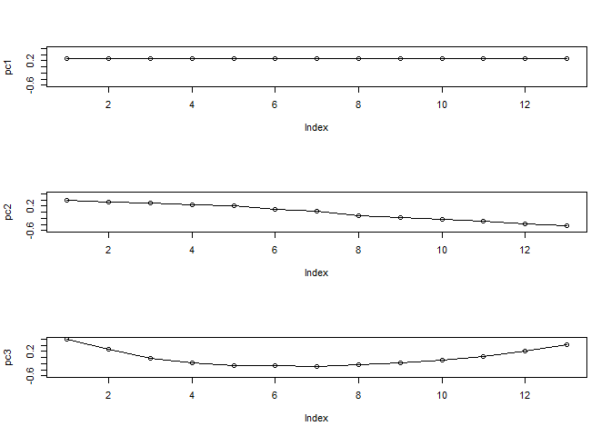
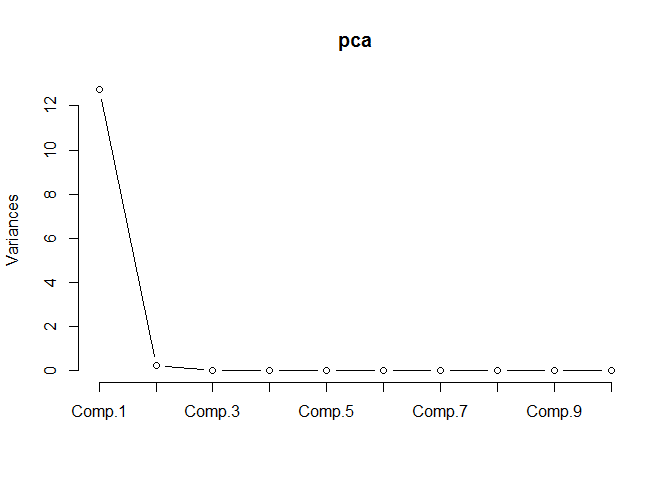

### Reference
Textbook:
Ch8 Applied Multivariate Statistical Analysis (Johnson & Wichern)

(Optional) Series of Lecture Videos: </br>
1. Background Knowledge: Singular Value Decomposition (SVD) </br>
https://www.youtube.com/watch?v=EokL7E6o1AE&index=3&list=PLEQ-ymviqWk_KbnJKZo2-5ADUS748Uo18&t=10s </br>
2. Main Theory: Principal Componenet Analysis (PCA) </br>
https://www.youtube.com/watch?v=a9jdQGybYmE&list=PLEQ-ymviqWk_KbnJKZo2-5ADUS748Uo18&index=1 </br>
3. Application: Face Recognition </br>
https://www.youtube.com/watch?v=8BTv-KZ2Bh8&index=3&list=PLEQ-ymviqWk_KbnJKZo2-5ADUS748Uo18

(Optional) Linear Algebra Course by Professor Gilbert Strang at MIT: </br>
https://ocw.mit.edu/courses/mathematics/18-06-linear-algebra-spring-2010/video-lectures/

(Optional) Coursera - Mathematics for Machine Learning Specialization (Linear Algebra, Multivariate Calculus and PCA): </br>
https://www.coursera.org/specializations/mathematics-machine-learning

### Principal Component Analysis (PCA)
Principal Component Analysis is a traditional multivariate statistical technique for dimension or variable reduction. It aims to find linear combinations of original variables such that the information in the original data is preserved.

#### Theory
Setting: Let the random vector $X'=[X_1,X_2,\dots,X_p]$ have the covariance matrix $\Sigma$ with eigenvalues $\lambda_1\geq\lambda_2\geq\cdots\geq 0$. Consider the linear combinations
$$Y=\begin{bmatrix}Y_1\\ Y_2 \\ \vdots\\Y_p\end{bmatrix}=\begin{bmatrix}a_1'X\\ a_2'X \\ \vdots\\a_p'X\end{bmatrix}=\begin{bmatrix}a_{11} & a_{12} & \cdots & a_{1p} \\ a_{21} & a_{22} & \cdots & a_{2p} \\ \vdots & \vdots & \ddots & \vdots \\ a_{p1} & a_{p2} & \cdots & a_{pp}\end{bmatrix}\begin{bmatrix} X_1 \\ X_2 \\ \vdots \\ X_p\end{bmatrix}=AX.$$
Then for $i,j=1,2,\dots,p$, $$\text{Var}(Y_i)=\text{Var}(a_i'X)=a_i'\Sigma a_i$$
$$\text{Cov}(Y_i,Y_j)=\text{Cov}(a_i'X,a_j'X)=a_i'\Sigma a_j$$
Objective: The principal components are those uncorrelated linear combinations $Y_1,Y_2,\dots,Y_p$ whose variances are as large as possible.

Algorithm: The first principal component is the linear combination $a_1'X$ that maximizes $\text{Var}(a_1'X)$ subject to $a_1'a_1=1$. At the $i\geq 2$ th step, the $i$th principal component is the linear combination $a_i'X$ that maximizes $\text{Var}(a_i'X)$ subject to $a_i'a_i=1$ and $\text{Cov}(a_i'X,a_j'X)=0$ for $j<i$.

Result 8.1 in the textbook (you can find the proof there): </br>
Let $\Sigma$ be the covariance matrix associated with the random vector $X'=[X_1,X_2,\dots,X_p]$. Let $\Sigma$ have the eigenvalue-eigenvector pairs $(\lambda_1,e_1), (\lambda_2,e_2),\dots,(\lambda_p,e_p)$ where $\lambda_1\geq\lambda_2\geq\cdots\geq\lambda_p\geq0$. Then the $i$th principal component is given by 
$$Y_i=e_i'X=e_{i1}X_1+e_{i2}X_2+\cdots+e_{ip}X_p,\hspace{5mm} i=1,2,\dots,p$$ with 
$$\text{Var}(Y_i)=e_i'\Sigma e_i=\lambda_i,\hspace{5mm} i=1,2,\dots,p$$ and
$$\text{Cov}(Y_i,Y_j)=\text{Cov}(e_i'X,e_j'X)=e_i'\Sigma e_j=0 ,\hspace{5mm} i\neq j.$$
If some $\lambda_i$ are equal, the choices of the corresponding coefficient vectors, $e_i$, and hence $Y_i$, are not unique.

#### Read in and Manipulate Data
The file `us-rate.csv` contains US semi-annualized zero-coupon rates, measured in basis points (b.p.), with maturities between 1-month to 15-year, monthly data from 1944 to 1992.

```r
# Read in data (a CSV file) under Dataset
d <- read.csv("./../Dataset/us-rate.csv")
names(d)
```

```
 [1] "X1m"  "X3m"  "X6m"  "X9m"  "X12m" "X18m" "X2y"  "X3y"  "X4y"  "X5y" 
[11] "X7y"  "X10y" "X15y"
```

```r
label <- c("1m", "3m", "6m", "9m", "12m", "18", "2y", "3y", "4y", "5y", "7y", "10y", "15y")
names(d) <- label                # Apply labels
str(d)                           # Display the structure of an object
```

```
'data.frame':	588 obs. of  13 variables:
 $ 1m : num  0.34 0.29 0.32 0.29 0.3 0.32 0.29 0.29 0.33 0.3 ...
 $ 3m : num  0.51 0.36 0.42 0.4 0.55 0.52 0.53 0.39 0.43 0.45 ...
 $ 6m : num  0.7 0.73 0.78 0.7 0.74 0.8 0.7 0.69 0.78 0.78 ...
 $ 9m : num  0.79 0.79 0.8 0.76 0.78 0.78 0.74 0.73 0.78 0.77 ...
 $ 12m: num  0.84 0.82 0.81 0.78 0.79 0.76 0.76 0.75 0.78 0.77 ...
 $ 18 : num  0.9 0.9 0.88 0.89 0.89 0.9 0.87 0.89 0.9 0.94 ...
 $ 2y : num  0.93 0.94 0.92 0.94 0.94 0.96 0.93 0.95 0.96 1.02 ...
 $ 3y : num  1.24 1.25 1.25 1.23 1.24 1.26 1.24 1.24 1.25 1.29 ...
 $ 4y : num  1.4 1.41 1.42 1.37 1.39 1.41 1.39 1.38 1.4 1.42 ...
 $ 5y : num  1.65 1.64 1.65 1.63 1.64 1.65 1.64 1.62 1.64 1.66 ...
 $ 7y : num  1.93 1.9 1.91 1.92 1.92 1.93 1.92 1.9 1.91 1.93 ...
 $ 10y: num  2.16 2.12 2.11 2.13 2.12 2.14 2.13 2.1 2.12 2.13 ...
 $ 15y: num  2.33 2.3 2.27 2.28 2.28 2.3 2.3 2.26 2.27 2.29 ...
```

```r
options(digits = 2)              # Display the number using 2 digits
cor(d)                           # Compute correlation matrix
```

```
      1m   3m   6m   9m  12m   18   2y   3y   4y   5y   7y  10y  15y
1m  1.00 0.99 0.99 0.99 0.98 0.98 0.97 0.96 0.95 0.95 0.94 0.92 0.91
3m  0.99 1.00 1.00 0.99 0.99 0.99 0.98 0.97 0.96 0.96 0.95 0.94 0.92
6m  0.99 1.00 1.00 1.00 1.00 0.99 0.99 0.98 0.97 0.96 0.96 0.94 0.93
9m  0.99 0.99 1.00 1.00 1.00 1.00 0.99 0.99 0.98 0.97 0.96 0.95 0.94
12m 0.98 0.99 1.00 1.00 1.00 1.00 1.00 0.99 0.98 0.98 0.97 0.96 0.94
18  0.98 0.99 0.99 1.00 1.00 1.00 1.00 1.00 0.99 0.99 0.98 0.97 0.96
2y  0.97 0.98 0.99 0.99 1.00 1.00 1.00 1.00 0.99 0.99 0.98 0.98 0.96
3y  0.96 0.97 0.98 0.99 0.99 1.00 1.00 1.00 1.00 1.00 0.99 0.99 0.98
4y  0.95 0.96 0.97 0.98 0.98 0.99 0.99 1.00 1.00 1.00 1.00 0.99 0.98
5y  0.95 0.96 0.96 0.97 0.98 0.99 0.99 1.00 1.00 1.00 1.00 1.00 0.99
7y  0.94 0.95 0.96 0.96 0.97 0.98 0.98 0.99 1.00 1.00 1.00 1.00 0.99
10y 0.92 0.94 0.94 0.95 0.96 0.97 0.98 0.99 0.99 1.00 1.00 1.00 1.00
15y 0.91 0.92 0.93 0.94 0.94 0.96 0.96 0.98 0.98 0.99 0.99 1.00 1.00
```

Note that the 13 variables are highly correlated. The aim of dimension reduction is to use a few variables (say 2 or 3) to represent the data without loss of much information (maximizing variance). Each new variable comes from a linear combination of the original variables (see Theory).

#### Implementation of PCA

```r
options(digits = 4)              # Display the number using 4 digits
pca <- princomp(d, cor = T)      # Perform PCA using correlation matrix
pca$loadings[, 1:6]              # Display the loadings of the first six PC's
```

```
    Comp.1   Comp.2   Comp.3   Comp.4   Comp.5   Comp.6
1m  0.2732  0.40434  0.59756  0.56592  0.27195  0.06041
3m  0.2758  0.34462  0.28225 -0.29408 -0.61221 -0.34923
6m  0.2770  0.30272 -0.02848 -0.36767 -0.16994  0.38335
9m  0.2783  0.23612 -0.17710 -0.23317  0.21616  0.25111
12m 0.2786  0.20227 -0.25195 -0.16505  0.41027  0.18186
18  0.2798  0.09148 -0.27652  0.03453  0.20085 -0.31179
2y  0.2799  0.03527 -0.28849  0.13555  0.09394 -0.56147
3y  0.2798 -0.09978 -0.22264  0.22118 -0.13877 -0.10916
4y  0.2791 -0.16815 -0.18806  0.26537 -0.25584  0.12151
5y  0.2785 -0.22976 -0.08357  0.20610 -0.21373  0.20016
7y  0.2772 -0.30150  0.03910  0.13771 -0.16234  0.29454
10y 0.2754 -0.37538  0.21868 -0.10556  0.04935  0.08244
15y 0.2729 -0.44384  0.40821 -0.40615  0.31461 -0.24199
```

```r
pc1 <- pca$loadings[, 1]         # Save the loading of 1st PC
pc2 <- pca$loadings[, 2]         # Save the loading of 2nd PC
pc3 <- pca$loadings[, 3]         # Save the loading of 3rd PC

par(mfrow = c(3, 1))             # Multiframe for plotting
plot(pc1, ylim = c(-0.6, 0.6), type = "o")
plot(pc2, ylim = c(-0.6, 0.6), type = "o") 
plot(pc3, ylim = c(-0.6, 0.6), type = "o")
```

<!-- -->

Please refer to the lectures for intuitive interpretation of the loadings of the first three PCs. The 1st PC represents a parallel shift of the yield curve, the 2nd PC agrees with the liquidity preference theory while the 3rd PC represents the curvature of the yield curve.


```r
pc1 <- pca$loadings[, 1]         # Save the loading of 1st PC
pc2 <- pca$loadings[, 2]         # Save the loading of 2nd PC
pc3 <- pca$loadings[, 3]         # Save the loading of 3rd PC
pc1 %*% pc1                      # Should be 1 (unit length)
```

```
     [,1]
[1,]    1
```

```r
pc2 %*% pc2                      # Should be 1 (unit length)
```

```
     [,1]
[1,]    1
```

```r
pc1 %*% pc2                      # Should be 0 (orthogonal)
```

```
          [,1]
[1,] 1.388e-17
```

```r
(s <- pca$sdev)                  # Save the s.d. of all PC's to s
```

```
   Comp.1    Comp.2    Comp.3    Comp.4    Comp.5    Comp.6    Comp.7 
3.5670547 0.4875869 0.1576834 0.0864412 0.0538379 0.0381947 0.0313479 
   Comp.8    Comp.9   Comp.10   Comp.11   Comp.12   Comp.13 
0.0264545 0.0008803 0.0008536 0.0008309 0.0007982 0.0007683 
```

```r
round(s^2, 4)                    # Display the variances of all PC's
```

```
 Comp.1  Comp.2  Comp.3  Comp.4  Comp.5  Comp.6  Comp.7  Comp.8  Comp.9 
12.7239  0.2377  0.0249  0.0075  0.0029  0.0015  0.0010  0.0007  0.0000 
Comp.10 Comp.11 Comp.12 Comp.13 
 0.0000  0.0000  0.0000  0.0000 
```

```r
(t <- sum(s^2))                  # Compute total variance (should equal 13)
```

```
[1] 13
```

```r
round(s^2/t, 4)                  # Proportion of variance explained by each PC
```

```
 Comp.1  Comp.2  Comp.3  Comp.4  Comp.5  Comp.6  Comp.7  Comp.8  Comp.9 
 0.9788  0.0183  0.0019  0.0006  0.0002  0.0001  0.0001  0.0001  0.0000 
Comp.10 Comp.11 Comp.12 Comp.13 
 0.0000  0.0000  0.0000  0.0000 
```

```r
cumsum(s^2/t)                    # Cumulative sum of proportion of variance
```

```
 Comp.1  Comp.2  Comp.3  Comp.4  Comp.5  Comp.6  Comp.7  Comp.8  Comp.9 
 0.9788  0.9970  0.9990  0.9995  0.9998  0.9999  0.9999  1.0000  1.0000 
Comp.10 Comp.11 Comp.12 Comp.13 
 1.0000  1.0000  1.0000  1.0000 
```

By Lemma 1.10 in Tutorial 1 Proof: </br>
Let $R$ be a $p\times p$ symmetric matrix. Then, the trace of $R$ is $$\text{tr}(R)=\sum_{i=1}^{p}\lambda_i,$$ 
where the $\lambda_i$ are the eigenvalues of $R$.

The total variation is equal to the trace (sum of all the diagonal elements). Since the correlation matrix has been used, all the diagonal elements are 1 and the trace is equal to 13. The 1st PC has already explained 97.88% of the total variation (most information).

#### Scree Plot

```r
screeplot(pca, type = "lines")   # screeplot: plot variances against number of principal component
```

<!-- -->

The plot supports that the 1st PC is sufficient to explain most information.
