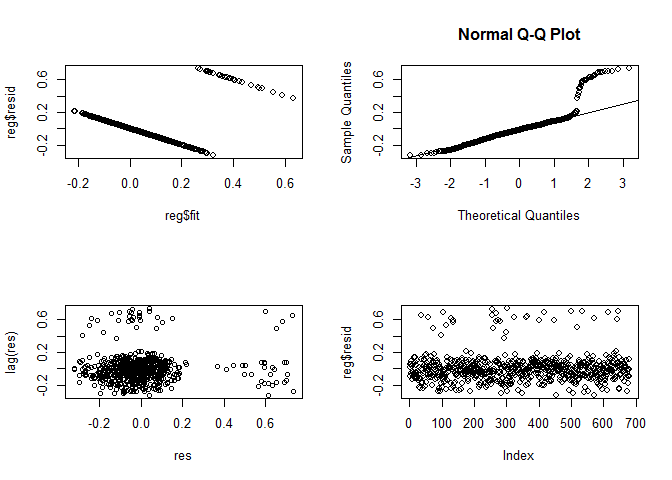
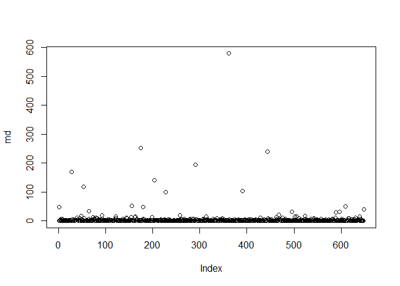

#### Reference
1. Applied Multivariate Statistical Analysis (Johnson & Wichern)
2. (Optional) Generalized Linear Models (McCullagh and Nelder)

#### Regression Analysis
##### Objective
1. Prediction: Predicting values of one or more response (dependent) variables from a collection of predictor (independent) variables
2. Inference: Assessing the effects of the predictor variables on the responses.

#### (Optional) Generalized Linear Model (GLM)
Materials do credit to Prof. Xinyuan Song. Only two special cases (linear and logistic regression) are discussed here.

##### Three components in a GLM
1. A random component $Y$ has the probability distribution in the exponential family (including normal and Bernoulli distributions). </br>
2. A systematic component $\eta=\sum_{j=1}^p \beta_jx_j$. </br>
3. A link function $g(\cdot)$ relates the random and systematic components: $g(\mu)=\eta$, where $\mu=E(Y)$ and $g(\cdot)$ is monotonic and differentiable.

##### Linear Regression is a GLM
Note that linear regression can be solved without assuming normal distribution. Let
$$Y=\sum_{j=1}^p \beta_jx_j+\epsilon, \hspace{5mm} \epsilon\sim N(0,\sigma^2),$$
1. The random component $Y\sim N(\mu,\sigma^2)$, where $\mu=E(Y)=\sum_{j=1}^p \beta_jx_j$. </br>
2. The systematic component $\eta=\sum_{j=1}^p \beta_jx_j$. When $x_1=1$, $\beta_1$ is the intercept in the model.</br>
3. The link between the random and systematic components $\eta=g(\mu)=\mu$ (identity link).

##### Logistic Regression is a GLM
Let
$$\text{logit}(\pi)=\log\bigg(\frac{\pi}{1-\pi}\bigg)=\sum_{j=1}^p
\beta_j x_j,$$
1. The binomial component $Y\sim B(1,\pi)$, where $\pi=E(Y)$. </br>
2. The systematic component $\eta=\sum_{j=1}^p \beta_jx_j$. When $x_1=1$, $\beta_1$ is the intercept in the model.</br>
3. The link between the random and systematic components $\eta=g(\mu)=\text{log}(\frac{\pi}{1-\pi})$ (logit link).

#### Implementation of Linear Regression
##### Basic Knowledge
Let $x_1,x_2,\dots,x_k$ be $k$ predictor variables thought to be related to a response variable $y$. The fixed-$x$ linear regression model states that $y$ is composed of a mean, which depends in a continuous manner on the $x_i$'s, and a random error $\varepsilon$, which accounts for measurement error and the effects of other variables not explicitly considered in the model.

Specifically, the linear regression model with a single response takes the form
$$y=\beta_0+\beta_1x_1+\cdots+\beta_k x_k+\varepsilon.$$
The $\beta$'s are called regression coefficients. The term "linear" refers to the fact that the mean is a linear function of the unknown parameters $\beta_0,\beta_1,\dots,\beta_k$.

With $n$ independent observations on $y$ and the associated values of $x_i$, the complete model becomes
$$\begin{bmatrix} y_1 \\ y_2 \\ \vdots \\ y_n\end{bmatrix}=\begin{bmatrix} 1 & x_{11} & x_{12} & \cdots & x_{1k} \\ 1 & x_{21} & x_{22} & \cdots & x_{2k} \\ \vdots & \vdots & \vdots & \ddots & \vdots \\ 1 & x_{n1} & x_{n2} & \cdots & x_{nk} \end{bmatrix} \begin{bmatrix} \beta_0 \\ \beta_1 \\ \vdots \\ \beta_k \end{bmatrix}+\begin{bmatrix} \varepsilon_1 \\ \varepsilon_2 \\ \vdots \\ \varepsilon_n
\end{bmatrix}$$
or 
$$Y=X\beta+\varepsilon$$
where the error terms are assumed to be uncorrelated with mean zero and constant variance: </br>
1. $E(\varepsilon_i)=0$ for all $i$; </br>
2. $\text{Var}(\varepsilon_i)=\sigma^2$ for all $i$; </br>
3. $\text{Cov}(\varepsilon_i,\varepsilon_j)=0$ for all $i\neq j$. </br>

If $X$ has full rank, then the least squares estimator of $\beta$ is
$$\hat{\beta}=(X'X)^{-1}X'Y.$$

##### Example of Misuse of Linear Regression
The csv file `fin-ratio.csv` contains financial ratios of 680 securities listed in the main board of Hong Kong Stock Exchange in 2002. There are six financial variables, namely, Earning Yield (EY), Cash Flow to Price (CFTP), logarithm of Market Value (ln MV), Dividend Yield (DY), Book to Market Equity (BTME), Debt to Equity Ratio (DTE). Among these companies, there are 32 Blue Chips which are the Hang Seng Index Constituent Stocks. The last column HSI is a binary variable indicating whether the stock is a Blue Chip or not.

```r
d <- read.csv("./../Dataset/fin-ratio.csv")         # Read in data
names(d)                                            # Display the variable names
```

```
[1] "EY"    "CFTP"  "ln_MV" "DY"    "BTME"  "DTE"   "HSI"  
```

```r
summary(lm(HSI~EY+CFTP+ln_MV+DY+BTME+DTE, data = d))
```

```

Call:
lm(formula = HSI ~ EY + CFTP + ln_MV + DY + BTME + DTE, data = d)

Residuals:
     Min       1Q   Median       3Q      Max 
-0.32104 -0.08546 -0.01672  0.05592  0.73866 

Coefficients:
              Estimate Std. Error t value Pr(>|t|)    
(Intercept) -0.4591209  0.0268310 -17.112  < 2e-16 ***
EY          -0.0017172  0.0016181  -1.061  0.28896    
CFTP        -0.0103792  0.0037321  -2.781  0.00557 ** 
ln_MV        0.0810286  0.0040887  19.818  < 2e-16 ***
DY          -0.0027336  0.0017826  -1.534  0.12561    
BTME         0.0004798  0.0007938   0.604  0.54575    
DTE          0.0010610  0.0018035   0.588  0.55655    
---
Signif. codes:  0 '***' 0.001 '**' 0.01 '*' 0.05 '.' 0.1 ' ' 1

Residual standard error: 0.1689 on 673 degrees of freedom
Multiple R-squared:  0.3708,	Adjusted R-squared:  0.3652 
F-statistic: 66.09 on 6 and 673 DF,  p-value: < 2.2e-16
```

```r
summary(lm(HSI~EY+CFTP+ln_MV+DY+BTME, data = d))    # Exclude DTE (with the largest p-value)
```

```

Call:
lm(formula = HSI ~ EY + CFTP + ln_MV + DY + BTME, data = d)

Residuals:
     Min       1Q   Median       3Q      Max 
-0.32132 -0.08534 -0.01732  0.05568  0.73824 

Coefficients:
              Estimate Std. Error t value Pr(>|t|)    
(Intercept) -0.4581051  0.0267624 -17.117   <2e-16 ***
EY          -0.0017108  0.0016173  -1.058   0.2905    
CFTP        -0.0102957  0.0037275  -2.762   0.0059 ** 
ln_MV        0.0809789  0.0040859  19.819   <2e-16 ***
DY          -0.0027259  0.0017816  -1.530   0.1265    
BTME         0.0005074  0.0007921   0.641   0.5220    
---
Signif. codes:  0 '***' 0.001 '**' 0.01 '*' 0.05 '.' 0.1 ' ' 1

Residual standard error: 0.1688 on 674 degrees of freedom
Multiple R-squared:  0.3704,	Adjusted R-squared:  0.3658 
F-statistic: 79.32 on 5 and 674 DF,  p-value: < 2.2e-16
```

```r
summary(lm(HSI~EY+CFTP+ln_MV+DY, data = d))         # Exclude BTME (with the largest p-value)
```

```

Call:
lm(formula = HSI ~ EY + CFTP + ln_MV + DY, data = d)

Residuals:
     Min       1Q   Median       3Q      Max 
-0.32075 -0.08609 -0.01726  0.05575  0.73911 

Coefficients:
             Estimate Std. Error t value Pr(>|t|)    
(Intercept) -0.455614   0.026467 -17.215  < 2e-16 ***
EY          -0.001701   0.001616  -1.052  0.29316    
CFTP        -0.010000   0.003697  -2.705  0.00701 ** 
ln_MV        0.080757   0.004069  19.845  < 2e-16 ***
DY          -0.002748   0.001781  -1.543  0.12328    
---
Signif. codes:  0 '***' 0.001 '**' 0.01 '*' 0.05 '.' 0.1 ' ' 1

Residual standard error: 0.1687 on 675 degrees of freedom
Multiple R-squared:  0.3701,	Adjusted R-squared:  0.3663 
F-statistic: 99.13 on 4 and 675 DF,  p-value: < 2.2e-16
```

```r
summary(lm(HSI~CFTP+ln_MV+DY, data = d))            # Exclude EY (with the largest p-value)
```

```

Call:
lm(formula = HSI ~ CFTP + ln_MV + DY, data = d)

Residuals:
     Min       1Q   Median       3Q      Max 
-0.32025 -0.08622 -0.01619  0.05686  0.73947 

Coefficients:
             Estimate Std. Error t value Pr(>|t|)    
(Intercept) -0.452425   0.026295 -17.206  < 2e-16 ***
CFTP        -0.011235   0.003506  -3.205  0.00142 ** 
ln_MV        0.080419   0.004057  19.822  < 2e-16 ***
DY          -0.002849   0.001778  -1.602  0.10955    
---
Signif. codes:  0 '***' 0.001 '**' 0.01 '*' 0.05 '.' 0.1 ' ' 1

Residual standard error: 0.1687 on 676 degrees of freedom
Multiple R-squared:  0.369,	Adjusted R-squared:  0.3662 
F-statistic: 131.8 on 3 and 676 DF,  p-value: < 2.2e-16
```

```r
summary(lm(HSI~CFTP+ln_MV, data = d))               # Exclude DY (with the largest p-value)
```

```

Call:
lm(formula = HSI ~ CFTP + ln_MV, data = d)

Residuals:
     Min       1Q   Median       3Q      Max 
-0.32409 -0.08559 -0.01729  0.05688  0.73488 

Coefficients:
             Estimate Std. Error t value Pr(>|t|)    
(Intercept) -0.454781   0.026284 -17.303  < 2e-16 ***
CFTP        -0.012026   0.003475  -3.461 0.000573 ***
ln_MV        0.079630   0.004032  19.751  < 2e-16 ***
---
Signif. codes:  0 '***' 0.001 '**' 0.01 '*' 0.05 '.' 0.1 ' ' 1

Residual standard error: 0.1689 on 677 degrees of freedom
Multiple R-squared:  0.3666,	Adjusted R-squared:  0.3648 
F-statistic: 195.9 on 2 and 677 DF,  p-value: < 2.2e-16
```

```r
reg <- lm(HSI~CFTP+ln_MV, data = d)                 # Save the regression results
names(reg)                                          # Display the items contained in reg
```

```
 [1] "coefficients"  "residuals"     "effects"       "rank"         
 [5] "fitted.values" "assign"        "qr"            "df.residual"  
 [9] "xlevels"       "call"          "terms"         "model"        
```

We have done a backward elimination manually. In fact, it can be done by the program (see later sections). The model is incorrect in the sense that HSI can only be 0 or 1 but the fitted values can be any real number.


```r
par(mfrow = c(2, 2))                                # Set a 2x2 multiple frame for graphics
plot(reg$fit,reg$resid)                             # Residuals vs fitted values
qqnorm(reg$resid)                                   # QQ-normal plot of residuals
qqline(reg$resid)                                   # Add reference line
res <- as.ts(reg$resid)                             # Change res to time series
plot(res,lag(res))                                  # Residuals vs lag(residuals)
plot(reg$resid)                                     # Residuals vs index number
```



We can see patterns in the diagnostic plots. Linear regression should not be used mainly because HSI is binary. Logistic regression is an alternative.

#### Implementation of Logistic Regression
Consider a GLM with binary data. More specifically, logistic regression model is $$\text{logit}(\pi)=\log\bigg(\frac{\pi}{1-\pi}\bigg)=\sum_{j=1}^p
\beta_j x_j,$$
where $\pi$ is regarded as the probability of success.

Let $y=(y_1,\dots,y_n)$, where $y_i$ is the number of successes among $n_i$ observations, $x_i=(x_{i1},\dots,x_{ip})$, $i=1,\dots,n$, and $\beta=(\beta_1,\dots,\beta_p)$. An alternative representation of logistic regression model is
$$\pi(x_i)=\frac{\text{exp}(\sum_{j=1}^p\beta_jx_{ij})}{1+\text{exp}(\sum_{j=1}^p\beta_jx_{ij})}.$$

##### Fit with Full Model and Full Data

```r
# glm: fit generalized linear models
lreg <- glm(HSI~., data = d, family = binomial)
summary(lreg)
```

```

Call:
glm(formula = HSI ~ ., family = binomial, data = d)

Deviance Residuals: 
   Min      1Q  Median      3Q     Max  
 -8.49    0.00    0.00    0.00    8.49  

Coefficients:
              Estimate Std. Error    z value Pr(>|z|)    
(Intercept) -4.121e+15  1.066e+07 -386410689   <2e-16 ***
EY           1.516e+13  6.431e+05   23570644   <2e-16 ***
CFTP        -6.364e+13  1.483e+06  -42902735   <2e-16 ***
ln_MV        4.945e+14  1.625e+06  304287297   <2e-16 ***
DY          -1.144e+14  7.085e+05 -161536188   <2e-16 ***
BTME        -7.907e+12  3.155e+05  -25063060   <2e-16 ***
DTE          8.744e+12  7.168e+05   12198713   <2e-16 ***
---
Signif. codes:  0 '***' 0.001 '**' 0.01 '*' 0.05 '.' 0.1 ' ' 1

(Dispersion parameter for binomial family taken to be 1)

    Null deviance:  258.08  on 679  degrees of freedom
Residual deviance: 1153.40  on 673  degrees of freedom
AIC: 1167.4

Number of Fisher Scoring iterations: 18
```

```r
names(lreg)                                         # Display item in lreg
```

```
 [1] "coefficients"      "residuals"         "fitted.values"    
 [4] "effects"           "R"                 "rank"             
 [7] "qr"                "family"            "linear.predictors"
[10] "deviance"          "aic"               "null.deviance"    
[13] "iter"              "weights"           "prior.weights"    
[16] "df.residual"       "df.null"           "y"                
[19] "converged"         "boundary"          "model"            
[22] "call"              "formula"           "terms"            
[25] "data"              "offset"            "control"          
[28] "method"            "contrasts"         "xlevels"          
```

```r
pred1 <- (lreg$fitted.values>0.5)                   # Prediction
table(pred1, d$HSI)                                 # Classification table
```

```
       
pred1     0   1
  FALSE 634   2
  TRUE   14  30
```

From the table, the correct classification rate is 97.65%.

##### Outlier Detection
From the extremely large coefficients in MLE, we suspect that there are outliers. Outlier detection can be done by using Mahalanobis distance introduced in Tutorial 3:
$$D^2=(x-\bar{x})'S^{-1}(x-\bar{x})$$
Observations with large distance are potential outliers.

```r
mdist <- function(x) {
    t <- as.matrix(x)                               # Transform x to a matrix
    m <- apply(t, 2, mean)                          # Compute column means
    s <- var(t)                                     # Compute sample covariance matrix
    mahalanobis(t, m, s)                            # Using built-in Mahalanobis function
}

d0 <- d[d$HSI==0,]                                  # Select HSI = 0
d1 <- d[d$HSI==1,]                                  # Select HSI = 1
dim(d0)
```

```
[1] 648   7
```

```r
dim(d1)
```

```
[1] 32  7
```

We only detect and throw away the outliers in d0 since d1 contains only 32 cases. 


```r
x <- d0[,1:6]                                       # Exclude HSI, which are all 0
md <- mdist(x)                                      # mdist: self-defined function

par(mfrow = c(1, 1))
plot(md)                                            # Plot Mahalanobis distances
```




```r
# Cutoff for testing normality: p = 6 (six financial variables) and type-I error = 0.01
(c <- qchisq(0.99, df = 6))                         
```

```
[1] 16.81189
```

```r
d2 <- d0[md<c,]                                     # Select cases from d0 with md<c
dim(d2)                                             # Throw away 648-626=22 cases
```

```
[1] 626   7
```

```r
d3 <- rbind(d1, d2)                                 # Combine d1 with d2 to form a cleaned dataset
dim(d3)
```

```
[1] 658   7
```

```r
# Save the cleaned dataset as fin-ratio1.csv
write.csv(d3, file = "./../Dataset/fin-ratio1.csv", row.names = F)
```

##### Fit with Backward Elimination and Clean Data
Fit a logistic regression to `fin-ratio1.csv`.

```r
# First fit with all variables
lreg <- glm(HSI~., data = d3, family = binomial)

# step: choose a model by AIC in a Stepwise Algorithm
lreg <- step(lreg, direction = "backward", trace = 0)       
summary(lreg)
```

```

Call:
glm(formula = HSI ~ CFTP + ln_MV + BTME, family = binomial, data = d3)

Deviance Residuals: 
     Min        1Q    Median        3Q       Max  
-2.37704  -0.00019  -0.00001   0.00000   1.73796  

Coefficients:
            Estimate Std. Error z value Pr(>|z|)   
(Intercept) -69.9309    21.3821  -3.271  0.00107 **
CFTP         -3.0376     1.2178  -2.494  0.01262 * 
ln_MV         7.2561     2.2284   3.256  0.00113 **
BTME          1.3222     0.6418   2.060  0.03940 * 
---
Signif. codes:  0 '***' 0.001 '**' 0.01 '*' 0.05 '.' 0.1 ' ' 1

(Dispersion parameter for binomial family taken to be 1)

    Null deviance: 255.920  on 657  degrees of freedom
Residual deviance:  23.087  on 654  degrees of freedom
AIC: 31.087

Number of Fisher Scoring iterations: 12
```

```r
pred2 <- (lreg$fitted.values>0.5)                   # Prediction
table(pred2, d3$HSI)                                # Classification table
```

```
       
pred2     0   1
  FALSE 624   3
  TRUE    2  29
```

From the table, the correct classification rate is 99.24%, which is higher than that using full model and full data (97.65%).
