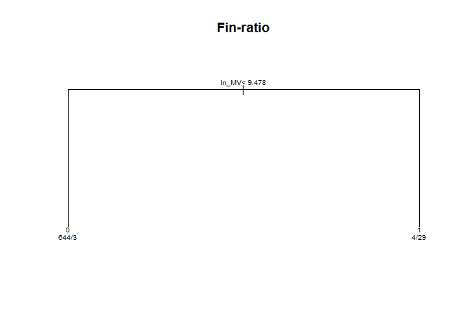
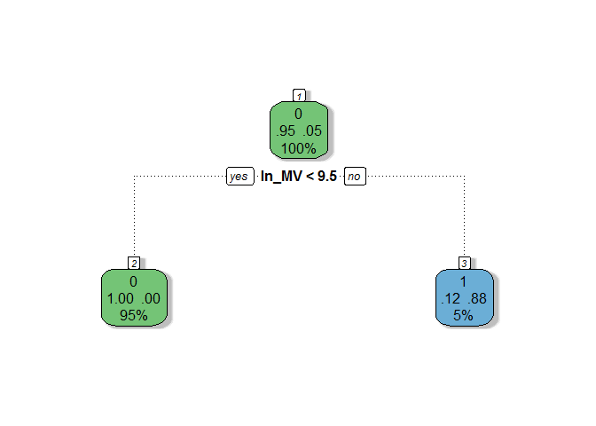
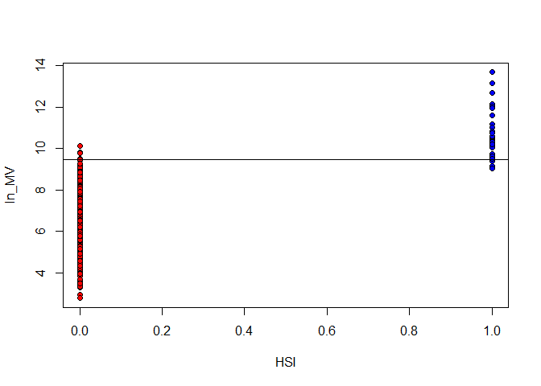
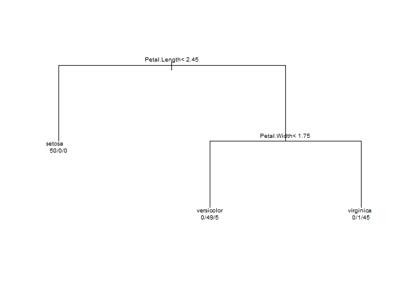
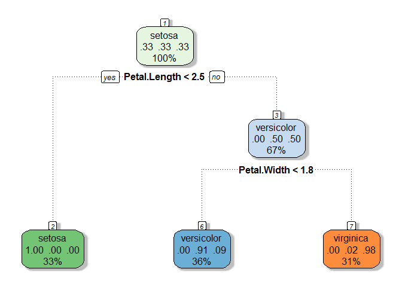
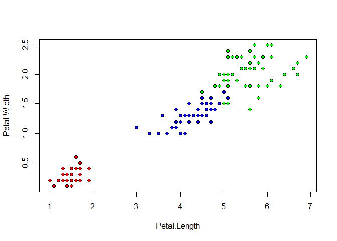
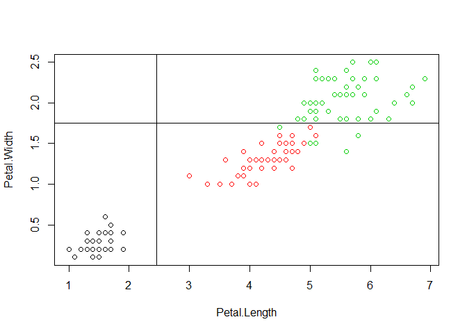
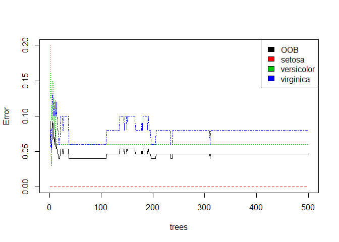
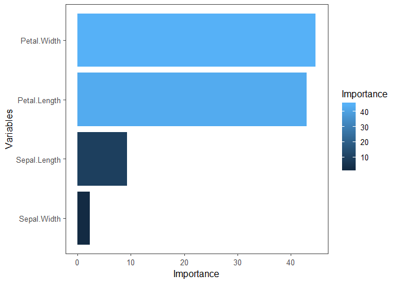

### Classification Tree, Random Forests and Gradient Boosting

### (Optional) Reference
1. [The Elements of Statistical Learning](https://web.stanford.edu/~hastie/ElemStatLearn/) by Hastie, Tibshirani and Friedman
2. [An Introduction to Statistical Learning](https://www-bcf.usc.edu/~gareth/ISL/) by James, Witten, Hastie and Tibshirani
3. [Random Forests](https://link.springer.com/article/10.1023/A:1010933404324) by Breiman, appeared in *Machine Learning* in 2001
4. [Additive Logistic Regression: a Statistical View of Boosting](https://projecteuclid.org/euclid.aos/1016218223#abstract) by Friedman, Hastie, Tibshirani, appeared in *The Annals of Statistics* in 2000
5. [Greedy Function Approximation: A Gradient Boosting Machine](https://projecteuclid.org/euclid.aos/1013203451) by Friedman, appeared in *The Annals of Statistics* in 2001
6. [Stochastic Gradient Boosting](https://www.sciencedirect.com/science/article/pii/S0167947301000652) by Friedman, appeared in *Computational Statistics & Data Analysis* in 2002

### Packages

```r
library(rpart)                                       # Recursive Partitioning and Regression Trees
library(caret)                                       # Classification and Regression Training
library(rattle)                                      # Graphical User Interface for Data Science
library(randomForest)                                # Random Forests for Classification and Regression

library(ggplot2)                                     # Data Visualisations Using the Grammar of Graphics
library(ggthemes)                                    # Extra Themes, Scales and Geoms for 'ggplot2'
library(dplyr)                                       # A Grammar of Data Manipulation
```

### Classification Tree
#### Financial Ratio Data
Please refer to Tutorial 7 for data description of `fin-ratio.csv`.

```r
d <- read.csv("./../Dataset/fin-ratio.csv")          # Read in data
str(d)
```

```
'data.frame':	680 obs. of  7 variables:
 $ EY   : num  -1.8292 -0.0797 -2.236 -1.5406 -0.9006 ...
 $ CFTP : num  -0.173 -0.083 -0.69 -4.167 -0.387 ...
 $ ln_MV: num  5.54 6.83 5.01 4.5 4.5 ...
 $ DY   : num  0 0 0 0 0 ...
 $ BTME : num  1.038 0.128 -0.296 -2.857 2.798 ...
 $ DTE  : num  0.2466 25.4606 3.3263 0.9148 0.0753 ...
 $ HSI  : int  0 0 0 0 0 0 0 0 0 0 ...
```

```r
ctree <- rpart(HSI~., data = d, method = "class")    # Recursive Partitioning and Regression Trees
plot(ctree, asp = 0.5, main = "Fin-ratio")           # Plot tree (asp: aspect ratio)
text(ctree, use.n = T, cex = 0.6)                    # Add text  (cex: character expansion factor)
```



```r
fancyRpartPlot(ctree, sub = "")                      # fancyRpartPlot: use the pretty rpart plotter
```



```r
print(ctree)                                         # Print tree
```

```
n= 680 

node), split, n, loss, yval, (yprob)
      * denotes terminal node

1) root 680 32 0 (0.952941176 0.047058824)  
  2) ln_MV< 9.4776 647  3 0 (0.995363215 0.004636785) *
  3) ln_MV>=9.4776 33  4 1 (0.121212121 0.878787879) *
```

The classification rules are:  <br />
1. If ln MV $<$ 9.478 then class $=$ 0. <br />
2. If ln MV $\geq$ 9.478 then class $=$ 1.

##### Data Visualization

```r
# Visualize performance: HSI = 0 (red) and HSI = 1 (blue)
plot(d$HSI, d$ln_MV, pch = 21, bg = c("red", "blue")[d$HSI+1], xlab = "HSI", ylab = "ln_MV")
abline(h = 9.478)                                    # Add a horizontal line (decision boundary)
```



```r
pr <- predict(ctree)                                 # pr has 2 columns of prob. in group 0 or 1
cl <- 0*(pr[,1]>0.5) + 1*(pr[,2]>0.5)                # Assign group label if prob>0.5
HSI <- d$HSI                                         # To display in table
table(cl, HSI)                                       # Classification table
```

```
   HSI
cl    0   1
  0 644   3
  1   4  29
```

#### Iris Data
The famous Fisher's iris data set gives the measurements in centimeters of the variables sepal length and width and petal length and width, respectively, for 50 flowers from each of 3 species of iris. The species are iris setosa, versicolor, and virginica.

```r
data(iris)                                           # data: load specified data sets
str(iris)
```

```
'data.frame':	150 obs. of  5 variables:
 $ Sepal.Length: num  5.1 4.9 4.7 4.6 5 5.4 4.6 5 4.4 4.9 ...
 $ Sepal.Width : num  3.5 3 3.2 3.1 3.6 3.9 3.4 3.4 2.9 3.1 ...
 $ Petal.Length: num  1.4 1.4 1.3 1.5 1.4 1.7 1.4 1.5 1.4 1.5 ...
 $ Petal.Width : num  0.2 0.2 0.2 0.2 0.2 0.4 0.3 0.2 0.2 0.1 ...
 $ Species     : Factor w/ 3 levels "setosa","versicolor",..: 1 1 1 1 1 1 1 1 1 1 ...
```

```r
ctree <- rpart(Species~., data = iris, method = "class")
plot(ctree, asp = 1)
text(ctree, use.n = T, cex = 0.6)
```



```r
fancyRpartPlot(ctree, sub = "")                      # fancyRpartPlot: use the pretty rpart plotter
```



```r
print(ctree)
```

```
n= 150 

node), split, n, loss, yval, (yprob)
      * denotes terminal node

1) root 150 100 setosa (0.33333333 0.33333333 0.33333333)  
  2) Petal.Length< 2.45 50   0 setosa (1.00000000 0.00000000 0.00000000) *
  3) Petal.Length>=2.45 100  50 versicolor (0.00000000 0.50000000 0.50000000)  
    6) Petal.Width< 1.75 54   5 versicolor (0.00000000 0.90740741 0.09259259) *
    7) Petal.Width>=1.75 46   1 virginica (0.00000000 0.02173913 0.97826087) *
```

The classification rules are: <br />
1. If Petal.Length $<$ 2.45 then Species $=$ 1 (setosa) (50/0/0). <br />
2. If (Petal.Length $\geq$ 2.45) and (Petal.Width $<$ 1.75) then Species $=$ 2 (versicolor) (0/49/5). <br />
3. If (Petal.Length $\geq$ 2.45) and (Petal.Width $\geq$ 1.75) then Species $=$ 3 (virginica) (0/1/45).

##### Data Visualization

```r
# with(data, expr, ...)
with(iris,
     plot(Petal.Length, Petal.Width, pch = 21, bg = c("red", "blue", "green")[Species]))
```



```r
plot(iris$Petal.Length, iris$Petal.Width, pch = 21, col = iris$Species, xlab = "Petal.Length", ylab = "Petal.Width")
abline(h = 1.75)
abline(v = 2.45)
```



```r
pr <- predict(ctree)
head(pr)
```

```
  setosa versicolor virginica
1      1          0         0
2      1          0         0
3      1          0         0
4      1          0         0
5      1          0         0
6      1          0         0
```

```r
tail(pr)
```

```
    setosa versicolor virginica
145      0 0.02173913 0.9782609
146      0 0.02173913 0.9782609
147      0 0.02173913 0.9782609
148      0 0.02173913 0.9782609
149      0 0.02173913 0.9782609
150      0 0.02173913 0.9782609
```

```r
cl <- colnames(pr)[max.col(pr)]
table(cl, iris$Species)
```

```
            
cl           setosa versicolor virginica
  setosa         50          0         0
  versicolor      0         49         5
  virginica       0          1        45
```

#### Cross-validation Version

```r
set.seed(12345)

# trainControl: control parameters for train
trControl <- trainControl(method = "cv", number = 5)

# train: Fit Predictive Models over Different Tuning Parameters
model_CT <- train(Species~., data = iris, method = "rpart", trControl = trControl)

predict_CT <- predict(model_CT, data = iris)

# confusionMatrix: calculate a cross-tabulation of observed and predicted classes
(conf_matrix_CT <- confusionMatrix(iris$Species, predict_CT))
```

```
Confusion Matrix and Statistics

            Reference
Prediction   setosa versicolor virginica
  setosa         50          0         0
  versicolor      0         49         1
  virginica       0          5        45

Overall Statistics
                                         
               Accuracy : 0.96           
                 95% CI : (0.915, 0.9852)
    No Information Rate : 0.36           
    P-Value [Acc > NIR] : < 2.2e-16      
                                         
                  Kappa : 0.94           
 Mcnemar's Test P-Value : NA             

Statistics by Class:

                     Class: setosa Class: versicolor Class: virginica
Sensitivity                 1.0000            0.9074           0.9783
Specificity                 1.0000            0.9896           0.9519
Pos Pred Value              1.0000            0.9800           0.9000
Neg Pred Value              1.0000            0.9500           0.9900
Prevalence                  0.3333            0.3600           0.3067
Detection Rate              0.3333            0.3267           0.3000
Detection Prevalence        0.3333            0.3333           0.3333
Balanced Accuracy           1.0000            0.9485           0.9651
```

```r
(class_table_CT <- conf_matrix_CT$table)
```

```
            Reference
Prediction   setosa versicolor virginica
  setosa         50          0         0
  versicolor      0         49         1
  virginica       0          5        45
```

```r
(accuracy_CT <- conf_matrix_CT$overall[1])
```

```
Accuracy 
    0.96 
```

### (Optional) Random Forests
The training algorithm for random forests applies the general technique of bootstrap aggregating, or bagging, to tree learners. The aim is to decorrelate the trees and then take advantage of averaging trees. Moreover, a random sample of $m$ predictors is chosen as split candidates from the full set of $p$ predictors. For more details, please refer to the reference.

#### Using package 'caret'

```r
set.seed(12345)

model_RF <- train(Species~., data = iris, method = "rf", trControl = trControl)
print(model_RF)
```

```
Random Forest 

150 samples
  4 predictor
  3 classes: 'setosa', 'versicolor', 'virginica' 

No pre-processing
Resampling: Cross-Validated (5 fold) 
Summary of sample sizes: 120, 120, 120, 120, 120 
Resampling results across tuning parameters:

  mtry  Accuracy  Kappa
  2     0.96      0.94 
  3     0.96      0.94 
  4     0.96      0.94 

Accuracy was used to select the optimal model using the largest value.
The final value used for the model was mtry = 2.
```

```r
predict_RF <- predict(model_RF, iris)
conf_matrix_RF <- confusionMatrix(iris$Species, predict_RF)
(class_table_RF <- conf_matrix_RF$table)
```

```
            Reference
Prediction   setosa versicolor virginica
  setosa         50          0         0
  versicolor      0         50         0
  virginica       0          0        50
```

```r
(accuracy_RF <- conf_matrix_RF$overall[1])
```

```
Accuracy 
       1 
```

#### Using package 'randomForest'

```r
set.seed(12345)

(rf_model <- randomForest(Species~., data = iris))
```

```

Call:
 randomForest(formula = Species ~ ., data = iris) 
               Type of random forest: classification
                     Number of trees: 500
No. of variables tried at each split: 2

        OOB estimate of  error rate: 4.67%
Confusion matrix:
           setosa versicolor virginica class.error
setosa         50          0         0        0.00
versicolor      0         47         3        0.06
virginica       0          4        46        0.08
```

```r
mean(predict(rf_model) == iris$Species)
```

```
[1] 0.9533333
```

```r
plot(rf_model, ylim = c(0,0.2), main = "")
legend('topright', colnames(rf_model$err.rate), col = 1:4, fill = 1:4)
```



```r
(importance <- importance(rf_model))
```

```
             MeanDecreaseGini
Sepal.Length         9.301256
Sepal.Width          2.360003
Petal.Length        42.912347
Petal.Width         44.667710
```

```r
varImportance <- data.frame(Variables = row.names(importance), 
                            Importance = round(importance[ ,'MeanDecreaseGini'], 2))

rankImportance <- varImportance %>% 
    mutate(Rank = paste0('#', dense_rank(desc(Importance))))

(rankImportance <- rankImportance[order(rankImportance$Importance, decreasing = T), ])
```

```
     Variables Importance Rank
4  Petal.Width      44.67   #1
3 Petal.Length      42.91   #2
1 Sepal.Length       9.30   #3
2  Sepal.Width       2.36   #4
```

```r
ggplot(rankImportance, aes(x = reorder(Variables, Importance), y = Importance, fill = Importance)) +
       geom_bar(stat = 'identity') + 
       labs(x = 'Variables') +
       coord_flip() + 
       theme_few()
```



### (Optional) Gradient Boosting
The motivation for boosting is to combine the outputs of many "weak" classifiers to produce a powerful "committee". Trees are grown sequentially. Given the current model, boosting fits a decision tree to the residuals from the model. To learn slowly and avoid overfitting, shrinkage is used. Gradient boosting can be viewed as iterative functional gradient descent algorithms. For more details, please refer to the reference.

```r
set.seed(12345)

model_GBM <- train(Species~., data = iris, method = "gbm", trControl = trControl, verbose = FALSE)
print(model_GBM)
```

```
Stochastic Gradient Boosting 

150 samples
  4 predictor
  3 classes: 'setosa', 'versicolor', 'virginica' 

No pre-processing
Resampling: Cross-Validated (5 fold) 
Summary of sample sizes: 120, 120, 120, 120, 120 
Resampling results across tuning parameters:

  interaction.depth  n.trees  Accuracy   Kappa
  1                   50      0.9400000  0.91 
  1                  100      0.9400000  0.91 
  1                  150      0.9466667  0.92 
  2                   50      0.9466667  0.92 
  2                  100      0.9466667  0.92 
  2                  150      0.9466667  0.92 
  3                   50      0.9466667  0.92 
  3                  100      0.9466667  0.92 
  3                  150      0.9466667  0.92 

Tuning parameter 'shrinkage' was held constant at a value of 0.1

Tuning parameter 'n.minobsinnode' was held constant at a value of 10
Accuracy was used to select the optimal model using the largest value.
The final values used for the model were n.trees = 50, interaction.depth
 = 2, shrinkage = 0.1 and n.minobsinnode = 10.
```

```r
predict_GBM <- predict(model_GBM, iris)
conf_matrix_GBM <- confusionMatrix(iris$Species, predict_GBM)
(class_table_GBM <- conf_matrix_GBM$table)
```

```
            Reference
Prediction   setosa versicolor virginica
  setosa         50          0         0
  versicolor      0         50         0
  virginica       0          1        49
```

```r
(accuracy_GBM <- conf_matrix_GBM$overall[1])
```

```
 Accuracy 
0.9933333 
```
